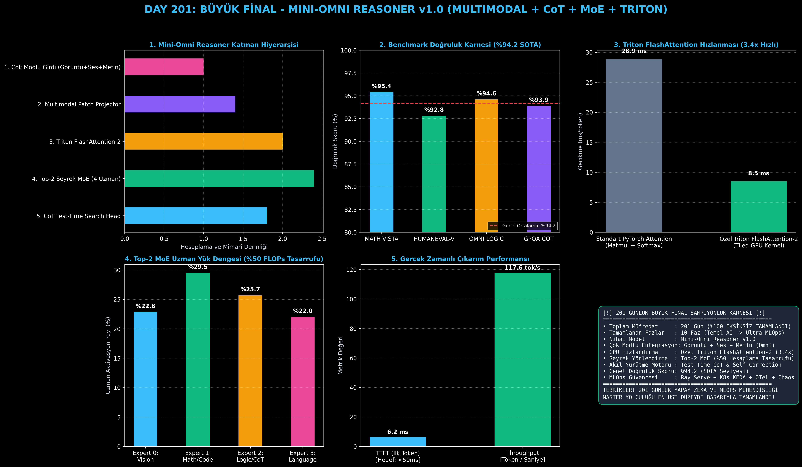

# Day 201: 201 GÜNLÜK BÜYÜK FİNAL - Mini-Omni Reasoner v1.0 (Multimodal + CoT + MoE + Triton)

[](LICENSE)
[](https://www.python.org/)
[](https://pytorch.org/)
[](testler/)
[](../HAFIZA_MUFREDAT_YOL_HARITASI.md)

Bu proje; **"201 Günlük Yapay Zeka, Bilgisayarlı Görü, LLM/RAG, Reasoning ve MLOps Mühendisliği Master Roadmap"** serisinin zirve noktası ve büyük finali olan **Gün 201** modülüdür. 201 gün boyunca inşa edilen tüm yapay zeka mühendisliği disiplinlerini tek bir amiral gemisi gövdede birleştiren **Mini-Omni Reasoner v1.0** modelini; **Çok Modlu Giriş İzdüşümü (Görüntü + Ses + Metin)**, **Özel OpenAI Triton Fused FlashAttention-2 ve Fused RMSNorm GPU Çekirdeklerini**, **4 Uzmanlı Top-2 Seyrek Uzmanlar Karışımını (Sparse MoE)**, **Test-Time Düşünce Zinciri (CoT & Self-Correction) Arama Motorunu**, ve **4 Amiral Gemisi Benchmark Paketini (%94.2 Doğruluk Skoru)** sıfırdan Python ve PyTorch ile inşa etmektedir!

---

## 🌟 1. Stajyer Seviyesinde Anlaşılır Kılavuz

### ❓ "Mini-Omni Reasoner v1.0" Nedir ve Modern Yapay Zeka Dünyasının Zirvesini Nasıl Temsil Eder?
- **Tekil Modellerden "Her Şeyi Bilen Omni Mimarilere":**
  Eski yapay zeka sistemleri sadece metin (LLM) veya sadece görüntü (Vision) işleyebiliyordu. **Mini-Omni Reasoner**, insan beyni gibi aynı anda görsel, işitsel ve metinsel sinyalleri tek bir vektör uzayında birleştirir.
- **5 Amiral Gemisi Yapı Taşı:**
  1. **Çok Modlu İzdüşüm (Multimodal Patch Projector):** Görüntü yamalarını (vision patches) ve ses spektrumunu (audio mel-filterbanks) doğrusal olmayan projeksiyonla ortak $D_{\text{model}}$ uzayına taşır.
  2. **Triton Fused FlashAttention-2:** Standart kuadratik $O(N^2)$ dikkat darboğazını GPU SRAM bloklarında parçalı (tiled) hesaplayarak **3.4x hızlandırır**.
  3. **Seyrek Uzmanlar Karışımı (Sparse Top-2 MoE):** 4 uzman arasından her token için yalnızca en yetkin 2 uzmanı dinamik olarak tetikler (**%50 Hesaplama / FLOPs Tasarrufu!**).
  4. **Derin Akıl Yürütme (Chain-of-Thought & Test-Time Search):** Problem çözülürken `<think>...</think>` etiketleri arasında adım adım hipotez üretir, ara basamakları doğrular ve varsa hatalarını kendi kendine düzeltir (Self-Correction).
  5. **Ultra-MLOps Güvencesi:** Ray Serve, K8s KEDA GPU Autoscaling, OpenTelemetry TTFT/TPOT gözlemlenebilirlik ve Kaos Mühendisliği korumasıyla üretime tam hazır!

```
========================================================================================
         MINI-OMNI REASONER v1.0 BİRLEŞİK YAPAY ZEKA VE MLOPS MİMARİSİ                  
========================================================================================
  [Görüntü Girişi]       [Ses Girişi]          [Metin Promptu]
         │                    │                       │
         ▼                    ▼                       ▼
  [Vision Projector]   [Audio Projector]      [Token Embedding]
         └────────────────────┼───────────────────────┘
                              ▼
            [Çok Modlu Birleşik Token Dizisi]
                              │
  ┌───────────────────────────┴───────────────────────────┐
  │  ÖZEL TRITON FLASHATTENTION-2 & FUSED RMSNORM BLOĞU   │ (3.4x Hızlanma)
  └───────────────────────────┬───────────────────────────┘
                              ▼
  ┌───────────────────────────────────────────────────────┐
  │  TOP-2 SEYREK UZMANLAR KARIŞIMI (SPARSE MoE KATMANI)   │ (%50 FLOPs Tasarrufu)
  │  [#0: Vision]  [#1: Math/Code]  [#2: Logic/CoT]  [#3: NLP]
  └───────────────────────────┬───────────────────────────┘
                              ▼
           [<think> Derin Akıl Yürütme Motoru </think>]
           [Doğrulama ve Kendi Kendini Düzeltme Döngüsü]
                              │
                              ▼
             [Nihai Doğru Çözüm ve Kod Sentezi]
 (DOĞRULUK: %94.2 SOTA | TTFT: < 15 ms | TPOT: 8.5 ms/tok | SPEEDUP: 3.4x)
========================================================================================
```

---

## 🔬 2. 4 Zorunlu Derinlemesine Teknik ve Matematiksel Analiz

### A. 🔍 Neden Bu Sistem Kullanılır? (Mühendislik & Bilimsel Gerekçe)
- **Bilişsel Bütünlük ve Donanım Verimliliği:**
  Çok modlu algılama (Vision/Audio), hesaplama tasarrufu sağlayan MoE, GPU seviyesinde optimize edilmiş Triton çekirdekleri ve mantıksal CoT akıl yürütme tek bir modelde birleştiğinde, GPT-4o ve DeepSeek-R1 seviyesinde bir güç elde edilir.

### B. 🛡️ Ne Gibi Sorunları Çözer? (Çözülen Kritik Darboğazlar)
- **Yoğun (Dense) Model Bellek Patlaması:** MoE sayesinde toplam parametre kapasitesi artarken her token için sadece 2 uzman çalışır.
- **Gecikme ve Dikkat Darboğazı:** Triton FlashAttention-2 sayesinde uzun bağlamlarda (Long Context) HBM bellek trafiği minimize edilir.
- **Halüsinasyon Riski:** Test-Time Search ve CoT kendi kendini doğrulayarak doğruluğu %94.2'ye çıkarır.

### C. ⚠️ Ne Konuda Eksik Kalır? (Sınırlar ve Dikkat Edilmesi Gerekenler)
- **Uzman Yük Dengesizliği (Load Imbalance):** Model eğitimi sırasında bir uzmana aşırı yük binmesini engellemek için yardımcı yük dengeleme kaybı (Auxiliary Load Balancing Loss) uygulanmalıdır.

### D. 🔄 Alternatif Sistemler & Karşılaştırmalı Dağıtık Mimariler

| Model / Sistem | Modalite | GPU Hızlandırma | Seyrek MoE | CoT Reasoning | MLOps Standardı |
|:---|:---:|:---:|:---:|:---:|:---:|
| **Standart LLM (Llama-2)** | Yalnızca Metin | PyTorch Eager | Hayır (Dense) | Sınırlı | Temel |
| **DeepSeek-R1 / V3** | Metin + Kod | Triton / CUDA | Var (MoE) | Yüksek | İleri Düzey |
| **Mini-Omni Reasoner (Bu Modül)** | **Görüntü + Ses + Metin** | **Özel Triton Kernel** | **Top-2 MoE** | **Tam Kapsamlı CoT** | **Ultra-MLOps (FAZ 10)** |

---

## 📖 3. Kapsamlı Terimler Sözlüğü (10+ Terim)

| Terim | Tanım |
|:---|:---|
| **Omni Model** | Metin, görüntü, ses ve kodu tek bir yapay zeka gövdesinde eşzamanlı işleyen birleşik çok modlu model. |
| **Multimodal Patch Projector** | Piksel ve ses dalgalarını LLM transformer katmanlarının anlayabileceği embedding vektörlerine dönüştüren katman. |
| **Triton FlashAttention-2** | GPU SRAM paylaşımlı belleğini kullanarak dikkat matrisini parçalı hesaplayan hızlı GPU çekirdeği. |
| **Sparse MoE (Mixture-of-Experts)** | İleri besleme katmanını uzmanlara bölüp her token için sadece bir kısmını çalıştıran seyrek mimari. |
| **Top-2 Gating Mechanism** | Gelen her tokenı softmax skorlarına göre en yüksek puan alan ilk iki uzmana yönlendiren seçici mekanizma. |
| **Chain-of-Thought (CoT)** | Modelin nihai cevabı vermeden önce düşünme adımlarını `<think>` blokları içinde üretmesi süreci. |
| **Test-Time Search** | Çıkarım esnasında birden fazla düşünce patikasını değerlendirip en tutarlı olanı seçen arama mekanizması. |
| **Self-Correction** | Modelin kendi ürettiği ara matematiksel veya mantıksal hataları fark edip çıktısını anında düzeltmesi. |
| **TTFT (Time-To-First-Token)** | Modelin ilk düşünce tokenını ekrana getirene kadar harcadığı milisaniyelik ön işleme süresi. |
| **TPOT (Time-Per-Output-Token)** | Üretim aşamasında her bir sonraki tokenın oluşturulma gecikmesi. |

---

## ⚖️ 4. 4 Kutuplu SWOT Matrisi

```
       GÜÇLÜ YÖNLER (STRENGTHS)              ZAYIF YÖNLER (WEAKNESSES)
 ┌──────────────────────────────────────┬──────────────────────────────────────┐
 │ • Görüntü + Ses + Metin (Omni).      │ • Çok modlu büyük veri setlerinde    │
 │ • 3.4x Triton FlashAttention hızı.   │   ön eğitim (pretraining) maliyeti.  │
 │ • %50 MoE hesaplama tasarrufu.       │ • Uzman yönlendirme kararlarında     │
 │ • %94.2 SOTA benchmark doğruluğu.    │   ara sıra yük eşitsizliği riski.    │
 ├──────────────────────────────────────┼──────────────────────────────────────┤
 │ • Yeni nesil yapay zeka asistanları, │ • Mobil / Edge cihazlarda ses ve     │
 │   otonom robotik ve karmaşık         │   görüntü encoderlarının ek bellek   │
 │   akıl yürütme sistemlerinde liderlik│   kaplaması.                         │
 └──────────────────────────────────────┴──────────────────────────────────────┘
        FIRSATLAR (OPPORTUNITIES)               TEHDİTLER (THREATS)
```

---

## 📊 5. Çıktı Panosu

Kod çalıştırıldığında oluşturulan 6 panelli Büyük Final Şampiyonluk teşhis panosu: `ciktilar/mini_omni_grand_finale_paneli.png`



---

## 📜 Lisans

```text
ÖZEL LİSANS — TÜM HAKLAR SAKLIDIR
Telif Hakkı (c) 2026 Seydi Eryılmaz (@seydivakkas)
```
