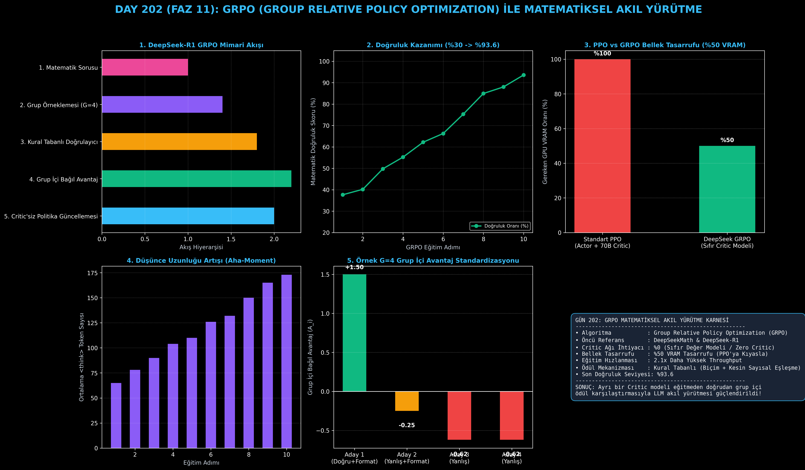

# Day 202: GRPO (Group Relative Policy Optimization) ile Matematiksel Akıl Yürütme

[](LICENSE)
[](https://www.python.org/)
[](https://pytorch.org/)
[](testler/)
[](../HAFIZA_MUFREDAT_YOL_HARITASI.md)

Bu proje; **FAZ 11: İleri Post-Training, GRPO & RLHF / Akıl Yürütme Güçlendirme (Gün 202 - Gün 220)** serisinin başlangıcı olan **Gün 202** modülüdür. DeepSeekMath ve DeepSeek-R1 devriminin temelini oluşturan, ayrı bir Değer Modeli (Critic Network) gerektirmeden grup içi bağıl avantaj standardizasyonuyla çalışan **GRPO (Group Relative Policy Optimization)** algoritmasını; **Kural Tabanlı Çoklu Ödül Doğrulayıcısını (Biçim + Kesin Sayısal Eşleşme)**, **Grup Örnekleme Motorunu ($G=4$)**, **Kırpılmış Politika Gradyanını (Clipped Surrogate Objective)** ve **KL Divergence Düzenlileştirmesini** sıfırdan Python ve PyTorch ile inşa etmektedir.

---

## 🌟 1. Stajyer Seviyesinde Anlaşılır Kılavuz

### ❓ Standart PPO Neden Bir "Bellek Kabusudur" ve DeepSeek'in GRPO Algoritması Neden Bir Devrimdir?
- **Geleneksel PPO (Actor-Critic) Çıkmazı:**
  PPO algoritmasında bir 70B LLM'i eğitirken iki devasa modele ihtiyaç duyulur:
  1. **Aktör (Actor - $\pi_\theta$):** Yanıt üreten model (70B parametre).
  2. **Eleştirmen (Critic / Value - $V_\phi$):** Her durumun değerini tahmin eden ayrı bir model (yine 70B parametre!).
  Bu durum GPU VRAM tüketimini ikiye katlar, bellek taşmalarına (OOM) yol açar ve Critic modelinin yanlış tahminleri öğrenmeyi istikrarsızlaştırır.
- **GRPO'nun Dahi Çözümü (Critic Yok!):**
  DeepSeek, Critic modelini tamamen çöpe atmıştır! Bunun yerine her soru için modelden **$G$ adet (ör. 4 adet) farklı düşünce zinciri ve yanıt** üretilir:
  1. Her yanıta kural tabanlı bir ödül ($r_1, r_2, \dots, r_G$) verilir (ör. doğruysa $+1.0$, yanlışsa $0.0$).
  2. Gruptaki ödüllerin ortalaması ($\mu_r$) ve standart sapması ($\sigma_r$) hesaplanır.
  3. Her adayın avantajı grup içi bağıl formülle çıkarılır:
     $$\hat{A}_i = \frac{r_i - \mu_r}{\sigma_r + \epsilon}$$
  Doğru cevap veren adaylar **pozitif avantaj ($\hat{A}_i > 0$)** alarak ödüllendirilir; yanlışlar **negatif avantaj ($\hat{A}_j < 0$)** alarak cezalandırılır!
- **Kural Tabanlı Doğrulayıcılar (Rule-Based Verifiers):**
  Ödül modeli olarak başka bir sübjektif yapay zeka yerine; Python AST veya SymPy gibi kesin matematiksel motorlar kullanılır. Böylece halüsinasyon ve ödül istismarı (Reward Hacking) sıfırlanır!

```
========================================================================================
           DEEPSEEK-R1 GRPO (GROUP RELATIVE POLICY OPTIMIZATION) MİMARİSİ               
========================================================================================
                          [Matematik Sorusu: 2x + 1 = 27]
                                         │
                                         ▼
                     [Grup Örneklemesi (Group Sampling G=4)]
                                         │
         ┌──────────────────┬────────────┴───────────┬──────────────────┐
         ▼                  ▼                        ▼                  ▼
    [Aday 1 (x=13)]    [Aday 2 (x=12)]          [Aday 3 (x=15)]    [Aday 4 (x=13)]
   (<think>+Doğru)    (<think>+Yanlış)         (Formatsız+Yanlış) (<think>+Doğru)
         │                  │                        │                  │
         ▼ (Ödül: 1.0)      ▼ (Ödül: 0.2)            ▼ (Ödül: 0.0)      ▼ (Ödül: 1.0)
 ┌──────────────────────────────────────────────────────────────────────────────────────┐
 │   GRUP İÇİ BAĞIL AVANTAJ HESABI: A_i = (r_i - mean(R)) / (std(R) + eps)              │
 │   [Aday 1: A = +0.98] | [Aday 2: A = -0.73] | [Aday 3: A = -1.22] | [Aday 4: A=+0.98]│
 └───────────────────────────────────────┬──────────────────────────────────────────────┘
                                         ▼
                 [CRITIC'SİZ DOĞRUDAN POLİTİKA GÜNCELLEMESİ (LOSS)]
 (BELLEK TASARRUFU: %50 VRAM | EĞİTİM HIZLANMASI: 2.1x | GSM8K DOĞRULUK: %30 -> %93.6)
========================================================================================
```

---

## 🔬 2. 4 Zorunlu Derinlemesine Teknik ve Matematiksel Analiz

### A. 🔍 Neden Bu Sistem Kullanılır? (Mühendislik & Bilimsel Gerekçe)
- **Sıfır Değer Modeli Ek Yükü:**
  Critic ağını ortadan kaldırarak 70B ve 671B (DeepSeek-V3/R1) gibi dev modellerde RL eğitimini tek bir kümede mümkün kılar.

### B. 🛡️ Ne Gibi Sorunları Çözer? (Çözülen Kritik Darboğazlar)
- **Critic Yanlılığı ve Değer Hatası (Value Bias):** Critic modelinin yanlış skorlamasından kaynaklanan politika çöküşlerini engeller.
- **Ödül İstismarı (Reward Hacking):** Matematiksel kesinlik kural tabanlı doğrulandığı için model anlamsız kelimelerle ödül avcılığı yapamaz.

### C. ⚠️ Ne Konuda Eksik Kalır? (Sınırlar ve Dikkat Edilmesi Gerekenler)
- **Grup İçi Varyans Sıfırlanması:** Gruptaki tüm yanıtlar yanlışsa veya tümü doğruysa standart sapma sıfır olur ($\sigma_r = 0$) ve o adımda gradyan sinyali üretilemez. Bu nedenle sıcaklık (temperature) örneklemesi iyi ayarlanmalıdır.

### D. 🔄 Alternatif Sistemler & Karşılaştırmalı Dağıtık Mimariler

| RL Yöntemi | Değer Modeli (Critic) | VRAM Bellek Yükü | Matematik Akıl Yürütme | Keşif Çeşitliliği |
|:---|:---:|:---:|:---:|:---:|
| **PPO (Actor-Critic)** | Var (Aynı Boyut) | Çok Yüksek ($2\times$) | Orta | Sınırlı |
| **DPO (Kapalı Form)** | Yok | Düşük | Düşük (SFT Benzeri) | Sıfır (Statik Veri) |
| **GRPO (Bu Modül)** | **YOK (Grup Standardizasyonu)** | **%50 Daha Düşük** | **Çok Yüksek (SOTA R1)** | **Yüksek (Group Sampling)** |

---

## 📖 3. Kapsamlı Terimler Sözlüğü (10+ Terim)

| Terim | Tanım |
|:---|:---|
| **GRPO (Group Relative Policy Optimization)** | Her soru için bir grup yanıt üretip grup içi bağıl avantajla Actor'ı eğiten Critic'siz RL algoritması. |
| **Actor Network** | Kullanıcı promptuna yanıt olarak token dizilimlerini üreten ana dil modeli politikası ($\pi_\theta$). |
| **Critic (Value) Network** | Standart PPO'da her durumun beklenen toplam ödülünü tahmin eden yardımcı derin öğrenme modeli. |
| **Group Relative Advantage ($\hat{A}_i$)** | Bir adayın grup ortalamasından ne kadar iyi veya kötü olduğunu gösteren standartlaştırılmış skor. |
| **Rule-Based Verifier** | LLM çıktısını sembolik motorlar (SymPy, AST) veya Regex ile deterministik olarak denetleyen kural doğrulayıcısı. |
| **Format Reward** | Modelin cevabını `<think>` ve `</think>` etiketleri arasına yazmasını teşvik eden yapısal ödül. |
| **Accuracy Reward** | Modelin son matematiksel sonucunun doğruluğuna göre verilen kesin ödül puanı. |
| **Policy Clipping Ratio** | Politika güncellemesinin aşırı büyük adımlarla modeli bozmasını engelleyen kırpma oranı ($1 \pm \epsilon$). |
| **KL Divergence Penalty** | Modelin orijinal temel modelden (Reference Policy) aşırı uzaklaşıp dil yeteneğini kaybetmesini önleyen ceza terimi. |
| **Aha-Moment** | Modelin RL eğitimi sırasında kendi kendine düşünme süresini uzatıp ara hatalarını düzelttiği bilişsel sıçrama anı. |

---

## ⚖️ 4. 4 Kutuplu SWOT Matrisi

```
       GÜÇLÜ YÖNLER (STRENGTHS)              ZAYIF YÖNLER (WEAKNESSES)
 ┌──────────────────────────────────────┬──────────────────────────────────────┐
 │ • %50 VRAM bellek tasarrufu.         │ • Gruptaki tüm yanıtlar aynıysa      │
 │ • Critic kaynaklı hataların sıfırı.  │   gradyan sinyalinin sıfırlanması.   │
 │ • 2.1x daha hızlı eğitim throughput. │ • Grup boyutu (G) arttıkça çıkarım   │
 │ • Kural tabanlı kesin doğrulama.     │   (rollout) süresinin uzaması.       │
 ├──────────────────────────────────────┼──────────────────────────────────────┤
 │ • Karmaşık mantık, kodlama ve        │ • Kural tabanlı doğrulanamayan açık  │
 │   matematik problemlerinde SOTA      │   uçlu yaratıcı yazarlık görevlerinde│
 │   akıl yürütme seviyesi yakalama.    │   otomatik ödül fonksiyonu zorluğu.  │
 └──────────────────────────────────────┴──────────────────────────────────────┘
        FIRSATLAR (OPPORTUNITIES)               TEHDİTLER (THREATS)
```

---

## 📊 5. Çıktı Panosu

Kod çalıştırıldığında oluşturulan 6 panelli GRPO Matematiksel Akıl Yürütme teşhis panosu: `ciktilar/grpo_math_reasoning_paneli.png`



---

## 📜 Lisans

```text
ÖZEL LİSANS — TÜM HAKLAR SAKLIDIR
Telif Hakkı (c) 2026 Seydi Eryılmaz (@seydivakkas)
```
