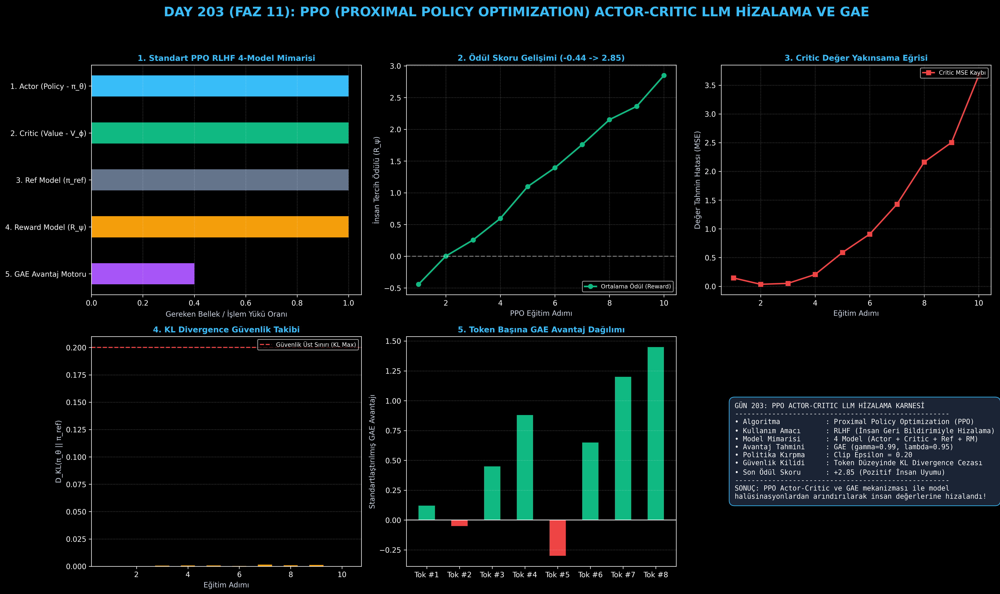

# Day 203: PPO (Proximal Policy Optimization) Actor-Critic LLM Hizalama ve GAE

[](LICENSE)
[](https://www.python.org/)
[](https://pytorch.org/)
[](testler/)
[](../HAFIZA_MUFREDAT_YOL_HARITASI.md)

Bu proje; **FAZ 11: İleri Post-Training, GRPO & RLHF / Akıl Yürütme Güçlendirme (Gün 202 - Gün 220)** serisinin **Gün 203** modülüdür. ChatGPT ve InstructGPT devrimini başlatan temel hizalama mekanizması olan **4 Modelli PPO (Proximal Policy Optimization)** mimarisini; **Aktör (Actor - $\pi_\theta$)**, **Eleştirmen (Critic / Value - $V_\phi$)**, **Referans Politika ($\pi_{\text{ref}}$)**, **Ödül Modeli ($R_\psi$)**, **GAE (Generalized Advantage Estimation - $\gamma, \lambda$)** ve **Kırpılmış Politika Kaybını (Clipped Surrogate Objective)** sıfırdan Python ve PyTorch ile inşa etmektedir.

---

## 🌟 1. Stajyer Seviyesinde Anlaşılır Kılavuz

### ❓ SFT Modeli Neden Yetmez ve 4 Modelli PPO RLHF Nasıl Çalışır?
- **SFT'nin (Supervised Fine-Tuning) Sınırı:**
  Bir modeli sadece metin tamamlamayla eğittiğinizde model "zararlı", "yanıltıcı" veya "aşırı geveze" cevapları da taklit edebilir. Modelin hangi cevabın "daha yararlı, dürüst ve zararsız (3H: Helpful, Honest, Harmless)" olduğunu öğrenmesi için pekiştirmeli öğrenmeye (RLHF) ihtiyaç vardır.
- **4 Modelli RLHF Orkestrasyonu:**
  PPO eğitiminde 4 farklı derin öğrenme modeli aynı anda sahnede yer alır:
  1. **Aktör (Actor - $\pi_\theta$):** Kullanıcı istemine yanıt üreten ve sürekli eğitilen ana dil modeli.
  2. **Eleştirmen (Critic - $V_\phi$):** Her durumun (her cümlenin/kelimenin) gelecekte getireceği toplam ödülü tahmin eden değer modeli.
  3. **Referans Model ($\pi_{\text{ref}}$):** Dondurulmuş temel model. Aktörün aşırı değişip dil yeteneğini kaybetmesini (Policy Drift) önlemek için KL Divergence cezası hesaplar.
  4. **Ödül Modeli ($R_\psi$):** İnsan tercihleriyle eğitilmiş, nihai yanıta skalar bir kalite puanı ($[-3.0, +3.0]$) veren skorlayıcı.
- **GAE (Generalized Advantage Estimation - $\gamma=0.99, \lambda=0.95$):**
  Bir cevaptaki hangi cümlenin veya kelimenin ödülü getirdiğini (Kredi Atama Problemi - Credit Assignment) belirlemek için zamansal fark (TD error) ve üstel ağırlıklı geleceğe bakış avantajını hesaplar.
- **Kırpma Oranı ($1 \pm \epsilon$ Clipping):**
  Yeni politikanın eskisine oranı ($\rho_t$) çok büyürse gradyan patlamasını ve modelin çökmesini engellemek için güncellemeyi $[\mathbf{1-\epsilon}, \mathbf{1+\epsilon}]$ aralığına hapseder.

```
========================================================================================
             4 MODELLİ RLHF PPO (PROXIMAL POLICY OPTIMIZATION) MİMARİSİ                 
========================================================================================
                              [Kullanıcı İstemi (Prompt x)]
                                            │
                     ┌──────────────────────┴──────────────────────┐
                     ▼                                             ▼
        [AKTÖR MODELİ (Actor π_θ)]                      [REFERANS MODEL (π_ref)]
         (Üretilen Yanıt Dizilimi y)                     (Dondurulmuş Temel SFT)
                     │                                             │
                     ├──────────────────────┬──────────────────────┘
                     ▼                      ▼
           [ÖDÜL MODELİ (R_ψ)]    [KL DIVERGENCE CEZASI: -β * log(π_θ / π_ref)]
           (İnsan Tercih Skoru)                     │
                     │                              │
                     └──────────────┬───────────────┘
                                    ▼
                    [TOKEN BAŞINA ÖDÜL VE CRITIC (V_ϕ)]
                                    │
                                    ▼
                   [GAE (γ=0.99, λ=0.95) AVANTAJ HESABI]
                    δ_t = r_t + γ*V(s_{t+1}) - V(s_t)
                                    │
                                    ▼
           [PPO CLIPPED KAYBI: min(ρ*A, clip(ρ, 1-ε, 1+ε)*A)]
========================================================================================
```

---

## 🔬 2. 4 Zorunlu Derinlemesine Teknik ve Matematiksel Analiz

### A. 🔍 Neden Bu Sistem Kullanılır? (Mühendislik & Bilimsel Gerekçe)
- **Token Düzeyinde İnce Ayarlı Kredi Dağıtımı:**
  GAE formülü sayesinde sadece cümlenin sonuna değil, yanıtın ara adımlarına da hassas avantaj skorları atanır; model tam olarak nerede iyi akıl yürüttüğünü anlar.

### B. 🛡️ Ne Gibi Sorunları Çözer? (Çözülen Kritik Darboğazlar)
- **Politika Bozulması (Policy Collapse):** Basit REINFORCE algoritmalarındaki yüksek varyans ve ani çöküşleri kırpılmış (clipped) objektif fonksiyonuyla çözer.
- **Reward Hacking Önleme:** Referans modele olan KL uzaklığı ($D_{\text{KL}}$) düzenlileştirici olarak eklenerek modelin ödül sistemini manipüle etmesi engellenir.

### C. ⚠️ Ne Konuda Eksik Kalır? (Sınırlar ve Dikkat Edilmesi Gerekenler)
- **Aşırı Yüksek Donanım Maliyeti:** Bellekte aynı anda 4 büyük modelin (Actor, Critic, Ref, RM) tutulması gerektiğinden devasa GPU VRAM kümesi gerektirir (DeepSeek GRPO bu yüzden Critic'i kaldırmıştır).

### D. 🔄 Alternatif Sistemler & Karşılaştırmalı Dağıtık Mimariler

| Özellik | Standart PPO (Bu Modül) | GRPO (DeepSeek) | DPO (Kapalı Form) | KTO (İkili Tercih) |
|:---|:---:|:---:|:---:|:---:|
| **Critic Ağı** | Var (Büyük Yük) | **Yok** | **Yok** | **Yok** |
| **Model Sayısı** | 4 Model | 2 Model (Policy+Ref) | 2 Model | 2 Model |
| **Token Düzeyi Kredi** | **Çok Yüksek (GAE)** | Grup Seviyesi | Sekans Seviyesi | Sekans Seviyesi |
| **Eğitim Karmaşıklığı**| Yüksek | Orta | Düşük | Düşük |

---

## 📖 3. Kapsamlı Terimler Sözlüğü (10+ Terim)

| Terim | Tanım |
|:---|:---|
| **PPO (Proximal Policy Optimization)** | Politika oranını kırparak istikrarlı ve güvenli pekiştirmeli öğrenme adımları atan algoritma. |
| **Actor Model ($\pi_\theta$)** | Metin dizilimini token token üreten ve gradyanlarla optimize edilen asıl dil modeli. |
| **Critic Model ($V_\phi$)** | Verilen bir metin durumunun (state) beklenen toplam kümülatif getirisini tahmin eden değer ağı. |
| **Reward Model ($R_\psi$)** | İnsan ikili tercih (A vs B) verileriyle eğitilmiş ve çıktıya skalar puan veren ödül modeli. |
| **Reference Policy ($\pi_{\text{ref}}$)** | SFT aşamasından kalan ve modelin dil kabiliyetini koruması için referans alınan dondurulmuş politika. |
| **GAE (Generalized Advantage Estimation)** | İndirgeme faktörü ($\gamma$) ve izleme parametresi ($\lambda$) ile yanlılık-varyans dengesini kuran avantaj formülü. |
| **TD Error ($\delta_t$)** | Bir adım sonraki durum değeri ile mevcut durum değeri arasındaki zamansal fark hatası. |
| **Policy Ratio ($\rho_t$)** | Yeni politikanın eski politikaya olasılık oranı ($\pi_\theta(a|s) / \pi_{\text{old}}(a|s)$). |
| **KL Divergence ($D_{\text{KL}}$)** | İki olasılık dağılımı arasındaki bilgi ıraksamasını ölçen ve modelin sapmasını kısıtlayan metrik. |
| **Credit Assignment** | Çıktıdaki nihai başarının veya başarısızlığın hangi ara tokenlardan kaynaklandığını tespit etme problemi. |

---

## ⚖️ 4. 4 Kutuplu SWOT Matrisi

```
       GÜÇLÜ YÖNLER (STRENGTHS)              ZAYIF YÖNLER (WEAKNESSES)
 ┌──────────────────────────────────────┬──────────────────────────────────────┐
 │ • Token düzeyinde hassas kredi atama │ • 4 modelin VRAM gereksinimi devasa. │
 │ • Kırpılmış kayıpla yüksek istikrar. │ • Hiperparametre hassasiyeti yüksek. │
 │ • Kanıtlanmış endüstri standardı     │ • Eğitimi DPO ve GRPO'ya kıyasla     │
 │   (InstructGPT, ChatGPT temeli).     │   daha yavaş ve hesaplama yoğundur.  │
 ├──────────────────────────────────────┼──────────────────────────────────────┤
 │ • Çevrimdışı (offline) ve çevrimiçi  │ • Reward modelin zayıf noktalarının  │
 │   (online) ortamda karmaşık insan    │   aktör tarafından suistimal edilme  │
 │   değerlerini modele kazandırma.     │   riski (Reward Exploitation).       │
 └──────────────────────────────────────┴──────────────────────────────────────┘
        FIRSATLAR (OPPORTUNITIES)               TEHDİTLER (THREATS)
```

---

## 📊 5. Çıktı Panosu

Kod çalıştırıldığında oluşturulan 6 panelli PPO Actor-Critic LLM Hizalama teşhis panosu: `ciktilar/ppo_actor_critic_paneli.png`



---

## 📜 Lisans

```text
ÖZEL LİSANS — TÜM HAKLAR SAKLIDIR
Telif Hakkı (c) 2026 Seydi Eryılmaz (@seydivakkas)
```
