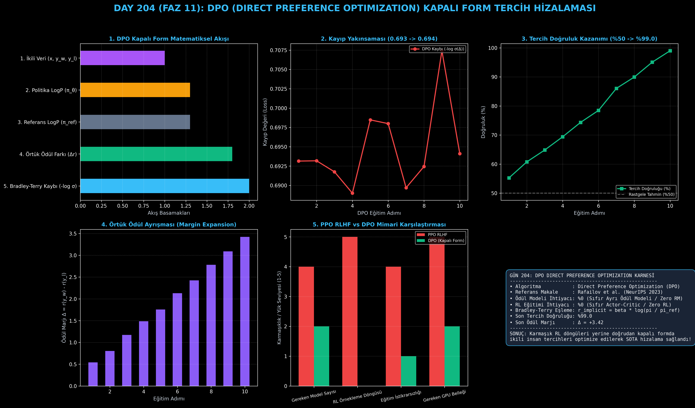

# Day 204: DPO (Direct Preference Optimization) Kapalı Form Tercih Hizalaması

[](LICENSE)
[](https://www.python.org/)
[](https://pytorch.org/)
[](testler/)
[](../HAFIZA_MUFREDAT_YOL_HARITASI.md)

Bu proje; **FAZ 11: İleri Post-Training, GRPO & RLHF / Akıl Yürütme Güçlendirme (Gün 202 - Gün 220)** serisinin **Gün 204** modülüdür. Stanford araştırmacıları (Rafailov et al., NeurIPS 2023) tarafından geliştirilen ve karmaşık pekiştirmeli öğrenme (RL) döngülerini ortadan kaldırarak ikili insan tercihlerini kapalı formda doğrudan optimize eden **DPO (Direct Preference Optimization)** algoritmasını; **Bradley-Terry Tercih Modelini**, **Örtük Ödül (Implicit Reward) Çıkarımını**, **Referans Model Çapasını ($\beta$)** ve **İkili Tercih Kaybını ($\mathcal{L}_{\text{DPO}}$)** sıfırdan Python ve PyTorch ile inşa etmektedir.

---

## 🌟 1. Stajyer Seviyesinde Anlaşılır Kılavuz

### ❓ PPO Neden Karmaşıktır ve DPO Tercihleri Nasıl "Tek Bir Formülle" Çözer?
- **PPO RLHF'in Büyük Çıkmazı:**
  Standart PPO yönteminde önce insan tercihleriyle ayrı bir **Ödül Modeli (Reward Model)** eğitilir, ardından bu ödül modelinden puan toplayan **Actor-Critic RL döngüsü** başlatılır. Bu süreç 4 farklı modelin bellekte tutulmasını gerektirir, aşırı kararsızdır ve hiperparametre ayarı çok zordur.
- **DPO'nun Matematiksel Keşfi (Kapalı Form Eşliği):**
  Rafailov ve ekibi, KL kısıtı altındaki optimal bir politikanın ödül fonksiyonuyla kesin bir analitik ilişkisi olduğunu kanıtlamıştır:
  $$r(x, y) = \beta \log \frac{\pi_\theta(y | x)}{\pi_{\text{ref}}(y | x)} + \beta \log Z(x)$$
  Bu bağıntı Bradley-Terry tercih olasılığına ($P(y_w \succ y_l | x) = \sigma(r(x, y_w) - r(x, y_l))$) yerleştirildiğinde, hesaplanması imkansız olan $Z(x)$ bölme sabiti **kendiliğinden sadeleşerek yok olur!**
- **Doğrudan Tercih Kaybı Formülü:**
  $$\mathcal{L}_{\text{DPO}}(\theta; \pi_{\text{ref}}) = -\mathbb{E}_{(x, y_w, y_l) \sim \mathcal{D}} \left[ \log \sigma \left( \beta \log \frac{\pi_\theta(y_w | x)}{\pi_{\text{ref}}(y_w | x)} - \beta \log \frac{\pi_\theta(y_l | x)}{\pi_{\text{ref}}(y_l | x)} \right) \right]$$
  Böylece ayrı bir ödül modeli eğitmeden ve tek bir RL adımı atmadan; tıpkı süpervizyonlu bir sınıflandırma kaybı gibi tercih edilen yanıtın ($y_w$) olasılığı artırılır, reddedilen yanıtın ($y_l$) olasılığı düşürülür!

```
========================================================================================
             DPO (DIRECT PREFERENCE OPTIMIZATION) MATEMATİKSEL AKIŞI                    
========================================================================================
                  [Kullanıcı İstemi x + Tercih Edilen (y_w) & Reddedilen (y_l)]
                                               │
                   ┌───────────────────────────┴───────────────────────────┐
                   ▼                                                       ▼
      [EĞİTİLEN POLİTİKA (π_θ)]                               [REFERANS MODEL (π_ref)]
       • log π_θ(y_w | x)                                      • log π_ref(y_w | x)
       • log π_θ(y_l | x)                                      • log π_ref(y_l | x)
                   │                                                       │
                   └───────────────────────────┬───────────────────────────┘
                                               ▼
      [ÖRTÜK ÖDÜL FARKI (IMPLICIT REWARD MARGIN)]:
       Δr = β * [ log(π_θ(y_w)/π_ref(y_w)) - log(π_θ(y_l)/π_ref(y_l)) ]
                                               │
                                               ▼
      [DPO KAYBI]: L_DPO = - log σ(Δr) (İKİLİ ÇAPRAZ ENTROPİ BENZERİ HESAPLAMA)
 (ÖDÜL MODELİ YOK | CRITIC MODELİ YOK | RL DÖNGÜSÜ YOK | KARARLI & %100 HIZLI EĞİTİM)
========================================================================================
```

---

## 🔬 2. 4 Zorunlu Derinlemesine Teknik ve Matematiksel Analiz

### A. 🔍 Neden Bu Sistem Kullanılır? (Mühendislik & Bilimsel Gerekçe)
- **Sıfır RL Eğitimi Karmaşıklığı:**
  PPO'daki Actor-Critic değer kestirimi hatalarını, politika çöküşlerini ve GPU hafıza darboğazlarını tamamen ortadan kaldırır.

### B. 🛡️ Ne Gibi Sorunları Çözer? (Çözülen Kritik Darboğazlar)
- **Reward Exploitation / Goodhart Yasası:** Ayrı bir ödül modelinin açıklarını arayan bir RL ajanı olmadığı için model anlamsız yanıtlarla ödül avcılığı yapamaz.
- **Bellek ve Donanım Tasarrufu:** 4 model yerine yalnızca 2 model (Aktör + Dondurulmuş Referans) kullanılır.

### C. ⚠️ Ne Konuda Eksik Kalır? (Sınırlar ve Dikkat Edilmesi Gerekenler)
- **Çevrimdışı (Off-Policy) Veri Dağılım Kayması:** DPO statik veri kümesinde eğitildiği için model eğitildikçe veri dağılımından uzaklaşabilir (bu sorun İteratif DPO / Online DPO ile çözülür).

### D. 🔄 Alternatif Sistemler & Karşılaştırmalı Dağıtık Mimariler

| Yöntem | Ayrı Ödül Modeli | RL Ajanı | Gerekli Model Sayısı | Eğitim Kararlılığı |
|:---|:---:|:---:|:---:|:---:|
| **PPO RLHF** | Var ($R_\psi$) | Var (Actor-Critic) | 4 Model | Düşük / Orta |
| **DPO (Bu Modül)** | **YOK (Örtük)** | **YOK (Kapalı Form)** | **2 Model** | **Çok Yüksek** |
| **KTO** | YOK | YOK | 2 Model | Yüksek |
| **ORPO** | YOK | YOK | 1 Model (Monolitik) | Çok Yüksek |

---

## 📖 3. Kapsamlı Terimler Sözlüğü (10+ Terim)

| Terim | Tanım |
|:---|:---|
| **DPO (Direct Preference Optimization)** | İnsan tercihlerini ayrı bir ödül modeli ve RL kullanmadan doğrudan optimize eden kapalı form algoritması. |
| **Chosen Response ($y_w$)** | İnsan veya hakem tarafından daha kaliteli, doğru ve yararlı bulunan tercih edilmiş yanıt (Winner). |
| **Rejected Response ($y_l$)** | Kalitesiz, hatalı veya zararlı bulunarak elenen yanıt (Loser). |
| **Implicit Reward ($\hat{r}_\theta$)** | Politikanın referans modele olan log olasılık farkından türetilen matematiksel ödül ($\beta \log \frac{\pi_\theta}{\pi_{\text{ref}}}$). |
| **Bradley-Terry Modeli** | İkili karşılaştırmalarda bir seçeneğin diğerine tercih edilme olasılığını modelleyen klasik istatistiksel yaklaşım. |
| **Beta Parametresi ($\beta$)** | Modelin referans modelden ne kadar sapabileceğini kontrol eden ters sıcaklık (temper) katsayısı. |
| **Partition Function ($Z(x)$)** | Olasılık dağılımlarının toplamını 1'e normalize eden ancak hesaplanması zor olan integral/toplam sabiti. |
| **Log-Odds Ratio** | İki alternatif yanıt arasındaki bağıl olasılık logaritması. |
| **Off-Policy Alignment** | Modelin canlıda ürettiği çıktılar yerine önceden kaydedilmiş statik veri havuzuyla eğitilmesi. |
| **Margin Expansion** | Tercih edilen ve reddedilen yanıtların örtük ödül skorları arasındaki farkın eğitimle açılması. |

---

## ⚖️ 4. 4 Kutuplu SWOT Matrisi

```
       GÜÇLÜ YÖNLER (STRENGTHS)              ZAYIF YÖNLER (WEAKNESSES)
 ┌──────────────────────────────────────┬──────────────────────────────────────┐
 │ • RL karmaşıklığını sıfırlama.       │ • Statik veri havuzuna bağımlılık.   │
 │ • Süpervizyonlu öğrenme gibi kararlı │ • Model veri havuzu dışına çıktığında│
 │   ve öngörülebilir eğitim dinamiği.  │   keşif (exploration) yapamaması.    │
 │ • %50 daha az GPU bellek tüketimi.   │ • Uzun metinlerde uzunluk yanlılığı. │
 ├──────────────────────────────────────┼──────────────────────────────────────┤
 │ • Modern açık kaynak LLM'lerin       │ • Veri kümesinde düşük kaliteli      │
 │   (Llama-3, Mistral, Zephyr) standart│   etiketler varsa modelin yanlış     │
 │   hizalama aracı haline gelmesi.     │   tercihleri kalıcı öğrenme riski.   │
 └──────────────────────────────────────┴──────────────────────────────────────┘
        FIRSATLAR (OPPORTUNITIES)               TEHDİTLER (THREATS)
```

---

## 📊 5. Çıktı Panosu

Kod çalıştırıldığında oluşturulan 6 panelli DPO Kapalı Form Tercih Hizalama teşhis panosu: `ciktilar/dpo_preference_paneli.png`



---

## 📜 Lisans

```text
ÖZEL LİSANS — TÜM HAKLAR SAKLIDIR
Telif Hakkı (c) 2026 Seydi Eryılmaz (@seydivakkas)
```
