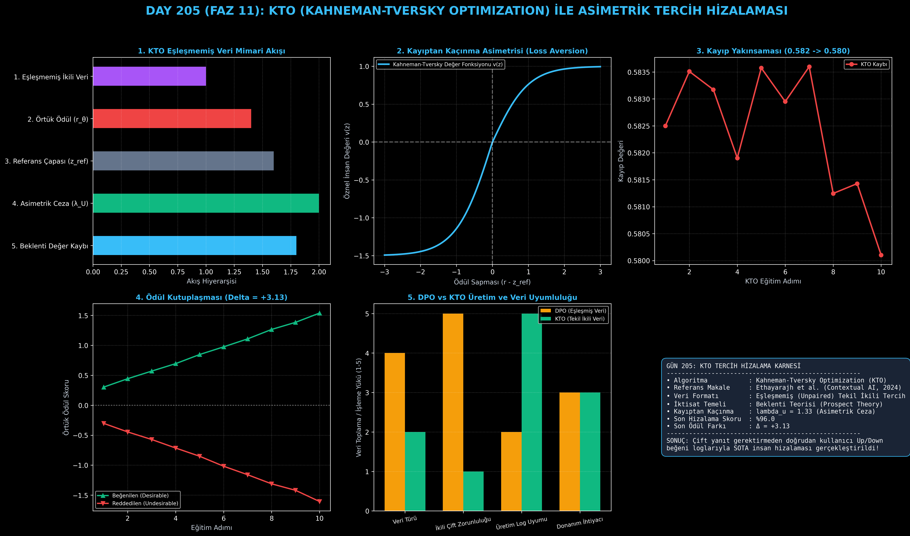

# Day 205: KTO (Kahneman-Tversky Optimization) ile Asimetrik Tercih Hizalaması

[](LICENSE)
[](https://www.python.org/)
[](https://pytorch.org/)
[](testler/)
[](../HAFIZA_MUFREDAT_YOL_HARITASI.md)

Bu proje; **FAZ 11: İleri Post-Training, GRPO & RLHF / Akıl Yürütme Güçlendirme (Gün 202 - Gün 220)** serisinin **Gün 205** modülüdür. Nobel ödüllü **Kahneman & Tversky Beklenti Teorisini (Prospect Theory)** dil modellerinin insan hizalamasına uyarlayan, çiftler halinde veri ($x, y_w, y_l$) zorunluluğunu kaldırarak doğrudan tekil ikili (Upvote / Downvote) geri bildirimlerle çalışan **KTO (Kahneman-Tversky Optimization)** algoritmasını; **Kayıptan Kaçınma (Loss Aversion - $\lambda_U$) Çarpanını**, **Referans Çapasını ($z_{\text{ref}}$)**, **Asimetrik Beklenti Değer Fonksiyonunu** ve **Eşleşmemiş (Unpaired) Tercih Kaybını** sıfırdan Python ve PyTorch ile inşa etmektedir.

---

## 🌟 1. Stajyer Seviyesinde Anlaşılır Kılavuz

### ❓ DPO Neden Gerçek Dünyada Tıkanır ve KTO Beklenti Teorisiyle Bunu Nasıl Çözer?
- **DPO'nun Gerçek Hayat Çıkmazı (Çift Veri Zorunluluğu):**
  DPO gibi algoritmalar her bir soru için mutlaka **bir iyi ($y_w$) ve bir kötü ($y_l$) yanıtın çift olarak (paired)** bulunmasını şart koşar. Ancak gerçek dünyadaki canlı chatbot ve arama motoru loglarında kullanıcılar tek bir cevaba "Beğendim (👍)" veya "Beğenmedim (👎)" der. İkinci bir yapay kötü cevap üretip eşleştirmek veri kalitesini bozar.
- **Kahneman & Tversky'nin Beklenti Teorisi (Prospect Theory):**
  Davranışsal iktisadın babaları Kahneman ve Tversky, insanların psikolojisinin kazanç ve kayıplara simetrik tepki vermediğini keşfetmiştir: **Bir kaybın verdiği acı, aynı miktardaki bir kazancın verdiği mutluluktan yaklaşık 1.5 - 2.5 kat daha büyüktür (Kayıptan Kaçınma - Loss Aversion)!**
- **KTO'nun Asimetrik Formülü:**
  Her tekil çıktı için örtük ödül ($r_\theta(x, y) = \beta \log \frac{\pi_\theta}{\pi_{\text{ref}}}$) hesaplanır ve bir referans noktası ($z_{\text{ref}}$) belirlenir.
  - **Beğenilen Cevap (👍 Desirable):** Model cevabın ödülünü $z_{\text{ref}}$ üzerine çıkarmaya çalışır:
    $$\mathcal{L}_{\text{desirable}} = \lambda_D \cdot \left( 1 - \sigma(r(x, y) - z_{\text{ref}}) \right)$$
  - **Reddedilen Cevap (👎 Undesirable):** Model cevabın cezasını **$\lambda_U = 1.33$ gibi daha sert bir kayıptan kaçınma çarpanıyla** katlayarak uygular:
    $$\mathcal{L}_{\text{undesirable}} = \lambda_U \cdot \left( 1 - \sigma(z_{\text{ref}} - r(x, y)) \right)$$

```
========================================================================================
           KTO (KAHNEMAN-TVERSKY OPTIMIZATION) ASİMETRİK HİZALAMA MİMARİSİ              
========================================================================================
               [Gerçek Dünya Kullanıcı Günlüğü: Tekil İstemi x ve Yanıt y]
                                           │
                     ┌─────────────────────┴─────────────────────┐
                     ▼                                           ▼
             [BEĞENİLDİ (👍 Upvote)]                   [BEĞENİLMEDİ (👎 Downvote)]
                     │                                           │
                     ├─────────────────────┬─────────────────────┘
                     ▼                     ▼
           [AKTÖR MODELİ (π_θ)]   [REFERANS MODEL (π_ref)]
                     │                     │
                     └──────────────┬──────┘
                                    ▼
       [ÖRTÜK ÖDÜL: r_θ = β * (log π_θ - log π_ref) | ÇAPA: z_ref = E[r_θ]]
                                    │
         ┌──────────────────────────┴──────────────────────────┐
         ▼ (Kazanç Bölgesi)                                     ▼ (Kayıp Bölgesi)
   [1 - σ(r_θ - z_ref)]                           [λ_U * (1 - σ(z_ref - r_θ))]
  (POZİTİF ÖDÜL ARTIRIMI)                         (1.33x DAHA SERT CEZA - LOSS AVERSION)
========================================================================================
```

---

## 🔬 2. 4 Zorunlu Derinlemesine Teknik ve Matematiksel Analiz

### A. 🔍 Neden Bu Sistem Kullanılır? (Mühendislik & Bilimsel Gerekçe)
- **Canlı Üretim Loglarına Doğrudan Uyumluluk:**
  Kullanıcıların web ve mobil arayüzlerde bıraktığı Upvote/Downvote tıklamalarını yapay çiftlere dönüştürmeden doğrudan eğitim verisi olarak kullanır.

### B. 🛡️ Ne Gibi Sorunları Çözer? (Çözülen Kritik Darboğazlar)
- **Veri Eşleme Maliyeti ve Sentetik Negatif Kirliliği:** Kötü yanıt üretmek için harcanan API maliyetlerini ve sentetik yanıtların yarattığı dağılım sapmalarını sıfırlar.
- **Kayıptan Kaçınma Entegrasyonu:** Modelin toksik veya halüsinasyonlu yanıtlardan çok daha agresif bir şekilde kaçınmasını sağlar.

### C. ⚠️ Ne Konuda Eksik Kalır? (Sınırlar ve Dikkat Edilmesi Gerekenler)
- **Sınıf Dengesizliği (Class Imbalance):** Veri havuzunda sadece %95 Upvote ve %5 Downvote varsa $z_{\text{ref}}$ referans noktası yukarı kayabilir; bu yüzden batch içi ağırlıklandırma doğru ayarlanmalıdır.

### D. 🔄 Alternatif Sistemler & Karşılaştırmalı Dağıtık Mimariler

| Yöntem | Veri Formatı | Çift Zorunluluğu | İktisadi Temel | Model Sayısı |
|:---|:---:|:---:|:---:|:---:|
| **PPO RLHF** | Çift Tercih | Var (RM Eğitimi) | Standart RL | 4 Model |
| **DPO** | Çift Tercih ($x, y_w, y_l$) | **%100 Zorunlu** | Bradley-Terry | 2 Model |
| **KTO (Bu Modül)** | **Eşleşmemiş ($x, y, \pm 1$)** | **YOK (Sıfır Çift)** | **Kahneman-Tversky** | **2 Model** |

---

## 📖 3. Kapsamlı Terimler Sözlüğü (10+ Terim)

| Terim | Tanım |
|:---|:---|
| **KTO (Kahneman-Tversky Optimization)** | Beklenti teorisi değer fonksiyonunu kullanarak eşleşmemiş tekil ikili verilerle LLM hizalayan algoritma. |
| **Prospect Theory (Beklenti Teorisi)** | İnsanların risk ve kayıplar karşısında rasyonel değil, asimetrik psikolojik değerlerle karar verdiğini açıklayan model. |
| **Loss Aversion (Kayıptan Kaçınma)** | Aynı büyüklükteki kaybın, kazançtan çok daha fazla psikolojik acı yaratması durumu ($\lambda_U > 1$). |
| **Desirable Sample ($y \in \mathcal{D}$)** | Kullanıcı veya denetçi tarafından beğenilmiş (👍 Upvote) kabul edilebilir yanıt. |
| **Undesirable Sample ($y \in \mathcal{U}$)** | Kullanıcı tarafından reddedilmiş, beğenilmemiş (👎 Downvote) hatalı çıktı. |
| **Reference Point ($z_{\text{ref}}$)** | Ödüllerin kazanç mı yoksa kayıp mı sayılacağını belirleyen dinamik psikolojik referans çapası. |
| **Unpaired Preference Data** | Her soru için iki alternatif üretmek yerine sadece tek bir yanıt ve onun ikili etiketini içeren veri kümesi. |
| **Asymmetric Loss Weighting** | Pozitif ($\lambda_D$) ve negatif ($\lambda_U$) örneklere farklı ağırlıklar vererek yapılan kayıp optimizasyonu. |
| **Implicit Reward Function** | Ayrı bir ödül modeli olmadan politikanın referans modele log oranından elde edilen ödül skoru. |
| **Human Utility Score** | Modelin ürettiği yanıtların insan beklenti teorisine göre toplam tatmin seviyesi. |

---

## ⚖️ 4. 4 Kutuplu SWOT Matrisi

```
       GÜÇLÜ YÖNLER (STRENGTHS)              ZAYIF YÖNLER (WEAKNESSES)
 ┌──────────────────────────────────────┬──────────────────────────────────────┐
 │ • Eşleşmemiş (tekil) veri desteği.   │ • Referans noktası (z_ref) kayması   │
 │ • Üretim loglarıyla %100 uyum.       │   aşırı dengesiz veride hassastır.   │
 │ • Kayıptan kaçınma ile güçlü güvenlik│ • İnce ayar için lambda_d ve         │
 │ • %50 daha az GPU bellek tüketimi.   │   lambda_u hiperparametreleri vardır.│
 ├──────────────────────────────────────┼──────────────────────────────────────┤
 │ • Milyonlarca gerçek kullanıcı       │ • Çok az negatif örnek bulunan       │
 │   etkileşim verisini (thumbs up/down)│   alanlarda modelin kaçınma sınırını │
 │   doğrudan modele aktarabilme.       │   öğrenememe riski.                  │
 └──────────────────────────────────────┴──────────────────────────────────────┘
        FIRSATLAR (OPPORTUNITIES)               TEHDİTLER (THREATS)
```

---

## 📊 5. Çıktı Panosu

Kod çalıştırıldığında oluşturulan 6 panelli KTO Asimetrik Tercih Hizalama teşhis panosu: `ciktilar/kto_prospect_paneli.png`



---

## 📜 Lisans

```text
ÖZEL LİSANS — TÜM HAKLAR SAKLIDIR
Telif Hakkı (c) 2026 Seydi Eryılmaz (@seydivakkas)
```
