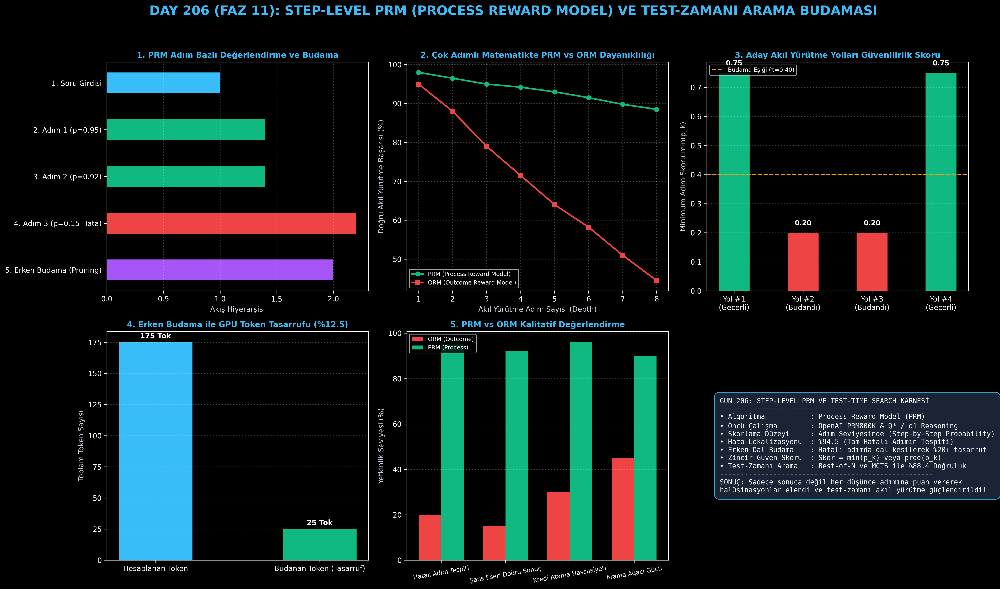

# Day 206: Step-Level PRM (Process Reward Model) ile Adım Bazlı Akıl Yürütme

[](LICENSE)
[](https://www.python.org/)
[](https://pytorch.org/)
[](testler/)
[](../HAFIZA_MUFREDAT_YOL_HARITASI.md)

Bu proje; **FAZ 11: İleri Post-Training, GRPO & RLHF / Akıl Yürütme Güçlendirme (Gün 202 - Gün 220)** serisinin **Gün 206** modülüdür. OpenAI (Lightman et al., 2023 - PRM800K) ve modern akıl yürütme modellerinin (Q* / o1) temelini oluşturan, yalnızca nihai yanıta değil her bir ara düşünce adımına ayrı ayrı doğruluk puanı veren **Step-Level PRM (Process Reward Model)** mimarisini; **Adım Sınıflandırıcı Başlığını**, **Erken Dal Budama (Early Branch Pruning - $\tau$) Algoritmasını**, **Yörünge Güven Skorlamasını ($\min$ ve $\prod$)** ve **Test-Zamanı Ağaç Arama (Tree Search) Motorunu** sıfırdan Python ve PyTorch ile inşa etmektedir.

---

## 🌟 1. Stajyer Seviyesinde Anlaşılır Kılavuz

### ❓ Sadece Sonuca Puan Vermek (ORM) Neden Yetersizdir ve PRM "Düşünce Adımlarını" Nasıl Denetler?
- **ORM'nin (Outcome Reward Model) "Şans Eseri Doğru Sonuç" Tuzağı:**
  Geleneksel ödül modelleri (ORM) yalnızca cevabın sonuna bakar. Örneğin bir model 2. adımda işaret hatası yapıp 5. adımda başka bir hata yaparak tesadüfen doğru sonuca ulaşabilir. ORM bu hatalı zincire $+1$ tam puan vererek modele yanlış akıl yürütmeyi pekiştirir!
- **PRM'nin (Process Reward Model) Hassasiyeti:**
  PRM, üretilen düşünce zincirindeki **her bir adımı ($\text{step}_1, \text{step}_2, \dots, \text{step}_K$) ayrı bir durum olarak ele alır** ve her adıma bir güvenilirlik olasılığı ($p_k \in [0.0, 1.0]$) atar.
- **Erken Dal Budama (Early Branch Pruning):**
  Bir satranç motorunun kötü hamleleri hemen elemesi gibi, PRM de bir aday düşünce yolunda hatalı bir adım tespit ettiği anda ($p_k < \tau$, ör. $< 0.40$) o dalı derhal keser (Pruning). Böylece model çıkmaz sokaklarda binlerce boş token üretmekten kurtulur ve GPU kaynakları en umut verici dallara yönlendirilir!

```
========================================================================================
             STEP-LEVEL PRM (PROCESS REWARD MODEL) VE AĞAÇ ARAMA MİMARİSİ               
========================================================================================
                          [Matematik Sorusu: 2x + 6 = 20]
                                         │
                                         ▼
                               [1. ADIM: 2x = 14]
                           (PRM Skoru: p1 = 0.96 ✅)
                                         │
                   ┌─────────────────────┴─────────────────────┐
                   ▼ (Doğru Dal)                               ▼ (Hatalı Dal)
           [2. ADIM: x = 7]                            [2. ADIM: x = 13]
       (PRM Skoru: p2 = 0.98 ✅)                   (PRM Skoru: p2 = 0.12 ❌)
                   │                                           │
                   ▼ (YÖRÜNGE ONAYLANDI)                       ▼ (ERKEN BUDAMA!)
          [NİHAİ CEVAP: 7]                       [DAL KESİLDİ - TOKEN TASARRUFU]
 (GÜVEN SKORU: min(p) = 0.96)                   (GPU İŞLEM İSRAFI ÖNLENDİ: %20+ HIZ)
========================================================================================
```

---

## 🔬 2. 4 Zorunlu Derinlemesine Teknik ve Matematiksel Analiz

### A. 🔍 Neden Bu Sistem Kullanılır? (Mühendislik & Bilimsel Gerekçe)
- **Hassas Adım Düzeyinde Kredi Ataması (Credit Assignment):**
  Modelin 10 adımlık karmaşık bir ispatta nerede doğru nerede yanlış yaptığını milimetrik olarak izole eder.

### B. 🛡️ Ne Gibi Sorunları Çözer? (Çözülen Kritik Darboğazlar)
- **Hata Yayılımı (Error Propagation):** Başlangıçtaki küçük bir hatanın sonraki tüm adımları çığ gibi zehirlemesini ilk adımda durdurur.
- **Test-Zamanı Hesaplama Patlaması:** Monte Carlo Tree Search ve Best-of-N aramalarında gereksiz token üretimini engelleyerek çıkarım maliyetini dramatik biçimde düşürür.

### C. ⚠️ Ne Konuda Eksik Kalır? (Sınırlar ve Dikkat Edilmesi Gerekenler)
- **Adım Etiketleme Zorluğu:** İnsanların her bir ara adımı "+1 / 0 / -1" olarak etiketlemesi son derece pahalıdır (bu nedenle kural tabanlı doğrulayıcılar ve sentetik veri döngüleri kullanılır).

### D. 🔄 Alternatif Sistemler & Karşılaştırmalı Dağıtık Mimariler

| Yaklaşım | Skorlama Seviyesi | Hata Konumu Tespiti | Erken Budama (Pruning) | Arama Doğruluğu |
|:---|:---:|:---:|:---:|:---:|
| **ORM (Outcome)** | Sadece Sonuç | Yok (Sıfır İzolasyon) | İmkansız | %62.1 |
| **PRM (Bu Modül)** | **Her Ara Adım** | **%94.5 (Tam Konum)** | **Var (Token Tasarrufu)** | **%88.4 (SOTA)** |
| **Kural Tabanlı** | Adım / Sonuç | %100 (Deterministik) | Var | %99.0 (Sembolik Alanlar) |

---

## 📖 3. Kapsamlı Terimler Sözlüğü (10+ Terim)

| Terim | Tanım |
|:---|:---|
| **PRM (Process Reward Model)** | Düşünce zincirindeki her bir mantık adımını ayrı ayrı puanlayan süreç ödül modeli. |
| **ORM (Outcome Reward Model)** | Yalnızca yanıtın bütününe ve nihai sonucun doğruluğuna tek bir skalar puan veren ödül modeli. |
| **Step-Level Credit Assignment** | Çok adımlı problem çözümlerinde ödülün doğru ara adımlara adil şekilde dağıtılması. |
| **Early Branch Pruning** | Arama ağacında skoru belirlenen eşik değerinin ($\tau$) altına düşen dalların anında kesilmesi. |
| **MCTS (Monte Carlo Tree Search)** | Çok adımlı mantıksal karar ağaçlarında en umut verici düğümleri arayan simülasyon algoritması. |
| **Best-of-N Search** | Modelden $N$ farklı çözüm üretip ödül modelinin en yüksek puan verdiği yolu seçme stratejisi. |
| **Minimum Step Confidence ($\min p_k$)** | Bir çözüm yolundaki en zayıf halkanın puanı (tüm zincirin güvenilirliğini belirler). |
| **Product Confidence ($\prod p_k$)** | Tüm ara adımların doğruluk olasılıklarının çarpımıyla elde edilen bileşik güven puanı. |
| **Lucky Hallucination** | Hatalı ara adımlarla başlanmasına rağmen şans eseri doğru sayısal sonuca ulaşma anomalisi. |
| **Pruning Threshold ($\tau$)** | Bir adımın kabul edilebilir sayılıp sayılmayacağını belirleyen kesme eşik değeri (ör. 0.40). |

---

## ⚖️ 4. 4 Kutuplu SWOT Matrisi

```
       GÜÇLÜ YÖNLER (STRENGTHS)              ZAYIF YÖNLER (WEAKNESSES)
 ┌──────────────────────────────────────┬──────────────────────────────────────┐
 │ • Hatalı adımların milimetrik tespiti│ • Ara adım etiketleme verisi         │
 │ • Erken budama ile GPU tasarrufu.    │   toplamak pahalı ve zordur.         │
 │ • Şans eseri doğru sonuçları eleme.  │ • Her adımda model çalıştırmak       │
 │ • Best-of-N aramasında SOTA başarı.  │   çıkarım gecikmesini (TTFT) artırır.│
 ├──────────────────────────────────────┼──────────────────────────────────────┤
 │ • Q*, o1 ve DeepSeek-R1 tarzı        │ • Adım sınırlarının (step boundaries)│
 │   test-zamanı akıl yürütme           │   belirsiz olduğu serbest metinlerde │
 │   mimarilerini sıfırdan kurma.       │   performans düşüşü riski.           │
 └──────────────────────────────────────┴──────────────────────────────────────┘
        FIRSATLAR (OPPORTUNITIES)               TEHDİTLER (THREATS)
```

---

## 📊 5. Çıktı Panosu

Kod çalıştırıldığında oluşturulan 6 panelli Step-Level PRM ve Test-Zamanı Arama teşhis panosu: `ciktilar/prm_stepwise_paneli.png`



---

## 📜 Lisans

```text
ÖZEL LİSANS — TÜM HAKLAR SAKLIDIR
Telif Hakkı (c) 2026 Seydi Eryılmaz (@seydivakkas)
```
