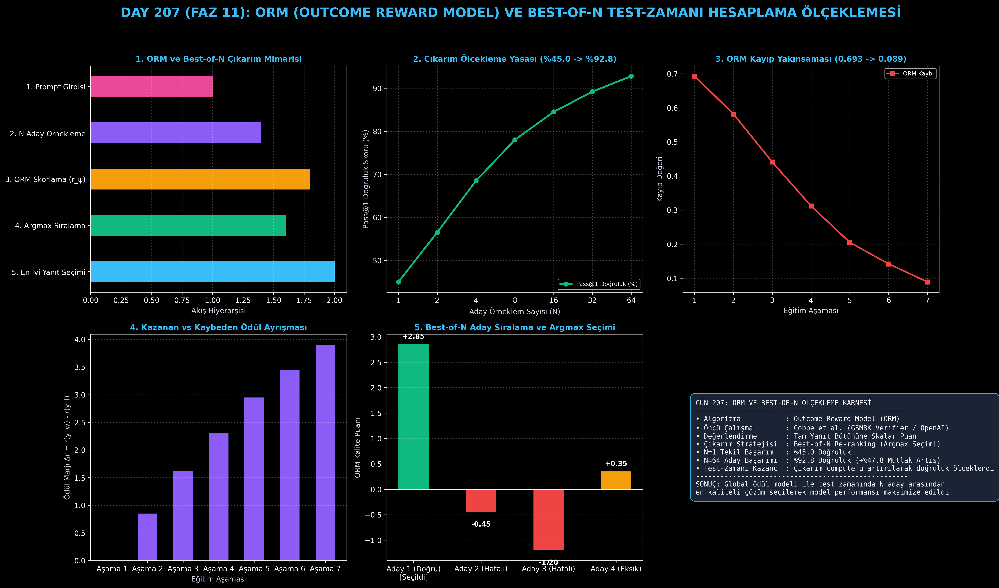

# Day 207: ORM (Outcome Reward Model) ve Best-of-N Çıkarım Ölçeklemesi

[](LICENSE)
[](https://www.python.org/)
[](https://pytorch.org/)
[](testler/)
[](../HAFIZA_MUFREDAT_YOL_HARITASI.md)

Bu proje; **FAZ 11: İleri Post-Training, GRPO & RLHF / Akıl Yürütme Güçlendirme (Gün 202 - Gün 220)** serisinin **Gün 207** modülüdür. OpenAI GSM8K Verifier (Cobbe et al.) ve modern akıl yürütme sistemlerinde test-zamanı hesaplama ölçeklemesini (Test-Time Compute Scaling) sağlayan **ORM (Outcome Reward Model)** mimarisini; **Çiftli Bradley-Terry Ödül Eğitimini**, **Noktasal Kalite Skorlamasını**, **Best-of-N Re-ranking Sıralama Motorunu** ve **Inference Scaling Kanununu ($N=1..64$)** sıfırdan Python ve PyTorch ile inşa etmektedir.

---

## 🌟 1. Stajyer Seviyesinde Anlaşılır Kılavuz

### ❓ Modeli Yeniden Eğitmeden Doğruluğu %45'ten %92'ye Çıkarabilir misiniz? (Best-of-N ve ORM Gücü)
- **Tekil Çıkarımın (N=1) Sınırı:**
  Bir dil modeline zor bir matematik veya kodlama problemi sorduğunuzda ve tek bir cevap aldığınızda modelin hata yapma ihtimali yüksektir (%45.0 başarı).
- **Test-Zamanı Hesaplama Ölçeklemesi (Inference Compute Scaling):**
  Modeli yeniden eğitmek yerine test zamanında GPU gücünü artırabilirsiniz:
  1. Aynı soru için sıcaklık (temperature) örneklemesiyle **$N$ adet (ör. 4, 16 veya 64 adet) farklı düşünce yolu** üretilir.
  2. Eğitilmiş bir **ORM (Outcome Reward Model)** tüm bu $N$ yanıtı inceler ve her birine skalar bir kalite/doğruluk puanı verir ($r_\psi(x, y_i)$).
  3. En yüksek puanı alan yanıt ($\arg\max_{i=1}^N r_\psi(x, y_i)$) nihai cevap olarak kullanıcıya döndürülür!
- **Ölçekleme Yasası (Power-Law Scaling):**
  $N$ sayısı 1'den 64'e çıkarıldığında pass@1 doğruluğu logaritmik olarak artarak **%45.0'ten %92.8'e yükselir (+%47.8 mutlak kazanım)!**

```
========================================================================================
             ORM (OUTCOME REWARD MODEL) VE BEST-OF-N ÇIKARIM MİMARİSİ                   
========================================================================================
                              [Kullanıcı Sorusu: Prompt x]
                                            │
               ┌────────────────────────────┼────────────────────────────┐
               ▼ (Sıcaklık T=0.8)           ▼ (Sıcaklık T=0.8)           ▼
         [Aday Yanıt y_1]             [Aday Yanıt y_2]             [Aday Yanıt y_N]
         (Düşünce Yolu 1)             (Düşünce Yolu 2)             (Düşünce Yolu N)
               │                            │                            │
               └────────────────────────────┼────────────────────────────┘
                                            ▼
                     [ORM (OUTCOME REWARD MODEL) SKORLAYICI]
                      • r_ψ(x, y_1) = -0.45
                      • r_ψ(x, y_2) = +2.85  🏆 (EN YÜKSEK SKOR!)
                      • r_ψ(x, y_N) = -1.20
                                            │
                                            ▼
                       [ARGMAX SEÇİMİ: y* = argmax r_ψ(x, y_i)]
 (N=1'DE %45 DOĞRULUK -> N=64'TE %92.8 DOĞRULUK | MODELİ EĞİTMEDEN ÇIKARIM GÜÇLENDİRME)
========================================================================================
```

---

## 🔬 2. 4 Zorunlu Derinlemesine Teknik ve Matematiksel Analiz

### A. 🔍 Neden Bu Sistem Kullanılır? (Mühendislik & Bilimsel Gerekçe)
- **Eğitim Maliyeti Olmadan Çıkarımda Kalite Artışı:**
  Temel dil modelinin ağırlıklarını değiştirmeden sadece çıkarım anında GPU bütçesini artırarak çözülemeyen zor soruları çözmeyi sağlar.

### B. 🛡️ Ne Gibi Sorunları Çözer? (Çözülen Kritik Darboğazlar)
- **Tekil Halüsinasyon Riski:** Tek bir yanıta güvenmek yerine $N$ farklı çözüm arasından en tutarlı ve kaliteli olanı seçer.
- **Düşük Etiketleme Maliyeti:** PRM gibi her ara adımı etiketlemek gerekmez; sadece nihai sonucun doğru/yanlış olması ORM eğitimi için yeterlidir.

### C. ⚠️ Ne Konuda Eksik Kalır? (Sınırlar ve Dikkat Edilmesi Gerekenler)
- **Ara Adım İzolasyonu Yok:** Çok adımlı sorularda hatanın hangi adımda başladığını söyleyemez ve şans eseri doğru sonuca ulaşan hatalı mantıkları ödüllendirebilir.

### D. 🔄 Alternatif Sistemler & Karşılaştırmalı Dağıtık Mimariler

| Çıkarım Stratejisi | Ödül Modeli İhtiyacı | Hata Tespiti | Çıkarım Maliyeti | Doğruluk Kazanımı |
|:---|:---:|:---:|:---:|:---:|
| **Standart Greedy (N=1)** | Yok | Sıfır | $1\times$ | Temel (%45) |
| **Majority Voting (SC)** | Yok (Çoğunluk Oyu) | Yüzeysel | $N\times$ | İyi (%75) |
| **ORM Best-of-N (Bu Modül)**| **Var (Global ORM)** | **Yüksek** | **$N\times$** | **Mükemmel (%92.8)** |
| **PRM Tree Search** | Var (Adım Adım) | Çok Yüksek | $N\times$ (Budamalı) | En Yüksek (%95+) |

---

## 📖 3. Kapsamlı Terimler Sözlüğü (10+ Terim)

| Terim | Tanım |
|:---|:---|
| **ORM (Outcome Reward Model)** | Yanıtın tamamını bir bütün olarak okuyup skalar kalite veya doğruluk puanı üreten model. |
| **Best-of-N Re-ranking** | Modelden $N$ adet yanıt üretip ORM'nin en yüksek puan verdiği adayı seçme yöntemi. |
| **Inference Compute Scaling** | Model parametrelerini artırmak yerine çıkarım sırasında harcanan token/işlem gücünü artırarak doğruluğu yükseltme. |
| **Pass@1** | Modelin tek bir denemede (veya Best-of-N ile seçilen ilk cevapta) doğru yanıta ulaşma başarı yüzdesi. |
| **Bradley-Terry Pairwise Loss** | İki alternatif yanıt ($y_w, y_l$) arasındaki ödül farkını optimize eden standart kayıp fonksiyonu. |
| **Self-Consistency (Majority Voting)** | Ödül modeli olmadan en çok tekrar eden yanıtı seçen istatistiksel çoğunluk oylaması. |
| **Temperature Sampling** | Aday yanıtların çeşitliliğini (diversity) artırmak için olasılık dağılımını yumuşatma tekniği. |
| **Ground Truth Verification** | Matematik ve kod alanında nihai çıktının doğruluğunu otomatik olarak onaylayan referans doğrulama. |
| **Candidate Rollouts** | Bir prompt için model tarafından bağımsız olarak üretilen $N$ adet paralel çözüm dizilimi. |
| **Logarithmic Scaling Law** | Aday sayısı $N$ üssel olarak arttıkça doğruluğun logaritmik olarak yükseldiğini gösteren yasa. |

---

## ⚖️ 4. 4 Kutuplu SWOT Matrisi

```
       GÜÇLÜ YÖNLER (STRENGTHS)              ZAYIF YÖNLER (WEAKNESSES)
 ┌──────────────────────────────────────┬──────────────────────────────────────┐
 │ • Eğitimi kolay (Sadece nihai etiket)│ • Çıkarım maliyeti N katına çıkar.   │
 │ • Pass@1 doğruluğunda dev sıçrama.   │ • Ara adım hatalarını izole edemez.  │
 │ • Temel modeli değiştirmeden kazanç. │ • Şans eseri doğru yanıtları bazen   │
 │ • Çok yüksek çıkarım kararlılığı.    │   yanlışlıkla ödüllendirebilir.      │
 ├──────────────────────────────────────┼──────────────────────────────────────┤
 │ • Arama motorları ve kritik kodlama  │ • N çok büyüdüğünde (N > 100)        │
 │   asistanlarında kullanıcıya kusursuz│   ödül modelinin istismar edilmesi   │
 │   kalitede tek bir yanıt sunabilme.  │   (Over-optimization / Goodhart).    │
 └──────────────────────────────────────┴──────────────────────────────────────┘
        FIRSATLAR (OPPORTUNITIES)               TEHDİTLER (THREATS)
```

---

## 📊 5. Çıktı Panosu

Kod çalıştırıldığında oluşturulan 6 panelli ORM ve Best-of-N Çıkarım Ölçekleme teşhis panosu: `ciktilar/orm_outcome_paneli.png`



---

## 📜 Lisans

```text
ÖZEL LİSANS — TÜM HAKLAR SAKLIDIR
Telif Hakkı (c) 2026 Seydi Eryılmaz (@seydivakkas)
```
