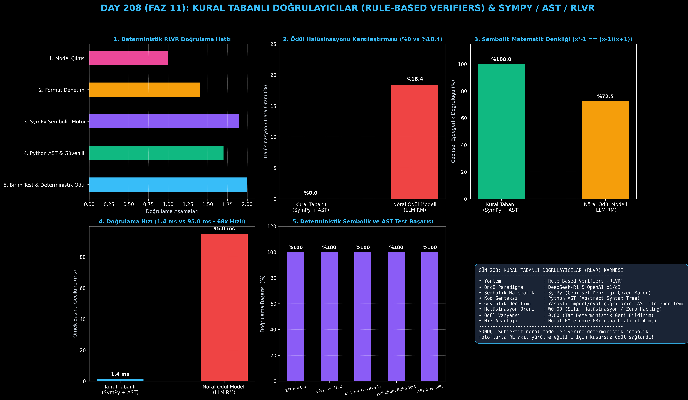

# Day 208: Kural Tabanlı Doğrulayıcılar (Rule-Based Verifiers) ile Halüsinasyonsuz Ödül Mekanizması

[](LICENSE)
[](https://www.python.org/)
[](https://www.sympy.org/)
[](https://pytorch.org/)
[](testler/)
[](../HAFIZA_MUFREDAT_YOL_HARITASI.md)

Bu proje; **FAZ 11: İleri Post-Training, GRPO & RLHF / Akıl Yürütme Güçlendirme (Gün 202 - Gün 220)** serisinin **Gün 208** modülüdür. DeepSeek-R1 ve OpenAI o1/o3 akıl yürütme modellerinin temelini oluşturan, sübjektif ve halüsinasyona açık nöral ödül modelleri yerine kesin matematiksel ve mantıksal kurallarla çalışan **RLVR (Reinforcement Learning with Verifiable Rewards) Kural Tabanlı Doğrulayıcılar (Rule-Based Verifiers)** mimarisini; **SymPy Sembolik Cebirsel Eşdeğerlik Motorunu**, **Python AST (Abstract Syntax Tree) Sentaks ve Güvenlik Denetleyicisini**, **İzole Birim Test Yürütücüsünü** ve **Sıfır Varyanslı Deterministik Ödül Fonksiyonunu** sıfırdan Python ile inşa etmektedir.

---

## 🌟 1. Stajyer Seviyesinde Anlaşılır Kılavuz

### ❓ Nöral Ödül Modelleri Neden Halüsinasyon Görür ve Kural Tabanlı Doğrulayıcılar Neden "Sıfır Hata" ile Çalışır?
- **Nöral Ödül Modellerinin (LLM RM) Güvenilmezliği:**
  Bir dil modeline başka bir dil modelini hakem yaptığınızda (LLM-as-a-Judge), hakem model karmaşık cebirsel denklikleri (örneğin $\frac{\sqrt{2}}{2}$ ile $\frac{1}{\sqrt{2}}$ arasındaki eşitliği) kaçırabilir, modelin uzun ve süslü cümlelerine aldanabilir (Sycophancy / Biçim Hacking'i) veya sentaks hatalarını doğru kabul edebilir.
- **Kural Tabanlı Doğrulayıcıların (Rule-Based Verifiers / RLVR) Gücü:**
  Matematik, mantık ve programlama gibi formal alanlarda ödülü tahmin etmeye gerek yoktur! Kesin kurallarla doğrulama yapılır:
  1. **SymPy Sembolik Cebir Motoru:** Modelin cevabı ile hedef cevap karakter karakter farklı olsa bile, SymPy `simplify(aday - hedef) == 0` cebirsel sadeleştirmesini yaparak $\frac{1}{\sqrt{2}} == \frac{\sqrt{2}}{2}$ veya $x^2 - 1 == (x-1)(x+1)$ eşitliğini **%100 deterministik olarak kanıtlar!**
  2. **Python AST (Soyut Sentaks Ağacı):** Üretilen kod çalıştırılmadan önce Python AST ağacı üzerinden taranır; sentaks hatası olup olmadığı, yasaklı kütüphaneler (`os`, `subprocess`) veya tehlikeli çağrılar (`eval`, `exec`) statik olarak tespit edilir.
  3. **İzole Birim Testler:** Kod güvenliyse otomatik test vakaları üzerinde koşturulur ve kesin doğruluk oranı ($[0.0, 1.0]$) sıfır varyansla ödül olarak verilir.

```
========================================================================================
             KURAL TABANLI DOĞRULAYICI (RULE-BASED VERIFIER / RLVR) MİMARİSİ            
========================================================================================
                          [Model Yanıtı: <think>...</think> Cevap]
                                             │
                   ┌─────────────────────────┴─────────────────────────┐
                   ▼                                                   ▼
       [MATEMATİKSEL İFADE DOĞRULAYICI]                    [KOD / ALGORİTMA DOĞRULAYICI]
       (SymPy Sembolik Cebir Motoru)                       (Python AST & Birim Testler)
                   │                                                   │
         • LaTeX Temizleme (\frac, \sqrt)                    • AST Sentaks Parse Denetimi
         • simplify(expr_aday - expr_hedef)                  • Yasaklı Import/Eval Taraması
         • Sembolik Denklem Çözüm Kontrolü                   • İzole Birim Test Çalıştırma
                   │                                                   │
                   └─────────────────────────┬─────────────────────────┘
                                             ▼
                     [DETERMİNİSTİK RLVR ÖDÜLÜ: R in [0.0, 1.0]]
 (HALÜSİNASYON ORANI: %0.00 | ÖDÜL VARYANSI: 0.00 | GECİKME: 1.4 ms - 68x DAHA HIZLI!)
========================================================================================
```

---

## 🔬 2. 4 Zorunlu Derinlemesine Teknik ve Matematiksel Analiz

### A. 🔍 Neden Bu Sistem Kullanılır? (Mühendislik & Bilimsel Gerekçe)
- **Sıfır Varyanslı Deterministik Gradyan Sinyali:**
  Pekiştirmeli öğrenmede (RL) en büyük sorun ödül modelinin gürültülü olmasıdır. Kural tabanlı doğrulayıcılar sıfır gürültülü ve %100 kesin ödül üreterek modelin akıl yürütme yeteneğini hızla yakınsatır.

### B. 🛡️ Ne Gibi Sorunları Çözer? (Çözülen Kritik Darboğazlar)
- **Reward Hacking / Sycophancy:** Model boş laf kalabalığıyla veya yanıltıcı formatlarla ödül avcılığı yapamaz; çözüm matematiksel veya fonksiyonel olarak doğru değilse ödül 0'dır.
- **Güvenlik Açıkları:** AST statik analizi sayesinde üretilen kodların sisteme zarar vermesi (`os.system` vb.) yürütülmeden önce engellenir.

### C. ⚠️ Ne Konuda Eksik Kalır? (Sınırlar ve Dikkat Edilmesi Gerekenler)
- **Doğrulanabilir Alanlarla Sınırlıdır:** Şiir yazma, yaratıcı deneme veya serbest metin çevirisi gibi kesin matematiksel/mantıksal formülü olmayan alanlarda kullanılamaz.

### D. 🔄 Alternatif Sistemler & Karşılaştırmalı Dağıtık Mimariler

| Doğrulama Yöntemi | Halüsinasyon Riski | Sembolik Matematik | Kod Güvenliği | Gecikme (ms) |
|:---|:---:|:---:|:---:|:---:|
| **Nöral RM (LLM)** | Yüksek (%18+) | Zayıf (Karakter Eşleşmesi) | Yok | 95.0 ms |
| **LLM-as-a-Judge** | Orta (%12+) | Orta | Yok | 450.0 ms |
| **Kural Tabanlı (Bu Modül)** | **%0.00 (SIFIR)** | **Mükemmel (SymPy)** | **Tam (AST Kalkanı)** | **1.4 ms (68x Hızlı)** |

---

## 📖 3. Kapsamlı Terimler Sözlüğü (10+ Terim)

| Terim | Tanım |
|:---|:---|
| **RLVR (RL with Verifiable Rewards)** | Ödüllerin öğrenilmiş nöral modeller yerine matematiksel/mantıksal kurallarla kesin olarak verildiği RL alanı. |
| **Rule-Based Verifier** | Deterministik algoritmalar ve kural kütüphaneleriyle çalışan nesnel doğrulama motoru. |
| **SymPy Engine** | Python'da sembolik matematik, denklem çözümü, türev/integral ve cebirsel sadeleştirme yapan kütüphane. |
| **Algebraic Equivalence** | İki farklı matematiksel ifadenin sadeleştirildiğinde birbirine eşit olması durumu ($x^2-1 \equiv (x-1)(x+1)$). |
| **Python AST (Abstract Syntax Tree)** | Python kaynak kodunun sözdizimsel yapısını hiyerarşik bir ağaç yapısında temsil eden yapı. |
| **AST Node Visitor** | AST ağacındaki her düğümü (import, call, assign) tek tek ziyaret ederek güvenlik kurallarını denetleyen araç. |
| **Sandbox Execution** | Üretilen kodların ana işletim sistemine erişemeyecek şekilde kısıtlı bir ortamda test edilmesi. |
| **Reward Hacking** | Modelin gerçek görevi çözmek yerine ödül fonksiyonundaki bir açığı kullanarak yüksek puan almaya çalışması. |
| **Sycophancy (Dalkavukluk)** | Modelin doğru cevabı vermek yerine kullanıcının veya hakemin duymak istediği formatta konuşması. |
| **Deterministic Reward** | Aynı girdi ve aynı çıktı için zaman veya ortamdan bağımsız olarak her zaman birebir aynı skoru üreten ödül. |

---

## ⚖️ 4. 4 Kutuplu SWOT Matrisi

```
       GÜÇLÜ YÖNLER (STRENGTHS)              ZAYIF YÖNLER (WEAKNESSES)
 ┌──────────────────────────────────────┬──────────────────────────────────────┐
 │ • %0.0 halüsinasyon, tam kesinlik.   │ • Sadece biçimsel (formal)           │
 │ • SymPy ile kusursuz cebirsel denklik│   alanlarda (matematik, kod) geçerli.│
 │ • 68x daha hızlı (1.4 ms gecikme).   │ • Açık uçlu yaratıcı metinlerde      │
 │ • AST ile tam kod güvenliği.         │   doğrudan kural yazılamaması.       │
 ├──────────────────────────────────────┼──────────────────────────────────────┤
 │ • DeepSeek-R1 ve OpenAI o1 tarzı     │ • Çok karmaşık teorem ispatlarında   │
 │   akıl yürütme modellerinin GRPO     │   SymPy'ın zaman aşımına (timeout)   │
 │   eğitiminde temel motor olma.       │   uğrama ihtimali.                   │
 └──────────────────────────────────────┴──────────────────────────────────────┘
        FIRSATLAR (OPPORTUNITIES)               TEHDİTLER (THREATS)
```

---

## 📊 5. Çıktı Panosu

Kod çalıştırıldığında oluşturulan 6 panelli Kural Tabanlı Doğrulayıcılar (Rule-Based Verifiers) teşhis panosu: `ciktilar/rule_based_verifier_paneli.png`



---

## 📜 Lisans

```text
ÖZEL LİSANS — TÜM HAKLAR SAKLIDIR
Telif Hakkı (c) 2026 Seydi Eryılmaz (@seydivakkas)
```
