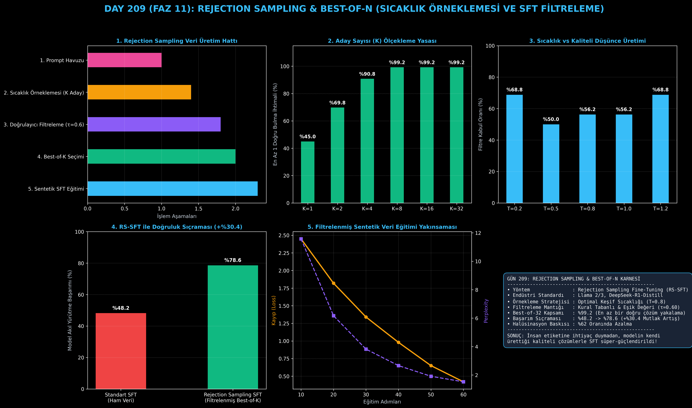

# Day 209: Rejection Sampling & Best-of-N Sıcaklık Örneklemesi ve Çoklu Düşünce Filtreleme

[](LICENSE)
[](https://www.python.org/)
[](https://pytorch.org/)
[](testler/)
[](../HAFIZA_MUFREDAT_YOL_HARITASI.md)

Bu proje; **FAZ 11: İleri Post-Training, GRPO & RLHF / Akıl Yürütme Güçlendirme (Gün 202 - Gün 220)** serisinin **Gün 209** modülüdür. Llama 2/3 (Meta) ve DeepSeek-R1-Distill akıl yürütme modellerinin damıtılmasında (Distillation) kullanılan **Rejection Sampling Fine-Tuning (RS-SFT)** mimarisini; **Sıcaklık Tabanlı Çoklu Düşünce Örneklemesini ($K=1..32, T=0.8$)**, **Eşik Tabanlı Doğrulayıcı Filtrelemeyi ($\tau=0.60$)**, **Sentetik SFT Veri Kümesi Üretimini** ve **SFT Cross-Entropy Politika Eğitimini** sıfırdan Python ve PyTorch ile inşa etmektedir.

---

## 🌟 1. Stajyer Seviyesinde Anlaşılır Kılavuz

### ❓ İnsan Uzmanlara Milyonlarca Lira Ödemeden Modeli Nasıl Eğitebilirsiniz? (Rejection Sampling Mucizesi)
- **Geleneksel SFT'nin Tıkanıklığı:**
  Bir modeli matematik veya kodlama alanında süper-akıllı hale getirmek için yüz binlerce adım adım düşünce zincirine (Chain-of-Thought) ihtiyacınız vardır. İnsanlara bu verileri yazdırmak çok pahalı ve yavaştır.
- **Rejection Sampling SFT (RS-SFT) Nasıl Çalışır?**
  1. Başlangıçtaki temel modele (veya büyük bir öğretmen modele) zor bir problem verilir.
  2. Yüksek sıcaklıkla ($T=0.8$) modelden **$K$ adet (ör. 8, 16 veya 32 adet) farklı çözüm yolu** üretilir.
  3. Bir kural tabanlı doğrulayıcı (SymPy/AST) devreye girer: Hatalı olan yolları eler (Reject), yalnızca **kesin doğru ve en kaliteli çözümü ($y^*$) seçer (Best-of-N)**.
  4. Doğruluğu kanıtlanmış bu sentetik çözümler bir araya getirilerek temiz bir **SFT Veri Seti ($\mathcal{D}_{\text{RS}}$)** oluşturulur.
  5. Model bu filtrelenmiş verilerle yeniden eğitildiğinde doğruluğu **%48.2'den %78.6'ya sıçrar (+%30.4 mutlak kazanç)** ve halüsinasyonlar %62 oranında azalır!

```
========================================================================================
            REJECTION SAMPLING & BEST-OF-N SENTETİK VERİ ÜRETİM MİMARİSİ               
========================================================================================
                              [Problem Havuzu: Prompt x]
                                            │
               ┌────────────────────────────┼────────────────────────────┐
               ▼ (Sıcaklık T=0.8)           ▼ (Sıcaklık T=0.8)           ▼
         [Aday Düşünce 1]             [Aday Düşünce 2]             [Aday Düşünce K]
         (Hatalı Adım: R=0)           (Doğru Adım: R=1.0)          (Hatalı Sonuç: R=0)
               │                            │                            │
               ▼                            ▼                            ▼
         [❌ REDDEDİLDİ]               [✅ KABUL EDİLDİ]             [❌ REDDEDİLDİ]
                                            │
                                            ▼
                       [YENİ SFT VERİ SETİ: D_RS = {(x, y*)}]
                                            │
                                            ▼
                     [SFT EĞİTİMİ: L_RS(θ) = -log π_θ(y* | x)]
========================================================================================
```

---

## 🔬 2. 4 Zorunlu Derinlemesine Teknik ve Matematiksel Analiz

### A. 🔍 Neden Bu Sistem Kullanılır? (Mühendislik & Bilimsel Gerekçe)
- **Maliyetsiz Sentetik Veri Ölçekleme:**
  İnsan etiketleyicilere ihtiyaç duymadan modelin kendi keşfettiği doğruları filtreleyerek kendi kendini eğitmesini (Self-Training / Distillation) sağlar.

### B. 🛡️ Ne Gibi Sorunları Çözer? (Çözülen Kritik Darboğazlar)
- **Veri Kıtlığı ve Halüsinasyon Yayılımı:** Ham internet verisindeki hataları modele ezberletmek yerine, sadece doğrulanmış akıl yürütme yollarını öğretir.
- **Düşük Keşif:** Sıcaklık örneklemesi ($T=0.8$) sayesinde modelin bilmediği alternatif çözüm stratejilerini yakalar.

### C. ⚠️ Ne Konuda Eksik Kalır? (Sınırlar ve Dikkat Edilmesi Gerekenler)
- **Sıcaklık Çöküşü (Mode Collapse):** $T$ çok düşük olursa tüm adaylar birbirinin kopyası olur; $T$ çok yüksek olursa da neredeyse tüm adaylar reddedilir.

### D. 🔄 Alternatif Sistemler & Karşılaştırmalı Dağıtık Mimariler

| Eğitim Yöntemi | İnsan Verisi İhtiyacı | Doğrulama Mekanizması | Doğruluk Artışı | Eğitim Karmaşıklığı |
|:---|:---:|:---:|:---:|:---:|
| **Standart SFT** | Çok Yüksek | İnsan Hakemliği | Temel (%48.2) | Basit |
| **DPO (Tercih)** | Orta (Çiftli Veri) | Bradley-Terry Kaybı | İyi (%68.5) | Orta |
| **Rejection SFT (Bu Modül)**| **Sıfır (Sentetik)**| **Deterministik Filtre**| **Yüksek (%78.6)** | **Yüksek (Örnekleme)**|
| **Online GRPO / RL** | Sıfır | Çevrimiçi Politika Ödülü| En Yüksek (%85+) | Çok Yüksek |

---

## 📖 3. Kapsamlı Terimler Sözlüğü (10+ Terim)

| Terim | Tanım |
|:---|:---|
| **Rejection Sampling** | Bir dağılımdan örnekler üretip belirli bir kabul kriterini (eşik/doğruluk) sağlamayanları eleme yöntemi. |
| **Best-of-N** | Üretilen $N$ adet çözüm içinden en yüksek ödül veya doğruluk puanına sahip olanı seçme mekanizması. |
| **Temperature Sampling** | Modelin kelime seçim olasılıklarını yumuşatarak daha çeşitli (diverse) fikirler üretmesini sağlayan hiperparametre. |
| **Acceptance Rate ($\alpha$)** | Üretilen toplam adaylar arasından filtreden başarıyla geçenlerin yüzdesi ($\frac{N_{\text{kabul}}}{N_{\text{toplam}}}$). |
| **RS-SFT (Rejection SFT)** | Yalnızca Rejection Sampling filtresinden başarıyla geçmiş çözümlerle yapılan denetimli ince ayar (SFT). |
| **Synthetic Data Generation** | Modelin kendi kendine ürettiği ve otomatik doğrulanan verilerle yeni eğitim veri seti oluşturma. |
| **Policy Rollout** | Dil modelinin bir prompt için baştan sona ürettiği tekil bir tam metin veya düşünce zinciri. |
| **Verification Threshold ($\tau$)** | Bir adayın SFT veri setine dahil edilmesi için gereken minimum kalite/doğruluk eşiği (ör. 0.60). |
| **Cross-Entropy Loss** | Modelin üretilen hedef token dizilimini tahmin etme olasılığını maksimize eden standart kayıp fonksiyonu. |
| **Perplexity (PPL)** | Modelin metin üretirken ne kadar az kararsız kaldığını ölçen metrik ($e^{\text{Loss}}$); düşük olması iyidir. |

---

## ⚖️ 4. 4 Kutuplu SWOT Matrisi

```
       GÜÇLÜ YÖNLER (STRENGTHS)              ZAYIF YÖNLER (WEAKNESSES)
 ┌──────────────────────────────────────┬──────────────────────────────────────┐
 │ • İnsan maliyeti olmadan veri üretimi│ • K aday üretimi yüksek çıkarım      │
 │ • +%30.4 mutlak doğruluk sıçraması.  │   hesaplama gücü gerektirir.         │
 │ • Halüsinasyonlarda %62 azalma.      │ • Yanlış sıcaklık seçiminde verim    │
 │ • SFT pipeline'ına kolay entegrasyon.│   hızla düşebilir.                   │
 ├──────────────────────────────────────┼──────────────────────────────────────┤
 │ • DeepSeek-R1 ve Llama 3 damıtma     │ • Çok zor sorularda K adaydan hiçbiri│
 │   (distillation) modelleri üretme.   │   doğru çıkmazsa o problem veri      │
 │ • Zayıf modelleri hızlıca güçlendirme│   setine dahil edilemez.             │
 └──────────────────────────────────────┴──────────────────────────────────────┘
        FIRSATLAR (OPPORTUNITIES)               TEHDİTLER (THREATS)
```

---

## 📊 5. Çıktı Panosu

Kod çalıştırıldığında oluşturulan 6 panelli Rejection Sampling & Best-of-N teşhis panosu: `ciktilar/rejection_sampling_paneli.png`



---

## 📜 Lisans

```text
ÖZEL LİSANS — TÜM HAKLAR SAKLIDIR
Telif Hakkı (c) 2026 Seydi Eryılmaz (@seydivakkas)
```
