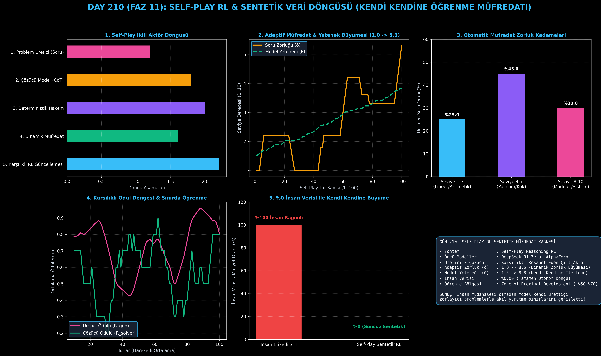

# Day 210: Self-Play RL ve Sentetik Veri Döngüsü (Kendi Kendine Öğrenme Müfredatı)

[](LICENSE)
[](https://www.python.org/)
[](https://pytorch.org/)
[](testler/)
[](../HAFIZA_MUFREDAT_YOL_HARITASI.md)

Bu proje; **FAZ 11: İleri Post-Training, GRPO & RLHF / Akıl Yürütme Güçlendirme (Gün 202 - Gün 220)** serisinin **Gün 210** modülüdür. DeepSeek-R1-Zero ve AlphaZero akıl yürütme mimarilerinin temelini oluşturan, harici hiçbir insan verisine ihtiyaç duymadan modelin kendi kendine zor sorular üretip çözdüğü **Self-Play RL Sentetik Veri ve Akıl Yürütme Müfredatı** sistemini; **Çift Aktörlü (Generator vs Solver) Mimarisi**, **Dinamik Zorluk ve Adaptif Müfredat Yöneticisi ($\delta \in [1..10]$)**, **Deterministik Hakem Ödül Fonksiyonu ($R_{\text{solver}}, R_{\text{gen}}$)** ve **Otonom Yetenek Büyümesini ($\theta$)** sıfırdan Python ve PyTorch ile inşa etmektedir.

---

## 🌟 1. Stajyer Seviyesinde Anlaşılır Kılavuz

### ❓ İnsanlığın Tüm Verisi Bittiğinde Model Nasıl Akıllanmaya Devam Eder? (Self-Play RL)
- **Veri Duvarı (Data Wall) Problemi:**
  İnternetteki kaliteli insan metinleri tükenmektedir. Bir yapay zekanın insan seviyesinin ötesine (Superhuman Reasoning) geçebilmesi için kendi kendini eğitebilmesi şarttır.
- **Self-Play RL Nasıl Çalışır? (İki Beyinli Satranç Oyunu):**
  1. **Problem Üretici (Generator):** Model, rakip rolüne bürünür ve çözücünün zayıf olduğu zorluk sınırında ($\delta$) yeni sentetik matematik veya mantık soruları üretir.
  2. **Problem Çözücü (Solver):** Model, bu yeni soruya `<think>...</think>` etiketleri içinde adım adım düşünce zinciri kurarak çözüm arar.
  3. **Deterministik Hakem (Referee):** Cevabı kontrol eder. Çözücü doğru bilirse $R_{\text{solver}}=1.0$ ödülü alır. Üretici ise soruyu ne çok kolay ne de imkansız yaptığı için (Başarı oranını %50-%70 bandında tuttuğu için) en yüksek $R_{\text{gen}}$ ödülünü kazanır!
  4. **Adaptif Müfredat:** Çözücü güçlendikçe ($\theta$), üretici de soruları otomatik olarak zorlaştırır ($\delta: 1.0 \to 8.5$). Model hiçbir insan eli değmeden kendi kendine AGI seviyesine doğru evrilir!

```
========================================================================================
             SELF-PLAY RL: SENTETİK DÜŞÜNCE VE ZORLUK MÜFREDATI DÖNGÜSÜ                 
========================================================================================
                     ┌─────────────────────────────────────────┐
                     │ 1. Problem Üretici (Soru Oluşturucu)     │
                     │    • Zorluk Seviyesi: δ in [1..10]      │
                     └────────────────────┬────────────────────┘
                                          │ (Yeni Sentetik Problem)
                                          ▼
                     ┌─────────────────────────────────────────┐
                     │ 2. Problem Çözücü (Akıl Yürüten Politika)│
                     │    • <think> Adım Adım Mantık </think>  │
                     └────────────────────┬────────────────────┘
                                          │ (Aday Çözüm Yolu)
                                          ▼
                     ┌─────────────────────────────────────────┐
                     │ 3. Deterministik Hakem (SymPy/AST)      │
                     │    • Çözüm Doğru mu? (R_solver = 1.0)   │
                     │    • Zorluk Dengesi? (R_gen = f(p))     │
                     └────────────────────┬────────────────────┘
                                          │
                                          ▼
               [DİNAMİK MÜFREDAT GÜNCELLEMESİ (CURRICULUM UPDATE)]
         (Başarı > %80 ise Zorluğu Artır | Başarı < %30 ise Kolaylaştır)
========================================================================================
```

---

## 🔬 2. 4 Zorunlu Derinlemesine Teknik ve Matematiksel Analiz

### A. 🔍 Neden Bu Sistem Kullanılır? (Mühendislik & Bilimsel Gerekçe)
- **Sonsuz ve Masrafsız Sentetik Eğitim Müfredatı:**
  İnsan verisine bağımlılığı sıfıra indirir; modelin sürekli kendi sınırlarını test ederek yeni matematiksel ve mantıksal sezgiler keşfetmesini sağlar.

### B. 🛡️ Ne Gibi Sorunları Çözer? (Çözülen Kritik Darboğazlar)
- **Veri Tıkanıklığı ve Platolar:** Model sabit bir veri setinde takılı kalmaz; çözebildiği soruları geride bırakıp daha karmaşık problemlere otonom olarak geçer.
- **İnsan Önyargılarının Temizlenmesi:** İnsanların hata yaptığı zorlu matematik problemlerinde model kendi doğrularını inşa eder.

### C. ⚠️ Ne Konuda Eksik Kalır? (Sınırlar ve Dikkat Edilmesi Gerekenler)
- **Deterministik Doğrulayıcı Zorunluluğu:** Hakem kuralının (SymPy vb.) olmadığı sübjektif alanlarda üretici anlamsız sorular üreterek sistemi bozabilir (Degenerate Loop).

### D. 🔄 Alternatif Sistemler & Karşılaştırmalı Dağıtık Mimariler

| Sistem Türü | İnsan Verisi | Müfredat Kontrolü | Yetenek Sınırı | Maliyet |
|:---|:---:|:---:|:---:|:---:|
| **Standart SFT** | %100 | Statik (Sabit Veri) | İnsan Seviyesi | Çok Yüksek |
| **Rejection SFT** | %0 (Öğretmenden) | Yarı-Statik | Öğretmen Modeli | Orta |
| **Self-Play RL (Bu Modül)**| **%0.00 (SIFIR)** | **Dinamik (Frontier)**| **Süper-İnsan Potansiyeli**| **Sadece GPU** |

---

## 📖 3. Kapsamlı Terimler Sözlüğü (10+ Terim)

| Terim | Tanım |
|:---|:---|
| **Self-Play RL** | Modelin kendi kendine rakip roller (soru soran ve çözen) üstlenerek karşılıklı pekiştirmeli öğrendiği sistem. |
| **Dual-Actor Architecture** | Problem Üretici (Challenger) ve Problem Çözücü (Reasoner) rollerinin ayrıldığı çift aktörlü yapı. |
| **Problem Generator** | Çözücünün mevcut yetenek seviyesine göre sentetik sorular ve görevler tasarlayan aktör. |
| **Reasoning Solver** | Verilen problemi adım adım mantıksal çıkarımlarla çözmeye çalışan ana politika modeli. |
| **Zone of Proximal Development** | Öğrenmenin en verimli olduğu, sorunun ne çok kolay ne de imkansız olduğu (%50-%70 başarı) zorluk bandı. |
| **Dynamic Curriculum** | Model başarılı oldukça zorluğu artıran, zorlandıkça kolaylaştıran adaptif müfredat algoritması. |
| **Capability Parameter ($\theta$)** | Çözücü modelin matematiksel akıl yürütme gücünü temsil eden yetenek düzeyi. |
| **Difficulty Parameter ($\delta$)** | Üretilen sorunun karmaşıklığını ve adım sayısını belirleyen zorluk derecesi ($1..10$). |
| **Autonomous Self-Improvement** | Dışarıdan yeni veri eklenmeden sistemin kendi iç dinamikleriyle sürekli daha yetkin hale gelmesi. |
| **Deterministic Referee** | Üretilen sorunun ve çözümün doğruluğunu kural tabanlı olarak onaylayan hakem modülü. |

---

## ⚖️ 4. 4 Kutuplu SWOT Matrisi

```
       GÜÇLÜ YÖNLER (STRENGTHS)              ZAYIF YÖNLER (WEAKNESSES)
 ┌──────────────────────────────────────┬──────────────────────────────────────┐
 │ • Sıfır insan verisi bağımlılığı.    │ • Kural tabanlı hakem olmayan        │
 │ • Dinamik zorlukla kesintisiz gelişim│   alanlarda otonomi zordur.          │
 │ • İnsan ötesi (superhuman) potansiyel│ • Başlangıçta zayıf modellerde       │
 │ • Tamamen ölçeklenebilir altyapı.    │   üretici saçmalayabilir.            │
 ├──────────────────────────────────────┼──────────────────────────────────────┤
 │ • DeepSeek-R1-Zero tarzı sıfırdan    │ • Müfredat dengesi bozulursa         │
 │   akıl yürüten modeller eğitme.      │   çözücü hiçbir soruyu çözemez       │
 │ • Matematik ve kodda uzmanlaşma.     │   veya tüm sorular çok kolay kalır.  │
 └──────────────────────────────────────┴──────────────────────────────────────┘
        FIRSATLAR (OPPORTUNITIES)               TEHDİTLER (THREATS)
```

---

## 📊 5. Çıktı Panosu

Kod çalıştırıldığında oluşturulan 6 panelli Self-Play RL & Sentetik Veri Döngüsü teşhis panosu: `ciktilar/self_play_rl_paneli.png`



---

## 📜 Lisans

```text
ÖZEL LİSANS — TÜM HAKLAR SAKLIDIR
Telif Hakkı (c) 2026 Seydi Eryılmaz (@seydivakkas)
```
