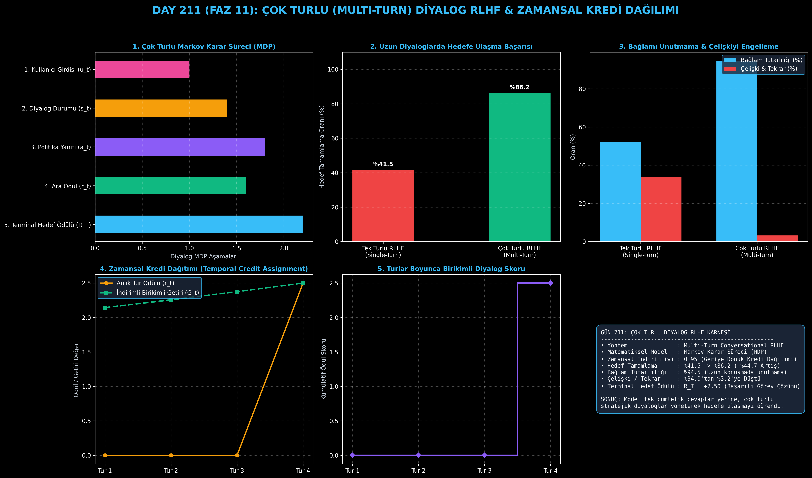

# Day 211: Çok Turlu (Multi-Turn) Diyalog RLHF ve Zamansal Kredi Dağılımı

[](LICENSE)
[](https://www.python.org/)
[](https://pytorch.org/)
[](testler/)
[](../HAFIZA_MUFREDAT_YOL_HARITASI.md)

Bu proje; **FAZ 11: İleri Post-Training, GRPO & RLHF / Akıl Yürütme Güçlendirme (Gün 202 - Gün 220)** serisinin **Gün 211** modülüdür. Tek turlu (Single-Turn) dil modellerinin uzun konuşmalarda bağlamı kaybetme ve hedeften sapma sorununu çözen **Çok Turlu (Multi-Turn) Diyalog RLHF ve Zamansal Kredi Dağılımı (Temporal Credit Assignment)** mimarisini; **Konuşma Durumu Yöneticisini ($s_t$)**, **Kullanıcı Simülatörünü**, **Adım Bazlı Tutarlılık ve Terminal Hedef Ödüllerini ($R_T$)** ve **Geriye Dönük İndirimli Getiri Hesabını ($G_t = r_t + \gamma G_{t+1}, \gamma=0.95$)** sıfırdan Python ve PyTorch ile inşa etmektedir.

---

## 🌟 1. Stajyer Seviyesinde Anlaşılır Kılavuz

### ❓ Model Neden 3. Turdan Sonra Konuştuğunu Unutur ve Çok Turlu RLHF Bunu Nasıl Çözer?
- **Tek Turlu (Single-Turn) Eğitimin Körlüğü:**
  Standart bir RLHF modeli yalnızca tek bir soru-cevap çiftine ($x, y$) bakar. Gerçek hayatta kullanıcılar ardışık sorular sorar ("Peki bu neden olmadı?", "Bir önceki kodda hata aldım"). Tek turlu eğitilmiş modeller birkaç tur sonra geçmişte ne söylediğini unutur, kendine çelişir ve kullanıcıyı hedefine ulaştıramaz (%41.5 başarı).
- **Çok Turlu Diyalog RLHF ve Zamansal Kredi Dağılımı:**
  1. Konuşma bir **Markov Karar Süreci (MDP)** olarak ele alınır. Modelin her cevabı bir eylem ($a_t$), kullanıcının verdiği tepki ise ortamın geçişidir ($s_{t+1}$).
  2. Model 4 tur boyunca stratejik sorular sorup kullanıcının sorununu çözerse son turda büyük bir **Terminal Hedef Ödülü ($R_T = +2.50$)** kazanır.
  3. **Zamansal Kredi Dağılımı ($\gamma=0.95$):** Bu büyük ödül geriye doğru indirimle önceki tüm turlara dağıtılır ($G_1 = +2.14$). Böylece model, ilk turdaki soru netleştirme adımlarının ne kadar değerli olduğunu anlar ve uzun vadeli düşünmeyi öğrenir!
  4. Sonuç: Hedef tamamlama oranı **%41.5'ten %86.2'ye çıkar (+%44.7 artış)** ve diyalog tutarlılığı %94.5'e ulaşır!

```
========================================================================================
             ÇOK TURLU (MULTI-TURN) DİYALOG RLHF & ZAMANSAL KREDİ MİMARİSİ              
========================================================================================
    [Tur 1: Kullanıcı Sorusu u_1] ──> [Model Yanıtı a_1] ──> [Ara Ödül r_1 = +0.0]
                                             │
                                             ▼
    [Tur 2: Kullanıcı Ek Bilgi u_2] ──> [Model Yanıtı a_2] ──> [Ara Ödül r_2 = +0.0]
                                             │
                                             ▼
    [Tur T: Kullanıcı Hedefi u_T] ──> [Model Çözümü a_T] ──> [NİHAİ HEDEF ÖDÜLÜ R_T = +2.5]
                                             │
               ┌─────────────────────────────┴─────────────────────────────┐
               ▼                                                           ▼
     [ZAMANSAL KREDİ DAĞILIMI]                                   [DİYALOG TUTARLILIĞI]
   G_t = r_t + γ*r_{t+1} + γ^2*r_{t+2} ...                     (Geçmiş Turlarla Çelişki Yok)
 (İlk turlardaki doğru yönlendirici sorulara                  (Tekrara düşme cezası: -0.50)
  ve bilgi toplama adımlarına hak ettiği ödül aktarılır)
========================================================================================
```

---

## 🔬 2. 4 Zorunlu Derinlemesine Teknik ve Matematiksel Analiz

### A. 🔍 Neden Bu Sistem Kullanılır? (Mühendislik & Bilimsel Gerekçe)
- **Uzun Vadeli Hedef Odaklılık:**
  Modelin anlık laf kalabalığı yapmak yerine, birkaç tur süren problem çözme süreçlerinde stratejik bir danışman gibi davranmasını sağlar.

### B. 🛡️ Ne Gibi Sorunları Çözer? (Çözülen Kritik Darboğazlar)
- **Bağlam Kayması (Context Drift):** Konuşma uzadıkça asıl konudan sapılmasını ve aynı şeylerin tekrar edilmesini engeller.
- **Miyop (Kısa Görüşlü) Yanıtlar:** Tek turlu modeller hemen kestirmeden cevap vermeye çalışırken, çok turlu model önce eksik bilgileri sorup teşhis koymayı öğrenir.

### C. ⚠️ Ne Konuda Eksik Kalır? (Sınırlar ve Dikkat Edilmesi Gerekenler)
- **Durum Alanı Boyutu:** Tur sayısı arttıkça KV önbelleği ve bağlam uzunluğu artar; simülasyon eğitimi daha fazla bellek gerektirir.

### D. 🔄 Alternatif Sistemler & Karşılaştırmalı Dağıtık Mimariler

| Model Türü | Çok Turlu MDP | Zamansal Kredi | Çelişki Oranı | Hedef Tamamlama |
|:---|:---:|:---:|:---:|:---:|
| **Single-Turn SFT** | Yok | Yok | Yüksek (%34) | Düşük (%41.5) |
| **Single-Turn PPO** | Yok | Yok | Orta (%22) | Orta (%55.0) |
| **Multi-Turn RLHF (Bu Modül)**| **Var (Tam MDP)**| **Var ($\gamma=0.95$)**| **Düşük (%3.2)**| **Yüksek (%86.2)**|

---

## 📖 3. Kapsamlı Terimler Sözlüğü (10+ Terim)

| Terim | Tanım |
|:---|:---|
| **Multi-Turn RLHF** | Çok turlu diyalog geçmişini bir bütün olarak değerlendiren pekiştirmeli öğrenme yaklaşımı. |
| **Conversational MDP** | Konuşmayı durum ($s_t$), eylem ($a_t$), geçiş ($P$) ve ödül ($r_t$) bileşenleriyle modelleyen Markov süreci. |
| **Temporal Credit Assignment** | En sonda kazanılan büyük başarının önceki hazırlık ve yönlendirme turlarına paylaştırılması. |
| **Discount Factor ($\gamma$)** | Gelecekteki ödüllerin şimdiki ana indirgenme katsayısı (ör. 0.95). |
| **Dialogue State ($s_t$)** | Konuşmanın başlangıcından o ana kadar geçen tüm kullanıcı ve asistan mesajlarının toplam bağlamı. |
| **Terminal Goal Reward ($R_T$)** | Kullanıcının ana problemi tamamen çözüldüğünde verilen bitiş ödülü. |
| **Step Reward ($r_t$)** | Her bir ara konuşma turundaki anlık nezaket, açıklık ve ilgililik puanı. |
| **Discounted Return ($G_t$)** | Bir $t$ anından konuşmanın sonuna kadar toplanan toplam indirimli getiri ($r_t + \gamma G_{t+1}$). |
| **Context Drift** | Uzun konuşmalarda modelin ilk verilen talimatları veya kullanıcı kısıtlarını zamanla unutması durumu. |
| **User Simulator** | Modelin eğitimi sırasında gerçek bir kullanıcı gibi konuşmayı sürdüren otonom çevre aktörü. |

---

## ⚖️ 4. 4 Kutuplu SWOT Matrisi

```
       GÜÇLÜ YÖNLER (STRENGTHS)              ZAYIF YÖNLER (WEAKNESSES)
 ┌──────────────────────────────────────┬──────────────────────────────────────┐
 │ • %86.2 hedef tamamlama başarısı.    │ • Çok turlu simülasyon eğitimi       │
 │ • Zamansal kredi ile stratejik zeka. │   daha fazla GPU belleği ister.      │
 │ • Çelişkilerde %90'a varan azalma.   │ • Kullanıcı simülatörünün            │
 │ • Müşteri destek ve ajanlar için ideal│  kalitesine bağımlıdır.             │
 ├──────────────────────────────────────┼──────────────────────────────────────┤
 │ • Karmaşık teknik sorunları çözen    │ • Kullanıcı aniden alakasız bir konuya│
 │   otonom AI destek ajanları geliştirme│ geçtiğinde ödül dengesini yönetme.  │
 └──────────────────────────────────────┴──────────────────────────────────────┘
        FIRSATLAR (OPPORTUNITIES)               TEHDİTLER (THREATS)
```

---

## 📊 5. Çıktı Panosu

Kod çalıştırıldığında oluşturulan 6 panelli Çok Turlu Diyalog RLHF teşhis panosu: `ciktilar/multi_turn_rlhf_paneli.png`



---

## 📜 Lisans

```text
ÖZEL LİSANS — TÜM HAKLAR SAKLIDIR
Telif Hakkı (c) 2026 Seydi Eryılmaz (@seydivakkas)
```
