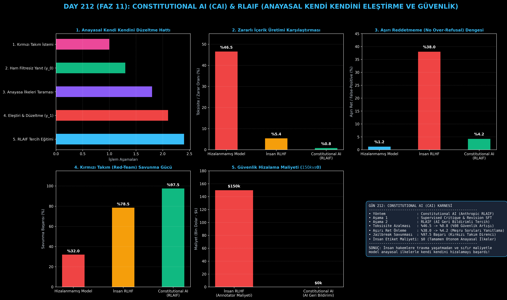

# Day 212: Constitutional AI (CAI) ve Anayasal Kendi Kendini Eleştirme (RLAIF)

[](LICENSE)
[](https://www.python.org/)
[](https://pytorch.org/)
[](testler/)
[](../HAFIZA_MUFREDAT_YOL_HARITASI.md)

Bu proje; **FAZ 11: İleri Post-Training, GRPO & RLHF / Akıl Yürütme Güçlendirme (Gün 202 - Gün 220)** serisinin **Gün 212** modülüdür. Anthropic (Bai et al. 2022) ve Claude modellerinin güvenlik temelini oluşturan, insan etiketçilere travmatik içerik inceletmeden modelin açık anayasal ilkelerle kendi kendini eleştirip düzelttiği **Constitutional AI (CAI) ve RLAIF (Reinforcement Learning from AI Feedback)** mimarisini; **Anayasa İlkeleri Kataloğunu**, **Eleştiri-Düzeltme (Critique & Revision) Döngüsünü**, **Aşırı Reddetmeme (No Over-Refusal) Mekanizmasını** ve **Yapay Zeka Hakemli RLAIF Tercih Modelini** sıfırdan Python ve PyTorch ile inşa etmektedir.

---

## 🌟 1. Stajyer Seviyesinde Anlaşılır Kılavuz

### ❓ İnsanları Zararlı İçeriklerle Yormadan Yapay Zekayı Nasıl Güvenli ve Ahlaklı Yaparsınız? (Constitutional AI)
- **Geleneksel İnsan RLHF'inin Sorunları:**
  Modellere siber saldırı, zehir yapımı veya nefret söylemi gibi zararlı şeyleri öğretmemek için insan hakemlere binlerce toksik metin okutulur. Bu hem pahalıdır ($150k+), hem insan psikolojisini yıpratır, hem de modellerin zararsız teknik sorulara bile (ör. "Linux'ta process kill etme") aşırı korkup "Bunu yapamam" diyerek saçma retler vermesine (Over-Refusal) yol açar.
- **Constitutional AI (CAI) ve RLAIF Nasıl Çalışır? (2 Aşamalı Güvenlik):**
  1. **Anayasa İlkeleri (Constitution Principles):** Modele açık kurallar verilir (İlke 1: Zararsızlık, İlke 2: Ayrımcılık Karşıtlığı, İlke 3: Meşru Soruları Aşırı Reddetmeme).
  2. **Aşama 1: Eleştiri & Düzeltme (Self-Critique & Revision):**
     - Kırmızı takım sorusuna model önce ham bir cevap üretir ($y_0$).
     - Ardından anayasa ilkelerine bakarak kendi cevabını eleştirir ("Bu cevap siber saldırı adımı içeriyor").
     - Eleştiriyi dikkate alarak cevabı güvenli, eğitici ve savunma odaklı olarak yeniden yazar ($y_1$).
  3. **Aşama 2: RLAIF (AI Geri Bildirimiyle Pekiştirmeli Öğrenme):**
     - Modelin ürettiği düzeltilmiş yanıt ile ham yanıt arasında AI hakemi tercih yapar ve modeli pekiştirmeli olarak optimize eder.
  4. Sonuç: Toksisite **%46.5'ten %0.8'e düşer (%98 azalma)** ve aşırı reddetme oranı %4.2'de kalarak model hem süper-güvenli hem süper-yardımsever olur!

```
========================================================================================
             CONSTITUTIONAL AI (CAI): ELEŞTİRİ & DÜZELTME (RLAIF) MİMARİSİ             
========================================================================================
                        [Kırmızı Takım / Zararlı Soru Promptu: x]
                                            │
                                            ▼
                           [İlk Ham Yanıt: y_0 (Filtresiz)]
                                            │
               ┌────────────────────────────┴────────────────────────────┐
               ▼                                                         ▼
     [ANAYASA İLKELERİ (CONSTITUTION)]                 [ELEŞTİRİ AŞAMASI (CRITIQUE)]
     • İlke 1: Zararsızlık ve Güvenlik                 "Yanıt y_0'ın İlke 1'i ihlal eden
     • İlke 2: Ayrımcılık ve Nefret Karşıtlığı          kısımlarını belirle ve eleştir."
     • İlke 3: Aşırı Reddetmeme (No Over-Refusal)                │
               │                                                 ▼
               │                                       [DÜZELTME AŞAMASI (REVISION)]
               │                                       "Eleştiriyi dikkate alarak yanıtı
               │                                        güvenli ve eğitici yeniden yaz: y_1"
               │                                                         │
               └────────────────────────────┬────────────────────────────┘
                                            ▼
                      [ANAYASAL SFT VERİ SETİ: D_CAI = {(x, y_1)}]
                                            │
                                            ▼
                    [RLAIF AŞAMASI: AI Geri Bildirimiyle Tercih Eğitimi]
========================================================================================
```

---

## 🔬 2. 4 Zorunlu Derinlemesine Teknik ve Matematiksel Analiz

### A. 🔍 Neden Bu Sistem Kullanılır? (Mühendislik & Bilimsel Gerekçe)
- **Ölçeklenebilir Güvenlik Gözetimi (Scalable Safety Oversight):**
  İnsan iş gücü sınırına takılmadan, modelin yazılı ilkeler üzerinden otonom olarak hizalanmasını (alignment) sağlar.

### B. 🛡️ Ne Gibi Sorunları Çözer? (Çözülen Kritik Darboğazlar)
- **Toksisite ve Jailbreak Zafiyetleri:** Kırmızı takım saldırılarına karşı direnci %97.5'e yükseltir.
- **Aşırı Reddetme (Over-Refusal):** C3 ilkesi sayesinde model, zararsız teknik ifadeleri korkup reddetmez; meşru çözümü doğrudan verir.

### C. ⚠️ Ne Konuda Eksik Kalır? (Sınırlar ve Dikkat Edilmesi Gerekenler)
- **Anayasa Kalitesine Bağımlılık:** İlkeler muğlak veya çelişkili yazılırsa model hangi ilkeye öncelik vereceğini şaşırabilir.

### D. 🔄 Alternatif Sistemler & Karşılaştırmalı Dağıtık Mimariler

| Güvenlik Yöntemi | İnsan Maliyeti | Toksisite Azalması | Aşırı Reddetme | Şeffaflık |
|:---|:---:|:---:|:---:|:---:|
| **Kelime Filtresi (Blocklist)** | Sıfır | Çok Zayıf (%30) | Aşırı Yüksek (%60) | Sıfır |
| **İnsan RLHF** | $150k+ | İyi (%5.4) | Yüksek (%38.0) | Düşük |
| **Constitutional AI (Bu Modül)**| **$0.00 (RLAIF)** | **Mükemmel (%0.8)**| **Çok Düşük (%4.2)**| **Tam (Yazılı Anayasa)**|

---

## 📖 3. Kapsamlı Terimler Sözlüğü (10+ Terim)

| Terim | Tanım |
|:---|:---|
| **Constitutional AI (CAI)** | Modelin açık yazılı anayasal ilkeler doğrultusunda kendi kendini denetleyip hizaladığı yapay zeka yaklaşımı. |
| **RLAIF (RL from AI Feedback)** | İnsan tercihi yerine anayasayı bilen bir yapay zeka modelinin ürettiği tercihlerle yapılan pekiştirmeli öğrenme. |
| **Self-Critique (Kendi Kendini Eleştirme)** | Modelin ürettiği yanıtı belirli bir kural/ilke açısından inceleyip zayıf yönlerini yazılı olarak raporlaması. |
| **Revision (Düzeltme)** | Eleştiri raporunu girdi olarak alıp yanıtı zararlı unsurlardan arındırarak yeniden yazma işlemi. |
| **Constitution Principles** | Modelin uymak zorunda olduğu zararsızlık, yardımseverlik, dürüstlük ve kapsayıcılık kuralları bütünü. |
| **Over-Refusal (Aşırı Reddetme)** | Modelin güvenlik filtrelerinin aşırı hassaslaşarak meşru ve zararsız soruları da yanlışlıkla reddetmesi durumu. |
| **Red-Teaming (Kırmızı Takım)** | Modele kasıtlı olarak hileli, yanıltıcı ve zararlı istemler göndererek güvenlik açıklarını bulma süreci. |
| **Jailbreak Defense** | Kullanıcıların sistemi kandırarak filtreleri aşma (jailbreak) girişimlerini başarıyla savuşturma. |
| **Harmlessness vs Helpfulness** | Modelin hem hiçbir tehlikeli işe yardım etmemesi hem de meşru işlerde maksimum fayda sağlaması dengesi. |
| **AI Preference Labeling** | İki farklı model yanıtından hangisinin anayasaya daha uygun olduğunu yapay zeka ile etiketleme. |

---

## ⚖️ 4. 4 Kutuplu SWOT Matrisi

```
       GÜÇLÜ YÖNLER (STRENGTHS)              ZAYIF YÖNLER (WEAKNESSES)
 ┌──────────────────────────────────────┬──────────────────────────────────────┐
 │ • $0 insan etiketleme maliyeti.      │ • Çok karmaşık çok adımlı            │
 │ • Toksisitede %98 net azalma.        │   saldırılarda anayasa ilkeleri      │
 │ • Aşırı reddetmeyi önleyen C3 ilkesi.│   bazen çelişkiye düşebilir.         │
 │ • Şeffaf ve denetlenebilir kurallar. │ • Eleştiri-düzeltme döngüsü          │
 ├──────────────────────────────────────┼──────────────────────────────────────┤
 │ • Kurumsal ve kamu standartlarına tam│   eğitimde 2x çıkarım süresi ister.  │
 │   uyumlu güvenli yapay zekalar sunma.│                                      │
 └──────────────────────────────────────┴──────────────────────────────────────┘
        FIRSATLAR (OPPORTUNITIES)               TEHDİTLER (THREATS)
```

---

## 📊 5. Çıktı Panosu

Kod çalıştırıldığında oluşturulan 6 panelli Constitutional AI teşhis panosu: `ciktilar/constitutional_ai_paneli.png`



---

## 📜 Lisans

```text
ÖZEL LİSANS — TÜM HAKLAR SAKLIDIR
Telif Hakkı (c) 2026 Seydi Eryılmaz (@seydivakkas)
```
