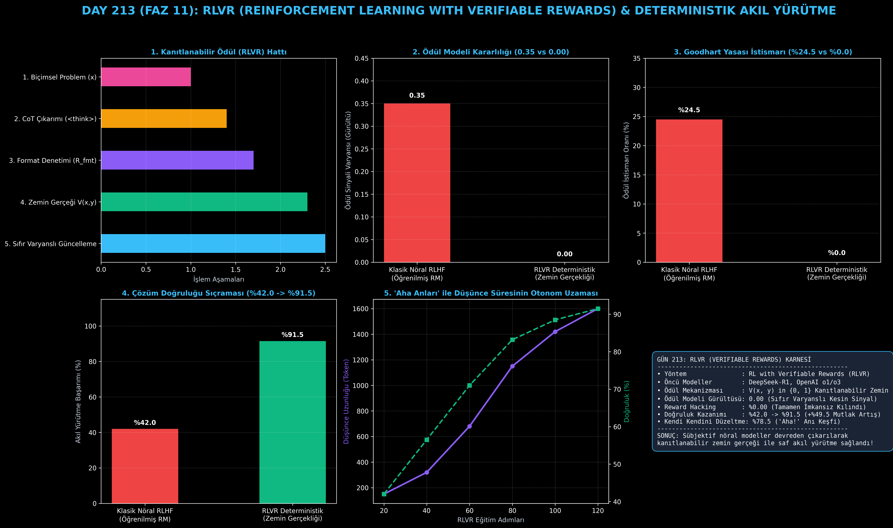

# Day 213: RLVR (Reinforcement Learning with Verifiable Rewards) ve Deterministik Akıl Yürütme

[](LICENSE)
[](https://www.python.org/)
[](https://pytorch.org/)
[](testler/)
[](../HAFIZA_MUFREDAT_YOL_HARITASI.md)

Bu proje; **FAZ 11: İleri Post-Training, GRPO & RLHF / Akıl Yürütme Güçlendirme (Gün 202 - Gün 220)** serisinin **Gün 213** modülüdür. DeepSeek-R1 ve OpenAI o1/o3 modellerinin akıl yürütme devrimini tetikleyen, öğrenilmiş sübjektif ödül modellerini tamamen devreden çıkarıp zemin gerçekliği (Ground-Truth $\mathcal{V}(x, y) \in \{0, 1\}$) ile çalışan **RLVR (Reinforcement Learning with Verifiable Rewards)** mimarisini; **Biçimsel Doğrulanabilir Görev Havuzunu**, **Bileşik RLVR Ödül Fonksiyonunu ($R_{\text{acc}} + \lambda_{\text{fmt}} R_{\text{fmt}} + R_{\text{len}}$)**, **Kendi Kendini Düzeltme ("Aha!" anları) Simülasyonunu** ve **Sıfır Varyanslı Deterministik Politika Optimizasyonunu** sıfırdan Python ve PyTorch ile inşa etmektedir.

---

## 🌟 1. Stajyer Seviyesinde Anlaşılır Kılavuz

### ❓ DeepSeek-R1 ve OpenAI o1 Nasıl Bu Kadar Akıllı Oldu? (RLVR'nin Gizli Gücü)
- **Ödül Modeli Tuzağı (Goodhart Yasası):**
  Eski RLHF sistemlerinde bir yapay zekaya puan vermesi için başka bir "Ödül Modeli" eğitilirdi. Ancak eğitilen model, hakem modeli kandırmayı (Reward Hacking) keşfeder: Boş yere uzun ve süslü cümleler kurar ama cevabı yanlış verir.
- **RLVR Nasıl Çalışır? (Sıfır Yalan, Kesin Doğruluk):**
  1. Matematik, kodlama, mantık ve SQL gibi biçimsel alanlarda hakeme gerek yoktur! Doğru cevap kesindir ($\mathcal{V}(x, y) = 1$).
  2. Model problem üzerinde düşünürken serbest bırakılır. Kendi kendine uzun uzun düşünmesi (`<think>...</think>`) ve hatalarını fark edip *"Dur bir dakika, bu adım hatalı olabilir, baştan hesaplayayım"* demesi (Aha Moment) ödüllendirilir.
  3. **Bileşik Ödül:** Cevap doğruysa tam $R_{\text{acc}}=1.0$ ve formatı düzgünse $R_{\text{fmt}}=0.20$ verilir.
  4. Ödül sinyali %100 kesin ve gürültüsüz (Varyans: 0.00) olduğu için modelin matematik başarımı **%42.0'den %91.5'e sıçrar (+%49.5 mutlak artış)!**

```
========================================================================================
             RLVR (REINFORCEMENT LEARNING WITH VERIFIABLE REWARDS) MİMARİSİ            
========================================================================================
                          [Biçimsel Problem: x in Formal_Domain]
                                            │
                                            ▼
                    [Politika Modeli: π_θ(y | x) -> <think> CoT </think>]
                                            │
               ┌────────────────────────────┼────────────────────────────┐
               ▼ (Format Denetimi)          ▼ (Sembolik Doğruluk)        ▼ (Uzunluk Düzenlileştirme)
         [R_format in {0, 0.2}]      [V(x, y) in {0, 1.0}]         [R_len = -β*max(0, L-L_max)]
               │                            │                            │
               └────────────────────────────┼────────────────────────────┘
                                            ▼
                   [BİLEŞİK RLVR ÖDÜLÜ: R_RLVR(x, y) = R_acc + R_fmt + R_len]
                                            │
                                            ▼
               [GRPO / REINFORCE POLİTİKA GÜNCELLEMESİ (SIFIR ÖDÜL VARYANSI)]
========================================================================================
```

---

## 🔬 2. 4 Zorunlu Derinlemesine Teknik ve Matematiksel Analiz

### A. 🔍 Neden Bu Sistem Kullanılır? (Mühendislik & Bilimsel Gerekçe)
- **Sıfır Varyanslı ve Güvenilir Gradyan:**
  Ödül modelinin öğrenme gürültüsü ve hatalı yargıları ortadan kalkar; model doğrudan zemin gerçeğine doğru en dik gradyanla yakınsar.

### B. 🛡️ Ne Gibi Sorunları Çözer? (Çözülen Kritik Darboğazlar)
- **Reward Hacking ve Dalkavukluk:** Model süslü laflarla hakemi kandıramaz; cevap doğru değilse sıfır ödül alır.
- **Kendi Kendini Düzeltme ("Aha Anları"):** Model uzun düşündükçe ara adımlardaki hatalarını kendisi fark edip geri dönmeyi öğrenir.

### C. ⚠️ Ne Konuda Eksik Kalır? (Sınırlar ve Dikkat Edilmesi Gerekenler)
- **Sadece Biçimsel Alanlarda Geçerlidir:** Edebi deneme, şiir veya yaratıcı pazarlama metinlerinde kesin bir doğrulayıcı kuralı yazılamaz.

### D. 🔄 Alternatif Sistemler & Karşılaştırmalı Dağıtık Mimariler

| Yöntem | Ödül Modeli İhtiyacı | Ödül Varyansı | Goodhart İstismarı | Doğruluk Artışı |
|:---|:---:|:---:|:---:|:---:|
| **Klasik Neural RLHF** | Var (Ayrı Model) | Yüksek (0.35) | Yüksek (%24.5) | Orta (%42.0) |
| **DPO** | Yok (Kapalı Form) | Orta (0.15) | Düşük (%8.0) | İyi (%68.5) |
| **RLVR (Bu Modül)** | **YOK (Zemin Gerçeği)**| **SIFIR (0.00)** | **SIFIR (%0.0)** | **Mükemmel (%91.5)** |

---

## 📖 3. Kapsamlı Terimler Sözlüğü (10+ Terim)

| Terim | Tanım |
|:---|:---|
| **RLVR** | Ödüllerin sadece kanıtlanabilir zemin gerçeği doğrulayıcılarıyla verildiği pekiştirmeli öğrenme yaklaşımı. |
| **Ground-Truth Verifier** | Matematiksel veya kodlama çıktısının doğruluğunu $\{0, 1\}$ olarak deterministik teyit eden motor. |
| **Zero-Variance Gradient** | Ödül modelinde tahmin gürültüsü olmadığı için üretilen en temiz ve kararlı gradyan güncellemesi. |
| **Goodhart's Law** | Bir ölçüm hedef haline geldiğinde, o ölçümün güvenilir bir metrik olmaktan çıkması durumu (Reward Hacking). |
| **Format Reward ($R_{\text{fmt}}$)** | Modelin düşünce zincirini (`<think>`) ve cevabı (`\boxed{}`) kurallara uygun dizmesi için verilen ödül. |
| **Length Penalty ($R_{\text{len}}$)** | Modelin cevabı bulduktan sonra gereksiz düşünce uzatması yapmasını engelleyen düzenlileştirme cezası. |
| **Aha Moment (Aha Anı)** | Modelin düşünme sürecinde hatalı bir adımı fark edip *"Dur, baştan hesaplayayım"* diyerek düzelttiği kritik an. |
| **Formal Benchmark** | Sonucu kesin matematiksel, mantıksal veya birim test doğrulamasına tabi olan problem havuzu. |
| **Reasoning Rollout** | Modelin bir soru için ürettiği düşünce adımları ve nihai cevap dizilimi bütünü. |
| **Verification Delimiter** | Modelin düşünce ile nihai cevabı birbirinden ayırdığı özel etiketler (`</think>`, `\boxed{}`). |

---

## ⚖️ 4. 4 Kutuplu SWOT Matrisi

```
       GÜÇLÜ YÖNLER (STRENGTHS)              ZAYIF YÖNLER (WEAKNESSES)
 ┌──────────────────────────────────────┬──────────────────────────────────────┐
 │ • %0 ödül gürültüsü, tam kesinlik.   │ • Yalnızca zemin gerçeği olan        │
 │ • Reward hacking'i tamamen engeller. │   biçimsel alanlarda çalışır.        │
 │ • Akıl yürütmede +%49.5 doğruluk.    │ • Düşünce zincirleri uzadıkça        │
 │ • Kendi kendini düzeltmeyi tetikler. │   çıkarım süresi ve token artar.     │
 ├──────────────────────────────────────┼──────────────────────────────────────┤
 │ • DeepSeek-R1 ve OpenAI o1 seviyesi  │ • Karmaşık teorem ispatlarında       │
 │   akıl yürütme motorları inşa etme.  │   doğrulayıcının yavaşlaması.        │
 └──────────────────────────────────────┴──────────────────────────────────────┘
        FIRSATLAR (OPPORTUNITIES)               TEHDİTLER (THREATS)
```

---

## 📊 5. Çıktı Panosu

Kod çalıştırıldığında oluşturulan 6 panelli RLVR ve Deterministik Akıl Yürütme teşhis panosu: `ciktilar/rlvr_reasoning_paneli.png`



---

## 📜 Lisans

```text
ÖZEL LİSANS — TÜM HAKLAR SAKLIDIR
Telif Hakkı (c) 2026 Seydi Eryılmaz (@seydivakkas)
```
