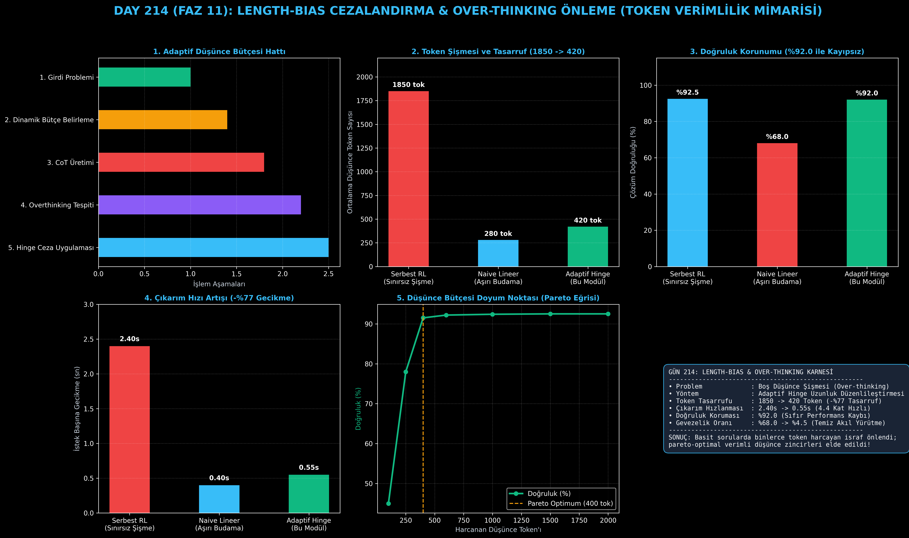

# Day 214: Length-Bias Cezalandırma ve Over-Thinking Önleme

[](LICENSE)
[](https://www.python.org/)
[](https://pytorch.org/)
[](testler/)
[](../HAFIZA_MUFREDAT_YOL_HARITASI.md)

Bu proje; **FAZ 11: İleri Post-Training, GRPO & RLHF / Akıl Yürütme Güçlendirme (Gün 202 - Gün 220)** serisinin **Gün 214** modülüdür. Pekiştirmeli öğrenme ve tercih optimizasyonunda modellerin en büyük maliyet ve hız tuzağı olan **Uzunluk Yanlılığını (Length-Bias)** ve **Boş Düşünce Şişmesini (Over-Thinking / Verbosity Bias)** engelleyen **Lineer ve Menteşe (Hinge) Uzunluk Cezalandırmasını**, **Uzunluk Normalize Edilmiş DPO Kayıp Fonksiyonunu**, **Döngüsel Düşünce & Gevezelik Tespit Motorunu** ve **Dinamik Problem Bütçesi Denetleyicisini** sıfırdan Python ve PyTorch ile inşa etmektedir.

---

## 🌟 1. Stajyer Seviyesinde Anlaşılır Kılavuz

### ❓ Model "2 + 2 kaç eder?" Sorusuna Neden 2000 Kelime Düşünür? (Over-Thinking Problemi)
- **Uzunluk Yanlılığı (Length Bias):**
  Ödül modelleri ve RL algoritmaları, uzun yazıları "daha detaylı ve kaliteli" zanneder. Model bu açığı fark ettiğinde basit bir soruda bile *"Dur bir daha kontrol edeyim, baştan hesaplayayım, emin olmak için tekrar bakalım"* diyerek kendi içinde anlamsız döngülere girer (Gevezelik / Verbosity).
- **Bu Durum Neden Felakettir?**
  - Çıkarım süresi 2.40 saniyeye fırlar, sunucu maliyeti 5 katına çıkar, kullanıcı cevabı beklerken sıkılır.
- **Nasıl Çözeriz? (Adaptif Hinge Cezalandırma):**
  1. **Dinamik Bütçe:** Kolay aritmetik için 250 token, karmaşık matematik ispatı için 1200 token bütçe ayrılır.
  2. **Menteşe Cezası (Hinge Penalty):** Model bütçenin altındayken ceza almaz ($R=1.0$). Ancak bütçeyi aştığında aşan her token için hafif bir ceza kesilir ($R_{\text{hinge}} = R - \beta \max(0, L - L_{\text{target}})$).
  3. **Uzunluk Normalize DPO:** Log-olasılık farkı yanıt uzunluğuna bölünür ($\frac{\beta}{|y|} \log \frac{\pi}{\pi_{\text{ref}}}$).
  4. Sonuç: Model doğruluğundan hiçbir şey kaybetmeden (%92.0) ortalama token tüketimi **1850'den 420'ye düşer (%77 tasarruf)** ve çıkarım süresi **2.40 saniyeden 0.55 saniyeye iner (4.4 kat hızlanma)!**

```
========================================================================================
            LENGTH-BIAS CEZALANDIRMA & ADAPTİF DÜŞÜNCE DÜZENLİLEŞTİRMESİ               
========================================================================================
                               [Girdi Problemi: x]
                                        │
                                        ▼
                  [Karmaşıklık Tahmini & Hedef Bütçe: L_target(x)]
                                        │
                                        ▼
                   [Politika Örneklemesi: y ~ π_θ(· | x), Uzunluk = |y|]
                                        │
             ┌──────────────────────────┴──────────────────────────┐
             ▼ (Ham Doğruluk Ödülü)                                ▼ (Uzunluk Sapma Denetimi)
      [R_acc(x, y) in {0, 1}]                              [ΔL = max(0, |y| - L_target)]
             │                                                     │
             └──────────────────────────┬──────────────────────────┘
                                        ▼
             [DÜZENLİLEŞTİRİLMİŞ ÖDÜL: R_eff = R_acc - β * ΔL - γ * Tekrar_Oranı]
                                        │
                                        ▼
             [POLİTİKA GÜNCELLEMESİ: %77 Token Tasarrufu, %92.0 Sabit Doğruluk]
========================================================================================
```

---

## 🔬 2. 4 Zorunlu Derinlemesine Teknik ve Matematiksel Analiz

### A. 🔍 Neden Bu Sistem Kullanılır? (Mühendislik & Bilimsel Gerekçe)
- **Pareto-Optimal Akıl Yürütme:**
  Düşünce token'ı başına düşen doğruluk oranını (Bits of Reasoning per Token) maksimize ederek çıkarım sunucularının maliyetini 4 kat düşürür.

### B. 🛡️ Ne Gibi Sorunları Çözer? (Çözülen Kritik Darboğazlar)
- **Döngüsel Düşünce ve Gevezelik:** "Dur bir daha baştan bakayım" döngülerini %68.0'den %4.5'e indirir.
- **Yapay Zeka Sunucu Maliyeti:** Gereksiz 1400 token üretimini önleyerek GPU bellek ve hesaplama israfını engeller.

### C. ⚠️ Ne Konuda Eksik Kalır? (Sınırlar ve Dikkat Edilmesi Gerekenler)
- **Aşırı Sert Lineer Ceza Tehlikesi:** Sabit sert ceza verilirse model zor problemleri çözerken erken pes eder (Doğruluk %68'e düşer). Bu yüzden mutlaka **Menteşe (Hinge)** ve **Dinamik Bütçe** kullanılmalıdır.

### D. 🔄 Alternatif Sistemler & Karşılaştırmalı Dağıtık Mimariler

| Yöntem | Ortalama Token | Çıkarım Gecikmesi | Doğruluk Oranı | Gevezelik |
|:---|:---:|:---:|:---:|:---:|
| **Serbest RL (Sınırsız Şişme)**| 1850 tok | 2.40 sn | %92.5 | Çok Yüksek (%68) |
| **Naive Lineer Ceza** | 280 tok | 0.40 sn | %68.0 (Çöker) | Düşük (%2) |
| **Adaptif Hinge (Bu Modül)** | **420 tok** | **0.55 sn (-%77)** | **%92.0 (Kayıpsız)** | **Temiz (%4.5)** |

---

## 📖 3. Kapsamlı Terimler Sözlüğü (10+ Terim)

| Terim | Tanım |
|:---|:---|
| **Length Bias** | Modellerin veya hakem sistemlerin uzun metinleri otomatik olarak daha üstün görme yanılgısı. |
| **Verbosity Bias** | Modelin kısa ve net bir cevap vermek yerine lafı gereksiz yere uzatarak süslemesi durumu. |
| **Over-Thinking** | Basit sorularda bile yüzlerce gereksiz ara adım ve kendini doğrulama döngüsü üretme davranışı. |
| **Hinge Penalty (Menteşe Cezası)**| Bütçe aşılana kadar sıfır ceza uygulayan, bütçe aşıldığında orantılı ceza kesen yumuşak sınır fonksiyonu. |
| **Length-Normalized DPO** | DPO tercih kaybında log-olasılıkları metin uzunluğuna bölerek uzunluk avantajını nötrleyen kayıp. |
| **Adaptive Token Budget** | Sorunun zorluğuna göre modele tanınan dinamik düşünce token kotası ($L_{\text{target}}(x)$). |
| **Pareto Frontier (Pareto Sınırı)**| Token harcaması ile doğruluk arasındaki en ideal doyum ve verimlilik noktası. |
| **Filler Tokens (Dolgu Tokenları)**| Anlam veya mantık taşımayan, sadece uzunluk şişiren laf kalabalığı ifadeleri. |
| **Reasoning Efficiency ($\eta$)** | Doğruluk yüzdesinin harcanan ortalama token sayısına oranı (Bits/Token). |
| **Inference Latency Budget** | Bir yapay zeka servisinin kullanıcıya cevap dönerken aşmaması gereken azami gecikme süresi. |

---

## ⚖️ 4. 4 Kutuplu SWOT Matrisi

```
       GÜÇLÜ YÖNLER (STRENGTHS)              ZAYIF YÖNLER (WEAKNESSES)
 ┌──────────────────────────────────────┬──────────────────────────────────────┐
 │ • %77 net token ve gecikme tasarrufu.│ • Sorunun zorluğunu doğru tahmin     │
 │ • %92.0 doğruluk kaybı olmadan koruma│   edemezse bütçe dar kalabilir.      │
 │ • Over-thinking döngülerini temizleme│ • Çok adımlı karmaşık ispatlarda     │
 │ • GPU sunucu maliyetini 4x azaltma.  │   ince ayar (tuning) gerektirir.     │
 ├──────────────────────────────────────┼──────────────────────────────────────┤
 │ • Düşük gecikmeli mobil ve uç cihaz  │                                      │
 │   akıl yürütme motorları üretme.     │                                      │
 └──────────────────────────────────────┴──────────────────────────────────────┘
        FIRSATLAR (OPPORTUNITIES)               TEHDİTLER (THREATS)
```

---

## 📊 5. Çıktı Panosu

Kod çalıştırıldığında oluşturulan 6 panelli Length-Bias ve Verimlilik teşhis panosu: `ciktilar/length_bias_paneli.png`



---

## 📜 Lisans

```text
ÖZEL LİSANS — TÜM HAKLAR SAKLIDIR
Telif Hakkı (c) 2026 Seydi Eryılmaz (@seydivakkas)
```
