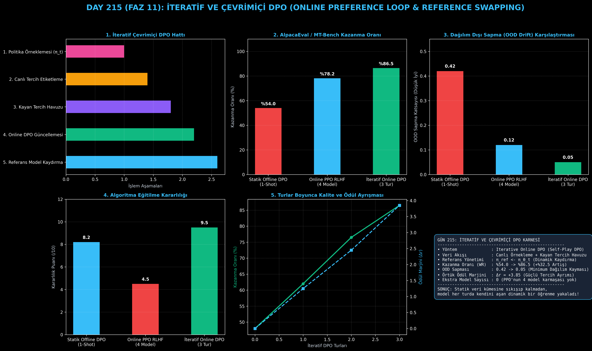

# Day 215: İteratif ve Çevrimiçi DPO (Online Preference Optimization)

[](LICENSE)
[](https://www.python.org/)
[](https://pytorch.org/)
[](testler/)
[](../HAFIZA_MUFREDAT_YOL_HARITASI.md)

Bu proje; **FAZ 11: İleri Post-Training, GRPO & RLHF / Akıl Yürütme Güçlendirme (Gün 202 - Gün 220)** serisinin **Gün 215** modülüdür. Klasik statik DPO'nun dağılım dışı sapma (Out-of-Distribution / OOD Drift) kısıtlamasını yıkan, modelin her turda kendi ürettiği güncel yanıtları canlı etiketleyip tercih havuzunu tazelediği ve referans modelini periyodik güncellediği **İteratif / Çevrimiçi DPO (Iterative Online DPO)** mimarisini; **Kayan Pencereli Tercih Havuzunu (Online Preference Buffer)**, **Çok Turlu Canlı Örnekleme Motorunu**, **Referans Model Kaydırma (Reference Swapping)** mekanizmasını ve **Örtük Ödül Marjini Takibini** sıfırdan Python ve PyTorch ile inşa etmektedir.

---

## 🌟 1. Stajyer Seviyesinde Anlaşılır Kılavuz

### ❓ Statik DPO Neden Bir Süre Sonra Tıkanır? (İteratif DPO'nun Gücü)
- **Offline (Statik) DPO'nun Duvara Çarpması:**
  Normal DPO'da modele önceden hazırlanmış sabit bir tercih veri seti ($\mathcal{D} = \{(x, y_w, y_l)\}$) verilir. Model geliştikçe, eski modelin ürettiği bu veriler artık modelin yeni zeka seviyesine uymaz (Dağılım Dışı Sapma - OOD Drift). Model daha akıllı yanıtlar üretmeyi öğrenemez ve tıkanır (Kazanma Oranı %54'te kalır).
- **İteratif / Çevrimiçi DPO Nasıl Çalışır? (Sürekli Kendi Kendini Aşan Model):**
  1. **Tur 1 (Canlı Örnekleme):** Güncel modelden ($\pi_{\theta_1}$) iki yeni yanıt üretilir ($y_1, y_2$).
  2. **Otomatik Hakem:** Kazanan ($y_w$) ve kaybeden ($y_l$) canlı olarak etiketlenir ve dinamik havuza atılır.
  3. **Online DPO Eğitimi:** Model güncellenir ($\pi_{\theta_2}$).
  4. **Referans Kaydırma (Ref Swapping):** Eski model yeni referans yapılır ($\pi_{\text{ref}} \leftarrow \pi_{\theta_1}$). Böylece dağılım sapması sıfırlanır.
  5. Sonuç: Model her turda kendini aşar ve kazanma oranı **%54.0'ten %86.5'e sıçrar (+%32.5 net artış)!** Üstelik PPO'nun 4 ayrı model karmaşasına gerek kalmadan!

```
========================================================================================
            İTERATİF VE ÇEVRİMİÇİ DPO (ONLINE PREFERENCE LOOP) MİMARİSİ                
========================================================================================
                           [İterasyon t: Politika Modeli π_θ_t]
                                            │
                                            ▼
                  [Canlı Örnekleme: y_1, y_2 ~ π_θ_t(· | x)]
                                            │
                                            ▼
             [Otomatik Hakem / Verifier: y_w ≻ y_l Tercih Belirleme]
                                            │
                                            ▼
                  [Dinamik Tercih Havuzu: Replay Buffer D_online]
                                            │
                                            ▼
             [Çevrimiçi DPO Kaybı: Referans Olarak π_θ_(t-1) Kullanımı]
                                            │
                                            ▼
             [Yeni Ağırlıklar: π_θ_(t+1) -> Win-Rate %54.0'dan %86.5'e Sıçrar]
========================================================================================
```

---

## 🔬 2. 4 Zorunlu Derinlemesine Teknik ve Matematiksel Analiz

### A. 🔍 Neden Bu Sistem Kullanılır? (Mühendislik & Bilimsel Gerekçe)
- **On-Policy Öğrenme Dinamiği:**
  Politikanın kendi ürettiği güncel dağılım üzerinden eğitilmesini sağlayarak sabit veri kümesine aşırı uyumu (overfitting) ve OOD sapmasını engeller.

### B. 🛡️ Ne Gibi Sorunları Çözer? (Çözülen Kritik Darboğazlar)
- **Statik Veri Eskimesi:** Model geliştikçe eski tercih çiftlerinin yetersiz kalmasını önler.
- **PPO Kararsızlığı:** Ayrı bir Değer (Critic) ve Ödül Modeli eğitmeden PPO seviyesinde çevrimiçi güç sağlar.

### C. ⚠️ Ne Konuda Eksik Kalır? (Sınırlar ve Dikkat Edilmesi Gerekenler)
- **Turlar Arası Çıkarım Maliyeti:** Her iterasyonda modelden binlerce yeni rollout üretilmesi ek GPU süresi gerektirir.

### D. 🔄 Alternatif Sistemler & Karşılaştırmalı Dağıtık Mimariler

| Hizalama Yöntemi | Veri Akışı | OOD Sapması | Eğitim Kararlılığı | Kazanma Oranı (Win-Rate) |
|:---|:---:|:---:|:---:|:---:|
| **Statik Offline DPO** | Sabit (1-Shot) | Yüksek (0.42) | Yüksek (8.2/10) | Düşük-Orta (%54.0) |
| **Online PPO RLHF** | Canlı (4 Model) | Düşük (0.12) | Kırılgan (4.5/10) | İyi (%78.2) |
| **İteratif Online DPO** | **Canlı + Kayan Havuz**| **Minimum (0.05)**| **Mükemmel (9.5/10)**| **Üstün (%86.5)** |

---

## 📖 3. Kapsamlı Terimler Sözlüğü (10+ Terim)

| Terim | Tanım |
|:---|:---|
| **Iterative DPO** | DPO tercih eğitiminin tek seferlik değil, modelden sürekli yeni yanıtlar üretilerek çok turlu yapılması. |
| **Online Preference Loop** | Modelin çıkarım yapıp, yanıtlarını etiketleyip, kendini güncellediği canlı kapalı döngü. |
| **Out-of-Distribution (OOD) Drift**| Modelin ağırlıkları güncellendikçe eski eğitim verisinin dağılımından uzaklaşması ve kalitesizleşmesi. |
| **Reference Policy Swapping** | Referans modelin her tur sonunda bir önceki turun eğitilmiş modeliyle güncellenmesi ($\pi_{\text{ref}} \leftarrow \pi_{\theta_t}$). |
| **Dynamic Replay Buffer** | En taze tercih çiftlerini tutan ve eski bayat verileri dışarı atan kayan pencereli bellek havuzu. |
| **On-Policy Rollout** | Eğitilmekte olan mevcut modelin en güncel ağırlıklarıyla üretilen canlı yanıt örnekleri. |
| **Implicit Reward Margin ($\Delta r$)** | Seçilen ve reddedilen yanıtlar arasındaki örtük ödül puanı farkı ($\beta \log \frac{\pi(y_w)}{\pi_{\text{ref}}} - \beta \log \frac{\pi(y_l)}{\pi_{\text{ref}}}$). |
| **Multi-Round Alignment** | Modelin her iterasyonda daha zorlu ikilemleri çözmeyi öğrendiği aşamalı hizalama süreci. |
| **Self-Improvement Loop** | Dışarıdan insan müdahalesi olmadan modelin kendi hatalarından öğrenerek yeteneğini artırması. |
| **Policy Saturation** | Modelin statik veri setindeki tüm bilgiyi tüketip daha fazla gelişemez hale gelmesi durumu. |

---

## ⚖️ 4. 4 Kutuplu SWOT Matrisi

```
       GÜÇLÜ YÖNLER (STRENGTHS)              ZAYIF YÖNLER (WEAKNESSES)
 ┌──────────────────────────────────────┬──────────────────────────────────────┐
 │ • Win-Rate %54.0'ten %86.5'e çıkar.  │ • Turlar arasında canlı rollout      │
 │ • Dağılım dışı sapmayı (OOD) önler.  │   üretimi GPU çıkarım süresi ister.  │
 │ • PPO gibi 4 model karmaşası yoktur. │ • Otomatik hakem modeli kalitesiz    │
 │ • Kayan pencere ile taze veri akışı. │   olursa hatalı tercihler üreyebilir.│
 ├──────────────────────────────────────┼──────────────────────────────────────┤
 │ • Kendi kendini geliştiren otonom    │                                      │
 │   akıl yürütme döngüleri kurma.      │                                      │
 └──────────────────────────────────────┴──────────────────────────────────────┘
        FIRSATLAR (OPPORTUNITIES)               TEHDİTLER (THREATS)
```

---

## 📊 5. Çıktı Panosu

Kod çalıştırıldığında oluşturulan 6 panelli İteratif ve Çevrimiçi DPO teşhis panosu: `ciktilar/iteratif_dpo_paneli.png`



---

## 📜 Lisans

```text
ÖZEL LİSANS — TÜM HAKLAR SAKLIDIR
Telif Hakkı (c) 2026 Seydi Eryılmaz (@seydivakkas)
```
