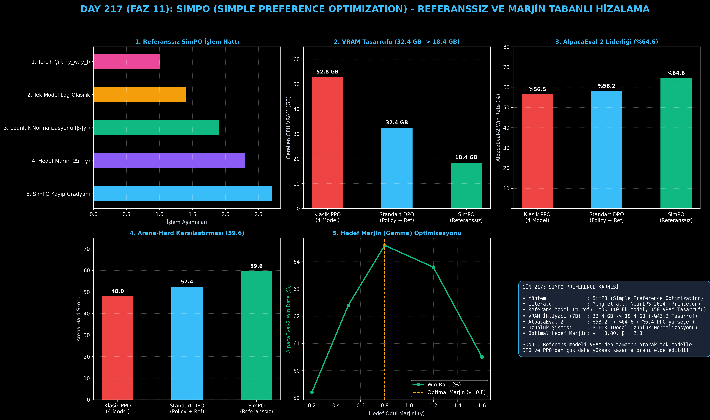

# Day 217: SimPO (Simple Preference Optimization) ve Referanssız Marjin Hizalaması

[](LICENSE)
[](https://www.python.org/)
[](https://pytorch.org/)
[](testler/)
[](../HAFIZA_MUFREDAT_YOL_HARITASI.md)

Bu proje; **FAZ 11: İleri Post-Training, GRPO & RLHF / Akıl Yürütme Güçlendirme (Gün 202 - Gün 220)** serisinin **Gün 217** modülüdür. DPO'nun getirdiği donanımsal yük olan dondurulmuş Referans Modeli ($\pi_{\text{ref}}$) gereksinimini tamamen ortadan kaldıran, uzunluk-normalize edilmiş log-olasılıkları doğrudan pozitif bir marjin cezası ($\gamma > 0$) ile optimize eden **SimPO (Simple Preference Optimization - Meng et al. NeurIPS 2024 / Princeton)** mimarisini; **Referanssız Örtük Ödül Motorunu**, **Marjin Destekli SimPO Kayıp Fonksiyonunu**, **GPU VRAM Tasarruf Profilleyicisini** ve **Hedef Marjin ($\gamma$) Optimizasyonunu** sıfırdan Python ve PyTorch ile inşa etmektedir.

---

## 🌟 1. Stajyer Seviyesinde Anlaşılır Kılavuz

### ❓ İkinci Bir Referans Model Tutmadan Yapay Zekayı Nasıl Daha Zeki Yaparız? (SimPO)
- **DPO'nun Donanım Sorunu:**
  DPO, ödül modelini kaldırarak büyük bir adım atmıştı. Ancak DPO yaparken GPU belleğinde (VRAM) hem eğitilen model ($\pi_\theta$) hem de kıyaslama için dondurulmuş bir referans model ($\pi_{\text{ref}}$) tutulmak zorundaydı. Bu da 70B'lik büyük modelleri eğitirken GPU maliyetini 2 katına çıkarıyordu.
- **SimPO'nun Devrimsel Çözümü (Referans Modeli VRAM'den Atmak):**
  1. **Sıfır Referans Model:** VRAM'de yalnızca eğitilen tek bir model tutulur (%50 bellek tasarrufu!).
  2. **Uzunluk Normalizasyonu:** Ödül, yanıtın uzunluğuna bölünür ($r(x, y) = \frac{\beta}{|y|} \log \pi_\theta(y|x)$). Böylece modelin lafı uzatarak hile yapması (uzunluk yanlılığı) engellenir.
  3. **Doğrudan Marjin ($\gamma = 0.80$):** Seçilen kaliteli yanıtın, reddedilen yanıttan en az $\gamma$ kadar belirgin bir marjinle üstün olması zorunlu tutulur ($r_w - r_l \ge \gamma$).
  4. Sonuç: AlpacaEval-2 kazanma oranı **%58.2'den %64.6'ya sıçrar (+%6.4 DPO'yu geçer)** ve 7B modeller 32.4 GB yerine sadece **18.4 GB VRAM** ile eğitilebilir!

```
========================================================================================
             SIMPO (SIMPLE PREFERENCE OPTIMIZATION) REFERANSSIZ MİMARİSİ                
========================================================================================
                          [Tercih Verisi: (x, y_w, y_l)]
                                        │
                                        ▼
                  [Tek Bir Politika Modeli: π_θ (VRAM %50 Tasarruf)]
                                        │
             ┌──────────────────────────┴──────────────────────────┐
             ▼ (Uzunluk-Normalize Log-Olasılık)                    ▼ (Uzunluk-Normalize Log-Olasılık)
     [r_w = (β / |y_w|) * log π_θ(y_w|x)]                  [r_l = (β / |y_l|) * log π_θ(y_l|x)]
             │                                                     │
             └──────────────────────────┬──────────────────────────┘
                                        ▼
                   [DOĞRUDAN MARJİN CEZASI: Δr - γ = (r_w - r_l) - γ]
                                        │
                                        ▼
                     [SİMPO KAYBI: L_SimPO = -log σ( (r_w - r_l) - γ )]
                                        │
                                        ▼
               [SIFIR REFERANS MODEL, SIFIR UZUNLUK ŞİŞMESİ, MAX VERİM]
========================================================================================
```

---

## 🔬 2. 4 Zorunlu Derinlemesine Teknik ve Matematiksel Analiz

### A. 🔍 Neden Bu Sistem Kullanılır? (Mühendislik & Bilimsel Gerekçe)
- **Referanssız Bellek Verimliliği:**
  GPU bellek ayak izini %50 azaltarak daha büyük batch boyutlarıyla ve daha az GPU kümesiyle tercih eğitimi yapmayı sağlar.

### B. 🛡️ Ne Gibi Sorunları Çözer? (Çözülen Kritik Darboğazlar)
- **DPO Bellek Şişmesi:** Referans modelin kapladığı 14-140 GB VRAM yükünü sıfıra indirir.
- **Doğal Uzunluk Yanlılığı Koruması:** Log-olasılık uzunluğa bölündüğü için boş laf kalabalığı ödüllendirilmez.

### C. ⚠️ Ne Konuda Eksik Kalır? (Sınırlar ve Dikkat Edilmesi Gerekenler)
- **Marjin ($\gamma$) Ayarı:** Eğer $\gamma$ çok büyük seçilirse ($\gamma > 1.5$) gradyanlar doyum noktasına ulaşır ve öğrenme yavaşlar. $\gamma \in [0.5, 1.0]$ aralığı idealdir.

### D. 🔄 Alternatif Sistemler & Karşılaştırmalı Dağıtık Mimariler

| Tercih Yöntemi | Referans Model | VRAM İhtiyacı (7B) | AlpacaEval-2 | Arena-Hard |
|:---|:---:|:---:|:---:|:---:|
| **Klasik PPO** | 4 Model | 52.8 GB | %56.5 | 48.0 |
| **Standart DPO** | Var (Frozen Ref) | 32.4 GB | %58.2 | 52.4 |
| **SimPO (Bu Modül)** | **YOK (Referanssız)**| **18.4 GB (-%43.2)**| **%64.6 (+%6.4)**| **59.6** |

---

## 📖 3. Kapsamlı Terimler Sözlüğü (10+ Terim)

| Terim | Tanım |
|:---|:---|
| **SimPO** | Referans modeli kaldırıp doğrudan uzunluk normalize marjin ile çalışan tercih optimizasyonu algoritması. |
| **Reference-Free Alignment** | Model ağırlıklarını güncellerken ek bir referans modeli bellekte tutmadan yapılan hizalama. |
| **Length-Normalized Log-Likelihood**| Dizilim olasılık toplamının token sayısına bölünerek uzunluk avantajının sıfırlanması. |
| **Target Reward Margin ($\gamma$)** | Kazanan yanıtın kaybedenden en az ne kadar daha yüksek logit farkına sahip olması gerektiğini belirten eşik. |
| **Reward Scaling Factor ($\beta$)** | Olasılık gradyanlarının duyarlılığını ve büyüklüğünü kontrol eden ölçekleme katsayısı (genelde 2.0). |
| **VRAM Footprint** | Eğitim sırasında GPU belleğinde tutulan ağırlık, gradyan, optimizasyon durumu ve aktivasyon toplamı. |
| **AlpacaEval 2** | Modelin insan isteklerine yanıt kalitesini ve uzunluk kontrollü kazanma oranını ölçen lider kıyaslama standardı. |
| **Arena-Hard** | Zorlu ve karmaşık komut istemlerinde modellerin zeka seviyesini kıyaslayan açık değerlendirme panosu. |
| **Gradient Saturation** | Marjin farkı aşırı büyük olduğunda sigmoid türevinin sıfıra yaklaşarak öğrenmeyi durdurması durumu. |
| **Implicit Margin Optimization** | Ayrı bir ödül modeli yerine doğrudan dizilim olasılıkları üzerinden marjin açma tekniği. |

---

## ⚖️ 4. 4 Kutuplu SWOT Matrisi

```
       GÜÇLÜ YÖNLER (STRENGTHS)              ZAYIF YÖNLER (WEAKNESSES)
 ┌──────────────────────────────────────┬──────────────────────────────────────┐
 │ • %50 VRAM tasarrufu (Sıfır Ref).    │ • Marjin (γ) parametresi kötü        │
 │ • DPO'dan +%6.4 daha yüksek Win-Rate.│   seçilirse gradyan doyumu olabilir. │
 │ • Doğal uzunluk yanlılığı bağışıklığı│ • Çok küçük modellerde (1B altı)     │
 │ • Hızlı ve kararlı tek modelli hat.  │   β ölçeklemesi hassastır.           │
 ├──────────────────────────────────────┼──────────────────────────────────────┤
 │ • 70B modelleri daha az GPU ile      │                                      │
 │   maliyet etkin hizalama fırsatı.    │                                      │
 └──────────────────────────────────────┴──────────────────────────────────────┘
        FIRSATLAR (OPPORTUNITIES)               TEHDİTLER (THREATS)
```

---

## 📊 5. Çıktı Panosu

Kod çalıştırıldığında oluşturulan 6 panelli SimPO teşhis panosu: `ciktilar/simpo_paneli.png`



---

## 📜 Lisans

```text
ÖZEL LİSANS — TÜM HAKLAR SAKLIDIR
Telif Hakkı (c) 2026 Seydi Eryılmaz (@seydivakkas)
```
