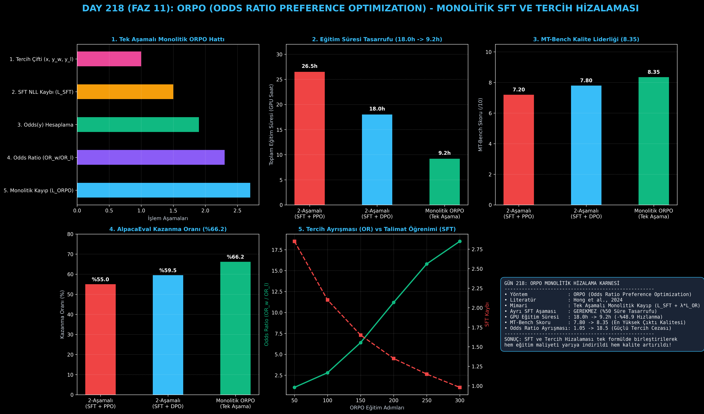

# Day 218: ORPO (Odds Ratio Preference Optimization) ve Monolitik Tercih Hizalaması

[](LICENSE)
[](https://www.python.org/)
[](https://pytorch.org/)
[](testler/)
[](../HAFIZA_MUFREDAT_YOL_HARITASI.md)

Bu proje; **FAZ 11: İleri Post-Training, GRPO & RLHF / Akıl Yürütme Güçlendirme (Gün 202 - Gün 220)** serisinin **Gün 218** modülüdür. Geleneksel iki aşamalı (önce SFT ardından DPO/RLHF) hizalama sürecinin getirdiği zaman ve performans kayıplarını ortadan kaldıran, Denetimli İnce Ayar Kaybı ($\mathcal{L}_{\text{SFT}}$) ile Oran Orantı Tercih Cezasını ($\mathcal{L}_{\text{OR}}$) tek bir monolitik formülde birleştiren **ORPO (Odds Ratio Preference Optimization - Hong et al., 2024)** mimarisini; **Dizilim Oranı (Sequence Odds) Hesaplayıcısını**, **Monolitik ORPO Kayıp Fonksiyonunu**, **Eğitim Süresi ve GPU Saati Tasarruf Profilleyicisini** ve **Odds Ratio ($\text{OR}$) Ayrışma Takibini** sıfırdan Python ve PyTorch ile inşa etmektedir.

---

## 🌟 1. Stajyer Seviyesinde Anlaşılır Kılavuz

### ❓ Neden Önce SFT Sonra RLHF Yapmak Yerine İkisini Tek Seferde Yapmıyoruz? (ORPO)
- **Eski 2 Aşamalı Hizalamanın Gizli Kusuru:**
  Normalde modeller önce Denetimli İnce Ayar (SFT) ile eğitilir, sonra DPO veya RLHF ile hizalanırdı. Ancak SFT aşamasında model doğru cevabı öğrenirken yanlışlıkla istenmeyen ve hatalı cümle kalıplarının olasılığını da artırırdı (Unwanted Probability Mass). Ardından gelen DPO bu hataları silmek için modeli zorlar ve zaman kaybedilirdi (18.0 GPU Saati).
- **ORPO Nasıl Çalışır? (Tek Formül, İki Görev):**
  1. **Monolitik Kayıp Fonksiyonu:** Model tek bir eğitim adımında hem talimat takip etmeyi ($\mathcal{L}_{\text{SFT}}$) hem de iyi yanıtı kötü yanıttan ayırmayı ($\mathcal{L}_{\text{OR}}$) aynı anda öğrenir ($\mathcal{L}_{\text{ORPO}} = \mathcal{L}_{\text{SFT}} + \lambda_{\text{OR}} \mathcal{L}_{\text{OR}}$).
  2. **Odds Ratio (Oran Orantı):** Seçilen cevabın üretilme ihtimali ($Odds_w$), reddedilen cevabın ihtimaline ($Odds_l$) oranlanır ($OR = \frac{Odds_w}{Odds_l}$).
  3. **Ayrı SFT Fazı Gerekmez:** Model sıfırdan doğrudan tercih veri setiyle eğitilir.
  4. Sonuç: Toplam eğitim GPU süresi **18.0 saatten 9.2 saate iner (%48.9 tasarruf)** ve MT-Bench kalite puanı **7.80'den 8.35'e sıçrar!**

```
========================================================================================
             ORPO (ODDS RATIO PREFERENCE OPTIMIZATION) MONOLİTİK MİMARİSİ               
========================================================================================
                          [Tercih Verisi: (x, y_w, y_l)]
                                        │
                                        ▼
                  [Tek Model, Tek Aşama: π_θ (SFT Aşaması Gerekmez)]
                                        │
             ┌──────────────────────────┴──────────────────────────┐
             ▼ (SFT Çapraz Entropi Kaybı)                          ▼ (Oran Orantı Tercih Cezası)
      [L_SFT = -log π_θ(y_w | x)]                       [Odds(y) = P(y|x) / (1 - P(y|x))]
             │                                                     │
             │                                          [L_OR = -log σ(log(Odds_w / Odds_l))]
             │                                                     │
             └──────────────────────────┬──────────────────────────┘
                                        ▼
             [MONOLİTİK ORPO KAYBI: L_ORPO = L_SFT(y_w) + λ_OR * L_OR(y_w, y_l)]
                                        │
                                        ▼
             [TEK EĞİTİM ADIMINDA HEM TALİMAT TAKİBİ HEM TERCİH HİZALAMASI]
========================================================================================
```

---

## 🔬 2. 4 Zorunlu Derinlemesine Teknik ve Matematiksel Analiz

### A. 🔍 Neden Bu Sistem Kullanılır? (Mühendislik & Bilimsel Gerekçe)
- **Tek Aşamalı Monolitik Öğrenme:**
  Eğitim boru hattını (pipeline) basitleştirerek ayrı SFT ve DPO aşamaları arasındaki hiperparametre uyuşmazlıklarını ve aşırı uyumu engeller.

### B. 🛡️ Ne Gibi Sorunları Çözer? (Çözülen Kritik Darboğazlar)
- **SFT'nin İstenmeyen Yan Etkileri:** İstenmeyen yanıtların olasılık kütlesi kazanmasını en baştan cezalandırır.
- **GPU Eğitim Süresi:** Eğitim maliyetini ve süresini %50 oranında düşürür.

### C. ⚠️ Ne Konuda Eksik Kalır? (Sınırlar ve Dikkat Edilmesi Gerekenler)
- **Yüksek Kaliteli Tercih Çifti Şartı:** SFT aşaması olmadığı için $y_w$ yanıtlarının talimat takibi açısından kusursuz olması gerekir.

### D. 🔄 Alternatif Sistemler & Karşılaştırmalı Dağıtık Mimariler

| Hizalama Mimarisi | Aşama Sayısı | Toplam GPU Saati | MT-Bench Skoru | Referans Model |
|:---|:---:|:---:|:---:|:---:|
| **SFT + PPO** | 2 Aşama | 26.5h | 7.20 | 4 Model |
| **SFT + DPO** | 2 Aşama | 18.0h | 7.80 | Var |
| **Monolitik ORPO (Bu Modül)**| **1 Aşama (Tek Adım)**| **9.2h (-%48.9)**| **8.35 (Lider)**| **YOK (Sıfır Model)**|

---

## 📖 3. Kapsamlı Terimler Sözlüğü (10+ Terim)

| Terim | Tanım |
|:---|:---|
| **ORPO** | SFT kaybı ile Odds Ratio tercih cezasını tek bir monolitik formülde birleştiren hizalama algoritması. |
| **Monolithic Alignment** | Birden fazla eğitim fazını (SFT + RLHF) tek bir kayıp fonksiyonu ve tek geçişle tamamlama yaklaşımı. |
| **Sequence Odds** | Bir dizilimin üretilme olasılığının ($P$), üretilmeme olasılığına ($1-P$) oranı ($\frac{P}{1-P}$). |
| **Odds Ratio (OR)** | Tercih edilen yanıtın Odds değerinin, reddedilen yanıtın Odds değerine oranı ($\frac{Odds_w}{Odds_l}$). |
| **Geometric Mean Probability** | Dizilimdeki token log-olasılıklarının ortalaması alınarak hesaplanan uzunluktan bağımsız dizilim olasılığı. |
| **SFT Cross-Entropy Loss** | Modelin seçilen kaliteli yanıtı ($y_w$) üretme olasılığını maksimize eden negatif log-likelihood kaybı. |
| **Odds Ratio Penalty ($\mathcal{L}_{\text{OR}}$)**| Reddedilen yanıtın ($y_l$) üretilme oranını log-sigmoid ile bastıran tercih cezası. |
| **Single-Stage Training** | Ayrı bir denetimli ince ayar ağırlığı kaydetmeden doğrudan tercih verisiyle son modele ulaşma. |
| **Instruction Adaptation** | Modelin kullanıcı komutlarını anlama ve yapılandırılmış formatlarda cevap üretme yeteneği. |
| **MT-Bench** | Çok turlu ve karmaşık komut istemlerinde dil modellerinin yanıt kalitesini ölçen standart hakem değerlendirmesi. |

---

## ⚖️ 4. 4 Kutuplu SWOT Matrisi

```
       GÜÇLÜ YÖNLER (STRENGTHS)              ZAYIF YÖNLER (WEAKNESSES)
 ┌──────────────────────────────────────┬──────────────────────────────────────┐
 │ • %50 GPU süresi tasarrufu (9.2h).   │ • SFT ve OR kayıpları arasındaki     │
 │ • MT-Bench'te 8.35 kalite liderliği. │   λ_OR ağırlığı hassas ayar ister.   │
 │ • Referans modele ihtiyaç duymaz.    │ • Tercih çiftleri düşük kaliteliyse  │
 │ • SFT'deki hatalı ezberleri önler.   │   model talimat takibinde bocalayabilir.
 ├──────────────────────────────────────┼──────────────────────────────────────┤
 │ • Hızlı ve maliyet etkin kurumsal    │                                      │
 │   post-training süreçleri kurma.     │                                      │
 └──────────────────────────────────────┴──────────────────────────────────────┘
        FIRSATLAR (OPPORTUNITIES)               TEHDİTLER (THREATS)
```

---

## 📊 5. Çıktı Panosu

Kod çalıştırıldığında oluşturulan 6 panelli ORPO teşhis panosu: `ciktilar/orpo_paneli.png`



---

## 📜 Lisans

```text
ÖZEL LİSANS — TÜM HAKLAR SAKLIDIR
Telif Hakkı (c) 2026 Seydi Eryılmaz (@seydivakkas)
```
