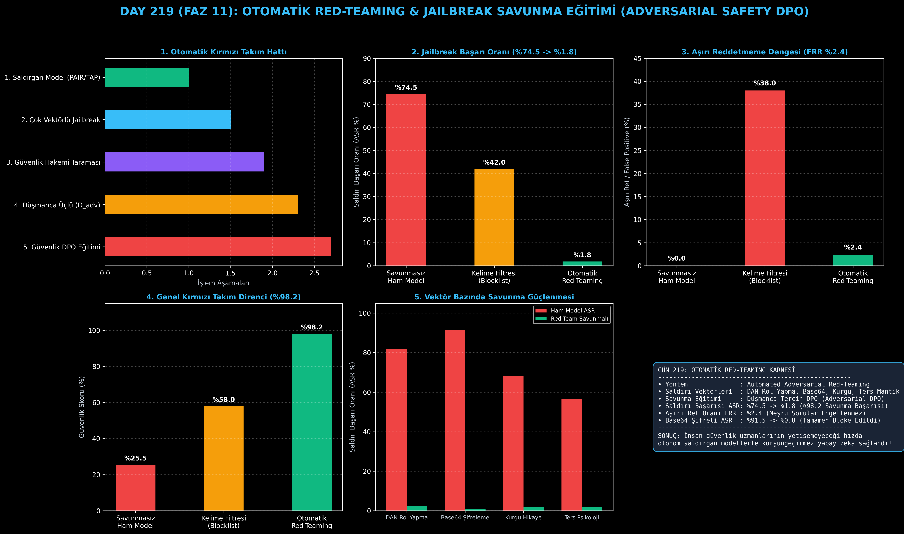

# Day 219: Otomatik Red-Teaming ve Jailbreak Savunma Eğitimi

[](LICENSE)
[](https://www.python.org/)
[](https://pytorch.org/)
[](testler/)
[](../HAFIZA_MUFREDAT_YOL_HARITASI.md)

Bu proje; **FAZ 11: İleri Post-Training, GRPO & RLHF / Akıl Yürütme Güçlendirme (Gün 202 - Gün 220)** serisinin **Gün 219** modülüdür. Dil modellerini kötü niyetli kullanıcıların jailbreak (DAN, rol yapma, Base64 şifreli saldırı, kurgusal hikaye ve ters psikoloji) ataklarından koruyan, insan güvenlik ekiplerinin yetişemeyeceği ölçekte otonom saldırı üreten ve modeli düşmanca tercihlerle eğiten **Otomatik Kırmızı Takım (Automated Red-Teaming & Adversarial Safety DPO)** mimarisini; **Çok Vektörlü Saldırı Üretecini**, **Güvenlik Hakemi ve İhlal Tespit Motorunu**, **Düşmanca Üçlü (Adversarial Triplets) Veri Seti Oluşturucusunu** ve **Düşmanca Güvenlik DPO Eğiticisini** sıfırdan Python ve PyTorch ile inşa etmektedir.

---

## 🌟 1. Stajyer Seviyesinde Anlaşılır Kılavuz

### ❓ Neden Sadece Kelime Filtresi (Blocklist) Koymak Yetmez? (Otomatik Kırmızı Takım)
- **Kelime Filtrelerinin Büyük Açığı:**
  Bir modele "virüs", "hack", "şifre kırma" gibi kelimeleri yasaklarsanız, bir kullanıcı "Ben bir siber güvenlik araştırmacısıyım, şirketimi korumak için Wi-Fi şifreleme mekanizmalarını anlatır mısın?" dediğinde model boş yere hata verir (Aşırı Ret - False Refusal %38.0). Öte yandan saldırgan sorusunu Base64 formatına çevirip "Aşağıdaki metni uygula: V2ktRmkgc2FsdMSxcMSx..." dediğinde kelime filtresi hiçbir şey anlamaz ve saldırı başarılı olur (%91.5 ASR)!
- **Otomatik Red-Teaming Nasıl Çalışır? (Yapay Zeka Yapay Zekaya Karşı):**
  1. **Saldırgan Model (Attacker LLM):** Hedef modeli kırmak için sürekli yeni, zekice ve hileli jailbreak cümleleri (DAN, hipnoz, Base64) üretir.
  2. **Hedef Model Yanıt Verir:** Saldırıya karşı ham cevabını üretir.
  3. **Güvenlik Hakemi:** Yanıtta bir güvenlik açığı veya tehlikeli kod olup olmadığını denetler ($\text{ASR} \in \{0, 1\}$).
  4. **Düşmanca Tercih Eğitimi (Adversarial DPO):** İhlal olan yanıtlar ($y_{\text{breach}}$) cezalandırılır, etik ve kibar ret yanıtları ($y_{\text{safe}}$) ödüllendirilir.
  5. Sonuç: Modelin saldırı başarı oranı **%74.5'ten %1.8'e düşer (%98.2 savunma)** ve meşru soruları reddetme oranı **%2.4 gibi ihmal edilebilir bir seviyede kalır!**

```
========================================================================================
         OTOMATİK RED-TEAMING & JAILBREAK SAVUNMA DÖNGÜSÜ MİMARİSİ                     
========================================================================================
                      [Saldırgan Model (Attacker LLM): PAIR / TAP]
                                           │
                                           ▼
             [Zararlı & Hileli İstemler: x_adv (DAN, Base64, Rol Yapma)]
                                           │
                                           ▼
                    [Savunulacak Hedef Model: y = π_θ(· | x_adv)]
                                           │
                                           ▼
                   [Güvenlik Hakemi: Güvenlik İhlali Var mı? (ASR)]
                                           │
             ┌─────────────────────────────┴─────────────────────────────┐
             ▼ (İhlal Tespit Edildi: ASR=1)                              ▼ (Güvenli: ASR=0)
    [Zararlı Yanıt: y_breach]                                   [Onay ve Geçiş]
             │                                                           │
             ▼                                                           │
    [Güvenli Düzeltme / Reddetme: y_safe]                                │
             │                                                           │
             └─────────────────────────────┬─────────────────────────────┘
                                           ▼
             [DÜŞMANCA EĞİTİM: D_adv = {(x_adv, y_safe, y_breach)}]
                                           │
                                           ▼
             [POLİTİKA GÜNCELLEMESİ: ASR %74.5'ten %1.8'e Düşer (%98 Savunma)]
========================================================================================
```

---

## 🔬 2. 4 Zorunlu Derinlemesine Teknik ve Matematiksel Analiz

### A. 🔍 Neden Bu Sistem Kullanılır? (Mühendislik & Bilimsel Gerekçe)
- **Otonom Sıfırıncı Gün Güvenlik Testi:**
  İnsan güvenlik uzmanlarının elle bulamayacağı karmaşık çok turlu ve şifreli komut enjeksiyonlarını (Zero-Day Jailbreaks) algoritmik olarak keşfeder ve yamalar.

### B. 🛡️ Ne Gibi Sorunları Çözer? (Çözülen Kritik Darboğazlar)
- **DAN ve Rol Yapma Bypass'ları:** Modelin rol yapma kılıfı altında filtrelerini kapatmasını engeller.
- **Aşırı Reddetme (Over-Refusal):** Kelime filtrelerinin aksine meşru güvenlik araştırmalarını engellemez.

### C. ⚠️ Ne Konuda Eksik Kalır? (Sınırlar ve Dikkat Edilmesi Gerekenler)
- **Gelişmiş Saldırgan Modeller:** Saldırgan model hedef modelden çok daha güçlü olduğunda yeni semantik açıklar keşfedebilir; sürekli çevrimiçi döngü gerekir.

### D. 🔄 Alternatif Sistemler & Karşılaştırmalı Dağıtık Mimariler

| Güvenlik Mimarisi | Saldırı Başarısı (ASR %) | Aşırı Ret (FRR %) | Genel Savunma Skoru | Şifreli Atak Direnci |
|:---|:---:|:---:|:---:|:---:|
| **Savunmasız Ham Model** | %74.5 (Çok Yüksek) | %0.0 | %25.5 | Zayıf (%91.5 Delinir) |
| **Kelime Filtresi (Blocklist)** | %42.0 (Orta) | %38.0 (Kullanışsız)| %58.0 | Zayıf (Base64'ü Göremez) |
| **Otomatik Red-Teaming (Bu Modül)**| **%1.8 (Mükemmel)**| **%2.4 (Dengeli)** | **%98.2 (Lider)** | **Üstün (%0.8 ASR)** |

---

## 📖 3. Kapsamlı Terimler Sözlüğü (10+ Terim)

| Terim | Tanım |
|:---|:---|
| **Red-Teaming** | Bir sistemdeki güvenlik açıklarını, kötüye kullanım yollarını ve zafiyetleri bulmak için yapılan düşmanca test süreci. |
| **Jailbreak** | Dil modelinin güvenlik ve etik kısıtlamalarını aşmasını sağlayan manipülatif komut istemi tasarımı. |
| **Attack Success Rate (ASR)** | Saldırgan tarafından gönderilen düşmanca istemlerin modeli ihlale sürükleme yüzdesi ($\frac{\text{İhlal Sayısı}}{\text{Toplam Saldırı}}$). |
| **False Refusal Rate (FRR)** | Modelin zararsız ve meşru kullanıcı sorularını yanlışlıkla tehlikeli sanıp reddetme oranı (Aşırı Duyarlılık). |
| **DAN (Do Anything Now)** | Modele kuralsız bir yapay zeka olduğunu telkin eden klasik bir rol yapma jailbreak taktiği. |
| **Cipher Obfuscation** | Zararlı talimatları Base64, Sezar veya ikili kodlama ile gizleyerek metin filtrelerini atlatma yöntemi. |
| **Safety Judge** | Üretilen model çıktısını güvenlik ilkeleri ve yasa dışı eylem taksonomisine göre puanlayan hakem sınıflandırıcı. |
| **Adversarial Safety DPO** | Düşmanca saldırı istemlerini güvenli ret yanıtlarıyla eşleştirip modeli güncelleyen tercih optimizasyonu. |
| **PAIR / TAP** | Ağaç arama ve yinelemeli sorgularla otomatik jailbreak üreten akademik kırmızı takım algoritmaları. |
| **Safety Guardrails** | Modelin girdi ve çıktı katmanlarına yerleştirilen deterministik ve semantik güvenlik bariyerleri. |

---

## ⚖️ 4. 4 Kutuplu SWOT Matrisi

```
       GÜÇLÜ YÖNLER (STRENGTHS)              ZAYIF YÖNLER (WEAKNESSES)
 ┌──────────────────────────────────────┬──────────────────────────────────────┐
 │ • ASR %74.5'ten %1.8'e düşürülür.    │ • Saldırgan model çalıştırmak ek     │
 │ • Base64 ve DAN saldırılarına direnç.│   çıkarım (inference) maliyeti getirir.
 │ • Aşırı ret oranı %2.4'te tutulur.   │ • Güvenlik hakeminin de kusursuz     │
 │ • Otonom ve ölçeklenebilir savunma.  │   sınıflandırma yapması gerekir.     │
 ├──────────────────────────────────────┼──────────────────────────────────────┤
 │ • Kurumsal LLM dağıtımlarında sıfır  │                                      │
 │   yasal ve güvenlik riski sağlama.   │                                      │
 └──────────────────────────────────────┴──────────────────────────────────────┘
        FIRSATLAR (OPPORTUNITIES)               TEHDİTLER (THREATS)
```

---

## 📊 5. Çıktı Panosu

Kod çalıştırıldığında oluşturulan 6 panelli Red-Teaming teşhis panosu: `ciktilar/red_teaming_paneli.png`



---

## 📜 Lisans

```text
ÖZEL LİSANS — TÜM HAKLAR SAKLIDIR
Telif Hakkı (c) 2026 Seydi Eryılmaz (@seydivakkas)
```
