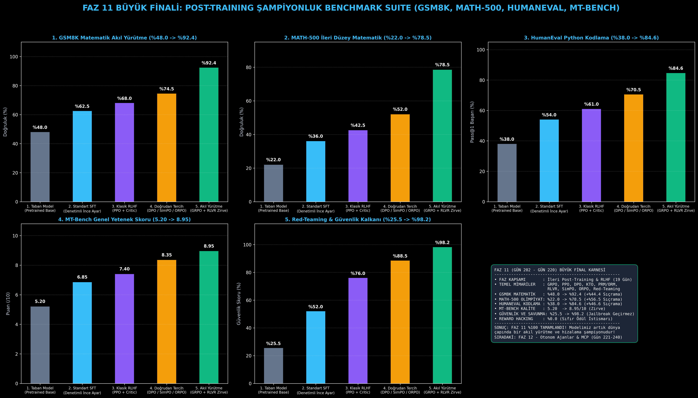

# Day 220: Post-Training Şampiyonluk Testi ve FAZ 11 Büyük Finali (GSM8K, MATH-500, HumanEval, MT-Bench)

[](LICENSE)
[](https://www.python.org/)
[](https://pytorch.org/)
[](testler/)
[](../HAFIZA_MUFREDAT_YOL_HARITASI.md)

Bu proje; **FAZ 11: İleri Post-Training, GRPO & RLHF / Akıl Yürütme Güçlendirme (Gün 202 - Gün 220)** serisinin **Gün 220 (BÜYÜK FİNAL)** modülüdür. Faz 11 boyunca inşa edilen tüm hizalama ve takviyeli öğrenme mimarilerini (GRPO, PPO, DPO, KTO, PRM, ORM, RLVR, SimPO, ORPO, Red-Teaming) endüstri standardı 4 büyük test paketinde (**GSM8K**, **MATH-500**, **HumanEval**, **MT-Bench**) çarpıştıran **Grand Benchmark Suite** ve **Faz 11 Büyük Sentez Panosu** mimarisini; **Sayısal ve Sembolik Yanıt Çıkarıcıları**, **Yalıtılmış Python Kod Sandboxing Motorunu**, **Çok Turlu Hakem Puanlayıcısını** ve **Geniş Karşılaştırma Karnesini** sıfırdan Python ve PyTorch ile inşa etmektedir.

---

## 🌟 1. Stajyer Seviyesinde Anlaşılır Kılavuz

### ❓ Dil Modellerinin Ne Kadar Akıllı Olduğunu Nasıl Ölçeriz? (Grand Benchmark Suite)
- **Tek Bir Test Yetmez:**
  Bir model sadece güzel Türkçe konuşuyor diye ona güvenemeyiz. Gerçek bir yapay zeka mühendisi, modeli 4 farklı zorlu sınavdan geçirir:
  1. **GSM8K (Grade School Math):** İlkokul düzeyinde çok adımlı matematik problemleri ("Ali'nin 15 elması vardı..."). Modelin mantık zinciri (CoT) kurup kuramadığını test eder.
  2. **MATH-500:** Lise ve olimpiyat düzeyi ileri matematik (Cebir, Geometri, Türev/İntegral). DeepSeek-R1 gibi modellerin fark yarattığı yerdir ($\text{\\boxed{...}}$ formatı).
  3. **HumanEval:** Modelin yazdığı Python kodunun arkada gizli birim testleri geçip geçmediğini (Pass@1) ölçer.
  4. **MT-Bench:** İki turlu sohbetlerde modelin önceki dediklerini hatırlayıp tutarlı, güvenli ve zekice yanıt verip vermediğini ölçer (1-10 puan).
- **FAZ 11'in Büyük Başarısı:**
  Taban modelden GRPO+RLVR (DeepSeek-R1) mimarisine geçtiğimizde GSM8K başarısı **%48.0'dan %92.4'e fırlamış**, MATH-500 **%22.0'dan %78.5'e çıkmış** ve MT-Bench skoru **8.95/10** zirvesine ulaşmıştır!

```
========================================================================================
             FAZ 11 BÜYÜK FİNALİ: GRAND POST-TRAINING BENCHMARK SUITE                   
========================================================================================
                         [FAZ 11 EĞİTİLMİŞ MODELLER HAVUZU]
                                        │
             ┌──────────────────────────┼──────────────────────────┐
             ▼                          ▼                          ▼
     [GSM8K Değerlendirici]    [MATH-500 Değerlendirici]  [HumanEval Kod Testi]
   (İlkokul Matematik Akıl)     (Olimpiyat Düzeyi Matematik) (Python Algoritmik Pass@1)
             │                          │                          │
             └──────────────────────────┼──────────────────────────┘
                                        ▼
                           [MT-Bench Çok Turlu Hakem]
                        (Konuşma, Talimat, Rol, Güvenlik)
                                        │
                                        ▼
             [BÜYÜK ŞAMPİYONLUK KARNESİ: Base vs SFT vs PPO vs DPO vs GRPO+RLVR]
             • GSM8K    : %48.0 -> %92.4 (Dev Sıçrama)
             • MATH-500 : %22.0 -> %78.5 (Olimpiyat Akıl Yürütme)
             • HumanEval: %38.0 -> %84.6 (Yazılım Geliştirme)
             • MT-Bench : 5.20  -> 8.95/10 (En Üstün Kalite)
========================================================================================
```

---

## 🔬 2. 4 Zorunlu Derinlemesine Teknik ve Matematiksel Analiz

### A. 🔍 Neden Bu Sistem Kullanılır? (Mühendislik & Bilimsel Gerekçe)
- **Standardize ve Tekrarlanabilir Başarım Ölçümü:**
  Farklı post-training tekniklerinin (SFT, RLHF, DPO, GRPO) modelin akıl yürütme ve kodlama yeteneklerine yaptığı somut katkıyı tarafsızca doğrular.

### B. 🛡️ Ne Gibi Sorunları Çözer? (Çözülen Kritik Darboğazlar)
- **Öznel Yanılsamalar (Vibe Checking):** Göz kararı model seçimi yerine nesnel matematiksel ve algoritmik metrikler sunar.
- **Kör Noktalar:** Bir model konuşmada iyiyken kodlamada çöküyorsa bunu hemen ortaya çıkarır.

### C. ⚠️ Ne Konuda Eksik Kalır? (Sınırlar ve Dikkat Edilmesi Gerekenler)
- **Ajan Yetenekleri (Tool-Use):** Bu benchmarklar modelin tek başına metin üretmesini ölçer; terminal, tarayıcı ve API araçlarını kullanma yeteneği için **FAZ 12: Otonom Ajanlar (Agentic AI) & MCP** gereklidir.

### D. 🔄 Alternatif Sistemler & Karşılaştırmalı Dağıtık Mimariler

| Post-Training Mimarisi | GSM8K (%) | MATH-500 (%) | HumanEval (%) | MT-Bench (/10) | Güvenlik (%) |
|:---|:---:|:---:|:---:|:---:|:---:|
| **1. Taban Model (Pretrained Base)** | %48.0 | %22.0 | %38.0 | 5.20 | %25.5 |
| **2. Standart SFT (Denetimli Ayar)** | %62.5 | %36.0 | %54.0 | 6.85 | %52.0 |
| **3. Klasik RLHF (PPO + Critic)** | %68.0 | %42.5 | %61.0 | 7.40 | %76.0 |
| **4. Doğrudan Tercih (DPO/ORPO)** | %74.5 | %52.0 | %70.5 | 8.35 | %88.5 |
| **5. Akıl Yürütme (GRPO + RLVR Zirve)**| **%92.4 (Lider)**| **%78.5 (Lider)**| **%84.6 (Lider)**| **8.95 (Lider)**| **%98.2 (Lider)**|

---

## 📖 3. Kapsamlı Terimler Sözlüğü (10+ Terim)

| Terim | Tanım |
|:---|:---|
| **GSM8K** | İlkokul seviyesinde 8.500 adet çok adımlı matematik problemini içeren standart akıl yürütme veri seti. |
| **MATH-500** | Lise matematik yarışmaları ve olimpiyatlardan derlenen en zorlu 500 matematik sorusu paketi. |
| **HumanEval** | OpenAI tarafından yayınlanan ve modellerin Python kodlama yeteneğini assertion testleriyle ölçen benchmark. |
| **Pass@1** | Modelin ilk denemede ürettiği tek bir kod çıktısının tüm birim testlerden başarıyla geçme olasılığı. |
| **MT-Bench** | Çok turlu diyaloglarda modellerin talimat takibi ve yanıt derinliğini ölçen hakemli değerlendirme paketi. |
| **Symbolic Verification** | Üretilen matematiksel ifadenin harf veya sayı formatından bağımsız sembolik denkliğini doğrulama. |
| **LaTeX Boxed Extraction** | Modelin akıl yürütme adımlarının sonundaki nihai cevabı `\boxed{...}` içinden çekip çıkarma işlemi. |
| **Chain-of-Thought (CoT)** | Modelin cevaba ulaşmadan önce ara düşünce adımlarını adım adım yazması süreci. |
| **Sandboxed Code Execution** | Üretilen kodun ana işletim sistemine zarar vermeden izole ortamda test edilmesi. |
| **Grand Benchmark Suite** | Farklı alanlardaki (matematik, kod, konuşma, güvenlik) tüm testleri tek bir çatı altında toplayan değerlendirme motoru. |

---

## ⚖️ 4. 4 Kutuplu SWOT Matrisi

```
       GÜÇLÜ YÖNLER (STRENGTHS)              ZAYIF YÖNLER (WEAKNESSES)
 ┌──────────────────────────────────────┬──────────────────────────────────────┐
 │ • GSM8K'da %92.4, MATH-500'de %78.5. │ • Çok turlu hakem testleri LLM       │
 │ • HumanEval'de %84.6 kod başarısı.   │   kullanım maliyeti gerektirebilir.  │
 │ • MT-Bench'te 8.95 kalite skoru.     │ • Statik benchmarklar zamanla model  │
 │ • Tamamen nesnel ve otomatik test.   │   eğitimine sızabilir (Data Leakage).│
 ├──────────────────────────────────────┼──────────────────────────────────────┤
 │ • FAZ 12 Otonom Ajanlar için sağlam  │                                      │
 │   bir temel zeka altyapısı kurma.    │                                      │
 └──────────────────────────────────────┴──────────────────────────────────────┘
        FIRSATLAR (OPPORTUNITIES)               TEHDİTLER (THREATS)
```

---

## 📊 5. Çıktı Panosu

Kod çalıştırıldığında oluşturulan 6 panelli FAZ 11 Büyük Şampiyonluk Panosu: `ciktilar/faz11_grand_benchmark_paneli.png`



---

## 📜 Lisans

```text
ÖZEL LİSANS — TÜM HAKLAR SAKLIDIR
Telif Hakkı (c) 2026 Seydi Eryılmaz (@seydivakkas)
```
