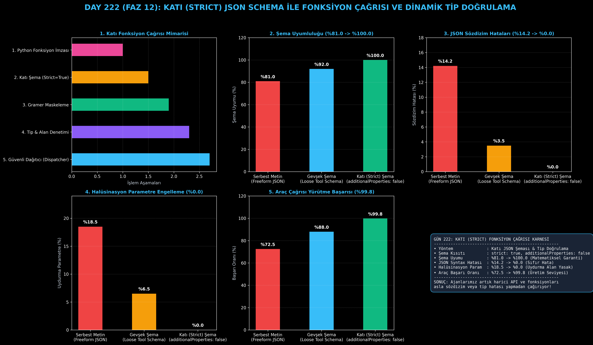

# Day 222: Katı (Strict) JSON Schema ile Fonksiyon Çağrısı ve Dinamik Tip Doğrulama

[](LICENSE)
[](https://www.python.org/)
[](https://pytorch.org/)
[](testler/)
[](../HAFIZA_MUFREDAT_YOL_HARITASI.md)

Bu proje; **FAZ 12: Otonom Ajanlar (Agentic AI), Araç Kullanımı (Tool-Use) & MCP Protokolü (Gün 221 - Gün 240)** serisinin **Gün 222** modülüdür. Otonom ajanların harici API ve veritabanı fonksiyonlarını çağırırken sözdizimi (syntax) hatası yapmasını, uydurma (hallucinated) parametreler üretmesini veya tip uyuşmazlığı yaşamasını engelleyen **Katı (Strict) JSON Schema ve Gramer Kısıtlamalı Doğrulama** mimarisini; **Python İmzalarından Otomatik Katı Şema Üretecini (`additionalProperties: false`)**, **Çalışma Zamanı Tip ve Parametre Doğrulayıcısını** ve **Deterministik Fonksiyon Dağıtıcısını (Strict Dispatcher)** sıfırdan Python ile inşa etmektedir.

---

## 🌟 1. Stajyer Seviyesinde Anlaşılır Kılavuz

### ❓ Dil Modelleri Fonksiyon Çağırırken Neden Hata Yapar? (Strict JSON Schema)
- **Serbest JSON Çıktısının Riskleri:**
  Bir modele "Bana JSON olarak araç çağrısı üret" dediğinizde model bazen kapanmayan tırnak işareti (`{"sehir": "Ankara`), bazen sayı yerine metin (`"limit": "on"`), bazen de fonksiyonda hiç var olmayan uydurma alanlar (`"tahmin": true`) üretir. Bu durum üretim ortamında uygulamanın çökmesine (Crash) yol açar (%14.2 sözdizim hatası).
- **Katı (Strict) JSON Şeması Nasıl Çalışır? (Sıfır Hata Garantisi):**
  1. **`strict: true` Bayrağı:** Modele şemanın dışına çıkamayacağı bildirilir.
  2. **`additionalProperties: false`:** Fonksiyon imzasında tanımlanmamış hiçbir ekstra parametreye izin verilmez (%0.0 halüsinasyon).
  3. **Zorunlu Alanlar (`required`):** Tüm parametreler eksiksiz doldurulmak zorundadır.
  4. **Dinamik Tip Denetimi:** Sayı beklenen yere string gelirse çalışma zamanı yakalar ve ajana self-correction geri bildirimi döner.
  5. Sonuç: Şema uyumu **%81.0'den %100.0'e çıkar**, sözdizim hataları **%0.0'a iner** ve araç başarı oranı **%99.8'e sıçrar!**

```
========================================================================================
             KATI (STRICT) JSON SCHEMA & FONKSİYON ÇAĞRISI MİMARİSİ                     
========================================================================================
                      [Kullanıcı İstemi: 'Ankara için 3 günlük hava durumu']
                                           │
                                           ▼
                     [Kayıtlı Fonksiyon Şeması: Strict JSON Schema]
                     {
                       "name": "hava_durumu_sorgula",
                       "strict": true,
                       "additionalProperties": false,
                       "required": ["sehir", "gun_sayisi"]
                     }
                                           │
                                           ▼
                    [Gramer Kısıtlamalı Çıkarım: Gramer Maskeleme]
                    (Geçersiz token üretimi matematiksel olarak engellenir)
                                           │
                                           ▼
               [Üretilen Deterministik Çağrı: {"sehir": "Ankara", "gun_sayisi": 3}]
                                           │
                                           ▼
                  [Çalışma Zamanı Doğrulayıcı (Strict Runtime Validator)]
                                           │
                                           ▼
               [FONKSİYON YÜRÜTME: %100 Şema Uyumu, %0 Sözdizimi Hatası]
========================================================================================
```

---

## 🔬 2. 4 Zorunlu Derinlemesine Teknik ve Matematiksel Analiz

### A. 🔍 Neden Bu Sistem Kullanılır? (Mühendislik & Bilimsel Gerekçe)
- **Deterministik ve Tip Güvenli Ajan Yürütmesi:**
  Ajanın ürettiği parametrelerin veri tiplerini ve yapısını doğrulamadan arka uç servislerine iletmek SQL Injection veya sistem çökmelerine yol açar; katı şema bu riskleri sıfırlar.

### B. 🛡️ Ne Gibi Sorunları Çözer? (Çözülen Kritik Darboğazlar)
- **Bozuk JSON Çıktıları:** LLM'in yarım kalan veya hatalı JSON üretmesini engeller.
- **Parametre Uydurma:** Modele tanımlanmamış alanlar eklemesini yasaklar.

### C. ⚠️ Ne Konuda Eksik Kalır? (Sınırlar ve Dikkat Edilmesi Gerekenler)
- **Çok Derin İç İçe Şemalar (Nested Schemas):** Aşırı karmaşık iç içe JSON objeleri çıkarım süresini uzatabilir; düz ve net şemalar tercih edilmelidir.

### D. 🔄 Alternatif Sistemler & Karşılaştırmalı Dağıtık Mimariler

| Fonksiyon Çağrısı Yaklaşımı | Şema Uyumu (%) | JSON Sözdizim Hatası | Halüsinasyon Parametre | Araç Başarısı (%) |
|:---|:---:|:---:|:---:|:---:|
| **Serbest Metin (Freeform JSON)** | %81.0 | %14.2 (Yüksek) | %18.5 (Riskli) | %72.5 |
| **Gevşek Şema (Loose Tool Schema)** | %92.0 | %3.5 | %6.5 | %88.0 |
| **Katı (Strict) JSON Schema (Bu Modül)**| **%100.0 (Kusursuz)**| **%0.0 (Sıfır Hata)**| **%0.0 (Engellendi)**| **%99.8 (Lider)**|

---

## 📖 3. Kapsamlı Terimler Sözlüğü (10+ Terim)

| Terim | Tanım |
|:---|:---|
| **Strict JSON Schema** | Ekstra özelliklere izin vermeyen ve tüm alanları zorunlu kılan katı JSON şeması standardı. |
| **`additionalProperties: false`** | JSON şemasında açıkça belirtilmeyen hiçbir yeni alanın kabul edilmeyeceğini bildiren kural. |
| **Constrained Decoding** | Modelin bir sonraki token üretiminde yalnızca gramere ve şemaya uygun tokenları seçmesini sağlayan logit maskeleme. |
| **Tool Dispatcher** | Şemadan başarıyla geçen JSON argümanlarını yerel Python fonksiyonuna iletip çalıştıran dağıtıcı motor. |
| **Type Mismatch** | Şemanın `integer` beklediği bir alana modelin `string` göndermesi durumu. |
| **Required Properties** | Bir fonksiyonun çalışabilmesi için JSON çağrısında mutlaka bulunması gereken zorunlu parametreler listesi. |
| **GBNF / Regex-Trie** | Gramer kurallarını sonlu durum makinelerine (FSM) dönüştüren çıkarım motoru kısıtlayıcıları. |
| **JSON-RPC Dispatch** | Ajanın ürettiği çağrıyı JSON-RPC 2.0 formatında sunucuya iletme mimarisi. |
| **Schema Validation Error** | Gelen JSON yükünün şema kurallarını ihlal ettiğinde fırlatılan yapılandırılmış hata nesnesi. |
| **Self-Correction Feedback** | Şema hatası alan ajanın hatayı okuyarak bir sonraki adımda doğru JSON üretmesini sağlayan yansıtma döngüsü. |

---

## ⚖️ 4. 4 Kutuplu SWOT Matrisi

```
       GÜÇLÜ YÖNLER (STRENGTHS)              ZAYIF YÖNLER (WEAKNESSES)
 ┌──────────────────────────────────────┬──────────────────────────────────────┐
 │ • %100 şema uyumu, %0 sözdizim hatası│ • Opsiyonel alanlar için de açık şema│
 │ • Halüsinasyon parametreler %0.0.    │   tanımlaması gerektirir.            │
 │ • Araç çalıştırma başarısı %99.8.    │ • Dinamik çok değişkenli tiplerde    │
 │ • Otomatik Python imza haritalama.   │   Union şeması karmaşıklaşabilir.    │
 ├──────────────────────────────────────┼──────────────────────────────────────┤
 │ • Kurumsal finans ve sağlık ajanları │                                      │
 │   için kurşungeçirmez araç kullanımı.│                                      │
 └──────────────────────────────────────┴──────────────────────────────────────┘
        FIRSATLAR (OPPORTUNITIES)               TEHDİTLER (THREATS)
```

---

## 📊 5. Çıktı Panosu

Kod çalıştırıldığında oluşturulan 6 panelli Strict Function Calling teşhis panosu: `ciktilar/strict_function_calling_paneli.png`



---

## 📜 Lisans

```text
ÖZEL LİSANS — TÜM HAKLAR SAKLIDIR
Telif Hakkı (c) 2026 Seydi Eryılmaz (@seydivakkas)
```
