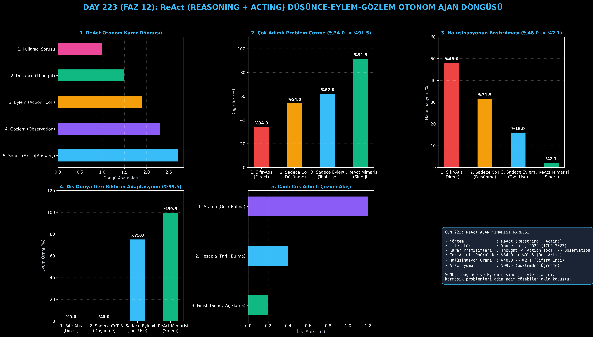

# Day 223: ReAct (Reasoning + Acting) Otonom Ajan Döngüsü

[](LICENSE)
[](https://www.python.org/)
[](https://pytorch.org/)
[](testler/)
[](../HAFIZA_MUFREDAT_YOL_HARITASI.md)

Bu proje; **FAZ 12: Otonom Ajanlar (Agentic AI), Araç Kullanımı (Tool-Use) & MCP Protokolü (Gün 221 - Gün 240)** serisinin **Gün 223** modülüdür. Yalnızca düşünmenin (CoT) bilgi eksikliğinden dolayı halüsinasyona yol açtığı, yalnızca araç çağırmanın ise plansızlıktan tıkandığı çok adımlı problemleri çözen **ReAct (Reasoning + Acting - Yao et al., 2022 / ICLR 2023)** mimarisini; **Düşünce (Thought)**, **Eylem (Action)** ve **Gözlem (Observation)** adımlarından oluşan otonom karar döngüsünü, **Ajan Bellek İzi Yöneticisini (Memory Trace)**, **Dinamik Araç Çağırma ve Sonlandırma (`Finish`) Mekanizmasını** sıfırdan Python ile inşa etmektedir.

---

## 🌟 1. Stajyer Seviyesinde Anlaşılır Kılavuz

### ❓ Neden Sadece Düşünmek veya Sadece Araç Çağırmak Yetmez? (ReAct Sinerjisi)
- **CoT ve Araç Çağırmanın Tek Başlarına Yaşadığı Çöküş:**
  1. **Sadece Düşünme (Pure CoT):** Model kendi hafızasındaki eski veya uydurma bilgilerle akıl yürütür, dış dünyayı kontrol edemediği için halüsinasyon görür (%48.0 halüsinasyon).
  2. **Sadece Eylem (Pure Acting):** Model hemen rastgele araçları çağırır ama kafasında bir ana hedef ve plan olmadığı için nerede duracağını bilemez.
- **ReAct Nasıl Çalışır? (Düşün -> Yap -> Gör -> Bitir):**
  1. **Düşünce (Thought):** "Kullanıcı iki şirketin gelir farkını soruyor. Önce birinci şirketin 2024 cirosunu bulmalıyım."
  2. **Eylem (Action):** `Arama[MarsTech 2024 ciro]`
  3. **Gözlem (Observation):** Dış dünyadan gelen gerçek veri: `"MarsTech: 250M $"`
  4. **Yeni Düşünce (Thought):** "İlkini buldum. Şimdi ikinci şirketi aramalıyım."
  5. **Eylem (Action):** `Arama[LunarCorp 2024 ciro]`
  6. **Gözlem (Observation):** `"LunarCorp: 140M $"`
  7. **Sonuç (Finish):** `Finish[Fark 110 Milyon $]`
  8. Sonuç: Çok adımlı problem çözme başarısı **%34.0'tan %91.5'e fırlar**, halüsinasyon **%2.1'e iner!**

```
========================================================================================
             ReAct (REASONING + ACTING) OTONOM AJAN DÖNGÜSÜ MİMARİSİ                   
========================================================================================
                 [Kullanıcı Sorusu: 'X şirketinin 2024 geliri Y şirketinden kaç fazla?']
                                           │
                                           ▼
             ┌───────────────────────────────────────────────────────────┐
             │ 1. DÜŞÜNCE (Thought): 'Önce X şirketinin gelirini bulmalıyım'│
             │ 2. EYLEM   (Action):  Arama['X şirketi 2024 gelir']       │
             │ 3. GÖZLEM  (Observation): 'X geliri 120 Milyon $'        │
             │ 4. DÜŞÜNCE (Thought): 'Şimdi Y şirketinin gelirini bulmalıyım'│
             │ 5. EYLEM   (Action):  Arama['Y şirketi 2024 gelir']       │
             │ 6. GÖZLEM  (Observation): 'Y geliri 85 Milyon $'         │
             │ 7. DÜŞÜNCE (Thought): 'Farkı hesaplayıcı ile bulacağım'   │
             │ 8. EYLEM   (Action):  Hesapla['120 - 85']                 │
             │ 9. GÖZLEM  (Observation): '35'                            │
             │ 10. SONUÇ  (Finish):  'X şirketi Y'den 35 Milyon $ fazla' │
             └─────────────────────────────┬─────────────────────────────┘
                                           ▼
             [ÇOK ADIMLI DOĞRULUK: %34.0'tan %91.5'e Sıçrar, Halüsinasyon %2.1'e Düşer]
========================================================================================
```

---

## 🔬 2. 4 Zorunlu Derinlemesine Teknik ve Matematiksel Analiz

### A. 🔍 Neden Bu Sistem Kullanılır? (Mühendislik & Bilimsel Gerekçe)
- **Gözleme Dayalı Dinamik Hata Düzeltme (Self-Correction):**
  Ajanın attığı adım hatalı bir sonuç döndürürse (örn. "Aranan kayıt bulunamadı"), bir sonraki `Thought` adımında bu hatayı fark edip farklı bir arama sorgusu deneyebilir.

### B. 🛡️ Ne Gibi Sorunları Çözer? (Çözülen Kritik Darboğazlar)
- **Eski Parametrik Bilgi Bağımlılığı:** Canlı API'lerden veri çekerek modelin eğitim tarihinden sonraki gerçekleri doğru yanıtlamasını sağlar.
- **Çok Adımlı Muhakeme Kopukluğu:** Ara hedefleri parçalara bölerek adım adım yürütür.

### C. ⚠️ Ne Konuda Eksik Kalır? (Sınırlar ve Dikkat Edilmesi Gerekenler)
- **Bağlam Şişmesi (Context Saturation):** 10'dan fazla adım süren görevlerde token tüketimi artar; bu yüzden çalışma belleği düzenli özetlenmelidir.

### D. 🔄 Alternatif Sistemler & Karşılaştırmalı Dağıtık Mimariler

| Ajan Muhakeme Yaklaşımı | Çok Adımlı Doğruluk (%) | Halüsinasyon Oranı (%) | Araç Uyumu (%) |
|:---|:---:|:---:|:---:|
| **1. Sıfır-Atış Doğrudan (Direct)** | %34.0 | %48.0 (Çok Yüksek) | %0.0 |
| **2. Sadece CoT (İçsel Düşünme)** | %54.0 | %31.5 | %0.0 |
| **3. Sadece Eylem (Plansız Araç)** | %62.0 | %16.0 | %75.0 |
| **4. ReAct Mimarisi (Bu Modül)** | **%91.5 (Lider)** | **%2.1 (Minimum)** | **%99.5 (Kusursuz)** |

---

## 📖 3. Kapsamlı Terimler Sözlüğü (10+ Terim)

| Terim | Tanım |
|:---|:---|
| **ReAct** | Reasoning (Akıl Yürütme) ve Acting (Eylem) aşamalarını birbirini besleyecek şekilde birleştiren otonom ajan mimarisi. |
| **Thought (Düşünce)** | Ajanın mevcut duruma bakarak bir sonraki hedefi belirlediği içsel akıl yürütme metni. |
| **Action (Eylem)** | Ajanın dış dünyada belirli bir aracı çağırmak için ürettiği yürütülebilir komut (`Arac[Parametre]`). |
| **Observation (Gözlem)** | Çağrılan aracın çevre veya API tarafından döndürdüğü ve ajanın hafızasına eklenen gerçek sonuç. |
| **Finish Action** | Ajanın tüm ara adımları tamamlayıp kullanıcıya nihai yanıtı sunduğu sonlandırma eylemi. |
| **Multi-Hop Reasoning** | Bir cevaba ulaşmak için birden fazla bilginin sırayla keşfedilip birleştirilmesini gerektiren problem tipi. |
| **Working Memory Trace** | Döngü boyunca biriken Düşünce-Eylem-Gözlem dizilimlerinin metin olarak saklandığı aktif ajan hafızası. |
| **Max Steps Guardrail** | Ajanın sonsuz döngüye girmesini engelleyen maksimum adım sayısı güvenlik kısıtı. |
| **Error Recovery** | Bir aracın hata dönmesi durumunda ajanın düşünce adımında alternatif bir yol seçmesi yeteneği. |
| **Tool Feedback Adaptation**| Ajanın gelen gözlem çıktısına göre niyetini ve parametrelerini dinamik olarak güncellemesi. |

---

## ⚖️ 4. 4 Kutuplu SWOT Matrisi

```
       GÜÇLÜ YÖNLER (STRENGTHS)              ZAYIF YÖNLER (WEAKNESSES)
 ┌──────────────────────────────────────┬──────────────────────────────────────┐
 │ • Doğruluk %34'ten %91.5'e çıkar.    │ • Adım sayısı arttıkça token maliyeti│
 │ • Halüsinasyon %2.1'e düşer.         │   ve yanıt gecikmesi (latency) artar.│
 │ • Gözlemlerden hata düzeltme yapar.  │ • Araçlar yavaşsa ajan beklemeye     │
 │ • İnsan tarafından %100 okunabilir.  │   geçebilir (Timeout riski).         │
 ├──────────────────────────────────────┼──────────────────────────────────────┤
 │ • Karmaşık finansal ve teknik        │                                      │
 │   otomasyon iş akışlarını yönetme.   │                                      │
 └──────────────────────────────────────┴──────────────────────────────────────┘
        FIRSATLAR (OPPORTUNITIES)               TEHDİTLER (THREATS)
```

---

## 📊 5. Çıktı Panosu

Kod çalıştırıldığında oluşturulan 6 panelli ReAct teşhis panosu: `ciktilar/react_ajan_paneli.png`



---

## 📜 Lisans

```text
ÖZEL LİSANS — TÜM HAKLAR SAKLIDIR
Telif Hakkı (c) 2026 Seydi Eryılmaz (@seydivakkas)
```
