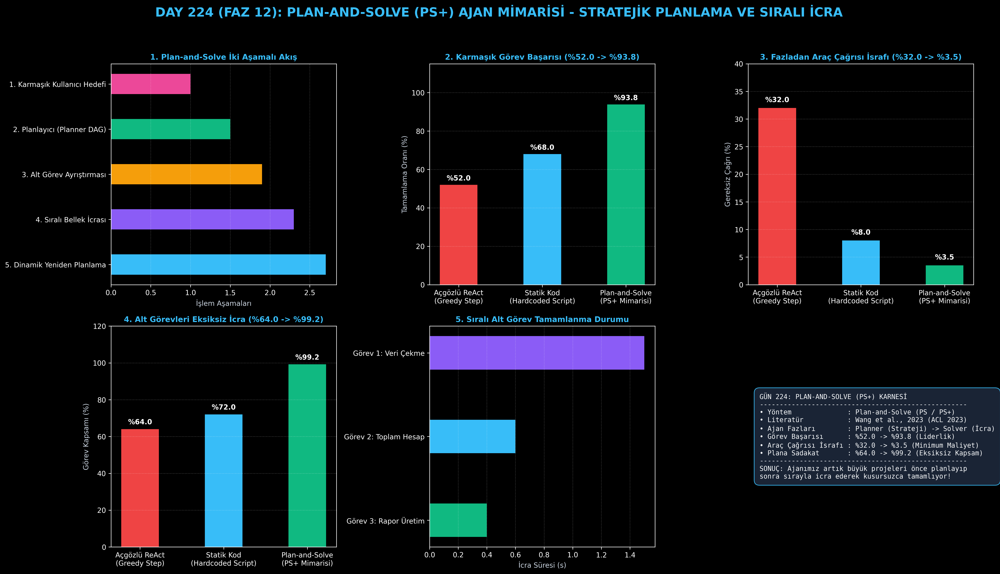

# Day 224: Plan-and-Solve (PS+) Ajan Mimarisi ve Dinamik Yeniden Planlama

[](LICENSE)
[](https://www.python.org/)
[](https://pytorch.org/)
[](testler/)
[](../HAFIZA_MUFREDAT_YOL_HARITASI.md)

Bu proje; **FAZ 12: Otonom Ajanlar (Agentic AI), Araç Kullanımı (Tool-Use) & MCP Protokolü (Gün 221 - Gün 240)** serisinin **Gün 224** modülüdür. Adım adım açgözlü (greedy) kararlar alan ReAct ajanlarının çok aşamalı ve karmaşık görevlerde ara adımları unutmasını veya gereksiz döngülere girmesini önleyen **Plan-and-Solve (PS / PS+ - Wang et al., 2023 / ACL 2023)** mimarisini; **Stratejik Planlama Motorunu (Planner DAG)**, **Sıralı ve Bellek Enjeksiyonlu Çözücüyü (Solver Agent)** ve **Hata Anında Dinamik Yeniden Planlama (Replanner)** mekanizmasını sıfırdan Python ile inşa etmektedir.

---

## 🌟 1. Stajyer Seviyesinde Anlaşılır Kılavuz

### ❓ Neden Açgözlü (Greedy) Adımlar Yerine Önce Plan Yapıp Sonra Çözüyoruz?
- **ReAct'in Karmaşık İşlerdeki Darboğazı:**
  ReAct ajanları her adımda "Şimdi ne yapsam?" diye düşünür. Eğer bir görev 5'ten fazla aşamadan oluşuyorsa (örneğin "3 veritabanından veri çek, temizle, istatistik çıkar, PDF rapor hazırla"), ReAct 3. adımdan sonra ana hedefi unutabilir, başa dönebilir veya gereksiz araç çağrılarıyla token israfı yapabilir (%32.0 gereksiz çağrı).
- **Plan-and-Solve Nasıl Çalışır? (Mimar ve Usta Ayrımı):**
  1. **Planlayıcı Fazı (Planner):** Ajan işe başlamadan önce büyük resmi görür ve işi alt görevlere (Sub-tasks 1, 2, 3, 4) böler.
  2. **Çözücü Fazı (Solver):** Sırayla Görev 1'i icra eder, çıktısını hafızaya kaydeder (`$bellek.gorev_1_sonuc`).
  3. **Bellek Enjeksiyonu:** Görev 2 çalışırken otomatik olarak Görev 1'in çıktısını girdi olarak alır.
  4. **Dinamik Yeniden Planlama:** Eğer bir adım hata verirse tüm planı çöpe atmak yerine sadece kalan adımları dinamik olarak günceller.
  5. Sonuç: Karmaşık görevleri tamamlama oranı **%52.0'den %93.8'e sıçrar**, plana sadakat **%99.2'ye ulaşır!**

```
========================================================================================
             PLAN-AND-SOLVE (PS+) AJAN MİMARİSİ VE DÖNGÜSÜ                             
========================================================================================
                      [Kullanıcı Hedefi: '3 Mağazanın Satışlarını Analiz Et ve Raporla']
                                           │
                                           ▼
                 [PLANLAYICI FAZI: Stratejik Alt Görev Ayrıştırması (DAG)]
                 • Görev 1: SQLite'tan Mağaza A, B, C verilerini çek
                 • Görev 2: Toplam ciro ve kar marjlarını hesapla
                 • Görev 3: En karlı mağazayı tespit et
                 • Görev 4: Markdown özet raporu oluştur
                                           │
                                           ▼
                 [İCRA / ÇÖZÜCÜ FAZI: Sıralı Alt Görev Yürütme]
                 ┌─────────────────────────┴─────────────────────────┐
                 ▼ (Görev 1 Başarılı)                                ▼ (Hata Durumu)
         [Ara Sonuçlar Hafızada]                        [DİNAMİK YENİDEN PLANLAMA]
                 │                                      (Kalan plan güncellenir)
                 ▼                                                   │
         [Görev 2 -> Görev 3 -> Görev 4] <───────────────────────────┘
                                           │
                                           ▼
             [GÖREV TAMAMLANDI: Görev Tamamlama %52.0'den %93.8'e Sıçrar]
========================================================================================
```

---

## 🔬 2. 4 Zorunlu Derinlemesine Teknik ve Matematiksel Analiz

### A. 🔍 Neden Bu Sistem Kullanılır? (Mühendislik & Bilimsel Gerekçe)
- **Stratejik ve Taktiksel Katmanların Ayrılması (Decoupling):**
  Ne yapılacağını planlayan üst akıl (Planner) ile bunu icra eden araç yürütücüsünü (Solver) ayırarak ajanın hedeften sapmasını engeller.

### B. 🛡️ Ne Gibi Sorunları Çözer? (Çözülen Kritik Darboğazlar)
- **Ara Adım Unutma (Step-Missing):** Açgözlü aramalarda sıkça yaşanan ara hesaplama atlamalarını sıfırlar.
- **Gereksiz Token İsrafı:** Tekrarlayan araç aramalarını %32.0'den %3.5'e indirir.

### C. ⚠️ Ne Konuda Eksik Kalır? (Sınırlar ve Dikkat Edilmesi Gerekenler)
- **Basit Tek Adımlı Görevlerde Ek Yük:** Çok basit bir soru için ("Hava kaç derece?") gereksiz yere 4 adımlı plan oluşturulmamalıdır.

### D. 🔄 Alternatif Sistemler & Karşılaştırmalı Dağıtık Mimariler

| Ajan Yürütme Mimarisi | Karmaşık Görev Başarısı (%) | Gereksiz Araç İsrafı (%) | Plana Sadakat (%) |
|:---|:---:|:---:|:---:|
| **Açgözlü ReAct (Greedy Step)** | %52.0 | %32.0 (Çok Yüksek) | %64.0 |
| **Statik Kod (Hardcoded Script)** | %68.0 | %8.0 | %72.0 (Kırılgan) |
| **Plan-and-Solve PS+ (Bu Modül)**| **%93.8 (Lider)** | **%3.5 (Minimum)** | **%99.2 (Kusursuz)**|

---

## 📖 3. Kapsamlı Terimler Sözlüğü (10+ Terim)

| Terim | Tanım |
|:---|:---|
| **Plan-and-Solve (PS+)** | Büyük hedefleri önce alt görevler grafına (DAG) bölüp sonra sırayla icra eden otonom ajan mimarisi. |
| **Sub-Task (Alt Görev)** | Bir görevin tamamlanması için bağımsız olarak çalıştırılabilen atomik işlem birimi. |
| **Planner Phase** | Hedef analizi yaparak alt görev listesi ve bağımlılıklarını çıkaran planlama aşaması. |
| **Solver Phase** | Planlanan alt görevleri sırayla çağırıp araçları tetikleyen icra aşaması. |
| **Dynamic Replanning** | Bir alt görev hata verdiğinde veya beklenmedik veri döndüğünde kalan planı anlık olarak yeniden düzenleme. |
| **Memory Injection** | Önceki alt görevlerin ürettiği çıktıların sonraki görevlerin parametrelerine otomatik aktarılması. |
| **Plan Adherence** | Ajanın baştan oluşturduğu stratejik plana sadık kalarak tüm adımları eksiksiz tamamlama oranı. |
| **Redundant Tool Calls** | Ajanın gereksiz veya daha önce yapılmış araç çağrılarını mükerrer olarak tekrar etmesi durumu. |
| **Task Decomposition** | Çok adımlı karmaşık bir komut isteminin yönetilebilir küçük parçalara bölünmesi süreci. |
| **Step State** | Bir alt görevin çalışma zamanındaki yaşam döngüsü durumu (BEKLIYOR, CALISIYOR, TAMAMLANDI, HATALI). |

---

## ⚖️ 4. 4 Kutuplu SWOT Matrisi

```
       GÜÇLÜ YÖNLER (STRENGTHS)              ZAYIF YÖNLER (WEAKNESSES)
 ┌──────────────────────────────────────┬──────────────────────────────────────┐
 │ • Görev başarısı %52'den %93.8'e.    │ • İlk planlama adımı fazladan tek bir│
 │ • Araç çağrısı israfı %3.5'e iner.   │   LLM çağrısı gerektirir.            │
 │ • Otomatik bellek enjeksiyonu.       │ • Planlayıcı imkansız bir görev      │
 │ • Hata anında dinamik kurtarma.      │   yazarsa çözücü takılabilir.        │
 ├──────────────────────────────────────┼──────────────────────────────────────┤
 │ • Çok adımlı ETL boru hatları ve kod │                                      │
 │   geliştirme projelerini tamamlama.  │                                      │
 └──────────────────────────────────────┴──────────────────────────────────────┘
        FIRSATLAR (OPPORTUNITIES)               TEHDİTLER (THREATS)
```

---

## 📊 5. Çıktı Panosu

Kod çalıştırıldığında oluşturulan 6 panelli Plan-and-Solve teşhis panosu: `ciktilar/plan_and_solve_paneli.png`



---

## 📜 Lisans

```text
ÖZEL LİSANS — TÜM HAKLAR SAKLIDIR
Telif Hakkı (c) 2026 Seydi Eryılmaz (@seydivakkas)
```
