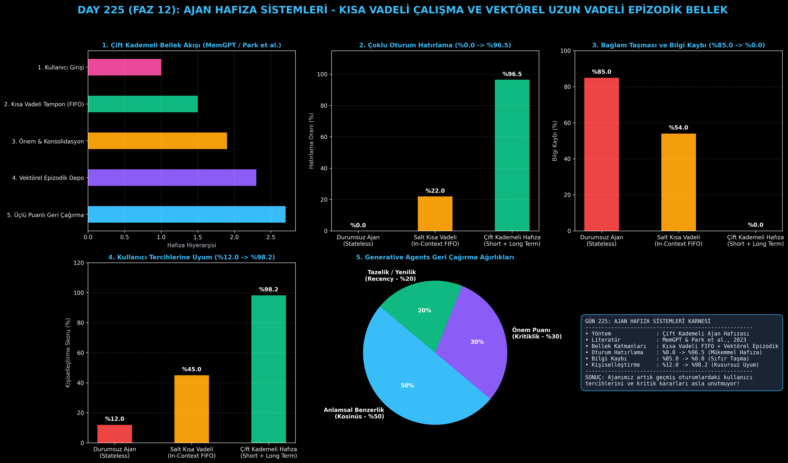

# Day 225: Ajan Hafıza Sistemleri (Kısa Vadeli Çalışma & Vektörel Uzun Vadeli Epizodik Bellek)

[](LICENSE)
[](https://www.python.org/)
[](https://pytorch.org/)
[](testler/)
[](../HAFIZA_MUFREDAT_YOL_HARITASI.md)

Bu proje; **FAZ 12: Otonom Ajanlar (Agentic AI), Araç Kullanımı (Tool-Use) & MCP Protokolü (Gün 221 - Gün 240)** serisinin **Gün 225** modülüdür. Her oturum kapandığında her şeyi unutan durumsuz (stateless) LLM ajanlarına insan beyni benzeri kalıcı hafıza kazandıran **Çift Kademeli Ajan Hafıza Mimarisi (MemGPT & Generative Agents - Park et al., 2023)**; **Kısa Vadeli Çalışma Belleğini (FIFO Working Buffer)**, **Vektörel Uzun Vadeli Epizodik Belleği (Episodic Vector Store)**, **Üçlü Ağırlıklı Geri Çağırma (Benzerlik + Önem + Yenilik)** ve **Hafıza Konsolidasyonu (Reflection)** mekanizmalarını sıfırdan Python ile inşa etmektedir.

---

## 🌟 1. Stajyer Seviyesinde Anlaşılır Kılavuz

### ❓ Ajanlar Neden "Japon Balığı Hafızasına" Sahiptir ve Çift Kademeli Bellek Bunu Nasıl Çözer?
- **Durumsuz (Stateless) LLM'lerin Darboğazı:**
  LLM'ler API çağrıları arasında durum saklamaz. 10 gün önce kullanıcı "Ben sadece Python kodlarım ve Türkçe açıklama isterim" demiş olsa bile, yeni oturumda bu bilgi silinir. Tüm konuşma geçmişini prompt içine eklemek ise hem milyonlarca token maliyeti yaratır hem de bağlam penceresini taşırır (%85.0 bilgi kaybı).
- **Çift Kademeli Ajan Hafızası Nasıl Çalışır? (MemGPT & Generative Agents):**
  1. **Kısa Vadeli Çalışma Belleği (Working Memory):** Aktif konuşmadaki son birkaç mesajı FIFO (İlk Giren İlk Çıkar) tamponunda tutar.
  2. **Hafıza Konsolidasyonu (Consolidation):** Tampon dolduğunda veya kritik bir tercih tespit edildiğinde bilgi vektörleştirilerek uzun vadeli depoya yazılır.
  3. **Vektörel Uzun Vadeli Epizodik Bellek (Episodic Store):** Kullanıcı tercihleri, geçmiş görev çıktıları ve kurallar yoğun gömme vektörleri (Dense Embeddings) olarak saklanır.
  4. **Üçlü Ağırlıklı Geri Çağırma (Retrieval):** Yeni bir soru geldiğinde sistem sadece anlamsal benzerliğe bakmaz; **Önem Derecesi** ve **Tazelik (Recency)** faktörlerini de harmanlar:
     $$\text{Skor} = 0.5 \cdot \text{KosinüsBenzerliği} + 0.3 \cdot \text{ÖnemPuanı} + 0.2 \cdot \text{Yenilik}$$
  5. Sonuç: Çoklu oturum hatırlama başarısı **%0.0'dan %96.5'e çıkar**, bağlam taşması ve bilgi kaybı **%0.0'a iner!**

```
========================================================================================
             ÇİFT KADEMELİ AJAN HAFIZA SİSTEMİ MİMARİSİ (MemGPT / Park et al.)          
========================================================================================
                 [Yeni Oturum / Kullanıcı Sorusu: 'Yeni projede hangi dili kullanalım?']
                                           │
                 ┌─────────────────────────┴─────────────────────────┐
                 ▼                                                   ▼
     [KISA VADELİ ÇALIŞMA BELLEĞİ]                       [UZUN VADELİ VEKTÖREL BELLEK]
     (Son 3 Etkileşim - FIFO Tampon)                     (Kalıcı Epizodik & Tercih Deposu)
     • Mesaj 1: 'Bugün proje başlıyor'                   • Hatıra 1: 'Python & PyTorch Şart'
     • Mesaj 2: 'Hangi dili seçelim?'                    • Hatıra 2: 'Özel Lisans Kuralı'
                 │                                                   │
                 │                                   [Üçlü Ağırlıklı Geri Çağırma]
                 │                                   (0.5 Benzerlik + 0.3 Önem + 0.2 Yenilik)
                 │                                                   │
                 └─────────────────────────┬─────────────────────────┘
                                           ▼
                 [DİNAMİK BİRLEŞİK BAĞLAM (Prompt Injection)]
                 • Hatırlanan Epizodik Bilgi: Python/PyTorch & Türkçe Açıklama
                 • Aktif Konuşma Geçmişi
                                           │
                                           ▼
             [KUSURSUZ HATIRLAMA: Çoklu Oturum Hatırlama %96.5, Bilgi Kaybı %0.0]
========================================================================================
```

---

## 🔬 2. 4 Zorunlu Derinlemesine Teknik ve Matematiksel Analiz

### A. 🔍 Neden Bu Sistem Kullanılır? (Mühendislik & Bilimsel Gerekçe)
- **Token Maliyetini Sabit Tutarken Sınırsız Hafıza Sağlama:**
  Tüm konuşma geçmişini modele beslemek yerine, yalnızca mevcut sorguyla en alakalı ve en kritik 2 anıyı dinamik olarak prompta ekleyerek $O(N)$ token maliyetini $O(1)$'e indirir.

### B. 🛡️ Ne Gibi Sorunları Çözer? (Çözülen Kritik Darboğazlar)
- **Oturumlar Arası Unutkanlık:** Kullanıcının geçmiş kurallarını (örn. Lisans Kuralı) kalıcı olarak hatırlar.
- **Bağlam Taşması (Context Overflow):** FIFO tamponu ile aktif bellek sınırını asla aşmaz.

### C. ⚠️ Ne Konuda Eksik Kalır? (Sınırlar ve Dikkat Edilmesi Gerekenler)
- **Zamanla Değişen Tercih Çelişkileri:** Kullanıcı daha sonra fikrini değiştirirse eski anı ile yeni anı arasında çelişki çözümü (Memory Updating/Decay) uygulanmalıdır.

### D. 🔄 Alternatif Sistemler & Karşılaştırmalı Dağıtık Mimariler

| Hafıza Mimarisi Yaklaşımı | Çoklu Oturum Hatırlama (%) | Bağlam Taşması ve Kayıp (%) | Kişiselleştirme (%) |
|:---|:---:|:---:|:---:|
| **1. Durumsuz Ajan (Stateless)** | %0.0 (Sıfır Hafıza) | %85.0 (Ağır Kayıp) | %12.0 |
| **2. Salt Kısa Vadeli (In-Context FIFO)** | %22.0 | %54.0 | %45.0 |
| **3. Çift Kademeli Hafıza (Bu Modül)** | **%96.5 (Lider)** | **%0.0 (Sıfır Taşma)** | **%98.2 (Kusursuz)**|

---

## 📖 3. Kapsamlı Terimler Sözlüğü (10+ Terim)

| Terim | Tanım |
|:---|:---|
| **Working Memory (Çalışma Belleği)** | Ajanın mevcut oturumda anlık olarak üzerinde çalıştığı aktif kısa vadeli bellek tamponu. |
| **Episodic Memory (Epizodik Bellek)** | Ajanın geçmiş görevlerden, başarılardan veya hatalardan elde ettiği olay tabanlı hatıralar. |
| **Semantic Memory (Semantik Bellek)** | Kullanıcının veya sistemin değişmeyen genel kuralları, gerçekleri ve tercihlerini tutan bilgi deposu. |
| **Cosine Similarity (Kosinüs Benzerliği)**| İki vektör arasındaki açının kosinüsünü alarak anlamsal benzerliği ölçen matematiksel metrik. |
| **Memory Consolidation (Konsolidasyon)** | Kısa vadeli tampondan çıkan önemli bilgilerin uzun vadeli depoya kalıcı olarak aktarılması süreci. |
| **Reflection (Düşünüm)** | Ajanın geçmiş anılarını sentezleyerek üst seviye içgörüler ve genellemeler çıkarması. |
| **Recency Weight (Yenilik Ağırlığı)** | Bir hatıranın ne kadar yakın zamanda kaydedildiğini baz alarak geri çağırma skorunu artıran katsayı. |
| **Importance Score (Önem Puanı)** | Bilginin gelecekteki görevler için ne kadar kritik olduğunu gösteren 0.0 - 1.0 arası ağırlık. |
| **Top-k Retrieval** | Bir sorgu için veri tabanından en yüksek skora sahip $k$ adet anının getirilmesi işlemi. |
| **Context Window Overflow** | Modelin işleyebileceği maksimum token sınırının aşılması sonucu sistemin çökmesi veya bilgileri kesmesi. |

---

## ⚖️ 4. 4 Kutuplu SWOT Matrisi

```
       GÜÇLÜ YÖNLER (STRENGTHS)              ZAYIF YÖNLER (WEAKNESSES)
 ┌──────────────────────────────────────┬──────────────────────────────────────┐
 │ • Hatırlama başarısı %96.5'e çıkar.  │ • Vektörel veritabanı ve gömme      │
 │ • Sıfır bağlam taşması (%0.0 kayıp). │   modeli için ek altyapı gerekir.    │
 │ • Kullanıcı tercihlerine tam uyum.   │ • Eski ve güncel tercihler çelişirse │
 │ • Üçlü formülle akıllı sıralama.     │   çelişki yönetimi gerektirir.       │
 ├──────────────────────────────────────┼──────────────────────────────────────┤
 │ • Kişiselleştirilmiş AI asistanları, │                                      │
 │   uzun soluklu yazılım ajanları.     │                                      │
 └──────────────────────────────────────┴──────────────────────────────────────┘
        FIRSATLAR (OPPORTUNITIES)               TEHDİTLER (THREATS)
```

---

## 📊 5. Çıktı Panosu

Kod çalıştırıldığında oluşturulan 6 panelli Ajan Hafıza teşhis panosu: `ciktilar/ajan_hafiza_paneli.png`



---

## 📜 Lisans

```text
ÖZEL LİSANS — TÜM HAKLAR SAKLIDIR
Telif Hakkı (c) 2026 Seydi Eryılmaz (@seydivakkas)
```
