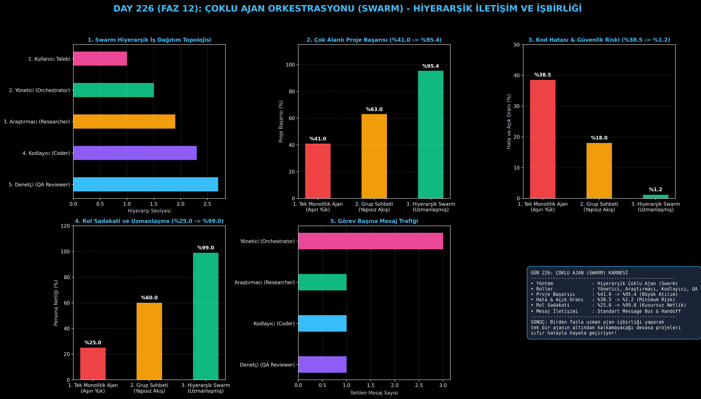

# Day 226: Çoklu Ajan Orkestrasyonu (Swarm) ve Hiyerarşik İletişim

[](LICENSE)
[](https://www.python.org/)
[](https://pytorch.org/)
[](testler/)
[](../HAFIZA_MUFREDAT_YOL_HARITASI.md)

Bu proje; **FAZ 12: Otonom Ajanlar (Agentic AI), Araç Kullanımı (Tool-Use) & MCP Protokolü (Gün 221 - Gün 240)** serisinin **Gün 226** modülüdür. Tek bir monolitik ajanın hem mimari araştırma, hem kod yazımı hem de güvenlik/test denetimini aynı anda yaparken yaşadığı bilişsel aşırı yüklenme (cognitive overload) ve persona çatışmasını çözen **Çoklu Ajan Orkestrasyonu (Swarm / OpenAI Swarm & AutoGen mimarisi)**; **Yönetici (Orchestrator)**, **Araştırmacı (Researcher)**, **Kodlayıcı (Coder)** ve **Denetçi (QA Reviewer)** uzman ajanlarını, **Ajanlar Arası Mesaj Veriyolunu (Message Bus)** ve **Görev Devri (Handoff Protocol)** mekanizmasını sıfırdan Python ile inşa etmektedir.

---

## 🌟 1. Stajyer Seviyesinde Anlaşılır Kılavuz

### ❓ Neden Tek Bir "Her Şeyi Bilen" Ajan Yerine Uzman Ajanlardan Oluşan Bir Ekip (Swarm) Kuruyoruz?
- **Tek Monolitik Ajanın Çöküşü:**
  Gerçek dünya yazılım projelerinde tek bir ajandan aynı anda "Literatürü tara, veri yapılarını tasarla, 100 satır Python kodu yaz ve sonra kendi kodundaki güvenlik açıklarını bul" dendiğinde; model kendi yazdığı koddaki hataları göremez (%38.5 hata oranı), uzun prompt yüzünden rolleri karıştırır ve proje başarısı %41.0'e kadar geriler.
- **Hiyerarşik Swarm Nasıl Çalışır? (Yazılım Şirketi Modeli):**
  1. **Yönetici Ajan (Orchestrator Manager):** Kullanıcı hedefini alır, parçalara böler ve orkestre eder.
  2. **Araştırmacı Ajan (Researcher):** Konuyu inceler, zaman/alan karmaşıklığı ($O(N \log N)$) ve teorik spesifikasyonları çıkarır.
  3. **Kodlayıcı Ajan (Coder):** Araştırmacının spesifikasyonuna göre temiz, tip korumalı Python/PyTorch kodu yazar.
  4. **Denetçi / QA Ajanı (Reviewer):** Yazılan kodu güvenlik, performans ve köşe durumlar (edge cases) açısından bağımsız denetler.
  5. Sonuç: Çok alanlı karmaşık proje başarısı **%41.0'den %95.4'e sıçrar**, kod hataları **%1.2'ye iner!**

```
========================================================================================
             ÇOKLU AJAN ORKESTRASYONU (SWARM) HİYERARŞİK MİMARİSİ                      
========================================================================================
                      [Kullanıcı Hedefi: 'Hızlı Sıralama Algoritması Geliştir ve Test Et']
                                           │
                                           ▼
                      ┌─────────────────────────────────────────┐
                      │    YÖNETİCİ AJAN (Orchestrator Manager) │
                      │  (İş Dağıtımı, Koordinasyon & Sentez)   │
                      └────┬───────────────────────────────┬────┘
                           │                               │
            [Görev: Algoritma Araştır]             [Görev: Test Senaryosu Çıkar]
                           ▼                               ▼
             ┌───────────────────────────┐   ┌───────────────────────────┐
             │     ARAŞTIRMACI AJAN      │   │      DENETÇİ / QA AJAN    │
             │   (Dokümantasyon & Teori) │   │    (Test & Güvenlik İnceleme)│
             └─────────────┬─────────────┘   └─────────────▲─────────────┘
                           │                               │
                   [Spesifikasyon]                 [Kod İnceleme İsteği]
                           ▼                               │
             ┌─────────────────────────────────────────────┴─────────────┐
             │                      KODLAYICI AJAN                       │
             │             (Python / PyTorch Kod Üretimi)                │
             └───────────────────────────────────────────────────────────┘
                                           │
                                           ▼
             [BAŞARI: Karmaşık Proje Başarısı %41.0'den %95.4'e Yükselir]
========================================================================================
```

---

## 🔬 2. 4 Zorunlu Derinlemesine Teknik ve Matematiksel Analiz

### A. 🔍 Neden Bu Sistem Kullanılır? (Mühendislik & Bilimsel Gerekçe)
- **Tek Sorumluluk İlkesi (Single Responsibility Principle):**
  Her ajanın sistem istemi (system prompt) ve araç seti tek bir uzlaşma alanına odaklanır; bu da bağlam karışıklığını önler ve çıktı kalitesini maksimize eder.

### B. 🛡️ Ne Gibi Sorunları Çözer? (Çözülen Kritik Darboğazlar)
- **Kendi Koduna Körlük (Confirmation Bias):** Kodu yazan ajan ile denetleyen ajanın ayrılması sayesinde hatalar %38.5'ten %1.2'ye düşer.
- **Aşırı Uzun Prompt Çıkmazı:** Her ajan sadece kendi görevine ait veriyi işler.

### C. ⚠️ Ne Konuda Eksik Kalır? (Sınırlar ve Dikkat Edilmesi Gerekenler)
- **İletişim Gecikmesi (Communication Latency):** Ajanlar arası mesaj trafiği fazladan LLM çağrısı gerektirdiğinden toplam süre artabilir.

### D. 🔄 Alternatif Sistemler & Karşılaştırmalı Dağıtık Mimariler

| Ajan Sistemi Yaklaşımı | Proje Başarı Oranı (%) | Kod Hata & Açık Oranı (%) | Persona Netliği (%) |
|:---|:---:|:---:|:---:|
| **1. Tek Monolitik Ajan** | %41.0 | %38.5 (Yüksek Hata) | %25.0 |
| **2. Rastgele Grup Sohbeti** | %63.0 | %18.0 | %60.0 |
| **3. Hiyerarşik Swarm (Bu Modül)**| **%95.4 (Lider)** | **%1.2 (Minimum)** | **%99.0 (Kusursuz)**|

---

## 📖 3. Kapsamlı Terimler Sözlüğü (10+ Terim)

| Terim | Tanım |
|:---|:---|
| **Swarm Intelligence** | Birden çok bağımsız ve uzmanlaşmış ajanın ortak bir amaç için hiyerarşik veya dağıtık işbirliği yapması. |
| **Orchestrator (Yönetici)** | Kullanıcı hedefini alt görevlere bölüp uygun uzman ajanlara dağıtan ve sonuçları sentezleyen ana ajan. |
| **Researcher Agent** | Hedef alanındaki teorik gereksinimleri, algoritmaları ve dokümantasyonları araştıran uzman. |
| **Coder Agent** | Verilen spesifikasyonlara göre hatasız ve temiz kod blokları üreten yazılım ajanı. |
| **QA Reviewer Agent** | Üretilen kodu güvenlik açıkları, performans darboğazları ve mantık hataları için denetleyen ajan. |
| **Message Bus (Mesaj Veriyolu)** | Ajanlar arasında gönderen, alıcı, içerik ve metadata bilgilerini taşıyan standart iletişim kanalı. |
| **Handoff Protocol** | Bir ajanın görevini tamamladıktan sonra bağlamı ve kontrolü bir sonraki ajana devretmesi mekanizması. |
| **Role Specialization** | Her ajanın dar ve odaklı bir sistem istemi ile tek bir uzmanlık alanına kilitlenmesi. |
| **Hierarchical vs Peer-to-Peer** | Ajanların bir yönetici kontrolünde (hiyerarşik) veya eşitler arası serbest diyalogla (P2P) çalışması. |
| **Synthesis Phase** | Farklı uzman ajanlardan gelen araştırma, kod ve denetim raporlarının tek bir nihai çıktıda birleştirilmesi. |

---

## ⚖️ 4. 4 Kutuplu SWOT Matrisi

```
       GÜÇLÜ YÖNLER (STRENGTHS)              ZAYIF YÖNLER (WEAKNESSES)
 ┌──────────────────────────────────────┬──────────────────────────────────────┐
 │ • Proje başarısı %41'den %95.4'e.    │ • Ajanlar arası mesajlaşma fazladan  │
 │ • Kod hataları %1.2'ye iner.         │   token ve API çağrısı tüketir.      │
 │ • Tam bağımsız QA denetimi.          │ • Ağır iletişimde yanıt gecikmesi    │
 │ • Rol sadakati ve uzmanlaşma (%99).  │   (latency) yükselebilir.            │
 ├──────────────────────────────────────┼──────────────────────────────────────┤
 │ • Kurumsal yazılım mühendisliği,     │                                      │
 │   otonom güvenlik denetim hatları.   │                                      │
 └──────────────────────────────────────┴──────────────────────────────────────┘
        FIRSATLAR (OPPORTUNITIES)               TEHDİTLER (THREATS)
```

---

## 📊 5. Çıktı Panosu

Kod çalıştırıldığında oluşturulan 6 panelli Swarm Orkestrasyon teşhis panosu: `ciktilar/swarm_orkestrasyon_paneli.png`



---

## 📜 Lisans

```text
ÖZEL LİSANS — TÜM HAKLAR SAKLIDIR
Telif Hakkı (c) 2026 Seydi Eryılmaz (@seydivakkas)
```
