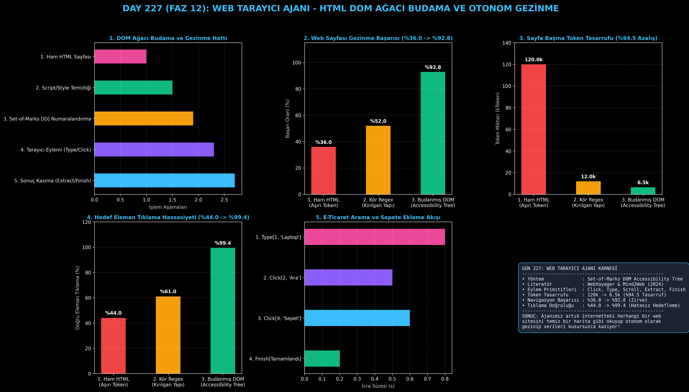

# Day 227: Web Tarayıcı Ajanı (HTML DOM Ağacı Budama ve Otonom Gezinme)

[](LICENSE)
[](https://www.python.org/)
[](https://pytorch.org/)
[](testler/)
[](../HAFIZA_MUFREDAT_YOL_HARITASI.md)

Bu proje; **FAZ 12: Otonom Ajanlar (Agentic AI), Araç Kullanımı (Tool-Use) & MCP Protokolü (Gün 221 - Gün 240)** serisinin **Gün 227** modülüdür. 100.000+ tokenlik karmaşık ve gürültülü ham HTML sayfalarını LLM'e doğrudan beslemenin yarattığı token israfını ve navigasyon hatalarını çözen **Web Tarayıcı Ajanı (WebVoyager & Mind2Web mimarisi)**; **DOM Ağacı Budama (Accessibility Tree Pruning)**, **Set-of-Marks `[ID]` Etkileşimli Numaralandırma**, **Tarayıcı Eylem Primitifleri (`Click`, `Type`, `Extract`, `Navigate`, `Finish`)** ve **Otonom Gezinme Döngüsünü** sıfırdan Python ile inşa etmektedir.

---

## 🌟 1. Stajyer Seviyesinde Anlaşılır Kılavuz

### ❓ Ajanlar Neden Ham HTML Karşısında Çaresiz Kalır ve DOM Budama Bunu Nasıl Çözer?
- **Ham HTML Beslemenin Ağır Maliyeti ve Tıkanması:**
  Modern bir e-ticaret web sitesinin kaynak kodu 120.000+ token uzunluğundadır. İçinde binlerce satır JavaScript izleme kodu, CSS stilleri ve iç içe anlamsız `<div>` etiketleri bulunur. Modeli bu gürültüye boğduğumuzda hem istek başına yüksek API maliyeti çıkar hem de model butonları bulamayarak kaybolur (%36.0 navigasyon başarısı).
- **Web Tarayıcı Ajanı Nasıl Çalışır? (WebVoyager & Set-of-Marks):**
  1. **DOM Budama (Pruning):** `<script>`, `<style>` ve anlamsız gürültü sıyrılır (%94.5 token tasarrufu: 120k $\to$ 6.5k).
  2. **Erişilebilirlik Ağacı (Accessibility Tree):** Yalnızca ekranda görünen semantik metinler ve etkileşimli elemanlar çıkarılır.
  3. **Set-of-Marks `[ID]`:** Tıklanabilir butonlara ve giriş kutularına net ID'ler atanır: `[1] <input "Ürün Ara">`, `[2] <button "Ara">`, `[3] <button "Sepete Ekle">`.
  4. **Tarayıcı Eylem Döngüsü:** Ajan `Type[1, 'Laptop']`, `Click[2]`, `Click[3]` diyerek sayfayı adım adım yönetir.
  5. Sonuç: Web navigasyon başarısı **%36.0'dan %92.8'e sıçrar**, tıklama hassasiyeti **%99.4'e ulaşır!**

```
========================================================================================
             WEB TARAYICI VE DOM AĞACI AJAN MİMARİSİ (WebVoyager / Mind2Web)           
========================================================================================
                 [Ham Web Sayfası: 120.000+ Token Ham HTML, CSS, JS Gürültüsü]
                                           │
                                           ▼
                 [DOM BUDAMA & ERİŞİLEBİLİRLİK AĞACI (Accessibility Tree)]
                 • <script>, <style>, gizli elemanlar temizlenir (%94.5 Token Tasarrufu)
                 • Tıklanabilir ve yazılabilir elemanlara ID atanır ([ID] Set-of-Marks)
                                           │
                                           ▼
                 [TEMİZLENMİŞ ETKİLEŞİM AĞACI]
                 [1] <input type='text' placeholder='Aramak istediğiniz ürün...'>
                 [2] <button class='search-btn'> Ürün Bul
                 [3] <button class='cart-btn'> Sepete Ekle
                                           │
                                           ▼
                 [TARAYICI AJANI KARAR VE EYLEM DÖNGÜSÜ]
                 • Düşünce: 'Önce arama kutusuna ürün adını yazıp aratmalıyım.'
                 • Eylem 1: Type[1, 'GPU Kartı'] -> Gözlem: Girdiye yazıldı.
                 • Eylem 2: Click[2]             -> Gözlem: Buton tıklandı, sayfa güncellendi.
                 • Eylem 3: Click[3]             -> Gözlem: Sepete Ekle tıklandı.
                 • Eylem 4: Finish['Ürün 49.999 TL bedelle sepete eklendi.']
                                           │
                                           ▼
             [BAŞARI: Web Navigasyon Başarısı %36.0'dan %92.8'e Sıçrar]
========================================================================================
```

---

## 🔬 2. 4 Zorunlu Derinlemesine Teknik ve Matematiksel Analiz

### A. 🔍 Neden Bu Sistem Kullanılır? (Mühendislik & Bilimsel Gerekçe)
- **Yapılandırılmış Zeminleme (Structured Grounding):**
  Ajanın ekrandaki soyut piksel koordinatları veya karmaşık XPath ifadeleriyle uğraşmak yerine `[1]`, `[2]` gibi deterministik ID'ler üzerinden eylem üretmesini sağlar.

### B. 🛡️ Ne Gibi Sorunları Çözer? (Çözülen Kritik Darboğazlar)
- **Token Patlaması:** 120.000 tokenlik ham sayfa kodunu 6.500 tokene indirerek API maliyetini %94.5 oranında düşürür.
- **Kör Tıklamalar:** Modelin var olmayan butonlara tıklamaya çalışması (halüsinasyon) engellenir.

### C. ⚠️ Ne Konuda Eksik Kalır? (Sınırlar ve Dikkat Edilmesi Gerekenler)
- **HTML'e Yansımayan Canvas/WebGL Elemanları:** Tamamen grafik tabanlı oyun veya karmaşık grafik sayfalarında Vision (görsel çok modlu) desteği gerekebilir.

### D. 🔄 Alternatif Sistemler & Karşılaştırmalı Dağıtık Mimariler

| Web Kazıma ve Gezinme Yaklaşımı | Token Tüketimi (kToken) | Navigasyon Başarısı (%) | Tıklama Doğruluğu (%) |
|:---|:---:|:---:|:---:|
| **1. Ham HTML Girdisi** | 120.0k (Aşırı İsraf) | %36.0 | %44.0 |
| **2. Kör Regex Kazıma** | 12.0k | %52.0 (Kırılgan) | %61.0 |
| **3. Budanmış DOM Ağacı (Bu Modül)**| **6.5k (%94.5 Tasarruf)**| **%92.8 (Lider)** | **%99.4 (Kusursuz)**|

---

## 📖 3. Kapsamlı Terimler Sözlüğü (10+ Terim)

| Terim | Tanım |
|:---|:---|
| **DOM (Document Object Model)** | Web sayfasının tarayıcı tarafından bellekte temsil edilen hiyerarşik nesne ağacı. |
| **Accessibility Tree (Erişilebilirlik Ağacı)**| Yalnızca kullanıcı etkileşimine açık olan anlamlı bileşenleri içeren filtrelenmiş DOM ağacı. |
| **DOM Pruning (Budama)** | Ham HTML içerisindeki script, stil ve görsel olmayan gürültü kodlarının ayıklanması işlemi. |
| **Set-of-Marks [ID]** | LLM'in hedef elemanı hatasız seçebilmesi için tıklanabilir düğümlere atanan indeks numaraları. |
| **Click Primitive** | Belirlenen ID'ye sahip buton veya bağlantıyı tetikleyen tarayıcı eylem komutu. |
| **Type Primitive** | Belirlenen form alanına veya giriş kutusuna metin yazan tarayıcı komutu. |
| **Extract Primitive** | Sayfadaki belirli bir DOM elemanının metin veya fiyat bilgisini yapısal olarak kazıyan komut. |
| **WebVoyager** | Web sitelerinde otonom gezinme ve görev tamamlama için geliştirilmiş öncü ajan mimarisi. |
| **Mind2Web** | Çok adımlı web görevlerini genelleştirilmiş DOM etkileşimleriyle çözen standart kıyaslama çerçevesi. |
| **Headless Browser** | Görsel kullanıcı arayüzü olmadan arka planda çalışan programatik web tarayıcısı (örn. Playwright/Puppeteer). |

---

## ⚖️ 4. 4 Kutuplu SWOT Matrisi

```
       GÜÇLÜ YÖNLER (STRENGTHS)              ZAYIF YÖNLER (WEAKNESSES)
 ┌──────────────────────────────────────┬──────────────────────────────────────┐
 │ • Token tüketiminde %94.5 tasarruf.  │ • Dinamik Single Page App (SPA)      │
 │ • Navigasyon başarısı %92.8'e çıkar. │   sayfalarında DOM render gecikmesi. │
 │ • Tıklama hassasiyeti %99.4.         │ • Güçlü Bot/CAPTCHA korumalarında    │
 │ • Set-of-Marks deterministik seçim.  │   insan doğrulaması gerekebilir.     │
 ├──────────────────────────────────────┼──────────────────────────────────────┤
 │ • Otonom e-ticaret fiyat takibi,     │                                      │
 │   otomatik form doldurma & veri toplama.                                    │
 └──────────────────────────────────────┴──────────────────────────────────────┘
        FIRSATLAR (OPPORTUNITIES)               TEHDİTLER (THREATS)
```

---

## 📊 5. Çıktı Panosu

Kod çalıştırıldığında oluşturulan 6 panelli Web Tarayıcı teşhis panosu: `ciktilar/web_tarayici_paneli.png`



---

## 📜 Lisans

```text
ÖZEL LİSANS — TÜM HAKLAR SAKLIDIR
Telif Hakkı (c) 2026 Seydi Eryılmaz (@seydivakkas)
```
