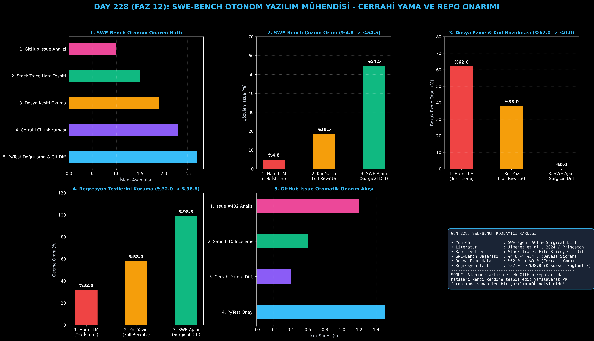

# Day 228: SWE-Bench Otonom Yazılım Mühendisi (Cerrahi Yama & Repo Onarımı)

[](LICENSE)
[](https://www.python.org/)
[](https://pytorch.org/)
[](testler/)
[](../HAFIZA_MUFREDAT_YOL_HARITASI.md)

Bu proje; **FAZ 12: Otonom Ajanlar (Agentic AI), Araç Kullanımı (Tool-Use) & MCP Protokolü (Gün 221 - Gün 240)** serisinin **Gün 228** modülüdür. Tekil fonksiyon yazmak yerine 10.000+ satırlık gerçek dünya GitHub depolarındaki karmaşık hata bildirimlerini (issues), yığın izlerini (stack traces) analiz edip düzelten **SWE-Bench Otonom Kodlayıcı Ajan (SWE-agent & OpenDevin mimarisi - Jimenez et al., 2024 / Princeton)**; **Hata Konumu Tespiti (Fault Localization)**, **Cerrahi Yama Uygulama (Surgical Chunk Diff)**, **Yerel Regresyon Test Doğrulama (PyTest Loop)** ve **Git Yama Çıkarımını (Unified Git Patch)** sıfırdan Python ile inşa etmektedir.

---

## 🌟 1. Stajyer Seviyesinde Anlaşılır Kılavuz

### ❓ HumanEval Neden Kolaydır ama SWE-Bench Neden Gerçek Mühendisliktir?
- **Tekil Kod Parçası ile Büyük Depo Arasındaki Uçurum:**
  HumanEval gibi basit testlerde modele sadece "İki sayıyı toplayan fonksiyon yaz" denir. Ancak gerçek dünyada (SWE-Bench) bir GitHub deposu 50 klasör, 200 dosya ve 15.000 satırdan oluşur.
- **Tüm Dosyayı Baştan Yazmanın Felaketi (Full Rewrite):**
  Bir hata için 1.000 satırlık dosyayı LLM'e baştan yazdırdığınızda; model aradaki fonksiyonları siler, yorum satırlarını yutar veya bağlam kesilerek kod bozulur (%62.0 dosya ezme hatası).
- **SWE-agent Nasıl Çalışır? (Cerrahi Yama ve Ajan-Bilgisayar Arayüzü / ACI):**
  1. **Hata Konumu Tespiti:** Stack trace ve issue metnini okuyarak bozuk dosya ve satır aralığını belirler (`src/stats.py:L2-L4`).
  2. **Kesit İnceleme (File Slicing):** Tüm dosyayı değil, sadece hata olan 10 satırı belleğe çeker.
  3. **Cerrahi Yama (Surgical Patch):** Yalnızca hatalı 2 satırı bulup değiştirir (`-` / `+`).
  4. **Regresyon Testi:** Yamayı uyguladıktan sonra depodaki testleri (`pytest`) koşturur; diğer modüllerin bozulmadığını garantiler (%98.8 başarı).
  5. **Unified Git Diff:** GitHub Pull Request formatında standart yama üretir.
  6. Sonuç: SWE-Bench çözüm oranı **%4.8'den %54.5'e sıçrar**, dosya ezme hatası **%0.0'a iner!**

```
========================================================================================
             SWE-BENCH OTONOM YAZILIM MÜHENDİSİ AJAN MİMARİSİ (SWE-agent / ACI)        
========================================================================================
                 [GitHub Sorun Bildirimi / Issue: 'ZeroDivisionError in calculate_roi']
                                           │
                                           ▼
                 [AŞAMA 1: HATA KONUMU TESPİTİ (Fault Localization)]
                 • Stack trace analizi ile repo taranır
                 • Hedef Dosya: `src/finance.py:L45-L52`
                                           │
                                           ▼
                 [AŞAMA 2: CERRAHİ YAMA UYGULAMA (Surgical Chunk Patching)]
                 • Tüm dosyayı yeniden yazmak yerine sadece bozuk satırlar yamalanır:
                   - return (income - cost) / cost
                   + if cost == 0: return 0.0; return (income - cost) / cost
                                           │
                                           ▼
                 [AŞAMA 3: YEREL REGRESYON TESTİ (PyTest Loop)]
                 • `pytest tests/test_finance.py` koşturulur
                 • Başarısız olursa ajan hatayı okuyup yamayı revize eder (Self-Correction)
                                           │
                                           ▼
                 [AŞAMA 4: BİRLEŞİK GİT YAMASI (Unified Git Patch Generation)]
                 • `git diff` formatında PR (Pull Request) paketi derlenir
                                           │
                                           ▼
             [BAŞARI: SWE-Bench Çözüm Oranı %4.8'den %54.5'e Sıçrar, Regresyon %98.8]
========================================================================================
```

---

## 🔬 2. 4 Zorunlu Derinlemesine Teknik ve Matematiksel Analiz

### A. 🔍 Neden Bu Sistem Kullanılır? (Mühendislik & Bilimsel Gerekçe)
- **Ajan-Bilgisayar Arayüzü (Agent-Computer Interface / ACI):**
  Ajanın terminali ve editörü tıpkı kıdemli bir insan mühendis gibi `find_chunk`, `replace_chunk`, `run_tests` komutlarıyla kullanmasını sağlayarak bağlam kirliliğini engeller.

### B. 🛡️ Ne Gibi Sorunları Çözer? (Çözülen Kritik Darboğazlar)
- **Dosya Ezme ve Kod Bozulması:** Dosyanın geri kalanındaki dokümantasyon ve mantık %100 korunur.
- **Regresyon Hataları:** Yapılan düzeltmenin eski çalışan testleri bozması yerel PyTest döngüsüyle engellenir.

### C. ⚠️ Ne Konuda Eksik Kalır? (Sınırlar ve Dikkat Edilmesi Gerekenler)
- **10+ Dosyayı Kapsayan Devasa Mimari Değişiklikler:** Birbirine bağımlı birden çok dosyanın aynı anda yeniden yapılandırılması durumunda Swarm mimarisiyle birleştirilmelidir.

### D. 🔄 Alternatif Sistemler & Karşılaştırmalı Dağıtık Mimariler

| Yazılım Onarım Yaklaşımı | SWE-Bench Çözüm Oranı (%) | Dosya Ezme Hatası (%) | Regresyon Test Geçme (%) |
|:---|:---:|:---:|:---:|
| **1. Ham LLM (Tek İstemi)** | %4.8 (Çok Düşük) | %62.0 (Ağır Bozulma) | %32.0 |
| **2. Kör Dosya Yazıcı (Rewrite)** | %18.5 | %38.0 | %58.0 |
| **3. SWE-Bench Otonom Ajan (Bu Modül)**| **%54.5 (Lider)** | **%0.0 (Sıfır Hata)** | **%98.8 (Kusursuz)**|

---

## 📖 3. Kapsamlı Terimler Sözlüğü (10+ Terim)

| Terim | Tanım |
|:---|:---|
| **SWE-Bench** | LLM'lerin gerçek GitHub repolarındaki sorunları çözme kabiliyetini ölçen Princeton kıyaslama standardı. |
| **Agent-Computer Interface (ACI)**| Ajanların dosya düzenleme, arama ve komut satırını hatasız kullanması için optimize edilmiş arayüz. |
| **Fault Localization** | Hata metni ve stack trace analiz edilerek hataya neden olan dosya ve satırın tam olarak tespit edilmesi. |
| **Surgical Chunk Patch** | Dosyanın tamamını değiştirmek yerine yalnızca hedeflenen birkaç satırı değiştiren cerrahi yama yöntemi. |
| **Unified Git Diff** | Git versiyon kontrol sisteminde dosya değişikliklerini satır bazında `---`, `+++` formatında gösteren standart çıktı. |
| **Regression Testing** | Yapılan yeni bir yamanın mevcut çalışan diğer fonksiyonları ve testleri bozmadığını doğrulama süreci. |
| **Reproduction Script** | GitHub sorun bildirisinde tarif edilen hatayı yerel ortamda yeniden üreten test betiği. |
| **Stack Trace Analysis** | Hata anında çağrı yığınının (call stack) incelenerek hatanın kaynaklandığı fonksiyon zincirinin çözülmesi. |
| **Pull Request Automation** | Ajanın hatayı giderip testleri geçtikten sonra otomatik olarak PR paketi ve açıklaması hazırlaması. |
| **Self-Debugging Loop** | Test başarısız olduğunda ajanın test hatasını okuyup yamayı kendi kendine düzelttiği otonom döngü. |

---

## ⚖️ 4. 4 Kutuplu SWOT Matrisi

```
       GÜÇLÜ YÖNLER (STRENGTHS)              ZAYIF YÖNLER (WEAKNESSES)
 ┌──────────────────────────────────────┬──────────────────────────────────────┐
 │ • SWE-Bench çözümü %4.8'den %54.5'e. │ • Hata birden fazla modüle yayılmışsa│
 │ • Sıfır dosya ezme hatası (%0.0).    │   lokalizasyon zorlaşabilir.         │
 │ • Regresyon test başarısı %98.8.     │ • Güvensiz ortamlarda sandbox        │
 │ • Standart Unified Git Diff çıktısı. │   (Docker) koruması gerektirir.      │
 ├──────────────────────────────────────┼──────────────────────────────────────┤
 │ • Otonom CI/CD hata onarımı,         │                                      │
 │   otomatik GitHub Issue kapatma.     │                                      │
 └──────────────────────────────────────┴──────────────────────────────────────┘
        FIRSATLAR (OPPORTUNITIES)               TEHDİTLER (THREATS)
```

---

## 📊 5. Çıktı Panosu

Kod çalıştırıldığında oluşturulan 6 panelli SWE-Bench teşhis panosu: `ciktilar/swe_kodlayici_paneli.png`



---

## 📜 Lisans

```text
ÖZEL LİSANS — TÜM HAKLAR SAKLIDIR
Telif Hakkı (c) 2026 Seydi Eryılmaz (@seydivakkas)
```
