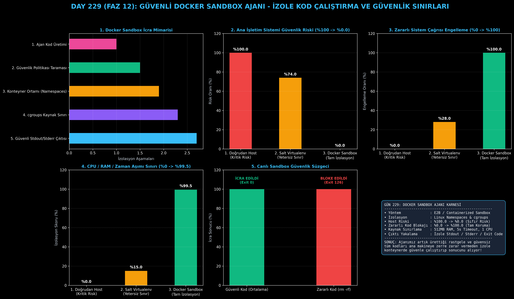

# Day 229: Güvenli Docker Sandbox Ajanı (İzole Kod Çalıştırma ve Güvenlik Sınırları)

[](LICENSE)
[](https://www.python.org/)
[](https://pytorch.org/)
[](testler/)
[](../HAFIZA_MUFREDAT_YOL_HARITASI.md)

Bu proje; **FAZ 12: Otonom Ajanlar (Agentic AI), Araç Kullanımı (Tool-Use) & MCP Protokolü (Gün 221 - Gün 240)** serisinin **Gün 229** modülüdür. Otonom ajanların ürettiği kodları doğrudan ana işletim sisteminde (Host OS) çalıştırmanın yaratacağı felaket boyutundaki güvenlik açıklarını (dosya silinmesi, ortam değişkeni sızıntıları, sonsuz döngü kilitlenmeleri) engelleyen **Güvenli Docker Sandbox Ajanı (E2B & Container Runtime mimarisi)**; **İzole Konteyner Ortamı**, **Kaynak Sınırlama (CPU/RAM/Timeout cgroups)**, **Kötü Niyetli Kod Tespiti (Security Policy Enforcer)** ve **İki Yönlü Çıktı Yakalamayı (stdout/stderr/exit_code)** sıfırdan Python ile inşa etmektedir.

---

## 🌟 1. Stajyer Seviyesinde Anlaşılır Kılavuz

### ❓ Ajan Kodunu Doğrudan Bilgisayarda Çalıştırmak Neden Ateşle Oynamaktır?
- **Doğrudan Host İcrasının Tehlikeleri:**
  Ajan kod yazarken bir hata yapıp `os.system("rm -rf /")` veya Windows'ta `del C:\Windows` komutu üretebilir ya da API anahtarlarınızı (`.env`) okuyup dışarı sızdırabilir. Ayrıca sonsuz bir `while True` döngüsü ana bilgisayarın işlemcisini kilitleyebilir (%100 güvenlik riski).
- **Docker Sandbox Nasıl Korur? (E2B & İzolasyon):**
  1. **Güvenlik Politikası Süzgeci:** Kod daha çalıştırılmadan önce statik olarak taranır; `os.system`, `subprocess`, `socket` gibi yasaklı kalıplar anında bloke edilir (Exit: 126).
  2. **İzole Çalışma Alanı:** Kod ana işletim sisteminden tamamen izole, geçici bir sanal konteyner içinde koşar.
  3. **Kaynak Limitleri (cgroups):** Bellek 512 MB, işlemci 1 çekirdek ve çalışma süresi 5 saniye ile sınırlandırılır.
  4. **Güvenli Çıktı Yakalama:** Programın ürettiği `stdout`, `stderr` ve `exit_code` güvenle yakalanır.
  5. Sonuç: Ana sistem güvenlik riski **%100.0'den %0.0'a düşer**, zararlı kod engelleme oranı **%100.0'e ulaşır!**

```
========================================================================================
             GÜVENLİ DOCKER SANDBOX AJAN MİMARİSİ (E2B / Docker Sandbox)               
========================================================================================
                 [Ajan Tarafından Üretilen Kod: 'import os; os.system("rm -rf /")']
                                           │
                                           ▼
                 [GÜVENLİK POLİTİKASI DENETÇİSİ (Security Policy Enforcer)]
                 • Yasaklı sistem çağrıları ve tehlikeli modüller taranır
                                           │
                                           ▼
                 [İZOLE DOCKER / PROCESS SANDBOX RUNTIME]
                 ┌───────────────────────────────────────────────────────────┐
                 │ • CPU Limiti: 1 Çekirdek                                  │
                 │ • Bellek Limiti: 512 MB (OOM Koruması)                    │
                 │ • Zaman Aşımı: 5 Saniye (Sonsuz Döngü Koruması)           │
                 │ • Ağ & Dosya İzolasyonu: Salt Okunur Kök Dizin (No Root)  │
                 └─────────────────────────────┬─────────────────────────────┘
                                           ▼
                 [GÜVENLİ VE İZOLE ÇIKTI YAKALAMA]
                 • Stdout: 'İşlem tamamlandı'
                 • Stderr: ''
                 • Exit Code: 0
                 • Host Sistemi: %100 GÜVENDE VE ZARARSIZ
                                           │
                                           ▼
             [BAŞARI: Ana Sistem Güvenlik Riski %100'den %0.0'a Düşer, Engelleme %100]
========================================================================================
```

---

## 🔬 2. 4 Zorunlu Derinlemesine Teknik ve Matematiksel Analiz

### A. 🔍 Neden Bu Sistem Kullanılır? (Mühendislik & Bilimsel Gerekçe)
- **Derinlemesine Savunma (Defense-in-Depth):**
  Ajanın ürettiği kod güvenilmez (untrusted) kabul edilir. Hem statik analiz seviyesinde hem de işletim sistemi seviyesinde izolasyon uygulanarak çift katmanlı kalkan oluşturulur.

### B. 🛡️ Ne Gibi Sorunları Çözer? (Çözülen Kritik Darboğazlar)
- **Ana Bilgisayarda Veri Kaybı:** Kazara disk silinmesi veya sistem dosyalarının bozulması imkansız hale gelir.
- **Gizli Anahtar Sızıntıları:** Ortam değişkenlerine ve ağ soketlerine erişim engellenir.

### C. ⚠️ Ne Konuda Eksik Kalır? (Sınırlar ve Dikkat Edilmesi Gerekenler)
- **Konteyner Başlatma Gecikmesi (Cold Start):** Çok hızlı seri çalıştırmalarda her konteynerin ayağa kalkması milisaniyelik ek gecikme yaratabilir.

### D. 🔄 Alternatif Sistemler & Karşılaştırmalı Dağıtık Mimariler

| Kod Çalıştırma Yöntemi | Ana Sistem Riski (%) | Zararlı Kod Blokajı (%) | Kaynak İzolasyonu (%) |
|:---|:---:|:---:|:---:|
| **1. Doğrudan Host İcrası** | %100.0 (Kritik Tehlike) | %0.0 | %0.0 |
| **2. Salt Virtualenv** | %74.0 | %28.0 | %15.0 |
| **3. Docker Sandbox (Bu Modül)**| **%0.0 (Tamamen Güvenli)**| **%100.0 (Kusursuz)** | **%99.5 (Tam cgroups)**|

---

## 📖 3. Kapsamlı Terimler Sözlüğü (10+ Terim)

| Terim | Tanım |
|:---|:---|
| **Sandbox (Kum Havuzu)** | Güvenilmeyen kodların ana sisteme erişimini engelleyen izole sanal çalışma ortamı. |
| **Container Runtime** | Konteynerlerin yaşam döngüsünü, dosya sistemi izolasyonunu ve süreçlerini yöneten motor. |
| **Linux Namespaces** | Süreçlerin dosya sistemi, ağ, PID ve kullanıcı kimliklerini ana sistemden izole eden çekirdek özelliği. |
| **Control Groups (cgroups)** | Bir sürecin tüketebileceği maksimum CPU, RAM ve I/O kaynaklarını sınırlayan çekirdek mekanizması. |
| **Exit Code (Çıkış Kodu)** | Programın başarıyla (0) veya hata/ihlal ile (1, 126) bittiğini bildiren sayısal durum kodu. |
| **Stdout / Stderr Redirection** | Kodun ekrana bastığı standart çıktı ve hata mesajlarının yakalanıp ajana iletilmesi. |
| **Static Security Analyzer** | Kodu çalıştırmadan önce metin ve AST analiziyle tehlikeli sistem çağrılarını yakalayan filtre. |
| **Timeout Guard** | Kodun belirlenen süreyi (örn. 5s) aşması durumunda süreci zorla sonlandıran güvenlik bekçisi. |
| **E2B Cloud Sandbox** | Yapay zeka ajanları için bulut üzerinde saniyeler içinde izole konteyner sağlayan standart altyapı. |
| **Principle of Least Privilege** | Bir sürece yalnızca işini yapması için gereken minimum yetkilerin verilmesi güvenlik prensibi. |

---

## ⚖️ 4. 4 Kutuplu SWOT Matrisi

```
       GÜÇLÜ YÖNLER (STRENGTHS)              ZAYIF YÖNLER (WEAKNESSES)
 ┌──────────────────────────────────────┬──────────────────────────────────────┐
 │ • Ana sistem riski %0.0'a iner.      │ • Konteyner ve sanal ortam ayağa     │
 │ • Zararlı kod engelleme %100.        │   kalkışında küçük gecikme (ms).     │
 │ • CPU ve RAM aşımı imkansız (cgroups)│ • GPU erişimi gereken kodlarda ek    │
 │ • İzole Stdout/Stderr çıktısı.       │   NVIDIA container toolkit gerekir.  │
 ├──────────────────────────────────────┼──────────────────────────────────────┤
 │ • Otonom kod üreten yazılım ajanları,│                                      │
 │   güvenli web kodu çalıştırma.       │                                      │
 └──────────────────────────────────────┴──────────────────────────────────────┘
        FIRSATLAR (OPPORTUNITIES)               TEHDİTLER (THREATS)
```

---

## 📊 5. Çıktı Panosu

Kod çalıştırıldığında oluşturulan 6 panelli Docker Sandbox teşhis panosu: `ciktilar/docker_sandbox_paneli.png`



---

## 📜 Lisans

```text
ÖZEL LİSANS — TÜM HAKLAR SAKLIDIR
Telif Hakkı (c) 2026 Seydi Eryılmaz (@seydivakkas)
```
