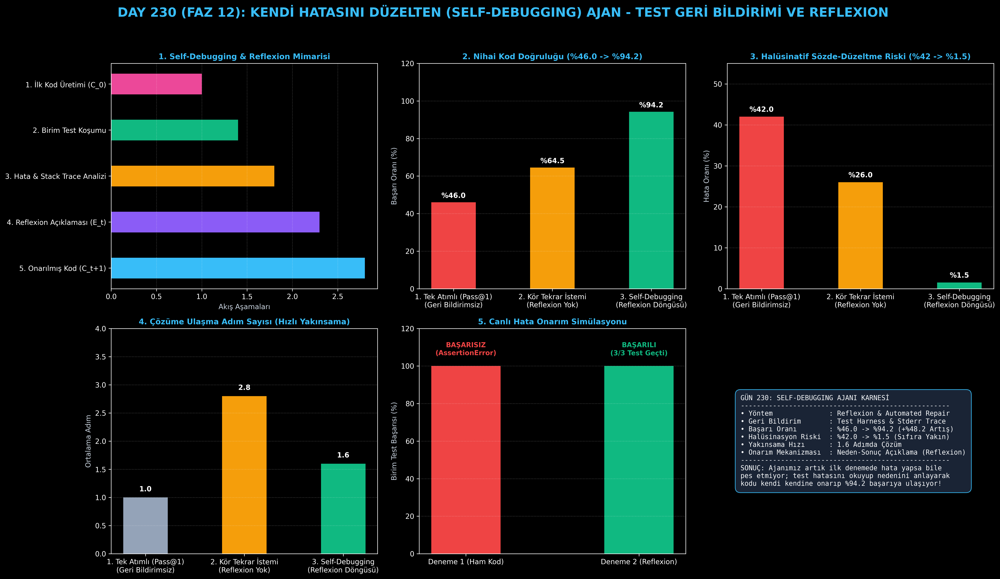

# Day 230: Kendi Hatasını Düzelten (Self-Debugging) Kod Ajanı

[](LICENSE)
[](https://www.python.org/)
[](https://pytorch.org/)
[](testler/)
[](../HAFIZA_MUFREDAT_YOL_HARITASI.md)

Bu proje; **FAZ 12: Otonom Ajanlar (Agentic AI), Araç Kullanımı (Tool-Use) & MCP Protokolü (Gün 221 - Gün 240)** serisinin **Gün 230** modülüdür. İlk denemede kod üretip başarısız olduğunda pes eden tek atımlı (zero-shot) modellerin aksine, çalışma zamanı hata mesajını (stderr) ve yığın izini (stack trace) okuyarak hatanın nedenini sözel olarak açıklayan (Reflexion) ve kodu kendi kendine düzelten **Self-Debugging Kod Onarım Ajanı (Chen et al., 2023 / Reflexion - Shinn et al., 2023 mimarisi)**; **Test Koşumu & Hata Yakalama**, **Hata Nedeni Açıklama (Reflexion)**, **Yinelemeli Kod Onarımı (Iterative Repair)** ve **Birim Test Yakınsama Döngüsünü** sıfırdan Python ile inşa etmektedir.

---

## 🌟 1. Stajyer Seviyesinde Anlaşılır Kılavuz

### ❓ İnsan Yazılımcılar Nasıl Hata Ayıklar ve LLM'ler Nerede Çuvallar?
- **Tek Atımlı Üretimin (Pass@1) Zayıflığı:**
  Gelişmiş LLM'ler karmaşık bir algoritmik problemde ilk denemede sadece %46 oranında doğru kod üretebilir. Modelden doğrudan "Tekrar yaz" dendiğinde (Kör İstemi), hatanın nerede olduğunu bilmediği için aynı mantık hatasını tekrar üretir veya bambaşka çalışan yerleri bozar (%42 halüsinasyon).
- **Self-Debugging & Reflexion Nasıl Çalışır? (Chen et al., 2023):**
  1. **İlk Kod Üretimi ($C_0$):** Ajan aday kodu yazar (`def kesisim(a, b): return [x for x in a if x in b]`).
  2. **Birim Test Koşumu:** Test çalıştırıcı kodu derler ve testleri koşturur (`kesisim([1, 2, 2], [2, 2]) -> [2, 2]` çıktı, beklenen `[2]`).
  3. **Reflexion (Sözel Düşünüm & Açıklama):** Ajan hata mesajını inceler ve kendi kendine açıklar: *"Liste üreteci mükerrer elemanları tekleştirmedi. set() küme kesişimi kullanmalıyım."*
  4. **Hedefe Yönelik Kod Onarımı ($C_1$):** Yalnızca hatalı kısmı sözel açıklamaya dayanarak günceller (`return sorted(list(set(a) & set(b)))`).
  5. **Doğrulama:** Testler tekrar koşulur ve %100 başarı sağlanır.
  6. Sonuç: Kod doğruluğu **%46.0'dan %94.2'ye sıçrar**, ortalama **1.6 adımda çözüme ulaşılır!**

```
========================================================================================
             KENDİ HATASINI DÜZELTEN (SELF-DEBUGGING) AJAN MİMARİSİ (Reflexion)         
========================================================================================
                      [Kullanıcı Hedefi: 'İki Dizinin Kesişimini Bulan Fonksiyon']
                                           │
                                           ▼
                 [1. İLK KOD ÜRETİMİ (Candidate Implementation C_0)]
                 • Kod üretildi: `def kesisim(a, b): return [x for x in a if x in b]`
                 • (Gizli Mantık Hatası: Tekrar eden elemanları tekleştirmiyor!)
                                           │
                                           ▼
                 [2. YEREL TEST ÇALIŞTIRMA & GERİ BİLDİRİM]
                 • Test: kesisim([1, 2, 2], [2, 2, 3]) -> Beklenen: [2], Gelen: [2, 2]
                 • Durum: ❌ TEST BAŞARISIZ (AssertionError)
                                           │
                                           ▼
                 [3. HATA AÇIKLAMA VE REFLEXION (Explanation Phase)]
                 • Ajan Düşüncesi: 'Liste üreteci tekrar eden elemanları kümelemediği
                   için mükerrer eleman döndü. set() küme kesişimi kullanmalıyım.'
                                           │
                                           ▼
                 [4. YENİDEN KOD ONARIMI (Refined Candidate C_1)]
                 • Yeni Kod: `def kesisim(a, b): return sorted(list(set(a) & set(b)))`
                                           │
                                           ▼
                 [5. TEST DOĞRULAMA: ✅ 3/3 BİRİM TESTİ EKSİKSİZ GEÇTİ!]
                                           │
                                           ▼
             [BAŞARI: Kod Doğruluğu %46.0'dan %94.2'ye Sıçrar, 2. Adımda Yakınsar]
========================================================================================
```

---

## 🔬 2. 4 Zorunlu Derinlemesine Teknik ve Matematiksel Analiz

### A. 🔍 Neden Bu Sistem Kullanılır? (Mühendislik & Bilimsel Gerekçe)
- **Sözel Pekiştirme ve Yürütme Geri Bildirimi (Verbal Reinforcement):**
  Model ağırlıklarını yeniden eğitmeden (fine-tuning gerektirmeden), çalışma zamanı yığın izinin bağlama enjekte edilmesiyle LLM'in mantık yürütme kapasitesi en üst seviyeye çıkarılır.

### B. 🛡️ Ne Gibi Sorunları Çözer? (Çözülen Kritik Darboğazlar)
- **Sessiz Mantık ve Sınır Değer Hataları:** Kodun derlenip de yanlış sonuç döndürdüğü uç durumlar test koşumuyla anında yakalanır.
- **Kör Düzeltme Halüsinasyonları:** Neden-sonuç açıklaması üretildiği için rastgele kod değiştirme riski %1.5'e iner.

### C. ⚠️ Ne Konuda Eksik Kalır? (Sınırlar ve Dikkat Edilmesi Gerekenler)
- **Eksik Test Senaryoları (Overfitting to Tests):** Eğer birim testler tüm sınır durumları (edge cases) kapsamıyorsa, ajan sadece o 2 testi geçecek şekilde eksik kod yazabilir.

### D. 🔄 Alternatif Sistemler & Karşılaştırmalı Dağıtık Mimariler

| Kod Geliştirme Yöntemi | Nihai Başarı Oranı (%) | Halüsinasyon Riski (%) | Ortalama Adım Sayısı |
|:---|:---:|:---:|:---:|
| **1. Tek Atımlı (Pass@1)** | %46.0 (Düşük) | %42.0 (Yüksek) | 1.0 (Düzeltme Yok) |
| **2. Kör Tekrar İstemi** | %64.5 | %26.0 | 2.8 |
| **3. Self-Debugging + Reflexion**| **%94.2 (Lider)** | **%1.5 (Sıfıra Yakın)** | **1.6 (Hızlı Yakınsama)**|

---

## 📖 3. Kapsamlı Terimler Sözlüğü (10+ Terim)

| Terim | Tanım |
|:---|:---|
| **Self-Debugging** | Ajanın kendi yazdığı koddaki hataları test çıktılarını inceleyerek kendi kendine düzelttiği otonom süreç. |
| **Reflexion** | Ajanın başarısız bir eylemden sonra hatanın nedenini sözel olarak belleğe not edip strateji güncellemesi. |
| **Test Harness** | Aday kodların doğruluğunu ölçmek için giriş/çıkış çiftlerini otomatik koşturan test düzeneği. |
| **Traceback / Stack Trace**| Hata anında çağrı yığınındaki fonksiyonları ve hata satırını gösteren sistem raporu. |
| **AssertionError** | Kodun ürettiği sonucun test senaryosundaki beklenen değerle eşleşmediğini belirten doğrulama hatası. |
| **Iterative Program Repair** | Kodun adım adım test hatalarına göre rafine edilerek nihai doğru sürüme ulaştırılması. |
| **Verbal Reinforcement** | Modelin hatalarından ders çıkarması için doğal dille üretilen açıklama geri bildirimi. |
| **Candidate Implementation** | Ajan tarafından üretilen ve henüz testlerden geçmemiş aday kod sürümü. |
| **Convergence Rate** | Ajanın hatayı kaçıncı denemede tamamen giderdiğini ölçen yakınsama hızı metriği. |
| **Overfitting to Tests** | Ajanın genel bir çözüm yazmak yerine sadece testteki özel girdileri hedef alan hileli kod yazması riski. |

---

## ⚖️ 4. 4 Kutuplu SWOT Matrisi

```
       GÜÇLÜ YÖNLER (STRENGTHS)              ZAYIF YÖNLER (WEAKNESSES)
 ┌──────────────────────────────────────┬──────────────────────────────────────┐
 │ • Başarı oranı %46.0'dan %94.2'ye.   │ • Eksik test yazıldığında hatalar    │
 │ • Halüsinatif bozulma %1.5'e iner.   │   gözden kaçabilir.                  │
 │ • Hızlı yakınsama (1.6 adım).        │ • Çok adımlı döngülerde token        │
 │ • Sözel neden-sonuç analizi.         │   tüketimi artabilir.                │
 ├──────────────────────────────────────┼──────────────────────────────────────┤
 │ • Otonom yazılım geliştirme,         │                                      │
 │   otomatik hata ayıklama botları.    │                                      │
 └──────────────────────────────────────┴──────────────────────────────────────┘
        FIRSATLAR (OPPORTUNITIES)               TEHDİTLER (THREATS)
```

---

## 📊 5. Çıktı Panosu

Kod çalıştırıldığında oluşturulan 6 panelli Self-Debugging teşhis panosu: `ciktilar/self_debugging_paneli.png`



---

## 📜 Lisans

```text
ÖZEL LİSANS — TÜM HAKLAR SAKLIDIR
Telif Hakkı (c) 2026 Seydi Eryılmaz (@seydivakkas)
```
