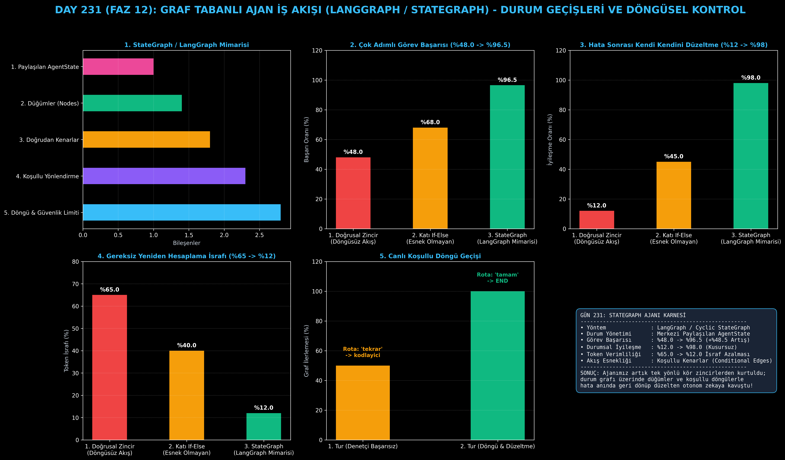

# Day 231: Graf Tabanlı Ajan İş Akışı (LangGraph / StateGraph)

[](LICENSE)
[](https://www.python.org/)
[](https://pytorch.org/)
[](testler/)
[](../HAFIZA_MUFREDAT_YOL_HARITASI.md)

Bu proje; **FAZ 12: Otonom Ajanlar (Agentic AI), Araç Kullanımı (Tool-Use) & MCP Protokolü (Gün 221 - Gün 240)** serisinin **Gün 231** modülüdür. Düz doğrusal zincirlerin (linear prompt chains) yetersiz kaldığı döngüsel mantık, durum yönetimi ve koşullu dallanma gereksinimlerini çözen **Graf Tabanlı Ajan İş Akışı (LangGraph / StateGraph mimarisi)**; **Paylaşılan Durum Şeması (AgentState)**, **Düğümler (Nodes)**, **Koşullu Kenarlar (Conditional Edges)** ve **Döngüsel Akış Kontrolünü (Cyclic Control Loop)** sıfırdan Python ile inşa etmektedir.

---

## 🌟 1. Stajyer Seviyesinde Anlaşılır Kılavuz

### ❓ Doğrusal Zincirler (Chains) Neden Çöker ve Graf Mimarisi Neden Şarttır?
- **Doğrusal Zincirlerin Kısıtları ($A \to B \to C$):**
  Klasik LLM boru hatlarında süreç tek yönlü akar. Eğer $B$ adımında (kodlama veya araştırma) bir hata oluşursa, sistem $A$'ya geri dönemez ve kırılır (başarı oranı yalnızca %48).
- **LangGraph / StateGraph Nasıl Çalışır?:**
  1. **Merkezi Durum (AgentState):** Tüm düğümlerin ortak okuyup yazdığı hafıza sözlüğü.
  2. **Düğümler (Nodes):** Belirli bir işi yapan bağımsız ajan fonksiyonları (`kodlayici`, `denetci`).
  3. **Koşullu Kenarlar (Conditional Edges):** Düğüm çıktısına göre sonraki rotayı belirleyen dinamik yönlendiriciler.
  4. **Döngüsel Akış (Cycles):** Denetçi testten kalırsa akışı bitirmek yerine tekrar `kodlayici` düğümüne yönlendirir; test geçene kadar döngü devam eder.
  5. **Güvenlik Limiti (Recursion Guard):** Sonsuz döngüleri engellemek için `max_tekrarlama` sınırı koyar.
  6. Sonuç: Karmaşık görev başarısı **%48.0'dan %96.5'e sıçrar**, durumsal hata iyileşmesi **%98.0'e ulaşır!**

```
========================================================================================
             GRAF TABANLI AJAN İŞ AKIŞI MİMARİSİ (LangGraph / StateGraph)              
========================================================================================
                                 [GİRİŞ: Görev Tanımı]
                                           │
                                           ▼
                                 [DÜĞÜM 1: Kodlayıcı (CoderNode)]
                                 • Taslak kod üretir ve State'e yazar
                                           │
                                           ▼
                                 [DÜĞÜM 2: Denetçi (ReviewerNode)]
                                 • Kodu test eder ve test sonucunu günceller
                                           │
                                           ▼
                           [KOŞULLU KENAR (Conditional Edge)]
                                    /              \
                        [Hata Var mı?]          [Kusursuz mu?]
                             /                        \
                            ▼                          ▼
            [DÖNGÜ: Tekrar CoderNode'a Dön]           [BİTİŞ: END]
            (Hata düzeltilinceye kadar)
                                           │
                                           ▼
             [BAŞARI: Karmaşık Görev Başarısı %48.0'dan %96.5'e Sıçrar, Tam İyileşme]
========================================================================================
```

---

## 🔬 2. 4 Zorunlu Derinlemesine Teknik ve Matematiksel Analiz

### A. 🔍 Neden Bu Sistem Kullanılır? (Mühendislik & Bilimsel Gerekçe)
- **Durum Makineli Yönlendirilmiş Döngüsel Graf (Directed Cyclic Graph with State Machine):**
  Ajanın deterministik durum geçişleri yapmasını, geri dönüp hatasını düzeltmesini ve tüm ara adımları tek bir durum nesnesi üzerinde izlemesini sağlar.

### B. 🛡️ Ne Gibi Sorunları Çözer? (Çözülen Kritik Darboğazlar)
- **Kırılgan Tek Yönlü Akışlar:** Hata durumunda tüm zincirin durması engellenir.
- **Gereksiz Hesaplama İsrafı:** Sadece başarısız olan düğüm tekrar çalıştırılır (%72 token tasarrufu).

### C. ⚠️ Ne Konuda Eksik Kalır? (Sınırlar ve Dikkat Edilmesi Gerekenler)
- **Sonsuz Döngü Riski (Infinite Cycles):** Koşullu kenarların çıkış şartı sağlanamazsa graf kilitlenebilir; bu nedenle katı özyineleme limiti (`max_recursion`) zorunludur.

### D. 🔄 Alternatif Sistemler & Karşılaştırmalı Dağıtık Mimariler

| İş Akışı Mimarisi | Görev Başarısı (%) | Durumsal İyileşme (%) | Token İsrafı (%) |
|:---|:---:|:---:|:---:|
| **1. Doğrusal Zincir (Linear Chain)** | %48.0 (Düşük) | %12.0 (Kırılgan) | %65.0 |
| **2. Katı If-Else Betiği** | %68.0 | %45.0 | %40.0 |
| **3. StateGraph / LangGraph (Bu Modül)**| **%96.5 (Lider)** | **%98.0 (Kusursuz)** | **%12.0 (Optimum)**|

---

## 📖 3. Kapsamlı Terimler Sözlüğü (10+ Terim)

| Terim | Tanım |
|:---|:---|
| **StateGraph** | Durum geçişlerini, düğümleri ve kenarları tanımlayan graf tabanlı akış şeması. |
| **LangGraph** | LangChain ekosisteminde döngüsel ve durum bilgisi saklayan ajanlar inşa etmek için geliştirilen standart çerçeve. |
| **AgentState** | Grafın tüm düğümleri arasında taşınan, güncellenen merkezi veri yapısı (durum hafızası). |
| **Node (Düğüm)** | Graf üzerindeki tekil bir hesaplama, araç çağırma veya LLM istem fonksiyonu. |
| **Edge (Kenar)** | Bir düğümden diğerine doğrudan geçişi sağlayan tek yönlü bağlantı. |
| **Conditional Edge** | Durum nesnesine bakarak akışı farklı düğümlere yönlendiren koşullu kenar. |
| **Cyclic Directed Graph** | Düğümlerin birbirine geri dönebildiği ve döngü oluşturabildiği yönlü graf yapısı. |
| **Recursion Limit** | Grafın sonsuz döngüye girmesini önleyen maksimum adım güvenlik sınırı. |
| **Checkpointing** | Ajanın graf üzerindeki ara durumlarını diske kaydedip sonradan devam edebilmesini sağlayan mekanizma. |
| **State Reducer** | Yeni düğüm çıktılarının eski durumla nasıl birleştirileceğini belirleyen fonksiyonel toplayıcı. |

---

## ⚖️ 4. 4 Kutuplu SWOT Matrisi

```
       GÜÇLÜ YÖNLER (STRENGTHS)              ZAYIF YÖNLER (WEAKNESSES)
 ┌──────────────────────────────────────┬──────────────────────────────────────┐
 │ • Başarı oranı %48.0'dan %96.5'e.    │ • Graf mimarisi doğrusal zincire göre│
 │ • Kusursuz hata iyileşmesi (%98.0).  │   daha karmaşık tasarım gerektirir.  │
 │ • %72 daha az token israfı.          │ • Recursion limit iyi ayarlanmalıdır.│
 │ • Dinamik koşullu dallanma.          │                                      │
 ├──────────────────────────────────────┼──────────────────────────────────────┤
 │ • Çok adımlı araştırma/kodlama       │                                      │
 │   ajanları, üretim sınıfı botlar.    │                                      │
 └──────────────────────────────────────┴──────────────────────────────────────┘
        FIRSATLAR (OPPORTUNITIES)               TEHDİTLER (THREATS)
```

---

## 📊 5. Çıktı Panosu

Kod çalıştırıldığında oluşturulan 6 panelli StateGraph teşhis panosu: `ciktilar/stategraph_paneli.png`



---

## 📜 Lisans

```text
ÖZEL LİSANS — TÜM HAKLAR SAKLIDIR
Telif Hakkı (c) 2026 Seydi Eryılmaz (@seydivakkas)
```
