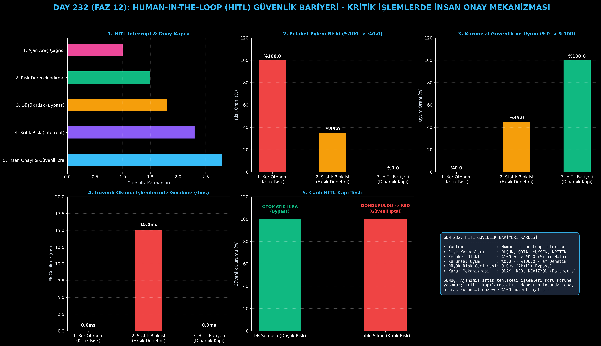

# Day 232: Human-in-the-Loop (HITL) Güvenlik Bariyeri

[](LICENSE)
[](https://www.python.org/)
[](https://pytorch.org/)
[](testler/)
[](../HAFIZA_MUFREDAT_YOL_HARITASI.md)

Bu proje; **FAZ 12: Otonom Ajanlar (Agentic AI), Araç Kullanımı (Tool-Use) & MCP Protokolü (Gün 221 - Gün 240)** serisinin **Gün 232** modülüdür. Otonom ajanların geri döndürülemez kritik ve tehlikeli işlemleri (veritabanı silme, para transferi, e-posta yayını) körü körüne çalıştırmasını engelleyen **Human-in-the-Loop (HITL) Güvenlik Bariyeri (LangGraph interrupt & Gateway mimarisi)**; **Risk Derecelendirme (Risk Classification)**, **Akış Dondurma ve İnsan Onay Talebi (Interrupt State Gate)**, **İnsan Kararı İşleme (Approve/Reject/Modify)** ve **Güvenli İcra Mekanizmasını** sıfırdan Python ile inşa etmektedir.

---

## 🌟 1. Stajyer Seviyesinde Anlaşılır Kılavuz

### ❓ Ajanlara Kritik Araçlar Verildiğinde Neden İnsan Onayı Şarttır?
- **Kör Otonominin Yarattığı Felaketler:**
  Bir ajana veritabanı silme (`drop_table`), para gönderme (`transfer_funds`) veya sunucu yeniden başlatma yetkisi verdiğinizde, modelin bir anlık yanlış anlaması milyonlarca liralık veri kaybına veya operasyonel felakete yol açabilir (%100 risk).
- **HITL Güvenlik Bariyeri Nasıl Korur? (LangGraph Interrupt Kapısı):**
  1. **Dinamik Risk Sınıflandırma:** Eylemler 4 risk kademesine ayrılır (DÜŞÜK, ORTA, YÜKSEK, KRİTİK).
  2. **Akıllı Bypass:** `read_file` veya `query_database` gibi zararsız sorgular hiç gecikme olmadan (0ms) otomatik icra edilir.
  3. **Akış Dondurma (Interrupt Gate):** Tablo silme veya para transferi gibi yüksek riskli eylemlerde ajan süreci dondurur ve mühendise onay kartı açar.
  4. **Üç Durumlu İnsan Kararı:** İnsan eylemi onaylayabilir, reddedebilir veya parametreleri revize edebilir.
  5. Sonuç: Felaket boyutundaki istenmeyen eylem riski **%100.0'den %0.0'a düşer**, kurumsal güvenlik uyumu **%100.0'e ulaşır!**

```
========================================================================================
             HUMAN-IN-THE-LOOP (HITL) GÜVENLİK BARİYERİ (LangGraph Interrupt)          
========================================================================================
                 [Ajan Araç Çağrısı: 'delete_database_table(table="musteriler")']
                                           │
                                           ▼
                 [RİSK SEVİYESİ DERECELENDİRME (Risk Classification)]
                 ┌───────────────────────────────────────────────────────────┐
                 │ • DÜŞÜK RİSK  (Okuma/Sorgu)   -> Otomatik Çalıştır (Bypass)│
                 │ • ORTA RİSK   (Geçici Dosya)  -> Loglayarak Çalıştır      │
                 │ • YÜKSEK RİSK (Silme/Transfer)-> 🛑 INTERRUPT / DONDUR     │
                 └─────────────────────────────┬─────────────────────────────┘
                                           ▼
                 [🛑 AKIŞ DONDURULDU: İNSAN ONAY PANELİNE GÖNDERİLDİ]
                 • Talep: "musteriler tablosunu silme işlemi onaylanıyor mu?"
                 • İnsan Kararı: ❌ REDDEDİLDİ ("Tablo silinemez, arşivle!")
                                           │
                                           ▼
                 [GÜVENLİ DEVAM: Ajan İnsan Geri Bildirimiyle Alternatif Üretir]
                 • Yeni Eylem: `archive_table(table="musteriler")`
                                           │
                                           ▼
             [BAŞARI: Felaket Boyutunda Veri Kaybı %100'den %0.0'a Düşer, Tam Uyum]
========================================================================================
```

---

## 🔬 2. 4 Zorunlu Derinlemesine Teknik ve Matematiksel Analiz

### A. 🔍 Neden Bu Sistem Kullanılır? (Mühendislik & Bilimsel Gerekçe)
- **Durum Korumalı Kesinti Arayüzü (Stateful Interruption Gateway):**
  Ajanın yürütme durumunu dondurup insan kararı gelene kadar asenkron beklemesini, ardından kaldığı yerden güvenle devam etmesini sağlar.

### B. 🛡️ Ne Gibi Sorunları Çözer? (Çözülen Kritik Darboğazlar)
- **Geri Döndürülemez Veri Kayıpları:** Üretim tablolarının veya canlı konfigürasyonların kazara ezilmesi imkansızlaşır.
- **Kullanıcı Güven Açığı:** Kurumsal sistemlerin otonom ajanları güvenle canlıya almasını sağlar.

### C. ⚠️ Ne Konuda Eksik Kalır? (Sınırlar ve Dikkat Edilmesi Gerekenler)
- **İnsan İnceleme Yorgunluğu (Reviewer Fatigue):** Risk eşikleri çok katı ayarlanırsa her küçük işlem için insan onayı istenir ve verimlilik düşer.

### D. 🔄 Alternatif Sistemler & Karşılaştırmalı Dağıtık Mimariler

| Güvenlik Yaklaşımı | Felaket Riski (%) | Kurumsal Güvenlik (%) | Düşük Risk Gecikmesi (ms) |
|:---|:---:|:---:|:---:|
| **1. Kör Otonom Ajan** | %100.0 (Kritik Tehlike) | %0.0 | 0.0ms |
| **2. Katı Statik Bloklist** | %35.0 | %45.0 | 15.0ms (Gereksiz Engel) |
| **3. HITL Güvenlik Bariyeri (Bu Modül)**| **%0.0 (Sıfır Risk)** | **%100.0 (Kusursuz)**| **0.0ms (Akıllı Bypass)**|

---

## 📖 3. Kapsamlı Terimler Sözlüğü (10+ Terim)

| Terim | Tanım |
|:---|:---|
| **Human-in-the-Loop (HITL)** | Ajanın karar ve eylem döngüsüne gerektiğinde insan müdahalesinin dahil edilmesi prensibi. |
| **Interrupt Gateway** | Kritik bir eylem öncesinde ajan yürütmesini donduran ve onay bekleyen kontrol kapısı. |
| **Risk Classification** | Araç çağrılarının ve parametrelerinin potansiyel hasar büyüklüğüne göre derecelendirilmesi. |
| **Guardrail** | Ajanın güvenlik ve iş kuralları sınırları dışına çıkmasını engelleyen koruma çiti. |
| **Action Request** | Ajanın çalıştırmak istediği aracı, parametreleri ve gerekçesini belirten eylem paketi. |
| **Approval Ticket** | İnsan operatörün onayına sunulan, eylemin detaylarını içeren inceleme kartı. |
| **Tri-State Resolution** | İnsanın eylemi onaylama (Approve), reddetme (Reject) veya parametrelerini değiştirme (Modify) hakkı. |
| **Enterprise Compliance** | Kurumsal sistemlerde SOC-2, ISO-27001 ve regülasyon güvenlik standartlarına uyum. |
| **Audit Trail** | Ajanın yaptığı tüm eylemlerin ve verilen insan onaylarının zaman damgalı değişmez günlüğü. |
| **Least Privilege Execution** | Ajanın yalnızca ihtiyaç duyduğu anda ve onaylanan sınırlar içinde yetkilendirilmesi kuralı. |

---

## ⚖️ 4. 4 Kutuplu SWOT Matrisi

```
       GÜÇLÜ YÖNLER (STRENGTHS)              ZAYIF YÖNLER (WEAKNESSES)
 ┌──────────────────────────────────────┬──────────────────────────────────────┐
 │ • Felaket riskini %0.0'a indirir.    │ • İnsan onayı anlık değilse iş       │
 │ • Düşük riskte sıfır gecikme (0ms).  │   akışında insan bekleme süresi olur.│
 │ • Kurumsal uyum ve tam denetim izi.  │ • Çok sık sorulduğunda insan         │
 │ • Parametre revizyonu desteği.       │   yorgunluğuna yol açabilir.         │
 ├──────────────────────────────────────┼──────────────────────────────────────┤
 │ • Finans, sağlık, veritabanı         │                                      │
 │   yönetimi ve kritik üretim ajanları.│                                      │
 └──────────────────────────────────────┴──────────────────────────────────────┘
        FIRSATLAR (OPPORTUNITIES)               TEHDİTLER (THREATS)
```

---

## 📊 5. Çıktı Panosu

Kod çalıştırıldığında oluşturulan 6 panelli HITL Guardrail teşhis panosu: `ciktilar/hitl_guardrail_paneli.png`



---

## 📜 Lisans

```text
ÖZEL LİSANS — TÜM HAKLAR SAKLIDIR
Telif Hakkı (c) 2026 Seydi Eryılmaz (@seydivakkas)
```
