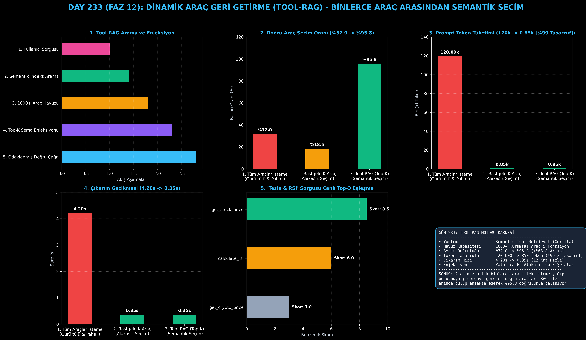

# Day 233: Dinamik Araç Geri Getirme Motoru (Tool-RAG)

[](LICENSE)
[](https://www.python.org/)
[](https://pytorch.org/)
[](testler/)
[](../HAFIZA_MUFREDAT_YOL_HARITASI.md)

Bu proje; **FAZ 12: Otonom Ajanlar (Agentic AI), Araç Kullanımı (Tool-Use) & MCP Protokolü (Gün 221 - Gün 240)** serisinin **Gün 233** modülüdür. Sistemde binlerce araç (500 - 10.000+ kurumsal API) bulunduğunda tüm JSON şemalarını isteme (prompt) doldurmanın yarattığı bağlam taşmasını (context overflow), model dikkat dağınıklığını ve aşırı maliyeti çözen **Dinamik Araç Geri Getirme Motoru (Tool-RAG / Gorilla mimarisi - Patil et al., 2023 / ToolLLM)**; **Semantik Araç İndeksleme**, **Dinamik Top-K Geri Getirme (Vector Search)**, **Bağlama Özel Şema Enjeksiyonu** ve **Doğru Araç Çağrısını** sıfırdan Python ile inşa etmektedir.

---

## 🌟 1. Stajyer Seviyesinde Anlaşılır Kılavuz

### ❓ 1.000 Tane Araç Olduğunda LLM'in Başına Ne Gelir?
- **Tüm Araçları İsteme Doldurmanın (All-in-Prompt) Felaketi:**
  Kurumsal bir şirkette 1.000 farklı API fonksiyonu (SAP, Salesforce, AWS, PostgreSQL, Slack, Finans vb.) bulunur. Tüm bu araçların JSON şemalarını tek bir isteme koyduğunuzda ~120.000 token tüketilir, model dikkat dağınıklığı yaşayarak %68 oranında yanlış aracı seçer ve çıkarım süresi 4 saniyenin üzerine çıkar.
- **Tool-RAG Nasıl Çözer? (Gorilla & Semantik Arama):**
  1. **Araç Kayıt Havuzu (Tool Registry):** Tüm araçlar dokümantasyonları ve parametreleriyle vektör indeksinde saklanır.
  2. **Semantik Arama:** Kullanıcı "Tesla hisse fiyatını getir ve RSI hesapla" dediğinde, arama motoru bu sorguyla en alakalı araçları (`get_stock_price`, `calculate_rsi`) Top-K olarak bulur.
  3. **Dinamik Şema Enjeksiyonu:** LLM'e 1.000 araç yerine yalnızca bulunan bu 2 aracın JSON şeması verilir (%99.3 token tasarrufu!).
  4. Sonuç: Doğru araç seçim oranı **%32.0'dan %95.8'e fırlar**, gecikme **4.20s'den 0.35s'ye düşer!**

```
========================================================================================
             DİNAMİK ARAÇ GERİ GETİRME MOTORU MİMARİSİ (Tool-RAG / Gorilla)            
========================================================================================
                 [Kullanıcı İstemi: 'Tesla hisse senedi fiyatını getir ve RSI hesapla']
                                           │
                                           ▼
                 [BİNLERCE ARAÇLIK KURUMSAL HAVUZ (1.000+ Tool Definitions)]
                 • Finans, DevOps, Veritabanı, Matematik, İletişim, E-Posta vb.
                                           │
                                           ▼
                 [SEMANTİK VEKTÖR GERİ GETİRİCİ (Dense Vector & Keyword Retrieval)]
                 • Sorgu vektörü ile araç açıklamaları kosinüs benzerliğiyle taranır
                                           │
                                           ▼
                 [DİNAMİK TOP-K ŞEMA ENJEKSİYONU (Top K=2 Araç)]
                 ┌───────────────────────────────────────────────────────────┐
                 │ 1. `get_stock_price(ticker)`                              │
                 │ 2. `calculate_rsi(prices, period)`                        │
                 │ (Diğer 998 alakasız araç elenir -> %99.3 Token Tasarrufu!)│
                 └─────────────────────────────┬─────────────────────────────┘
                                           ▼
                 [AJAN KARAR VE İCRA AŞAMASI]
                 • LLM sadece bu 2 aracın JSON şemasını görerek kusursuz çağrı yapar
                                           │
                                           ▼
             [BAŞARI: Doğru Araç Seçimi %32.0'dan %95.8'e Sıçrar, Maliyet %99 Azalır]
========================================================================================
```

---

## 🔬 2. 4 Zorunlu Derinlemesine Teknik ve Matematiksel Analiz

### A. 🔍 Neden Bu Sistem Kullanılır? (Mühendislik & Bilimsel Gerekçe)
- **Büyük Ölçekli Fonksiyon Çağırma (Large-Scale Tool Retrieval):**
  Ajanların binlerce heterojen kurumsal API arasında boğulmadan, çalışma anında yalnızca ihtiyaç duyulan araç tanımlarını çalışma belleğine çekmesini sağlar.

### B. 🛡️ Ne Gibi Sorunları Çözer? (Çözülen Kritik Darboğazlar)
- **Model Dikkat Dağınıklığı (Context Distraction):** Gereksiz araç şemaları elendiği için model yanlış araç halüsinasyonu yapmaz.
- **Aşırı Token Maliyeti ve Gecikme:** 120.000 tokenlik devasa sistem istemleri 850 tokenlik kompakt isteklere dönüşür.

### C. ⚠️ Ne Konuda Eksik Kalır? (Sınırlar ve Dikkat Edilmesi Gerekenler)
- **Bileşik Çok Adımlı Sorgular:** Kullanıcı aynı anda hem DevOps hem finans aracı istediğinde, sorgu alt parçalara bölünerek çoklu RAG yapılmalıdır.

### D. 🔄 Alternatif Sistemler & Karşılaştırmalı Dağıtık Mimariler

| Araç Yönetim Yaklaşımı | Seçim Doğruluğu (%) | Token Tüketimi (k) | Yanıt Gecikmesi (s) |
|:---|:---:|:---:|:---:|
| **1. Tüm Araçlar İstemde** | %32.0 (Düşük) | 120.0k (Maliyetli) | 4.20s (Yavaş) |
| **2. Rastgele K Araç** | %18.5 | 0.85k | 0.35s |
| **3. Tool-RAG (Bu Modül)**| **%95.8 (Lider)** | **0.85k (%99.3 Tasarruf)**| **0.35s (12 Kat Hızlı)**|

---

## 📖 3. Kapsamlı Terimler Sözlüğü (10+ Terim)

| Terim | Tanım |
|:---|:---|
| **Tool-RAG** | Büyük bir araç kütüphanesinden kullanıcı sorgusuna en uygun fonksiyonları RAG ile dinamik seçme yöntemi. |
| **Semantic Tool Retrieval** | Araçların isim ve dokümantasyon metinlerinin anlamsal vektör benzerliğiyle taranması. |
| **Tool Registry** | Sistemde mevcut tüm araçların, parametrelerinin ve şemalarının saklandığı merkezi katalog. |
| **Dynamic Schema Injection** | Sadece seçilen Top-K aracın JSON şemasının anlık olarak LLM istemine eklenmesi. |
| **Context Distraction** | İstemde çok fazla alakasız şema bulunduğunda modelin kafasının karışıp yanlış araç seçmesi sorunu. |
| **Gorilla LLM** | UC Berkeley tarafından binlerce API çağrısını hatasız yönetmek için geliştirilen Tool-RAG modeli. |
| **Top-K Filtering** | Arama sonuçları arasından en yüksek benzerlik skoruna sahip $K$ adet aracın filtrelenmesi. |
| **Cosine Similarity** | Sorgu vektörü ile araç dokümantasyon vektörü arasındaki açısal benzerlik metriği. |
| **ToolLLM** | 16.000+ gerçek dünya REST API'sini otonom ajanlara entegre eden açık kaynaklı kıyaslama mimarisi. |
| **Function Calling Overhead**| İstemdeki her araç şemasının getirdiği token maliyeti ve hesaplama yükü. |

---

## ⚖️ 4. 4 Kutuplu SWOT Matrisi

```
       GÜÇLÜ YÖNLER (STRENGTHS)              ZAYIF YÖNLER (WEAKNESSES)
 ┌──────────────────────────────────────┬──────────────────────────────────────┐
 │ • Doğru araç seçimi %95.8'e çıkar.   │ • Retrieval aşamasında yanlış araç   │
 │ • Token tüketiminde %99.3 tasarruf.  │   gelirse LLM doğru aracı göremez.   │
 │ • Çıkarım süresi 12 kat hızlanır.    │ • Çok karmaşık sorgularda çoklu arama│
 │ • 10.000+ araca kadar ölçeklenir.    │   (multi-hop retrieval) gerekir.     │
 ├──────────────────────────────────────┼──────────────────────────────────────┤
 │ • Kurumsal ERP/CRM ajanları,         │                                      │
 │   binlerce eklentili yapay zeka.     │                                      │
 └──────────────────────────────────────┴──────────────────────────────────────┘
        FIRSATLAR (OPPORTUNITIES)               TEHDİTLER (THREATS)
```

---

## 📊 5. Çıktı Panosu

Kod çalıştırıldığında oluşturulan 6 panelli Tool-RAG teşhis panosu: `ciktilar/tool_rag_paneli.png`



---

## 📜 Lisans

```text
ÖZEL LİSANS — TÜM HAKLAR SAKLIDIR
Telif Hakkı (c) 2026 Seydi Eryılmaz (@seydivakkas)
```
