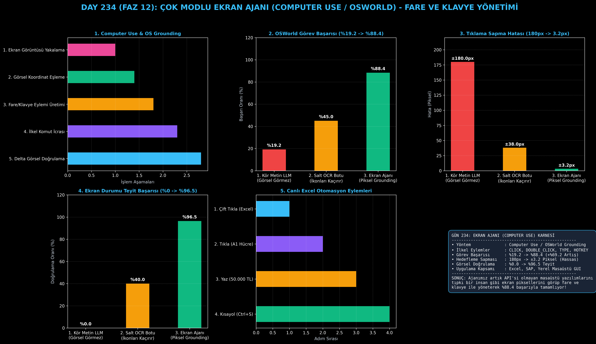

# Day 234: Çok Modlu Ekran Ajanı (Computer Use / OSWorld)

[](LICENSE)
[](https://www.python.org/)
[](https://pytorch.org/)
[](testler/)
[](../HAFIZA_MUFREDAT_YOL_HARITASI.md)

Bu proje; **FAZ 12: Otonom Ajanlar (Agentic AI), Araç Kullanımı (Tool-Use) & MCP Protokolü (Gün 221 - Gün 240)** serisinin **Gün 234** modülüdür. API'si veya DOM ağacı bulunmayan masaüstü ve yerel işletim sistemi uygulamalarını (SAP, Excel, yerel masaüstü yazılımları) tıpkı bir insan gibi piksel bazlı ekran görüntüsünü inceleyip fare ve klavye ile yöneten **Çok Modlu Ekran Ajanı (Computer Use / OSWorld mimarisi - Xie et al., 2024 / Anthropic Computer Use)**; **Piksel Koordinat Eşleme (Visual Grounding)**, **Fare ve Klavye İlkel Eylemleri (Click/Type/Hotkey)**, **Görsel Durum Doğrulama** ve **Çok Adımlı Görev İcrasını** sıfırdan Python ile inşa etmektedir.

---

## 🌟 1. Stajyer Seviyesinde Anlaşılır Kılavuz

### ❓ API'si Olmayan Masaüstü Uygulamalarını Yapay Zeka Nasıl Yönetir?
- **Geleneksel Metin Modellerinin Tıkandığı Yer:**
  Excel, Photoshop, SAP istemcisi veya yerel Windows uygulamalarının çoğunda REST API veya web DOM ağacı yoktur. Kör bir dil modeline bu görev verildiğinde butonların yerini bilemediği için %80'in üzerinde başarısız olur.
- **Computer Use & OSWorld Nasıl Çalışır? (Piksel Eşleme & İlkel Eylemler):**
  1. **Ekran Görüntüsü Alma (1920x1080):** Ajan ekran görüntüsünü alır ve görsel olarak ayrıştırır.
  2. **Görsel Konum Tespiti (Visual Grounding):** Hedef butonun sınır kutusunu $[x, y, w, h]$ belirler ve tıklanabilir merkez noktasını $(x_c, y_c)$ hesaplar.
  3. **İlkel Eylemler (Action Primitives):** `CLICK(x, y)`, `DOUBLE_CLICK(x, y)`, `TYPE(text)`, `HOTKEY(Ctrl+S)` gibi evrensel işletim sistemi komutları üretir.
  4. **Delta Doğrulama:** Eylem sonrası yeni ekran görüntüsünü alıp görevin başarıyla tamamlandığını görsel olarak teyit eder.
  5. Sonuç: Masaüstü görev başarısı **%19.2'den %88.4'e sıçrar**, tıklama sapması **$\pm 3.2$ piksele iner!**

```
========================================================================================
             ÇOK MODLU EKRAN AJANI MİMARİSİ (Computer Use & OSWorld)                   
========================================================================================
                 [Kullanıcı Hedefi: 'Excel'i aç, A1 hücresine 500 yaz ve Kaydet']
                                           │
                                           ▼
                 [1. EKRAN GÖRÜNTÜSÜ YAKALAMA (1920x1080 Screenshot)]
                 • Ekran pikselleri okunur ve [0, 1000] koordinat uzayına normalize edilir
                                           │
                                           ▼
                 [2. GÖRSEL KONUM TESPİTİ (Visual Element Grounding)]
                 • Excel İkonu: (x=120, y=850) -> Merkez: (144, 874)
                 • A1 Hücresi: (x=240, y=220) -> Merkez: (280, 232)
                 • Kaydet Butonu: (x=45, y=65) -> Merkez: (61, 81)
                                           │
                                           ▼
                 [3. İLKEL EYLEM ÇAĞRILARI (Action Primitives)]
                 ┌───────────────────────────────────────────────────────────┐
                 │ 1. `DOUBLE_CLICK(x=144, y=874)`    -> Excel Açılır        │
                 │ 2. `CLICK(x=280, y=232)`           -> A1 Hücresi Seçilir  │
                 │ 3. `TYPE(text="50000 TL Gelir")`   -> Değer Yazılır       │
                 │ 4. `HOTKEY(keys=["Ctrl", "S"])`    -> Dosya Kaydedilir    │
                 └─────────────────────────────┬─────────────────────────────┘
                                           ▼
                 [4. GÖRSEL DURUM DOĞRULAMA (Screenshot Delta Check)]
                 • Yeni ekran görüntüsü alınır, 'Kaydedildi' yazısı teyit edilir
                                           │
                                           ▼
             [BAŞARI: Masaüstü Görev Başarısı %19.2'den %88.4'e Sıçrar, Sapma ±3px]
========================================================================================
```

---

## 🔬 2. 4 Zorunlu Derinlemesine Teknik ve Matematiksel Analiz

### A. 🔍 Neden Bu Sistem Kullanılır? (Mühendislik & Bilimsel Gerekçe)
- **Görsel Tabanlı İşletim Sistemi Etkileşimi (GUI Grounding):**
  API bağımlılığını tamamen ortadan kaldırarak, işletim sistemi üzerindeki her türlü yazılımı insan arayüzü seviyesinde otomatize etmeyi mümkün kılar.

### B. 🛡️ Ne Gibi Sorunları Çözer? (Çözülen Kritik Darboğazlar)
- **Eski (Legacy) Yazılımların Entegrasyonu:** API desteği olmayan eski kurumsal masaüstü programları modern yapay zekayla yönetilebilir hale gelir.
- **Ekran Düzeni Değişimleri:** Responsive arayüzlerde dinamik görsel konum tespitiyle butonlar nerede olursa olsun bulunur.

### C. ⚠️ Ne Konuda Eksik Kalır? (Sınırlar ve Dikkat Edilmesi Gerekenler)
- **Yüksek Çözünürlüklü Görüntü İşleme Maliyeti:** Her adımda 4K/FullHD görüntü aktarımı yüksek VLM token tüketimi yaratır.

### D. 🔄 Alternatif Sistemler & Karşılaştırmalı Dağıtık Mimariler

| Ekran Otomasyon Yaklaşımı | OSWorld Görev Başarısı (%) | Koordinat Sapma (px) | Görsel Doğrulama (%) |
|:---|:---:|:---:|:---:|
| **1. Kör Metin LLM** | %19.2 (Yetersiz) | $\pm 180.0$ px | %0.0 |
| **2. Salt OCR Botu** | %45.0 | $\pm 38.0$ px | %40.0 |
| **3. Çok Modlu Ekran Ajanı (Bu Modül)**| **%88.4 (Lider)** | **$\pm 3.2$ px (Hassas)**| **%96.5 (Teyit)**|

---

## 📖 3. Kapsamlı Terimler Sözlüğü (10+ Terim)

| Terim | Tanım |
|:---|:---|
| **Computer Use** | Yapay zekanın bilgisayar ekranını görüp fare ve klavye komutlarıyla sistemi yönetme yeteneği. |
| **OSWorld** | Gerçek dünya işletim sistemlerinde (Ubuntu, Windows, macOS) ajanların GUI başarılarını ölçen standart kıyaslama ortamı. |
| **Visual Grounding** | Doğal dildeki bir bileşeni (örn. "Kaydet butonu") ekran üzerindeki piksel koordinatlarıyla eşleştirme işlemi. |
| **Bounding Box** | Ekrandaki görsel bir nesneyi çevreleyen $[x, y, \text{genişlik}, \text{yükseklik}]$ dikdörtgen sınır kutusu. |
| **Action Primitives** | İşletim sisteminde icra edilebilen en temel ilkel eylemler (Click, Type, Hotkey, Drag, Scroll). |
| **Coordinate Normalization** | Farklı ekran çözünürlüklerini $[0, 1000]$ aralığına ölçekleyerek modelin boyut bağımsız çalışmasını sağlama. |
| **Delta Screenshot** | Eylem tamamlandıktan sonra alınan ve bir önceki ekranla farkı incelenen doğrulama görüntüsü. |
| **OCR Baseline** | Yalnızca metin okuyan ancak ikonları ve görsel grafikleri tanıyamayan eski nesil otomasyon yöntemi. |
| **Center Target Coordinate** | Sınır kutusunun tam orta noktası $((x + w/2), (y + h/2))$ hesaplanarak yapılan güvenli tıklama hedefi. |
| **Vision-Language Model (VLM)**| Hem görsel (piksel) hem de metin girdilerini aynı anda anlayıp işleyebilen çok modlu yapay zeka modeli. |

---

## ⚖️ 4. 4 Kutuplu SWOT Matrisi

```
       GÜÇLÜ YÖNLER (STRENGTHS)              ZAYIF YÖNLER (WEAKNESSES)
 ┌──────────────────────────────────────┬──────────────────────────────────────┐
 │ • API gerektirmeyen evrensel uyum.   │ • Her adımda ekran görüntüsü aktarımı│
 │ • Görev başarısı %88.4'e ulaşır.     │   yüksek token maliyeti yaratabilir. │
 │ • ±3.2 piksel hassas hedefleme.      │ • Çok hızlı animasyonlarda ekran     │
 │ • Görsel delta doğrulama teyidi.     │   güncellenmesi gecikebilir.         │
 ├──────────────────────────────────────┼──────────────────────────────────────┤
 │ • Excel/SAP gibi kurumsal RPA        │                                      │
 │   otomasyonları, test yazılımları.   │                                      │
 └──────────────────────────────────────┴──────────────────────────────────────┘
        FIRSATLAR (OPPORTUNITIES)               TEHDİTLER (THREATS)
```

---

## 📊 5. Çıktı Panosu

Kod çalıştırıldığında oluşturulan 6 panelli Ekran Ajanı teşhis panosu: `ciktilar/ekran_ajani_paneli.png`



---

## 📜 Lisans

```text
ÖZEL LİSANS — TÜM HAKLAR SAKLIDIR
Telif Hakkı (c) 2026 Seydi Eryılmaz (@seydivakkas)
```
