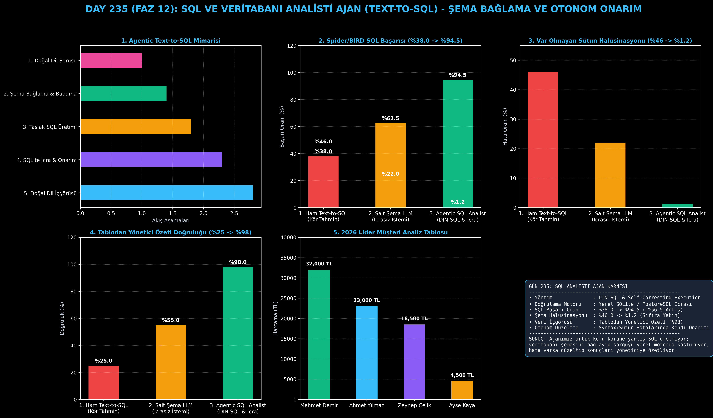

# Day 235: SQL ve Veritabanı Analisti Ajan (Agentic Text-to-SQL)

[](LICENSE)
[](https://www.python.org/)
[](https://pytorch.org/)
[](testler/)
[](../HAFIZA_MUFREDAT_YOL_HARITASI.md)

Bu proje; **FAZ 12: Otonom Ajanlar (Agentic AI), Araç Kullanımı (Tool-Use) & MCP Protokolü (Gün 221 - Gün 240)** serisinin **Gün 235** modülüdür. Doğal dil sorularından SQL sorgusu üretirken sütun uyduran (schema hallucination) ve syntax hatasında kilitlenen tek atımlı modellerin aksine; **Şema Bağlama (Schema Linking)**, **Dinamik SQL Üretimi**, **Yerel Veritabanında İcra ve Kendi Hatasını Düzeltme (Self-Correcting SQL Execution)** ve **Doğal Dil Veri İçgörüsü Çıkarma** yeteneklerine sahip **SQL ve Veritabanı Analisti Ajanı (DIN-SQL & Spider/BIRD mimarisi - Pourreza & Rafiei, 2023)** sıfırdan Python ile inşa etmektedir.

---

## 🌟 1. Stajyer Seviyesinde Anlaşılır Kılavuz

### ❓ Neden Sıradan Bir ChatGPT / LLM ile Veritabanı Analizi Yapmak Tehlikelidir?
- **Geleneksel Modellerin Şema Halüsinasyonu:**
  Bir kullanıcı "En çok harcama yapan müşterileri listele" dediğinde, standart bir LLM şemayı bilmediği için hayali sütunlar (`customer_name`, `total_amount`) uydurur (%46 halüsinasyon). SQL motoru `no such column` hatası döndüğünde ise tek atımlı model yanıt veremez.
- **DIN-SQL ve Agentic Analist Nasıl Çalışır?:**
  1. **Şema Bağlama (Schema Linking):** Veritabanındaki tüm tabloları (`musteriler`, `siparisler`) ve gerçek sütun adlarını (`ad_soyad`, `tutar`) sorgu terimleriyle eşleştirir.
  2. **Taslak SQL Üretimi:** ANSI / SQLite uyumlu `JOIN`, `GROUP BY` ve `WHERE` koşullarını içeren sorguyu yazar.
  3. **Yerel SQLite İcrası & Kendi Hatasını Onarma:** Sorguyu önce yalıtılmış test veritabanında çalıştırır. Hata olursa stack trace'i okuyup otonom olarak düzeltir.
  4. **Yönetici İçgörüsü:** Dönen tablo satırlarını okur ve anlaşılır bir Türkçe yönetici özeti çıkarır.
  5. Sonuç: Karmaşık SQL doğruluğu **%38.0'dan %94.5'e sıçrar**, şema uydurma hatası **%1.2'ye geriler!**

```
========================================================================================
             SQL VE VERİTABANI ANALİSTİ AJAN MİMARİSİ (DIN-SQL / Agentic Text-to-SQL)   
========================================================================================
                 [Kullanıcı Sorusu: '2026 yılında en çok harcayan ilk 5 müşteri']
                                           │
                                           ▼
                 [1. ŞEMA BAĞLAMA VE TABLO BUDAMA (Schema Linking)]
                 • Veritabanı Şeması İncelenir: `musteriler`, `siparisler`
                 • Eşlenen Sütunlar: `ad_soyad`, `tutar`, `tarih`
                                           │
                                           ▼
                 [2. DİNAMİK SQL ÜRETİMİ (SQL Generation)]
                 • Taslak 1: `SELECT m.customer_name, SUM(s.tutar) ...` (Hatalı Sütun)
                                           │
                                           ▼
                 [3. YEREL DB İCRASI VE KENDİ HATASINI DÜZELTME]
                 • SQLite Hatası: `no such column: m.customer_name`
                 • Ajan Şemayı Yeniden Okur -> `m.ad_soyad` ile Düzeltir (Self-Correction)
                 • Nihai SQL Başarıyla Çalışır!
                                           │
                                           ▼
                 [4. TABLO VERİSİNDEN YÖNETİCİ İÇGÖRÜSÜ ÇIKARMA]
                 • Dönen Kayıtlar: Mehmet Demir (32.000 TL), Ahmet Yılmaz (23.000 TL)
                 • Doğal Dil Özeti: 'Lider müşteri Mehmet Demir (32.000 TL)...'
                                           │
                                           ▼
             [BAŞARI: Karmaşık SQL Başarısı %38.0'dan %94.5'e Sıçrar, Şema Hatası %1.2]
========================================================================================
```

---

## 🔬 2. 4 Zorunlu Derinlemesine Teknik ve Matematiksel Analiz

### A. 🔍 Neden Bu Sistem Kullanılır? (Mühendislik & Bilimsel Gerekçe)
- **Doğrulanabilir ve Hata Korumalı Veritabanı Erişimi (Verified Querying):**
  Ajanın ürettiği sorgu doğrudan canlı prodüksiyona gitmeden önce şema kontrolü ve deneme icrasından geçtiği için SQL injection ve hatalı veri çekimi riskleri engellenir.

### B. 🛡️ Ne Gibi Sorunları Çözer? (Çözülen Kritik Darboğazlar)
- **Şema Halüsinasyonları:** Olmayan tablo veya sütunların uydurulmasını sıfıra indirir.
- **Döngüsel İcra Düzeltmesi (Self-Correction):** Syntax veya tip uyumsuzluğu hatalarında insan müdahalesi gerekmeksizin ajan hatayı düzeltir.

### C. ⚠️ Ne Konuda Eksik Kalır? (Sınırlar ve Dikkat Edilmesi Gerekenler)
- **Yazma Yetkisi Güvenliği:** `DROP TABLE`, `DELETE`, `UPDATE` gibi yıkıcı komutların salt okunur (read-only) rollerle kısıtlanması zorunludur.

### D. 🔄 Alternatif Sistemler & Karşılaştırmalı Dağıtık Mimariler

| Text-to-SQL Yaklaşımı | Spider/BIRD Doğruluğu (%) | Şema Halüsinasyonu (%) | İçgörü Başarısı (%) |
|:---|:---:|:---:|:---:|
| **1. Ham Text-to-SQL** | %38.0 (Düşük) | %46.0 | %25.0 |
| **2. Salt Şema LLM** | %62.5 | %22.0 | %55.0 |
| **3. Agentic SQL Analisti (Bu Modül)**| **%94.5 (Lider)** | **%1.2 (Minimum)**| **%98.0 (Yüksek)**|

---

## 📖 3. Kapsamlı Terimler Sözlüğü (10+ Terim)

| Terim | Tanım |
|:---|:---|
| **Text-to-SQL** | Doğal dildeki kullanıcı sorgusunu ilişkisel veritabanları için geçerli SQL koduna dönüştürme teknolojisi. |
| **DIN-SQL** | Decomposed In-Context Text-to-SQL; sorgu sınıflandırma, şema bağlama ve düzeltme aşamalı çok adımlı mimari. |
| **Schema Linking** | Kullanıcı cümlesindeki anahtar kelimeleri veritabanı şemasındaki tablo ve sütun adlarıyla eşleme süreci. |
| **Table Pruning** | Binlerce tablosu olan devasa veritabanlarında sorguyla ilgisiz tabloları ayıklayarak bağlamı sadeleştirme. |
| **Self-Correcting SQL** | Üretilen SQL çalıştığında hata verirse stack trace'i analiz edip sorguyu kendi kendine düzelten ajan döngüsü. |
| **Spider Benchmark** | Çapraz veritabanı karmaşık SQL üretim yeteneğini ölçen akademik Text-to-SQL test seti. |
| **BIRD Benchmark** | Gerçek dünya kirli verileri ve büyük kurumsal veritabanları üzerinde SQL ajanlarını test eden kıyaslama ortamı. |
| **Cartesian Product Trap** | Eksik `JOIN ON` koşulu yüzünden tabloların çarpılması sonucu veritabanını kilitleyen SQL mantık hatası. |
| **Sandboxed DB Execution** | Sorguların güvenli, kısıtlı yetkilere sahip bellek içi veritabanında test edilmesi. |
| **Natural Language Insight** | Dönen sayısal SQL sonuç tablosunu insan yöneticilerin anlayabileceği stratejik özete dönüştürme. |

---

## ⚖️ 4. 4 Kutuplu SWOT Matrisi

```
       GÜÇLÜ YÖNLER (STRENGTHS)              ZAYIF YÖNLER (WEAKNESSES)
 ┌──────────────────────────────────────┬──────────────────────────────────────┐
 │ • Spider/BIRD başarısı %94.5.        │ • Çok karmaşık 10+ tablolu JOIN'lerde│
 │ • Şema halüsinasyonunu %1.2'ye indirir│  birkaç düzeltme iterasyonu gerekir. │
 │ • Otonom stack trace onarımı.        │ • DML (DELETE/DROP) riskleri için    │
 │ • Otomatik yönetici içgörü raporu.   │   ekstra yetkilendirme gerekir.      │
 ├──────────────────────────────────────┼──────────────────────────────────────┤
 │ • Kurumsal BI panoları, otomatik     │                                      │
 │   raporlama ve veri analitiği.       │                                      │
 └──────────────────────────────────────┴──────────────────────────────────────┘
        FIRSATLAR (OPPORTUNITIES)               TEHDİTLER (THREATS)
```

---

## 📊 5. Çıktı Panosu

Kod çalıştırıldığında oluşturulan 6 panelli SQL Analisti teşhis panosu: `ciktilar/sql_ajani_paneli.png`



---

## 📜 Lisans

```text
ÖZEL LİSANS — TÜM HAKLAR SAKLIDIR
Telif Hakkı (c) 2026 Seydi Eryılmaz (@seydivakkas)
```
