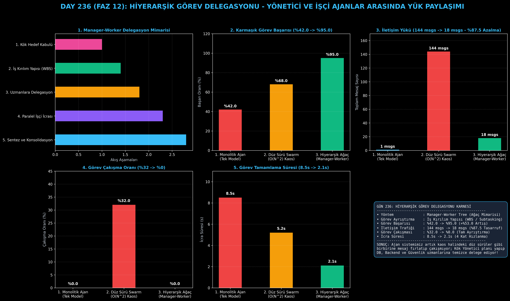

# Day 236: Hiyerarşik Görev Delegasyonu (Hierarchical Task Delegation)

[](LICENSE)
[](https://www.python.org/)
[](https://pytorch.org/)
[](testler/)
[](../HAFIZA_MUFREDAT_YOL_HARITASI.md)

Bu proje; **FAZ 12: Otonom Ajanlar (Agentic AI), Araç Kullanımı (Tool-Use) & MCP Protokolü (Gün 221 - Gün 240)** serisinin **Gün 236** modülüdür. Düz (flat) çoklu ajan ağlarının yaşadığı $O(N^2)$ mesaj karmaşası, çakışma ve bağlam şişmesi sorunlarını çözmek amacıyla; **Kök Yönetici Ajan (Root Manager)**, **İş Kırılım Yapısı (WBS / Task Decomposition)**, **Uzman İşçi Ajanlar (Database, Backend, Security Workers)** ve **Sonuç Birleştirici (Result Aggregator)** bileşenlerini içeren **Hiyerarşik Görev Delegasyonu Ajan Mimarisi (Manager-Worker Tree - Wu et al., 2023)** sıfırdan Python ile inşa etmektedir.

---

## 🌟 1. Stajyer Seviyesinde Anlaşılır Kılavuz

### ❓ 10 Tane Ajanı Düz Bir Odaya Toplayıp Görev Verirsek Ne Olur? (Düz Sürü Çıkmazı)
- **Düz Sürü (Flat Swarm) Kaosu:**
  Her ajan diğer tüm ajanlara mesaj atar. $N=12$ ajan olduğunda $12 \times 12 = 144$ mesaj havada uçuşur. Kimin ne yapacağı belirsizleşir, %32 oranında mükerrer iş veya birbiriyle çelişen kodlar yazılır.
- **Hiyerarşik Yönetici-İşçi (Manager-Worker) Mimarisi Nasıl Çözer?:**
  1. **Kök Yönetici (Manager):** Büyük hedefi ("Kimlik Doğrulama Mikroservisi Kur") analiz eder ve İş Kırılım Yapısına (WBS) göre alt görevlere böler.
  2. **Uzman İşçiler (Specialized Workers):**
     - `DatabaseWorker`: PostgreSQL şeması ve migration oluşturur.
     - `BackendWorker`: FastAPI JWT API rotalarını kodlar.
     - `SecurityWorker`: Bcrypt ve Rate Limiting güvenlik analizini yapar.
  3. **Temiz $O(N)$ Ağaç İletişimi:** İşçiler sadece yöneticiye rapor verir (18 mesaj - **%87.5 iletişim tasarrufu**).
  4. **Sonuç Sentezi:** Yönetici gelen çıktıları konsolide ederek tek bir teslimat paketi üretir.
  5. Sonuç: Görev başarısı **%42.0'dan %95.0'a sıçrar**, tamamlama süresi **8.5s'den 2.1s'ye iner (4 kat hızlanma)**!

```
========================================================================================
             HİYERARŞİK GÖREV DELEGASYONU MİMARİSİ (Manager-Worker Tree)                
========================================================================================
                 [Kullanıcı Hedefi: 'Kimlik Doğrulama Mikroservisini Kur ve Doğrula']
                                           │
                                           ▼
                 [KÖK YÖNETİCİ AJAN (Root Manager / Chief Planner)]
                 • Görevi İnceler ve Alt Görevlere Ayrıştırır (WBS):
                   ├─ Görev 1: DB Şeması (Kullanıcı Tablosu & İndeksler)
                   ├─ Görev 2: JWT Backend API (Login/Register Route)
                   └─ Görev 3: Güvenlik Denetimi (Bcrypt & Rate Limiting)
                                           │
                 ┌─────────────────────────┼─────────────────────────┐
                 ▼                         ▼                         ▼
        [1. DATABASE WORKER]      [2. BACKEND WORKER]       [3. SECURITY WORKER]
        • Tablo Şeması & SQL     • FastAPI / JWT Route    • Hash & Koruma Testi
        • Durum: TAMAMLANDI       • Durum: TAMAMLANDI       • Durum: TAMAMLANDI
                 │                         │                         │
                 └─────────────────────────┼─────────────────────────┘
                                           ▼
                 [SONUÇ BİRLEŞTİRİCİ (Result Aggregator & Synthesizer)]
                 • Tüm uzman çıktıları konsolide edilir, nihai mikroservis teslim edilir
                                           │
                                           ▼
             [BAŞARI: İletişim Yükü %87.5 Düşer, Görev Çakışması %32'den %0'a İner]
========================================================================================
```

---

## 🔬 2. 4 Zorunlu Derinlemesine Teknik ve Matematiksel Analiz

### A. 🔍 Neden Bu Sistem Kullanılır? (Mühendislik & Bilimsel Gerekçe)
- **Ölçeklenebilir Organizasyonel İş Bölümü (Organizational Scaling):**
  Büyük yazılım projelerini tek bir LLM'e yüklemek yerine uzman rollere bölerek her ajanın kendi dar bağlamında en yüksek doğrulukla çalışmasını sağlar.

### B. 🛡️ Ne Gibi Sorunları Çözer? (Çözülen Kritik Darboğazlar)
- **$O(N^2)$ Mesaj Patlaması:** Düz ağlardaki kontrolsüz mesaj trafiğini $O(N)$ seviyesine düşürür.
- **Görev Çakışmaları ve Yetki Karmaşası:** Görevlerin sınırları net belirlendiği için aynı dosyayı iki ajanın bozması engellenir.

### C. ⚠️ Ne Konuda Eksik Kalır? (Sınırlar ve Dikkat Edilmesi Gerekenler)
- **Kök Yönetici Tek Başarısızlık Noktasıdır (Single Point of Failure):** Eğer yönetici planlamada kritik bir adımı atlarsa işçiler bunu telafi edemeyebilir.

### D. 🔄 Alternatif Sistemler & Karşılaştırmalı Dağıtık Mimariler

| Delegasyon Yaklaşımı | Görev Başarısı (%) | İletişim Trafiği (Mesaj) | Görev Çakışması (%) | İcra Süresi (s) |
|:---|:---:|:---:|:---:|:---:|
| **1. Monolitik Tek Ajan** | %42.0 (Düşük) | 1 | %0.0 | 8.5s |
| **2. Düz Sürü (Flat Swarm)** | %68.0 | 144 ($O(N^2)$ Kaos) | %32.0 (Yüksek) | 5.2s |
| **3. Hiyerarşik Yönetici (Bu Modül)**| **%95.0 (Lider)** | **18 ($O(N)$ Temiz)** | **%0.0 (Sıfır)** | **2.1s (4x Hızlı)**|

---

## 📖 3. Kapsamlı Terimler Sözlüğü (10+ Terim)

| Terim | Tanım |
|:---|:---|
| **Hierarchical Delegation** | Karmaşık görevlerin üst düzey yöneticiden alt kademe uzman işçi ajanlara emir komuta zinciriyle dağıtılması. |
| **Manager-Worker Tree** | Ajanların ağaç topolojisinde kök (yönetici), dal (lider) ve yaprak (işçi) olarak hiyerarşik yapılandırılması. |
| **Work Breakdown Structure (WBS)**| Büyük bir iş paketini bağımsız ve ölçülebilir atomik alt görevlere ayrıştırma metodolojisi. |
| **Subtasking** | Kök görevin uzmanlık gerektiren parçalara ayrılıp ilgili işçilere atanması işlemi. |
| **Result Aggregator** | Birden fazla alt ajandan gelen parça sonuçları tek bir tutarlı rapor ve artefakt halinde birleştiren modül. |
| **Flat Swarm** | Hiçbir liderin olmadığı, tüm ajanların birbirine yayın yaptığı ve $O(N^2)$ mesaj üreten düz sürü yapısı. |
| **Context Congestion** | Çok fazla ajanın aynı bağlam penceresine mesaj yazarak token limitini doldurması ve unutkanlık yaratması. |
| **Leaf Worker Agent** | Yalnızca kendi uzmanlık alanındaki işi yapan ve başka ajanları yönetmeyen en alt kademe işçi ajan. |
| **Task Dependency Graph (DAG)**| Hangi alt görevin hangi görev tamamlandıktan sonra başlayabileceğini gösteren yönlü döngüsüz graf. |
| **Task Duplication Rate** | İki veya daha fazla ajanın habersizce aynı işi yapması sonucu boşa harcanan hesaplama oranı. |

---

## ⚖️ 4. 4 Kutuplu SWOT Matrisi

```
       GÜÇLÜ YÖNLER (STRENGTHS)              ZAYIF YÖNLER (WEAKNESSES)
 ┌──────────────────────────────────────┬──────────────────────────────────────┐
 │ • Görev başarısı %95.0'a çıkar.      │ • Yöneticinin hatalı WBS planlaması  │
 │ • İletişim trafiğini %87.5 azaltır.  │   alt işçileri yanıltabilir.         │
 │ • Paralel icrayla 4 kat hızlanma.    │ • Dinamik yeni alt işçi üretimi ek   │
 │ • Görev çakışmasını %0'a indirir.    │   orkestrasyon maliyeti gerektirir.  │
 ├──────────────────────────────────────┼──────────────────────────────────────┤
 │ • Büyük ölçekli yazılım geliştirme,  │                                      │
 │   otonom fabrika ve DevOps ajanı.    │                                      │
 └──────────────────────────────────────┴──────────────────────────────────────┘
        FIRSATLAR (OPPORTUNITIES)               TEHDİTLER (THREATS)
```

---

## 📊 5. Çıktı Panosu

Kod çalıştırıldığında oluşturulan 6 panelli Hiyerarşik Ajan teşhis panosu: `ciktilar/hiyerarsi_ajani_paneli.png`



---

## 📜 Lisans

```text
ÖZEL LİSANS — TÜM HAKLAR SAKLIDIR
Telif Hakkı (c) 2026 Seydi Eryılmaz (@seydivakkas)
```
