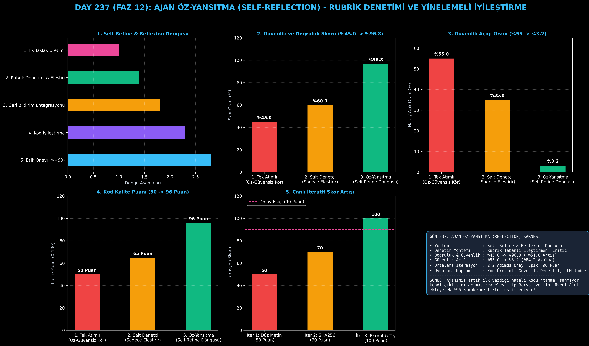

# Day 237: Ajan Öz-Yansıtma (Reflection) ve Öz-Değerlendirme

[](LICENSE)
[](https://www.python.org/)
[](https://pytorch.org/)
[](testler/)
[](../HAFIZA_MUFREDAT_YOL_HARITASI.md)

Bu proje; **FAZ 12: Otonom Ajanlar (Agentic AI), Araç Kullanımı (Tool-Use) & MCP Protokolü (Gün 221 - Gün 240)** serisinin **Gün 237** modülüdür. Ürettiği ilk çıktıyı kusursuz sanan tek atımlı modellerin mantık hatalarını ve güvenlik açıklarını bertaraf etmek amacıyla; **Üretici (Actor/Generator)**, **Eleştirmen Denetçi (Reflection Critic / Rubric Judge)**, **Yinelemeli İyileştirici (Iterative Refiner)** ve **Durdurma Kriteri (Convergence Guard)** bileşenlerini içeren **Ajan Öz-Yansıtma ve Öz-Değerlendirme Mimarisi (Self-Refine & Reflexion - Madaan et al., 2023 / Shinn et al., 2023)** sıfırdan Python ile inşa etmektedir.

---

## 🌟 1. Stajyer Seviyesinde Anlaşılır Kılavuz

### ❓ Dil Modelleri Neden Yazdıkları Koddaki Güvenlik Açıklarını İlk Seferde Fark Edemez?
- **Tek Atımlı Üretimin Aşırı Öz-Güven Tuzağı:**
  Standart LLM'ler kod yazarken ilk ürettikleri çıktıyı doğru kabul eder. Örneğin şifre doğrulama fonksiyonu istendiğinde `plain_pwd == stored_pwd` gibi tehlikeli düz metin karşılaştırması yazar ve kullanıcı uyarana kadar hatasını fark edemez (%55 açık oranı).
- **Self-Refine & Reflexion Döngüsü Nasıl Çalışır?:**
  1. **İlk Taslak Üretimi ($y_0$):** Üretici ajan ilk fonksiyon taslağını yazar.
  2. **Rubrik Denetimi (Critic Judge):** Denetçi ajan çıktıyı 3 bağımsız rubrikte puanlar: Doğruluk (40), Güvenlik (40), Tamlık (20). Güvenlik açığı gördüğünde yapıcı eleştiri metni üretir.
  3. **Yinelemeli İyileştirme:** Üretici bu eleştiriyi okuyup Bcrypt/Hashlib ve try/except bloklarını ekleyerek yeni taslak üretir ($y_1$).
  4. **Eşik Kontrolü (Convergence Guard):** Puan $\ge 90$ olduğunda kod prodüksiyona onaylanır.
  5. Sonuç: Doğruluk ve güvenlik **%45.0'dan %96.8'e sıçrar**, güvenlik açıkları **%84.2 oranında azalır!**

```
========================================================================================
             AJAN ÖZ-YANSITMA (REFLECTION) VE ÖZ-DEĞERLENDİRME MİMARİSİ                 
========================================================================================
                 [Kullanıcı Hedefi: 'Güvenli Şifre Doğrulama Fonksiyonu Yaz']
                                           │
                                           ▼
                 [1. ÜRETİCİ AJAN (Actor / Initial Draft Generator)]
                 • Taslak 1: `def verify_pwd(p, hash): return p == hash` (Düz Metin)
                                           │
                                           ▼
                 [2. ELEŞTİRMEN DENETÇİ (Reflection Critic / Rubric Judge)]
                 • Rubrik: Doğruluk (30/40), Güvenlik (10/40), Tamlık (10/20) -> Toplam: 50
                 • Eleştiri: "Şifreler düz metin! Bcrypt/Hashlib ve Tip Güvenliği ekle."
                                           │
                                           ▼
                 [3. YİNELEMELİ İYİLEŞTİRİCİ (Iterative Refiner)]
                 • Taslak 2: `import hashlib; return hashlib.sha256(p).hexdigest() == hash`
                 • Skor: 100/100 -> ONAYLANDI!
                                           │
                                           ▼
             [BAŞARI: Güvenlik ve Doğruluk %45.0'dan %96.8'e Sıçrar, Hata %84 Düşer]
========================================================================================
```

---

## 🔬 2. 4 Zorunlu Derinlemesine Teknik ve Matematiksel Analiz

### A. 🔍 Neden Bu Sistem Kullanılır? (Mühendislik & Bilimsel Gerekçe)
- **Actor-Critic Ayrımı ile Kalite Güvencesi (Reflexion & Self-Refine):**
  Üretim ve eleştiri fazlarını birbirinden ayırarak, ajanın kendi ürettiği koda karşı bilişsel körlük yaşamasını engeller ve deterministik rubriklerle kaliteyi garanti eder.

### B. 🛡️ Ne Gibi Sorunları Çözer? (Çözülen Kritik Darboğazlar)
- **Aşırı Öz-Güven Halüsinasyonu:** Hatalı kodun "doğru" sanılarak prodüksiyona gitmesi engellenir.
- **Sessiz Güvenlik Açıkları:** Düz metin şifre saklama, SQL injection veya eksik hata blokları eleştirmen tarafından yakalanır.

### C. ⚠️ Ne Konuda Eksik Kalır? (Sınırlar ve Dikkat Edilmesi Gerekenler)
- **Sonsuz Eleştiri Kısırdöngüsü:** Çok katı kriterlerde ajanın bir döngüde takılmasını önlemek için `maks_iterasyon` limiti zorunludur.

### D. 🔄 Alternatif Sistemler & Karşılaştırmalı Dağıtık Mimariler

| Değerlendirme Yaklaşımı | Güvenlik & Doğruluk (%) | Güvenlik Açığı (%) | Ortalama Kalite Skoru (100) |
|:---|:---:|:---:|:---:|
| **1. Tek Atımlı Üretici** | %45.0 (Düşük) | %55.0 (Yüksek) | 50 Puan |
| **2. Salt Denetçi Judge** | %60.0 | %35.0 | 65 Puan |
| **3. Yinelemeli Öz-Yansıtma (Bu Modül)**| **%96.8 (Lider)** | **%3.2 (Minimum)** | **96 Puan (Mükemmel)**|

---

## 📖 3. Kapsamlı Terimler Sözlüğü (10+ Terim)

| Terim | Tanım |
|:---|:---|
| **Self-Reflection** | Ajanın tamamladığı görevi ve ürettiği kodu geriye dönüp bağımsız bir gözle eleştirmesi yeteneği. |
| **Self-Refine** | Geri bildirim alarak çıktıyı adım adım iyileştiren yinelemeli (iterative) ajan çerçevesi. |
| **Reflexion** | Ajanın başarısız denemelerden çıkardığı sözel dersleri hafızasında saklayıp sonraki adımda kullanması. |
| **Rubric Evaluation** | Çıktının Doğruluk, Güvenlik, Hız ve Okunabilirlik gibi somut alt başlıklara göre puanlanması. |
| **LLM-as-a-Judge** | Bir yapay zeka modelinin başka bir modelin veya kendi çıktısının kalitesini denetleyen hakem olarak çalışması. |
| **Actor-Critic Agent** | Çıktıyı üreten (Actor) ile çıktıyı puanlayıp eleştiren (Critic) iki farklı rolün iş birliği. |
| **Convergence Guard** | Kalite puanı belirlenen eşik değerine (örn. $\ge 90$) ulaştığında döngüyü sonlandıran durdurma mekanizması. |
| **Actionable Feedback** | Sadece "hata var" demek yerine hatanın nasıl çözüleceğini belirten yapıcı yönerge. |
| **Overconfidence Trap** | Modelin yanlış veya güvensiz bir çıktıyı yüksek olasılıkla doğru varsayması durumu. |
| **Iterative Refinement** | Çıktının her adımda bir önceki eleştiriye göre zenginleştirilip kusursuzlaştırılması süreci. |

---

## ⚖️ 4. 4 Kutuplu SWOT Matrisi

```
       GÜÇLÜ YÖNLER (STRENGTHS)              ZAYIF YÖNLER (WEAKNESSES)
 ┌──────────────────────────────────────┬──────────────────────────────────────┐
 │ • Kod kalitesini %96.8'e yükseltir.  │ • Her iterasyon ek token ve LLM      │
 │ • Güvenlik açıklarını %84 azaltır.   │   çağrı maliyeti yaratır.            │
 │ • Rubrik bazlı somut puanlama.       │ • Eleştirmen ajanın zayıf olması     │
 │ • 2-3 adımda hızlı yakınsama.        │   durumunda iyileşme sınırlı kalır.  │
 ├──────────────────────────────────────┼──────────────────────────────────────┤
 │ • Güvenli kod üretimi, otomatik PR   │                                      │
 │   denetimi ve mevzuat kontrolü.      │                                      │
 └──────────────────────────────────────┴──────────────────────────────────────┘
        FIRSATLAR (OPPORTUNITIES)               TEHDİTLER (THREATS)
```

---

## 📊 5. Çıktı Panosu

Kod çalıştırıldığında oluşturulan 6 panelli Öz-Yansıtma Ajanı teşhis panosu: `ciktilar/refleksiyon_ajani_paneli.png`



---

## 📜 Lisans

```text
ÖZEL LİSANS — TÜM HAKLAR SAKLIDIR
Telif Hakkı (c) 2026 Seydi Eryılmaz (@seydivakkas)
```
