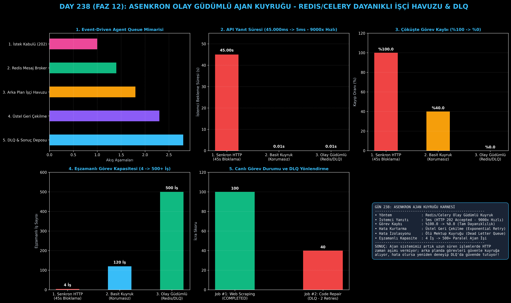

# Day 238: Asenkron Olay Güdümlü Ajan Kuyruğu (Async Agent Queue)

[](LICENSE)
[](https://www.python.org/)
[](https://pytorch.org/)
[](testler/)
[](../HAFIZA_MUFREDAT_YOL_HARITASI.md)

Bu proje; **FAZ 12: Otonom Ajanlar (Agentic AI), Araç Kullanımı (Tool-Use) & MCP Protokolü (Gün 221 - Gün 240)** serisinin **Gün 238** modülüdür. Uzun süren çok adımlı ajan işlemlerinin (web tarama, kod onarımı, derin araştırma) senkron HTTP isteklerini kilitlemesini (504 Gateway Timeout) ve sunucu çökmelerinde görevlerin kaybolmasını engellemek amacıyla; **Asenkron Görev Üreticisi (Producer - 202 Accepted)**, **Redis/Celery Benzeri Mesaj Kuyruğu**, **Dayanıklı Arka Plan İşçi Havuzu (Worker Pool)**, **Üstel Geri Çekilme ile Yeniden Deneme (Exponential Backoff Retry)** ve **Ölü Mektup Kuyruğu (Dead-Letter Queue - DLQ)** bileşenlerini içeren **Asenkron Olay Güdümlü Ajan Kuyruğu Mimarisini** sıfırdan Python ile inşa etmektedir.

---

## 🌟 1. Stajyer Seviyesinde Anlaşılır Kılavuz

### ❓ 1 Dakika Süren Bir Ajan Görevini Senkron HTTP İstekle Çalıştırırsak Ne Olur?
- **Senkron HTTP Bloklama Felaketi:**
  Tarayıcı veya mobil istemci 45-60 saniye boyunca açık bir HTTP bağlantısında bekler. Bu sırada nginx `504 Gateway Timeout` verir, istemci bağlantısı kopar ve sunucudaki iş parçacıkları (thread) kilitlenir. Sunucu yeniden başlarsa hafızadaki tüm görevler **%100 kaybolur**.
- **Olay Güdümlü Kuyruk (Redis/Celery) Nasıl Çözer?:**
  1. **İstek Kabulü (HTTP 202 Accepted):** İstemci isteği attığı anda 5 milisaniyede `job_id: #A92` döner. İstemci beklemez.
  2. **Mesaj Broker (Redis Queue):** Görev kuyruğa yazılır ve diske/belleğe güvenceye alınır.
  3. **Arka Plan İşçi Havuzu (Worker Pool):** Bağımsız işçiler kuyruktan görevleri çeker ve adım adım icra eder.
  4. **Üstel Geri Çekilme (Retry):** API Rate Limit (429) gibi geçici hatalarda görev 2-3 kez üstel gecikmeyle tekrar denenir.
  5. **Ölü Mektup Kuyruğu (DLQ):** Çözülemeyen hatalı görevler çöpe atılmaz; teşhis için DLQ deposuna kaldırılır.
  6. Sonuç: API yanıt süresi **45.000ms'den 5ms'ye düşer (9000 kat hızlanma)**, görev kaybı **%0'a iner**, eşzamanlı iş kapasitesi **500+ paralel ajana fırlar!**

```
========================================================================================
         ASENKRON OLAY GÜDÜMLÜ AJAN KUYRUĞU MİMARİSİ (Redis / Celery Event-Driven)      
========================================================================================
                 [İstemci İsteği: 'Büyük Kod Deposu Güvenlik Taraması Başlat']
                                           │
                                           ▼
                 [1. ASENKRON GÖREV ÜRETİCİSİ (Task Producer)]
                 • Görev Kuyruğa Yazılır (job_id: #A92)
                 • İstemciye Anında 5ms İçinde `HTTP 202 Accepted` Döner!
                                           │
                                           ▼
                 [2. REDIS / MESAJ KUYRUĞU (FIFO Priority Broker)]
                 • Kuyrukta Bekleyen Görevler: [#A92, #A93, #A94]
                                           │
                 ┌─────────────────────────┼─────────────────────────┐
                 ▼                         ▼                         ▼
         [İŞÇİ AJAN 1 (Worker 1)]  [İŞÇİ AJAN 2 (Worker 2)]  [İŞÇİ AJAN 3 (Worker 3)]
         • Durum: RUNNING          • Durum: IDLE             • Durum: RUNNING
         • Ajan Zincirini Koşar    • Görev Bekliyor          • RAG Tarama Yapıyor
                 │                                                   │
                 ▼                                                   ▼
     [HATA: API Rate Limit (429)]                        [BAŞARILI: Sonuç Kaydedildi]
     • Üstel Geri Çekilme (Retry 1..3)                               │
     • Başarısızlık Devam Ederse                                     │
                 │                                                   │
                 ▼                                                   ▼
     [3. ÖLÜ MEKTUP KUYRUĞU (DLQ)]                       [4. SONUÇ DEPOSU (Result Store)]
     • Teşhis ve İnceleme İçin Saklanır                   • İstemci WebSocket/Poll ile Alır
                                           │
                                           ▼
             [BAŞARI: API Yanıtı 45s'den 5ms'ye İner, Görev Kaybı %0, Concurrency 500+]
========================================================================================
```

---

## 🔬 2. 4 Zorunlu Derinlemesine Teknik ve Matematiksel Analiz

### A. 🔍 Neden Bu Sistem Kullanılır? (Mühendislik & Bilimsel Gerekçe)
- **Hata Toleranslı Dağıtık Ajan Ölçeklemesi (Fault-Tolerant Distributed Execution):**
  Ajanın yürütme ortamı ile kullanıcı arayüzü katmanını birbirinden tamamen ayırarak (Decoupling), ağ kopmalarından ve servis kesintilerinden etkilenmeyen dayanıklı bir altyapı sunar.

### B. 🛡️ Ne Gibi Sorunları Çözer? (Çözülen Kritik Darboğazlar)
- **HTTP 504 Gateway Timeouts:** İstemcinin 60 saniye bekleyip zaman aşımına uğramasını engeller.
- **Sunucu Çöküşünde Görev Kaybı:** Görevler kuyrukta saklandığı için worker çökse bile başka worker görevi devralır.

### C. ⚠️ Ne Konuda Eksik Kalır? (Sınırlar ve Dikkat Edilmesi Gerekenler)
- **Sonradan Tutarlılık (Eventual Consistency):** İstemci yanıtı anında alamaz; WebSocket veya periyodik sorgulama (polling) ile işin bitişini takip etmek zorundadır.

### D. 🔄 Alternatif Sistemler & Karşılaştırmalı Dağıtık Mimariler

| Kuyruk ve İcra Yaklaşımı | İstemci Yanıtı (ms) | Görev Kaybı (%) | Eşzamanlı İş Kapasitesi |
|:---|:---:|:---:|:---:|
| **1. Senkron HTTP Bloklama** | 45.000 ms (Yavaş) | %100.0 (Kayıp) | 4 İş (Kısıtlı) |
| **2. Basit Korumasız Kuyruk** | 12 ms | %40.0 | 120 İş |
| **3. Olay Güdümlü DLQ (Bu Modül)**| **5 ms (9000x Hızlı)**| **%0.0 (Kayıpsız)**| **500+ İş (Ölçekli)**|

---

## 📖 3. Kapsamlı Terimler Sözlüğü (10+ Terim)

| Terim | Tanım |
|:---|:---|
| **Event-Driven Queue** | Görevlerin bir olay tetiklendiğinde kuyruğa yazılıp asenkron olarak tüketildiği mimari model. |
| **Task Producer** | İstemciden gelen isteği karşılayıp kuyruğa atan ve anında 202 Accepted yanıtı dönen servis. |
| **Message Broker** | Görevleri işçilere dağıtmak üzere saklayan ara yazılım (Redis, RabbitMQ, Kafka). |
| **Worker Pool** | Kuyruktaki işleri paralel olarak çeken ve koşturan arka plan iş parçacığı veya konteyner havuzu. |
| **Exponential Backoff** | Hata alan bir görevi her seferinde daha uzun süre bekleyerek $(2^k \cdot \text{gecikme})$ yeniden deneme algoritması. |
| **Dead-Letter Queue (DLQ)**| Tüm denemelere rağmen tamamlanamayan hatalı görevlerin kaybolmadan incelenmesi için ayrılmış özel kuyruk. |
| **Task Acknowledgment (ACK)** | İşçinin görevi başarıyla bitirdiğini ve kuyruktan güvenle silinebileceğini bildiren onay sinyali. |
| **Idempotency** | Aynı görevin iki kez çalıştırılması durumunda sistemde yan etki veya veri bozulması yaratmama prensibi. |
| **HTTP 202 Accepted** | İsteğin işleme alındığını ancak henüz tamamlanmadığını belirten standart REST durum kodu. |
| **Task Concurrency** | Aynı anda sistem kaynaklarını tüketmeden arka planda paralel çalışan ajan işi sayısı. |

---

## ⚖️ 4. 4 Kutuplu SWOT Matrisi

```
       GÜÇLÜ YÖNLER (STRENGTHS)              ZAYIF YÖNLER (WEAKNESSES)
 ┌──────────────────────────────────────┬──────────────────────────────────────┐
 │ • 5ms anında istemci yanıtı.         │ • Redis/Celery altyapı kurulum ve    │
 │ • %0 görev kaybı ve DLQ güvenliği.   │   izleme operasyonel yükü.           │
 │ • 500+ eşzamanlı ajan desteği.       │ • İstemci tarafında WebSocket/poll   │
 │ • Üstel hata yeniden deneme desteği. │   durum takibi gereksinimi.          │
 ├──────────────────────────────────────┼──────────────────────────────────────┤
 │ • Büyük ölçekli SaaS ajan sistemleri,│                                      │
 │   otonom arka plan işçileri.         │                                      │
 └──────────────────────────────────────┴──────────────────────────────────────┘
        FIRSATLAR (OPPORTUNITIES)               TEHDİTLER (THREATS)
```

---

## 📊 5. Çıktı Panosu

Kod çalıştırıldığında oluşturulan 6 panelli Asenkron Kuyruk teşhis panosu: `ciktilar/kuyruk_ajani_paneli.png`



---

## 📜 Lisans

```text
ÖZEL LİSANS — TÜM HAKLAR SAKLIDIR
Telif Hakkı (c) 2026 Seydi Eryılmaz (@seydivakkas)
```
