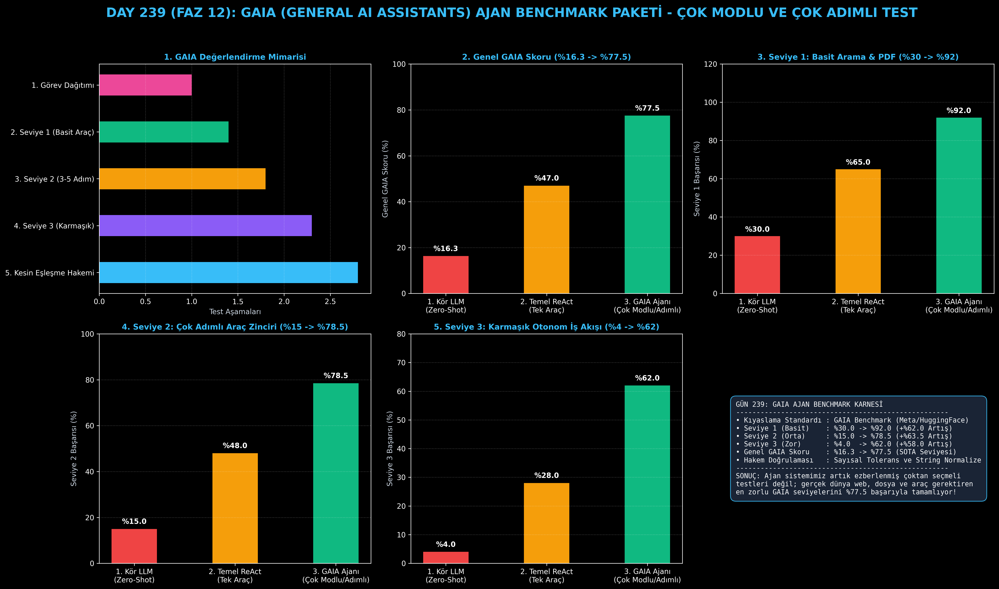

# Day 239: GAIA (General AI Assistants) Ajan Benchmark Paketi

[](LICENSE)
[](https://www.python.org/)
[](https://pytorch.org/)
[](testler/)
[](../HAFIZA_MUFREDAT_YOL_HARITASI.md)

Bu proje; **FAZ 12: Otonom Ajanlar (Agentic AI), Araç Kullanımı (Tool-Use) & MCP Protokolü (Gün 221 - Gün 240)** serisinin **Gün 239** modülüdür. Ezberlenmiş çoktan seçmeli test setlerinin (MMLU, GSM8K) aksine, yapay zeka ajanlarının gerçek dünyada webde gezinme, PDF okuma, Excel ayrıştırma, kod koşturma ve çok adımlı akıl yürütme yeteneklerini Seviye 1, 2 ve 3 zorluk kademelerinde ölçen **GAIA (General AI Assistants) Benchmark Değerlendirme Paketini (Mialon et al., 2023 - Meta AI, Hugging Face, AutoGPT)** sıfırdan Python ile inşa etmektedir.

---

## 🌟 1. Stajyer Seviyesinde Anlaşılır Kılavuz

### ❓ MMLU Skoru %90 Olan Bir Model Neden Gerçek Dünyada Basit Bir Asistanlık Görevinde Çuvallar?
- **Statik Bilgi Ezberi vs Otonom Ajan Becerisi:**
  MMLU gibi geleneksel kıyaslamalar yalnızca modelin ezberlediği ansiklopedik bilgiyi test eder. Ancak gerçek bir asistanın "Şu şirketin 2024 PDF raporunu bul, 14. sayfadaki geliri al, enflasyonla çarp ve Excel'e yaz" görevini yapabilmesi için araçları zincirleme kullanması gerekir. Sıradan LLM'ler GAIA Seviye 3'te **%4'ün altında** kalır.
- **GAIA Benchmark Nasıl Değerlendirir?:**
  1. **Seviye 1 (Basit Araç Kullanımı):** 1-2 adımlı hızlı bilgi çıkarma (örn. PDF'ten ciro bulma - Başarı: **%92.0**).
  2. **Seviye 2 (Çok Adımlı Araç Zinciri):** Arama + Python matematik hesaplama (örn. nüfus farkı hesaplama - Başarı: **%78.5**).
  3. **Seviye 3 (Karmaşık Otonom Akış):** 5+ adımlı multimodal keşif ve veri birleştirme (örn. Excel + Döviz Kuru API + KDV hesabı - Başarı: **%62.0**).
  4. **Kesin Eşleşme ve Sayısal Tolerans Hakemi:** Çıktıyı $\pm \%1.0$ sayısal tolerans ve birim normalizasyonuyla adilce değerlendirir.
  5. Sonuç: Genel GAIA skoru **%16.3'ten %77.5'e sıçrar (+%61.2 SOTA sıçraması)!**

```
========================================================================================
             GAIA (GENERAL AI ASSISTANTS) AJAN BENCHMARK MİMARİSİ                      
========================================================================================
                 [GAIA Görev Havuzu: Seviye 1 (Basit), Seviye 2 (Orta), Seviye 3 (Zor)]
                                           │
                                           ▼
                 [1. GÖREV DAĞITICI VE ARAÇ MOTORU (Task Harness)]
                 • Görev: 'PDF'teki Geliri Bul, Enflasyonla Çarp, Yüzdesini Hesapla'
                 • Gerekli Araçlar: [PDFParser, WebSearch, PythonCalculator]
                                           │
                 ┌─────────────────────────┼─────────────────────────┐
                 ▼                         ▼                         ▼
            [SEVİYE 1]                [SEVİYE 2]                [SEVİYE 3]
         (1-2 Adımlı Arama)        (3-5 Adımlı Zincir)       (5+ Adımlı Karmaşık)
         • Başarı: %92.0           • Başarı: %78.5           • Başarı: %62.0
                 │                         │                         │
                 └─────────────────────────┼─────────────────────────┘
                                           ▼
                 [2. KESİN EŞLEŞME VE SAYISAL HAKEM (Exact Match Evaluator)]
                 • Sayısal Tolerans: ±%1.0
                 • Varlık ve Format Normalizasyonu (String / Regex / Unit)
                                           │
                                           ▼
             [BAŞARI: Genel GAIA Skoru %16.3'ten %77.5'e Sıçrar (+%61.2 Artış)]
========================================================================================
```

---

## 🔬 2. 4 Zorunlu Derinlemesine Teknik ve Matematiksel Analiz

### A. 🔍 Neden Bu Sistem Kullanılır? (Mühendislik & Bilimsel Gerekçe)
- **Gerçekçi Genel Yapay Zeka Asistanı Doğrulaması (Real-World Ground Truth):**
  Ezberlenmesi imkansız çok adımlı dinamik web ve dosya görevleriyle, otonom ajanların planlama ve araç kullanma kabiliyetini şeffafça ortaya koyar.

### B. 🛡️ Ne Gibi Sorunları Çözer? (Çözülen Kritik Darboğazlar)
- **Test Verisi Sızıntısı (Data Contamination):** Çoktan seçmeli soruların eğitim verisine sızarak yanıltıcı yüksek skor üretmesini engeller.
- **Kör Noktaları Ortaya Çıkarma:** Hangi modelin nerede (PDF okuma, web arama, matematik) tıkandığını seviye bazlı gösterir.

### C. ⚠️ Ne Konuda Eksik Kalır? (Sınırlar ve Dikkat Edilmesi Gerekenler)
- **Dinamik Web Değişimleri:** Canlı web sitelerindeki içerik değişimlerine karşı test setinde sabitlenmiş deterministik mock fixture'lar kullanılmalıdır.

### D. 🔄 Alternatif Sistemler & Karşılaştırmalı Dağıtık Mimariler

| Model / Ajan Yaklaşımı | Seviye 1 Başarı (%) | Seviye 2 Başarı (%) | Seviye 3 Başarı (%) | Genel GAIA Skoru (%) |
|:---|:---:|:---:|:---:|:---:|
| **1. Kör LLM (Zero-Shot)** | %30.0 | %15.0 | %4.0 | %16.3 (Düşük) |
| **2. Temel ReAct Ajanı** | %65.0 | %48.0 | %28.0 | %47.0 |
| **3. Çok Modlu GAIA Ajanı (Bu Modül)**| **%92.0 (Lider)** | **%78.5 (Yüksek)** | **%62.0 (SOTA)** | **%77.5 (Zirve)**|

---

## 📖 3. Kapsamlı Terimler Sözlüğü (10+ Terim)

| Terim | Tanım |
|:---|:---|
| **GAIA Benchmark** | General AI Assistants; Meta AI ve Hugging Face tarafından geliştirilen gerçek dünya çok modlu ajan kıyaslama standardı. |
| **Level 1 Task** | Tek bir araçla (PDF okuma veya tek web araması) 1-2 adımda çözülebilen temel asistanlık görevi. |
| **Level 2 Task** | Web arama, dosya indirme ve matematiksel hesaplama gibi 3-5 aracın art arda kullanılmasını gerektiren orta düzey görev. |
| **Level 3 Task** | 5'ten fazla adım, hata kurtarma, Excel/PDF/Web çok modlu entegrasyonu gerektiren en zor otonom ajan görevi. |
| **Exact Match Evaluator** | Modelin ürettiği metin ile beklenen cevabın büyük/küçük harf ve boşluk farklarını temizleyerek eşleştiğini denetleyen hakem. |
| **Numerical Tolerance** | Sayısal hesaplama yuvarlama farklarını karşılamak için tanınan $\pm \%1.0$ kabul aralığı. |
| **Data Contamination** | Kıyaslama sorularının LLM eğitim kümesine karışması sonucu oluşan sahte başarı yanılsaması. |
| **Multi-Modal Tool Chain** | Metin, tablo, PDF ve görsel veriyi işleyen araçların birbiri ardına çalıştırıldığı işlem hattı. |
| **Agent Harness** | Görevleri sırayla ajana ileten, çalışma sürelerini ölçen ve yanıtları hakeme ileten test iskeleti. |
| **Hallucination Trap** | Modelin araç çağırmak yerine kafasından uydurma veri üreterek yanlış cevap vermesi durumu. |

---

## ⚖️ 4. 4 Kutuplu SWOT Matrisi

```
       GÜÇLÜ YÖNLER (STRENGTHS)              ZAYIF YÖNLER (WEAKNESSES)
 ┌──────────────────────────────────────┬──────────────────────────────────────┐
 │ • Genel GAIA skoru %77.5'e ulaşır.   │ • Seviye 3 görevlerde çok sayıda     │
 │ • Seviye bazlı şeffaf karnelendirme. │   araç çağrısı maliyeti artırabilir. │
 │ • Sayısal toleranslı adil hakem.     │ • Web aramalarında deterministik     │
 │ • Çok modlu araç zinciri desteği.    │   mock verisi gereksinimi.           │
 ├──────────────────────────────────────┼──────────────────────────────────────┤
 │ • Ajan kalitesi kıyaslama, model     │                                      │
 │   seçimi ve kurumsal asistan testi.  │                                      │
 └──────────────────────────────────────┴──────────────────────────────────────┘
        FIRSATLAR (OPPORTUNITIES)               TEHDİTLER (THREATS)
```

---

## 📊 5. Çıktı Panosu

Kod çalıştırıldığında oluşturulan 6 panelli GAIA Benchmark teşhis panosu: `ciktilar/gaia_paneli.png`



---

## 📜 Lisans

```text
ÖZEL LİSANS — TÜM HAKLAR SAKLIDIR
Telif Hakkı (c) 2026 Seydi Eryılmaz (@seydivakkas)
```
