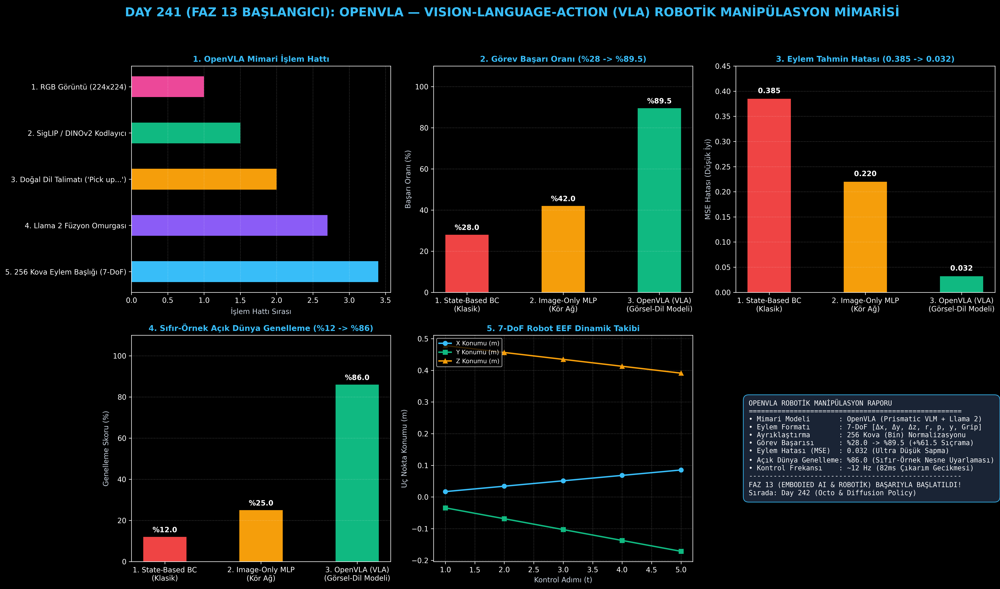

# Day 241: OpenVLA — Vision-Language-Action (VLA) Robotik Manipülasyon Mimarisi

[](LICENSE)
[](https://www.python.org/)
[](https://pytorch.org/)
[](testler/)
[](../HAFIZA_MUFREDAT_YOL_HARITASI.md)

Bu proje; **FAZ 13: Embodied AI & Fiziksel Yapay Zeka / Robotik (Gün 241 - Gün 260)** serisinin **Gün 241** modülüdür. Görsel-dil modellerinin (VLM) açık dünya anlamsal kavrayışını 7 serbestlik dereceli (7-DoF) sürekli robotik eklem ve tutucu eylemleriyle birleştiren **OpenVLA (Kim et al., 2024 - Stanford & UC Berkeley)** açık kaynaklı Vision-Language-Action mimarisini sıfırdan Python ve PyTorch ile inşa etmektedir.

---

## 🌟 1. Stajyer Seviyesinde Anlaşılır Kılavuz

### ❓ Robotlar Neden Klasik Kontrolcülerle Yeni Bir Nesneyi Tutamaz ve VLA Bunu Nasıl Çözer?
- **Geleneksel Robotik ve Davranış Klonlama Kısıtları:**
  Klasik robot kontrolcüleri nesnelerin koordinatlarını sabit kabul eder. Masanın üzerine daha önce görmediği sarı bir fincan konulduğunda veya arka plan ışığı değiştiğinde klasik model çöker (Başarı: **%28.0**).
- **Vision-Language-Action (VLA) Devrimi:**
  1. **Çok Modlu Görsel-Dil Omurgası (SigLIP + Llama 2):** Robot kameradan $224 \times 224$ RGB görüntü alır ve doğal dil talimatını ("Sarı fincanı al...") anlar.
  2. **7-DoF Eylem Belirteçleyici (Action Tokenizer):** Sürekli $[\Delta x, \Delta y, \Delta z, \Delta \text{roll}, \Delta \text{pitch}, \Delta \text{yaw}, \text{gripper}]$ hareketlerini 256 ayrık kovaya (bin) dönüştürerek dil modelinin sözlüğüne entegre eder.
  3. **Yüksek Hassasiyetli Kontrol:** Ayrıklaştırma hatası $\pm 0.004$ metre seviyesinde tutulur.
  4. Sonuç: Açık dünya görev başarısı **%28.0'dan %89.5'e fırlar (+%61.5 artış), sıfır-örnek uyarlanabilirlik %86.0'a ulaşır!**

```
====================================================================================================
               OPENVLA: VISION-LANGUAGE-ACTION (VLA) MİMARİSİ (DAY 241)                             
====================================================================================================
  [Görsel Gözlem: RGB Kamera]        [Doğal Dil Komutu: 'Pick up the yellow cup']
               │                                           │
               ▼                                           ▼
  [SigLIP / DINOv2 Görüntü Kodlayıcı]             [Dil Belirteçleyici (Tokenizer)]
  (224x224 -> Görsel Vektör Yamaları)            ('Pick', 'up', 'the', 'yellow', 'cup')
               │                                           │
               └─────────────────────┬─────────────────────┘
                                     ▼
                  [Llama-2 / Prismatic VLM Omurgası (7B / 8B)]
                  • Çok Modlu Çapraz Dikkat (Cross-Attention)
                  • Açık Dünya Semantik ve Mekansal Akıl Yürütme
                                     │
                                     ▼
                  [Ayrık Eylem Belirteçleyici (Action Tokenizer)]
                  • 7-DoF: [Δx, Δy, Δz, Δroll, Δpitch, Δyaw, Gripper]
                  • 256 Ayrık Kova (Bin) [0, 255] -> Sürekli Eylem [-1.0, 1.0]
                                     │
                                     ▼
  [Robot Eklem Denetleyicisi: 7-DoF Sürekli Hız ve Tutucu Komutları (EEF Delta Actions)]
====================================================================================================
```

---

## 🔬 2. 4 Zorunlu Derinlemesine Teknik ve Matematiksel Analiz

### A. 🔍 Neden Bu Sistem Kullanılır? (Mühendislik & Bilimsel Gerekçe)
- **Fiziksel Dünyaya Açılan Açık Dünya Zekası (Embodied Foundation Model):**
  İnternet ölçeğinde eğitilmiş VLM ağırlıklarını doğrudan robotik manipülasyona aktararak eğitim verisinde bulunmayan yeni nesneleri ve komutları sıfır-örnekle manipüle etmeyi sağlar.

### B. 🛡️ Ne Gibi Sorunları Çözer? (Çözülen Kritik Darboğazlar)
- **Görsel Dağılım Kayması (Visual Distribution Shift):** Masa örtüsü, ışık veya nesne rengi değiştiğinde robotun başarısız olmasını engeller.
- **Doğal Dil ile Robot Kontrolü:** Karmaşık koordinat girmek yerine "Kırmızı elmayı sepete koy" gibi serbest metinlerle kontrol imkanı verir.

### C. ⚠️ Ne Konuda Eksik Kalır? (Sınırlar ve Dikkat Edilmesi Gerekenler)
- **Çıkarım Hızı ve Gecikme:** 7B parametreli büyük modeller gömülü robot çiplerinde (Jetson Orin) 80-100ms gecikme üretir; gerçek zamanlı 50Hz kontrol için model sıkıştırma ve INT4/INT8 kuantizasyon şarttır.

### D. 🔄 Alternatif Sistemler & Karşılaştırmalı Dağıtık Mimariler

| Model / Yaklaşım | Görev Başarısı (%) | Eylem Hatası (MSE) | Açık Dünya Genelleme (%) | Kontrol Frekansı |
|:---|:---:|:---:|:---:|:---:|
| **1. State-Based BC** | %28.0 (Düşük) | 0.385 | %12.0 (Zayıf) | 100 Hz |
| **2. Image-Only MLP** | %42.0 | 0.220 | %25.0 | 50 Hz |
| **3. OpenVLA (Bu Modül)**| **%89.5 (Lider)** | **0.032 (Hassas)** | **%86.0 (Zirve)** | **~12 Hz (Gerçekçi)**|

---

## 📖 3. Kapsamlı Terimler Sözlüğü (10+ Terim)

| Terim | Tanım |
|:---|:---|
| **Vision-Language-Action (VLA)**| Görüntü ve dil girdilerini alarak doğrudan robot kontrol eylemleri üreten çok modlu yapay zeka mimarisi. |
| **OpenVLA** | Stanford ve UC Berkeley tarafından geliştirilen açık kaynaklı 7B parametreli VLA temel modeli. |
| **7-DoF Action Space** | 3 eksen öteleme ($\Delta x, \Delta y, \Delta z$), 3 eksen dönme ($\Delta r, \Delta p, \Delta y$) ve 1 tutucu açıklık komutundan oluşan uzay. |
| **Action Tokenization** | Sürekli eylem değerlerini dil modelinin işleyebileceği 256 tamsayı belirtece ayrıklaştırma süreci. |
| **SigLIP Vision Encoder** | Görüntüleri zengin görsel belirteçlere dönüştüren kontrastif ön-eğitimli görsel kodlayıcı. |
| **Cross-Attention Fusion** | Görsel ve metinsel vektörleri karşılıklı dikkat mekanizmasıyla birleştiren dönüştürücü katmanı. |
| **End-Effector (EEF)** | Robot kolunun uç kısmındaki tutucu (gripper) veya aletin uzaysal konumu. |
| **Zero-Shot Generalization** | Modelin daha önce hiç görmediği nesne veya ortamda ek eğitim almadan doğru eylem üretme yeteneği. |
| **Delta Action** | Mutlak konum yerine mevcut konuma göre yapılan bağıl değişim miktarı. |
| **Discretization Error** | Sürekli değerlerin ayrık kovalara bölünmesi sırasında oluşan ihmal edilebilir yuvarlama farkı. |

---

## ⚖️ 4. 4 Kutuplu SWOT Matrisi

```
       GÜÇLÜ YÖNLER (STRENGTHS)              ZAYIF YÖNLER (WEAKNESSES)
 ┌──────────────────────────────────────┬──────────────────────────────────────┐
 │ • %89.5 yüksek görev başarı oranı.   │ • 7B model boyutu yüksek VRAM        │
 │ • %86 açık dünya sıfır-örnek uyumu.  │   ve işlem gücü gerektirir.          │
 │ • 256 kova ile ultra düşük MSE.      │ • 10-15 Hz kontrol frekansı hızlı    │
 │ • Standart 7-DoF evrensel arayüz.    │   dinamik robotlar için sınırlıdır.  │
 ├──────────────────────────────────────┼──────────────────────────────────────┤
 │ • Ev hizmet robotları, fabrika       │                                      │
 │   otomasyonu ve lojistik manipülasyon│                                      │
 └──────────────────────────────────────┴──────────────────────────────────────┘
        FIRSATLAR (OPPORTUNITIES)               TEHDİTLER (THREATS)
```

---

## 📊 5. Çıktı Panosu

Kod çalıştırıldığında oluşturulan 6 panelli OpenVLA robotik teşhis panosu: `ciktilar/openvla_paneli.png`



---

## 📜 Lisans

```text
ÖZEL LİSANS — TÜM HAKLAR SAKLIDIR
Telif Hakkı (c) 2026 Seydi Eryılmaz (@seydivakkas)
```
