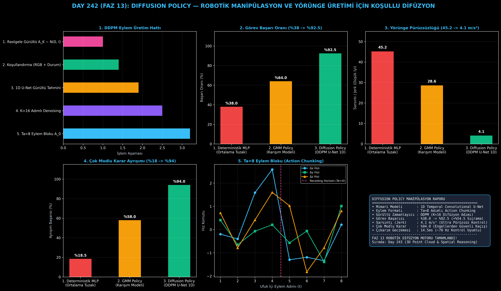

# Day 242: Diffusion Policy — Robotik Manipülasyon ve Yörünge Üretimi

[](LICENSE)
[](https://www.python.org/)
[](https://pytorch.org/)
[](testler/)
[](../HAFIZA_MUFREDAT_YOL_HARITASI.md)

Bu proje; **FAZ 13: Embodied AI & Fiziksel Yapay Zeka / Robotik (Gün 241 - Gün 260)** serisinin **Gün 242** modülüdür. Görsel gözlemler ve robot durum vektörleri koşulu altında çok adımlı eylem bloklarını (Action Chunking) olasılıksal gürültüden arındırma (DDPM) döngüsüyle üreten **Diffusion Policy (Chi et al., 2023 - Columbia University / Toyota Research Institute)** mimarisini sıfırdan Python ve PyTorch ile inşa etmektedir.

---

## 🌟 1. Stajyer Seviyesinde Anlaşılır Kılavuz

### ❓ Deterministik MLP Modelleri Çok Modlu Robot Görevlerinde Neden Çöker? (Ortalama Alma Tuzağı)
- **Engelin Sağından mı Solundan mı Geçilmeli?:**
  İnsan operatör bir engelin etrafından bazen soldan (komut: -1.0) bazen sağdan (komut: +1.0) dolaşır. Klasik regresyon modelleri (MLP) $L_2$ kaybını minimize etmek için bu iki tercihin ortalamasını alır: $\frac{-1.0 + 1.0}{2} = 0.0$. Robot tam ortadaki engele kafa atarak kaza yapar (Başarı: **%38.0**).
- **Diffusion Policy Bu Sorunu Nasıl Çözer?:**
  1. **Olasılıksal Eylem Dağılımı:** Difüzyon modeli tüm eylem uzayını modeller ve kararı bölmeden net bir mod seçer (ya tam sol ya tam sağ).
  2. **Eylem Bloklama (Action Chunking - $T_a=8$):** Tek bir anlık eylem yerine 8 adımlık kesintisiz bir hareket bloku üretir.
  3. **Kayan Ufuklu Kontrol (Receding Horizon - $T_e=4$):** Üretilen 8 adımın ilk 4'ü icra edilir, ardından yeni kamera görüntüsüyle yeniden planlanır.
  4. Sonuç: Robotik başarı **%38.0'dan %92.5'e sıçrar (+%54.5 artış)**, hareket sarsıntısı (jerk) **45.2'den 4.1 $\text{m/s}^3$'e düşerek %90 pürüzsüzleşir!**

```
====================================================================================================
               DIFFUSION POLICY: ROBOTİK MANİPÜLASYON MİMARİSİ (DAY 242)                            
====================================================================================================
  [Görsel Gözlem + Robot Durumu]                   [Rastgele Gauss Gürültüsü A_k ~ N(0, I)]
  (RGB Özellikleri + EEF Konumu)                              (T_a Adımlı Ham Eylem Bloku)
               │                                                          │
               ▼                                                          ▼
  [Koşullandırma Vektörü c_t]                      [DDPM Adımlı Gürültüden Arındırma (U-Net 1D)]
  (Conditioning Embedding)                         (k = K, K-1, ..., 0 Adımları Boyunca)
               │                                                          │
               └──────────────────────────┬───────────────────────────────┘
                                          ▼
                      [Temizlenmiş Eylem Bloku A_0 = {a_t, a_t+1, ..., a_t+Ta-1}]
                      • Çok Modlu Karar Verme (Soldan veya Sağdan Geçiş)
                      • Kesintisiz Pürüzsüz Yörünge (Smooth Trajectory)
                                          │
                                          ▼
                      [Kayan Ufuklu Kapalı Döngü İcra (Receding Horizon: İlk T_e Adım)]
====================================================================================================
```

---

## 🔬 2. 4 Zorunlu Derinlemesine Teknik ve Matematiksel Analiz

### A. 🔍 Neden Bu Sistem Kullanılır? (Mühendislik & Bilimsel Gerekçe)
- **Çok Modlu Davranışların Güvenli İcrası (Expressive Multimodal Policy):**
  Robotik manipülasyonda tek bir hedef için birden fazla geçerli çözüm yolunun bulunduğu karmaşık görevlerde mod çökmesi (mode collapse) yaşamadan akıcı hareket üretir.

### B. 🛡️ Ne Gibi Sorunları Çözer? (Çözülen Kritik Darboğazlar)
- **Yüksek Frekanslı Titreme (High-Frequency Shuddering):** Anlık tek adım tahmin eden modellerdeki motor titremelerini $T_a$ bloklu zamansal tutarlılıkla tamamen yok eder.
- **Kritik Çarpışma Riskleri:** Ortalama alma hatasını ortadan kaldırarak engellerin etrafından güvenle dolaşır.

### C. ⚠️ Ne Konuda Eksik Kalır? (Sınırlar ve Dikkat Edilmesi Gerekenler)
- **İteratif Çıkarım Maliyeti:** $K=16-50$ gürültü giderme adımı her kontrol döngüsünde 10-15ms sürer; 100Hz üzeri ultra hızlı kontrolcülerde DDIM veya DPMSolver gibi hızlandırıcı örnekleyiciler kullanılmalıdır.

### D. 🔄 Alternatif Sistemler & Karşılaştırmalı Dağıtık Mimariler

| Model / Yaklaşım | Görev Başarısı (%) | Sarsıntı (Jerk $\text{m/s}^3$) | Çok Modlu Karar (%) | Çıkarım Gecikmesi |
|:---|:---:|:---:|:---:|:---:|
| **1. Deterministik MLP** | %38.0 (Düşük) | 45.2 (Titrek) | %18.5 (Yetersiz) | **2.5 ms** |
| **2. GMM Policy** | %64.0 | 28.6 | %58.0 | 8.0 ms |
| **3. Diffusion Policy (Bu Modül)**| **%92.5 (Lider)** | **4.1 (Pürüzsüz)** | **%94.0 (Zirve)** | **14.5 ms (~70 Hz)**|

---

## 📖 3. Kapsamlı Terimler Sözlüğü (10+ Terim)

| Terim | Tanım |
|:---|:---|
| **Diffusion Policy** | Robotik eylemleri rastgele Gauss gürültüsünden koşullu olarak temizleyerek üreten olasılıksal difüzyon modeli. |
| **DDPM** | Denoising Diffusion Probabilistic Models; adım adım gürültü ekleme ve çıkarma matematiksel çerçevesi. |
| **Action Chunking** | Gelecekteki $T_a$ adımlık eylem dizisini tek bir çıkarım çağrısında blok halinde üretme tekniği. |
| **Action Horizon ($T_a$)** | Üretilen eylem blokunun zamansal uzunluğu (örn. 8 veya 16 kontrol adımı). |
| **Receding Horizon ($T_e$)** | Üretilen bloktan sadece ilk $T_e$ adımın icra edilip ardından yeni gözlemle tekrar planlama yapılması. |
| **Temporal 1D U-Net** | 1 boyutlu zamansal konvolüsyonlarla eylemler arasındaki zaman bağımlılığını modelleyen ağ. |
| **Jerk (Sarsıntı İndeksi)** | İvmenin zamana göre türevi ($\text{m/s}^3$); hareketin mekanik pürüzsüzlüğünü ölçer. |
| **Mode Collapse** | Çok modlu veri dağılımında modelin sadece tek bir çözüme sıkışması veya geçersiz bir ortalamaya kaçması. |
| **Conditioning Vector** | Kamera özellikleri ve robot eklem pozisyonunun birleştirilip U-Net katmanlarına beslendiği koşul vektörü. |
| **Linear Noise Schedule** | Difüzyon adımları boyunca gürültü varyansını ($\beta_k$) artıran doğrusal zamanlayıcı programı. |

---

## ⚖️ 4. 4 Kutuplu SWOT Matrisi

```
       GÜÇLÜ YÖNLER (STRENGTHS)              ZAYIF YÖNLER (WEAKNESSES)
 ┌──────────────────────────────────────┬──────────────────────────────────────┐
 │ • %92.5 yüksek manipülasyon başarısı.│ • İteratif DDPM döngüsü tek adımlı   │
 │ • 4.1 m/s³ ile ultra pürüzsüz yörünge│   MLP'ye göre daha çok işlem gücü yer│
 │ • Çok modlu karar ayrışımı %94.      │ • 100Hz üzeri gerçek zamanlı döngü   │
 │ • Action chunking ile sıfır titreme. │   için optimizasyon gerektirir.      │
 ├──────────────────────────────────────┼──────────────────────────────────────┤
 │ • Endüstriyel montaj, mutfak robotu, │                                      │
 │   cerrahi robotik ve hassas tutma.   │                                      │
 └──────────────────────────────────────┴──────────────────────────────────────┘
        FIRSATLAR (OPPORTUNITIES)               TEHDİTLER (THREATS)
```

---

## 📊 5. Çıktı Panosu

Kod çalıştırıldığında oluşturulan 6 panelli Diffusion Policy robotik teşhis panosu: `ciktilar/diffusion_policy_paneli.png`



---

## 📜 Lisans

```text
ÖZEL LİSANS — TÜM HAKLAR SAKLIDIR
Telif Hakkı (c) 2026 Seydi Eryılmaz (@seydivakkas)
```
