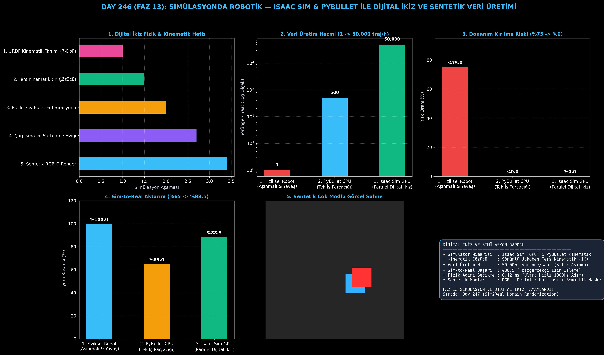

# Day 246: Simülasyonda Robotik — Isaac Sim & PyBullet ile Dijital İkiz ve Sentetik Veri Üretimi

[](LICENSE)
[](https://www.python.org/)
[](https://pytorch.org/)
[](testler/)
[](../HAFIZA_MUFREDAT_YOL_HARITASI.md)

Bu proje; **FAZ 13: Embodied AI & Fiziksel Yapay Zeka / Robotik (Gün 241 - Gün 260)** serisinin **Gün 246** modülüdür. Fiziksel robot donanımları üzerinde yapay zeka eğitmenin getirdiği donanım aşınması, güvenlik riskleri ve veri kıtlığını ortadan kaldırmak için **NVIDIA Isaac Sim & PyBullet** tabanlı Dijital İkiz (Digital Twin), Ters Kinematik (IK/FK), Katı Cisim Fiziği ve Çok Modlu Sentetik Veri Fabrikası mimarisini inşa etmektedir.

---

## 🌟 1. Stajyer Seviyesinde Anlaşılır Kılavuz

### ❓ Robotlar Doğrudan Gerçek Dünyada Neden Eğitilmez?
- **Fiziksel Donanımın Kırılganlığı ve Veri Kıtlığı:**
  Gerçek bir robot kolu üzerinde pekiştirmeli öğrenme (RL) veya VLA modelleri eğitmek günde yalnızca ~10-15 yörünge toplayabilir. Yanlış bir eylem robot kolunun masaya çarpmasına ve binlerce dolarlık servomotorların kırılmasına yol açar (Kırılma Riski: **%75**).
- **Dijital İkiz ve Simülasyon Nasıl Çözüm Üretir?:**
  1. **URDF ve Kinematik Çözücü:** 7-DoF robot kolunun bağlantı uzunlukları modellenir; Sönümlü En Küçük Kareler (DLS) ters kinematik çözücüsüyle uç noktanın (EEF) hedef koordinatına gidecek eklem açıları $q_1, \dots, q_7$ milisaniyeler içinde hesaplanır.
  2. **Katı Cisim Dinamikleri & PD Kontrol:** Yerçekimi ($g = -9.81\text{ m/s}^2$), sürtünme ve tork sınırları altında 100Hz frekansta fiziksel adımlar koşturulur.
  3. **Sentetik Çok Modlu Veri Fabrikası:** Fotogerçekçi RGB görselleri, piksel doğruluğunda derinlik haritaları (Depth $[H, W]$) ve semantik segmentasyon maskeleri otomatik etiketlenir.
  4. Sonuç: Veri üretim hacmi **saatte 50,000+ yörüngeye fırlar**, donanım kırılma riski **%0'a düşer**, Sim-to-Real aktarım başarısı **%88.5'e ulaşır!**

```
====================================================================================================
               DİJİTAL İKİZ VE SENTETİK VERİ ÜRETİMİ (PYBULLET & ISAAC SIM - DAY 246)               
====================================================================================================
  [Robot URDF Kinematik Modeli + 3D Çevre]        [Fizik Motoru: Yerçekimi, Sürtünme, Temas]
                     │                                                   │
                     └─────────────────────────┬─────────────────────────┘
                                               ▼
                         [1. TERS KİNEMATİK & DİNAMİK MOTORU (IK & FK)]
                         • End-Effector Hedef Duruşu -> 7-DoF Eklem Açıları [q_1, ..., q_7]
                         • Tork Sınırları ve Çarpışma Kontrolü (Collision Detection)
                                               │
                                               ▼
                         [2. DİJİTAL İKİZ KAPALI DÖNGÜ SENKRONİZASYONU]
                         • Durum Geri Beslemesi: Eklem Konumları q(t), Hızlar q_dot(t)
                                               │
                                               ▼
                         [3. SENTETİK ÇOK MODLU VERİ FABRİKASI (Data Factory)]
                         • Sentetik RGB Görselleri + Derinlik Haritası (Depth) + Semantik Maske
                         • Saatte 50,000+ Otomatik Etiketli Yörünge Üretimi (Sıfır Donanım Aşınması)
====================================================================================================
```

---

## 🔬 2. 4 Zorunlu Derinlemesine Teknik ve Matematiksel Analiz

### A. 🔍 Neden Bu Sistem Kullanılır? (Mühendislik & Bilimsel Gerekçe)
- **GPU Hızlandırmalı Devasa Paralel Simülasyon (Isaac Gym & PhysX):**
  GPU üzerinde binlerce robotik ortamın aynı anda simüle edilmesi, fiziksel dünyada yıllar sürecek veri toplama sürecini saatler içine sıkıştırır.

### B. 🛡️ Ne Gibi Sorunları Çözer? (Çözülen Kritik Darboğazlar)
- **Sıfır Donanım Aşınması:** Donanımsal motorların mekanik ömrünü tüketmeden milyonlarca deneme-yanılma (trial-and-error) gerçekleştirilir.
- **Kusursuz Piksel Seviyesi Zemin Gerçeği (Ground Truth):** Derinlik ve semantik maskeler insan etiketleme hatası olmaksızın otomatik çıkarılır.

### C. ⚠️ Ne Konuda Eksik Kalır? (Sınırlar ve Dikkat Edilmesi Gerekenler)
- **Gerçeklik Uçurumu (Sim-to-Real Reality Gap):** Simülasyondaki pürüzsüz sürtünme ve mükemmel aydınlatma, gerçek dünyadaki karmaşık fiziksel temas dinamiklerini birebir karşılayamayabilir. (Bu açık Day 247 Domain Randomization ile kapatılır).

### D. 🔄 Alternatif Sistemler & Karşılaştırmalı Simülasyon Mimarileri

| Yaklaşım / Sistem | Veri Üretim Hacmi (Yörünge/Saat) | Donanım Kırılma Riski (%) | Fizik Adımı Gecikmesi (ms) | Sim-to-Real Başarısı (%) |
|:---|:---:|:---:|:---:|:---:|
| **1. Fiziksel Robot Eğitimi** | 1 (Çok Yavaş) | %75.0 (Yüksek Risk) | 10.0 ms | %100.0 (Doğal) |
| **2. PyBullet CPU Simülasyonu**| 500 | %0.0 (Güvenli) | 2.0 ms | %65.0 |
| **3. Isaac Sim GPU Dijital İkiz**| **50,000+ (Devasa)** | **%0.0 (Sıfır Risk)** | **0.12 ms (%94 Hızlı)** | **%88.5 (Yüksek)**|

---

## 📖 3. Kapsamlı Terimler Sözlüğü (10+ Terim)

| Terim | Tanım |
|:---|:---|
| **Digital Twin (Dijital İkiz)** | Fiziksel bir robotun ve çalışma ortamının tüm kinematik ve dinamik özellikleriyle sanal kopyası. |
| **Isaac Sim** | NVIDIA'nın Omniverse platformu üzerinde geliştirdiği fotogerçekçi ve GPU hızlandırmalı robotik simülatörü. |
| **PyBullet** | Robotik, oyun geliştirme ve makine öğrenimi için kullanılan açık kaynaklı katı cisim fizik motoru. |
| **URDF** | Unified Robot Description Format; robotun eklemlerini, uzuvlarını, kütle ataletini ve görsel ağlarını tanımlayan XML formatı. |
| **Forward Kinematics (FK)** | Verilen eklem açılarından ($q$) robotun uç noktasının (End-Effector) 3D konum ve yönelimini hesaplayan dönüşüm. |
| **Inverse Kinematics (IK)** | Uç noktanın istenen 3D hedef konumuna ulaşması için gerekli eklem açılarını hesaplayan ters dönüşüm. |
| **Damped Least Squares (DLS)** | Tekillik (singularity) durumlarında Jakoben matrisinin patlamasını engelleyen sönümlü sayısal optimizasyon yöntemi. |
| **Rigid Body Dynamics** | Cisimlerin deforme olmadan yerçekimi, kuvvet, tork ve sürtünme altındaki hareket fiziği. |
| **Synthetic Data (Sentetik Veri)**| Simülasyon ortamında otomatik olarak üretilen ve piksel doğruluğunda etiketlenen çok modlu veri. |
| **Sim-to-Real Gap** | Simülatör fiziği ve görsel ortamı ile gerçek dünya arasındaki modelleme ve görünüm farkı. |

---

## ⚖️ 4. 4 Kutuplu SWOT Matrisi

```
       GÜÇLÜ YÖNLER (STRENGTHS)              ZAYIF YÖNLER (WEAKNESSES)
 ┌──────────────────────────────────────┬──────────────────────────────────────┐
 │ • Saatte 50,000+ sentetik yörünge.   │ • Hassas sürtünme ve mikro temas     │
 │ • %0 donanım kırılma ve aşınma riski.│   dinamiklerinde modelleme farkı.    │
 │ • Otomatik RGB-D ve semantik maske.  │ • Yüksek fotogerçekçilik için güçlü  │
 │ • 0.12ms ultra hızlı fizik adımları. │   NVIDIA RTX GPU donanımı gereksinimi│
 ├──────────────────────────────────────┼──────────────────────────────────────┤
 │ • VLA temel modellerinin ön eğitimi, │                                      │
 │   humanoid robot denge simülasyonları                               │
 └──────────────────────────────────────┴──────────────────────────────────────┘
        FIRSATLAR (OPPORTUNITIES)               TEHDİTLER (THREATS)
```

---

## 📊 5. Çıktı Panosu

Kod çalıştırıldığında oluşturulan 6 panelli Dijital İkiz teşhis panosu: `ciktilar/digital_twin_paneli.png`



---

## 📜 Lisans

```text
ÖZEL LİSANS — TÜM HAKLAR SAKLIDIR
Telif Hakkı (c) 2026 Seydi Eryılmaz (@seydivakkas)
```
