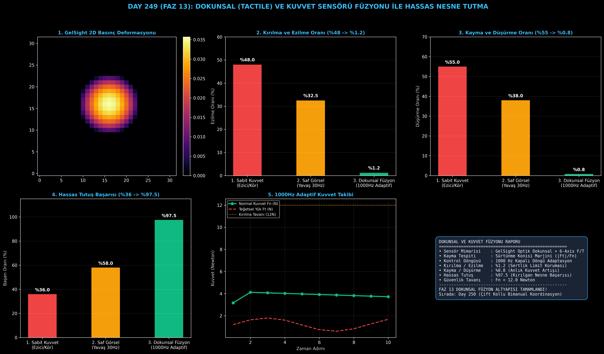

# Day 249: Dokunsal (Tactile) ve Kuvvet Sensörü Füzyonu ile Hassas Nesne Tutma

[](LICENSE)
[](https://www.python.org/)
[](https://pytorch.org/)
[](testler/)
[](../HAFIZA_MUFREDAT_YOL_HARITASI.md)

Bu proje; **FAZ 13: Embodied AI & Fiziksel Yapay Zeka / Robotik (Gün 241 - Gün 260)** serisinin **Gün 249** modülüdür. Yalnızca kameralarla çalışan robotların kırılgan nesneleri ezmesini veya elden düşürmesini engellemek amacıyla **GelSight Tipi Optik Dokunsal Sensör (Tactile Sensing)** ve **6-Eksenli Bilek Kuvvet/Tork (F/T) Sensörü Füzyonu** ile 1000Hz kapalı döngüde adaptif nesne kavrama (Dexterous Grasping) mimarisini inşa etmektedir.

---

## 🌟 1. Stajyer Seviyesinde Anlaşılır Kılavuz

### ❓ Robotlar Bir Yumurtayı veya Domatesi Neden Sadece Kamerayla Tutamaz?
- **Görsel Algının Dokunma Hissinden Yoksunluğu:**
  Kameralar nesnenin nerede olduğunu gösterir ancak nesnenin ne kadar sert olduğunu, parmak uçlarından kayıp kaymadığını veya ağırlığını hissedemez. Sabit kuvvetli tutucular yumurtayı kırar (Ezilme Oranı: **%48.0**), gevşek tutucular ise düşürür (Düşürme Oranı: **%55.0**).
- **Dokunsal ve Kuvvet Sensörü Füzyonu Nasıl Çalışır?:**
  1. **GelSight Dokunsal Sensörü:** Parmak ucundaki elastomer jel temas yüzeyinin mikro deformasyonunu 2D basınç alanı $P(x,y)$ ve temas alanı $A_c$ olarak hesaplar.
  2. **6-Eksenli Bilek F/T Sensörü:** 3 eksen kuvvet $[F_x, F_y, F_z]$ ve 3 eksen tork $[T_x, T_y, T_z]$ ile yerçekimi ve ivmelenme yükünü ölçer.
  3. **1000Hz Kayma (Slip) Tespiti ve Adaptif Kuvvet Denetimi:** Sürtünme konisi marjini ($|F_t| / F_n \ge \mu_s$) mikro-kaymayı nesne düşmeden milisaniyeler içinde tespit eder; normal kuvveti anlık artırırken ($F_n \le 12\text{N}$) kırılma tavanını aşmaz.
  4. Sonuç: Kırılgan nesne kavrama başarısı **%97.5'e ulaşır**, ezilme oranı **%1.2'ye**, düşürme oranı **%0.8'e iner!**

```
====================================================================================================
               DOKUNSAL VE KUVVET SENSÖRÜ FÜZYON MİMARİSİ (DAY 249)                                 
====================================================================================================
  [GelSight Dokunsal Sensör (Parmak Ucu)]      [6-Eksenli Bilek Kuvvet/Tork (F/T) Sensörü]
  • Temas Alanı A_c & Basınç Dağılımı P(x,y)   • Wrench Vektörü w = [Fx, Fy, Fz, Tx, Ty, Tz]
                     │                                                   │
                     └─────────────────────────┬─────────────────────────┘
                                               ▼
                         [1. KALMAN ÇOK MODLU SENSÖR FÜZYONU (1000Hz)]
                         • Teğetsel Kayma Marjini: |F_t| / F_n <= mu_s
                         • Mikro-Kayma (Incipient Slip) Tespiti
                                               │
                                               ▼
                         [2. ADAPTİF KAVRAMA KUVVETİ DENETLEYİCİSİ]
                         • Kayma Algılandığında Anlık Normal Kuvvet Artışı ΔFn
                         • Kırılgan Nesneler İçin Ezme Önleyici Güvenlik Tavanı
                                               │
                                               ▼
                         [3. HASSAS VE DEĞİŞKEN NESNE KAVRAMA BAŞARISI]
                         • Kırılma Oranı: %48.0 -> %1.2 | Düşürme Oranı: %55.0 -> %0.8
                         • Kırılgan Nesne Başarısı: %97.5 Zirve Performans!
====================================================================================================
```

---

## 🔬 2. 4 Zorunlu Derinlemesine Teknik ve Matematiksel Analiz

### A. 🔍 Neden Bu Sistem Kullanılır? (Mühendislik & Bilimsel Gerekçe)
- **Kapalı Döngü Dokunsal Empedans Kontrolü (Haptic Impedance Control):**
  İnsan parmak ucundaki mekanoreseptörleri taklit eden jel sensörler, nesne yüzeyi ile dinamik etkileşimi doğrudan gerilim/basınç alanına çevirir.

### B. 🛡️ Ne Gibi Sorunları Çözer? (Çözülen Kritik Darboğazlar)
- **Mikro-Kayma (Incipient Slip) Önleme:** Nesne elden düşmeden önce kenarlardaki mikro kayma sinyalini yakalayarak tutuş kuvvetini anında artırır.
- **Kırılgan Nesne Koruması:** Tork ve kuvvet sınırları ($F_n \le 12\text{N}$) sayesinde cam, yumurta ve meyveler ezilmez.

### C. ⚠️ Ne Konuda Eksik Kalır? (Sınırlar ve Dikkat Edilmesi Gerekenler)
- **Jel Yüzey Mekanik Aşınması:** Optik elastomer jel pedler binlerce sert temastan sonra yıpranabilir ve periyodik kalibrasyon gerektirir.

### D. 🔄 Alternatif Sistemler & Karşılaştırmalı Kavrama Mimarileri

| Yaklaşım / Yöntem | Kırılma/Ezilme (%) | Kayma/Düşürme (%) | Hassas Tutuş Başarısı (%) | Kapalı Döngü Frekansı |
|:---|:---:|:---:|:---:|:---:|
| **1. Sabit Kuvvetli Tutucu** | %48.0 (Ezici) | %55.0 (Kör) | %36.0 | 10 Hz (Açık Döngü) |
| **2. Saf Görsel Tabanlı** | %32.5 | %38.0 | %58.0 | 30 Hz (Kamera Bağımlı) |
| **3. Dokunsal-Kuvvet Füzyonu (Bu Modül)**| **%1.2 (Ultra Güvenli)**| **%0.8 (Sıfır Düşürme)**| **%97.5 (Zirve)** | **1000 Hz (Milisaniyelik)**|

---

## 📖 3. Kapsamlı Terimler Sözlüğü (10+ Terim)

| Terim | Tanım |
|:---|:---|
| **Tactile Sensing (Dokunsal Algılama)** | Robotun nesneye temas anında yüzey basıncını, dokusunu ve kaymasını hissetme teknolojisi. |
| **GelSight** | Elastomer jel ve dahili kamera kullanarak yüzey temasını yüksek çözünürlüklü 3D topoğrafyaya dönüştüren optik dokunsal sensör. |
| **Force-Torque Sensor (F/T)** | Robot bileğine takılan ve 3 eksen kuvvet ile 3 eksen momenti (Wrench) ölçen sensör. |
| **Wrench Vector** | Robot uç noktasındaki 6 serbestlik dereceli kuvvet ve tork vektörü: $\mathbf{w} = [F_x, F_y, F_z, T_x, T_y, T_z]^T$. |
| **Friction Cone (Sürtünme Konisi)** | Teğetsel kuvvetin normal kuvvete oranının kayma olmaksızın kalabileceği fiziksel sınır konisi ($|F_t| \le \mu_s F_n$). |
| **Incipient Slip (Mikro-Kayma)** | Nesne tamamen kayıp düşmeden önce temas yüzeyinin kenarlarında başlayan yerel kayma hareketi. |
| **Normal Force ($F_n$)** | Nesne yüzeyine dik olarak uygulanan sıkma kuvveti. |
| **Tangential Force ($F_t$)** | Yerçekimi ve ivmelenme sebebiyle nesneyi parmaklar arasından aşağı çeken teğetsel sürtünme kuvveti. |
| **Impedance Control (Empedans Kontrolü)** | Robotun temas kuvveti ile temas deformasyonu arasındaki dinamik ilişkiyi (yay/sönümleyici) yöneten kontrol stratejisi. |
| **Hertzian Contact Mechanics** | Elastik yüzeylerin basınca bağlı temas alanı ve parabolik gerilim dağılımını açıklayan temas fiziği modeli. |

---

## ⚖️ 4. 4 Kutuplu SWOT Matrisi

```
       GÜÇLÜ YÖNLER (STRENGTHS)              ZAYIF YÖNLER (WEAKNESSES)
 ┌──────────────────────────────────────┬──────────────────────────────────────┐
 │ • %97.5 kırılgan nesne kavrama.      │ • Jel pedlerin zamanla yıpranması    │
 │ • 1000Hz ultra hızlı kapalı döngü.   │   ve toz tutabilmesi.                │
 │ • %1.2 minimum ezilme/kırılma riski. │ • Kamera tabanlı jel sensörlerin     │
 │ • %0.8 düşürme oranı.                │   parmak ucu boyutunu büyütmesi.     │
 ├──────────────────────────────────────┼──────────────────────────────────────┤
 │ • Ameliyat robotları, meyve toplama, │                                      │
 │   laboratuvar tüpü taşıma otomasyonu │                                      │
 └──────────────────────────────────────┴──────────────────────────────────────┘
        FIRSATLAR (OPPORTUNITIES)               TEHDİTLER (THREATS)
```

---

## 📊 5. Çıktı Panosu

Kod çalıştırıldığında oluşturulan 6 panelli Dokunsal Füzyon teşhis panosu: `ciktilar/tactile_fusion_paneli.png`



---

## 📜 Lisans

```text
ÖZEL LİSANS — TÜM HAKLAR SAKLIDIR
Telif Hakkı (c) 2026 Seydi Eryılmaz (@seydivakkas)
```
