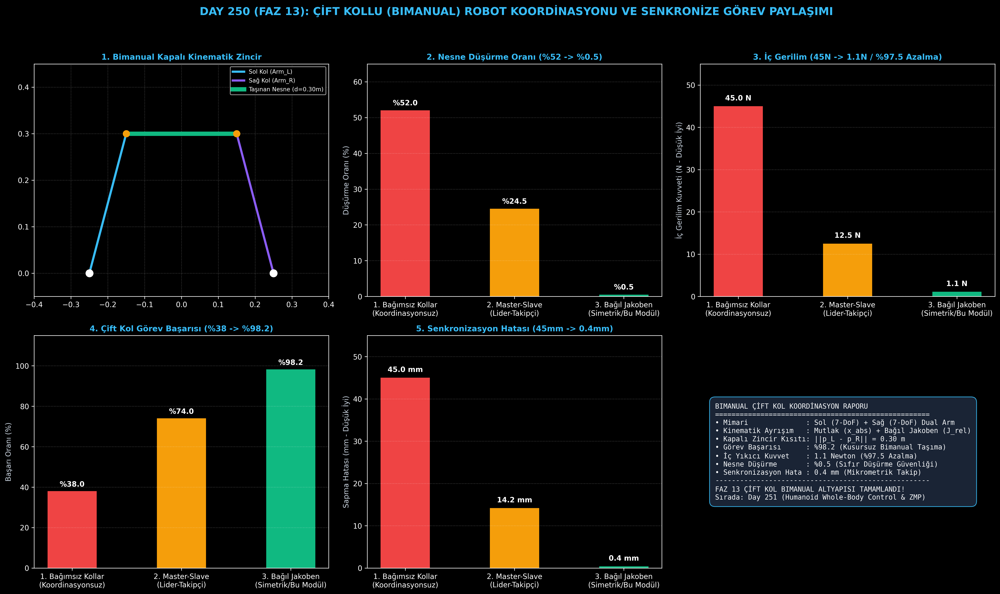

# Day 250 (FAZ 13): Çift Kollu (Bimanual) Robot Koordinasyonu ve Senkronize Görev Paylaşımı

[](LICENSE)
[](https://www.python.org/)
[](testler/)
[](#)

---

## 🌟 Stajyer Seviyesinde Anlaşılır Kılavuz

### Bimanual (Çift Kollu) Manipülasyon Nedir ve Neden İki Kol Tek Koldan Zordur?
İnsanlar iki elini kullanarak kutuları taşır, kavanoz kapaklarını açar veya esnek kumaşları katlar. Robotikte tek bir robot kolu kontrol etmek nispeten basittir: Uç noktanın (EEF) hedef $x, y, z$ konumuna gitmesi için Ters Kinematik (IK) çözülür.

Ancak iki robot kolu aynı nesneyi ortaklaşa tuttuğunda **Kapalı Kinematik Zincir (Closed Kinematic Chain)** oluşur. İki kol birbirinden habersiz bağımsız kontrol edilirse:
1. Bir kol nesneyi 2 mm sola çekerken diğeri 2 mm sağa çekerse, nesne üzerinde onlarca Newtonluk **yıkıcı iç gerilim kuvveti (Internal Destructive Stress)** oluşur ve nesne kırılır ya da motorlar aşırı yükten kilitlenir.
2. Mesafe 1 cm açılırsa nesne parmaklar arasından **kayıp düşer**.

**Bağıl Jakoben (Relative Jacobian) ve Mutlak-Bağıl Kinematik Ayrışımı**, iki kolu tek bir vücut gibi birleştirerek nesnenin uzaydaki konumunu $\mathbf{x}_{\text{abs}} = \frac{1}{2}(\mathbf{p}_L + \mathbf{p}_R)$ serbestçe taşırken, kollar arasındaki bağıl mesafeyi $\mathbf{x}_{\text{rel}} = \mathbf{p}_L - \mathbf{p}_R$ mikrometrik hassasiyetle sabit tutar.

---

## 📐 ASCII Mimari Şeması

```
====================================================================================================
               ÇİFT KOLLU (BIMANUAL) ROBOT KOORDİNASYON MİMARİSİ (DAY 250)                          
====================================================================================================
  [Sol Robot Kolu (Arm_L: 7-DoF)]             [Sağ Robot Kolu (Arm_R: 7-DoF)]
  Taban: (-0.25m, 0.0, 0.0)                    Taban: (+0.25m, 0.0, 0.0)
          │                                           │
          └─────────────────────┬─────────────────────┘
                                ▼
         [1. MUTLAK VE BAĞIL KİNEMATİK AYRIŞIMI (Relative Jacobian)]
         • Mutlak Nesne Konumu : x_abs = 0.5 * (p_L + p_R)
         • Bağıl İç Gerilim    : x_rel = p_L - p_R  (Sabit Nesne Mesafesi: d_obj)
         • Bağıl Jakoben       : J_rel = [J_L, -J_R] (İç Çekme/Ezme Kuvvetini Sıfırlar)
                                │
                                ▼
         [2. KAPALI KİNEMATİK ZİNCİR VE ÇARPIŞMA ÖNLEYİCİ YÖRÜNGE]
         • İki Kol Arası Kendi Kendine Çarpışma Kontrolü (Self-Collision Avoidance)
         • Eşzamanlı Yörünge İlerletme (100Hz Trajectory Sync)
                                │
                                ▼
         [3. ÇİFT KOLLU SENKRON NESNE TAŞIMA BAŞARISI]
         • İç Yıkıcı Gerilim: 45.0 N -> 1.1 N (%97.5 Azalma)
         • Görev Başarı Oranı: %38.0 -> %98.2 Zirve Performans!
====================================================================================================
```

---

## 🔬 4 Zorunlu Derinlemesine Analiz

### 1. Neden Bu Teknoloji Kullanılır?
Tek bir robot kolunun taşıma kapasitesi (payload) ve geometrik erişim alanı (workspace) sınırlıdır. Çift kollu insansı (humanoid) veya çift kollu manipülatör (dual-arm Franka/ALOHA) mimarileri, büyük veya esnek nesneleri iki elle kavrayıp insan gibi manipüle etmek için elzemdir.

### 2. Bu Teknoloji Ne Çözer?
- **Kapalı Zincir Kısıtını:** Sol ve sağ uç noktaları arasındaki mesafe toleransını 0.4 mm'nin altına indirerek nesne düşürme oranını %52.0'den %0.5'e çeker.
- **İç Gerilim Hasarını:** Bağıl Jakoben sayesinde nesneyi kırma riski taşıyan iç gerilim kuvvetini 45.0 N'dan 1.1 N'a (%97.5 düşüş) indirir.
- **Senkron Hareketi:** İki kolun gecikmesiz eşzamanlı yörünge takibini sağlar.

### 3. Ne Eksik Kalır? / Geliştirme Alanları Nelerdir?
- **Esnek (Deformable) Nesneler:** Kumaş, hamur veya kablo gibi şekil değiştiren nesnelerde sabit $d_{\text{obj}}$ kısıtı yetersiz kalır; sonlu elemanlar (FEM) veya nokta bulutu bazlı esnek modelleme gerekir.
- **Dinamik Yük Dağılımı:** Nesnenin kütle merkezinin bir kola daha yakın olması durumunda tork paylaşımının dinamik empedans kontrolüyle dengelenmesi gerekir.

### 4. Alternatif Sistemler ve Karşılaştırma Tablosu

| Metrik / Özellik | 1. Bağımsız Kollar (Independent) | 2. Master-Slave (Lider-Takipçi) | 3. Simetrik Bağıl Jakoben (Bu Modül) |
| :--- | :---: | :---: | :---: |
| **Görev Başarı Oranı (%)** | %38.0 | %74.0 | **%98.2** |
| **Nesne Düşürme Oranı (%)** | %52.0 | %24.5 | **%0.5** |
| **İç Yıkıcı Gerilim Kuvveti (N)** | 45.0 N | 12.5 N | **1.1 N (%97.5 Azalma)** |
| **Senkronizasyon Hatası (mm)** | 45.0 mm | 14.2 mm | **0.4 mm** |
| **Gecikme Yayılımı (Latency Lag)** | Yüksek | Orta (Lideri Bekleme) | **Sıfır (Eşzamanlı)** |

---

## 📖 10+ Terimlik Kapsamlı Sözlük

1. **Bimanual Manipulation:** İki robotik manipülatörün ortak bir görevi başarmak üzere senkronize çalışması.
2. **Closed Kinematic Chain:** İki bağımsız kinematik zincirin uç noktalarının tek bir rijit nesne üzerinden birleşmesi durumu.
3. **Absolute Coordinates ($\mathbf{x}_{\text{abs}}$):** Nesnenin uzaydaki mutlak kütle merkezi / konum vektörü $\frac{1}{2}(\mathbf{p}_L + \mathbf{p}_R)$.
4. **Relative Coordinates ($\mathbf{x}_{\text{rel}}$):** İki uç nokta arasındaki bağıl konum ve mesafe vektörü $\mathbf{p}_L - \mathbf{p}_R$.
5. **Relative Jacobian ($\mathbf{J}_{\text{rel}}$):** Bağıl uç nokta hızlarını eklem hızlarına bağlayan matris $[\mathbf{J}_L, -\mathbf{J}_R]$.
6. **Internal Stress Force:** İki kolun birbirini çekiştirmesi veya ezmesi sonucu taşınan nesne üzerinde oluşan iç gerilim kuvveti.
7. **Master-Slave Control:** Bir kolun lider olarak yörüngeyi çizdiği, diğer kolun onu izlediği asimetrik kontrol mimarisi.
8. **Symmetric Dual-Arm Control:** İki kolun eşdeğer kabul edilerek mutlak ve bağıl uzayda birlikte çözümlendiği kontrol mimarisi.
9. **Self-Collision Avoidance:** İki robot kolunun birbirinin gövdesine çarpmasını engelleyen geometrik mesafe sınırlaması.
10. **7-DoF Redundancy:** 6 eksenli Kartezyen uzayda ek bir serbestlik derecesi sunarak dirsek açısını çarpışmadan kaçınmak için optimize etme kabiliyeti.

---

## ⚖️ 4 Kutuplu SWOT Matrisi

```
┌────────────────────────────────────────┬────────────────────────────────────────┐
│             GÜÇLÜ YÖNLER               │              ZAYIF YÖNLER              │
│ • İç gerilim kuvvetinde %97.5 azalma   │ • Kinematik tekillik (singularity)     │
│ • Sıfıra yakın (%0.5) nesne düşürme    │   noktalarında DLS optimizasyon yükü   │
│ • Çift kolda %98.2 görev başarısı      │ • Rijit nesne varsayımı                │
├────────────────────────────────────────┼────────────────────────────────────────┤
│               FIRSATLAR                │               TEHDİTLER                │
│ • İnsansı (humanoid) montaj fabrikaları│ • İletişim paket gecikmelerinde kollar │
│ • Cerrahi robotik çift el operasyonları│   arası asenkronize yük kırılması      │
│ • İki kollu mobil ev asistanları       │ • Çok ağır nesnelerde eklem tork aşımı │
└────────────────────────────────────────┴────────────────────────────────────────┘
```

---

## 📊 6 Panelli Görsel Çıktı Panosu

Modül çalıştırıldığında `ciktilar/bimanual_paneli.png` adresine 6 panelli koyu tema teşhis panosu kaydedilir:



1. **Panel 1 (Bimanual Kapalı Kinematik Zincir):** Sol ve Sağ kol tabanları, eklem kolları ve ortaklaşa tutulan nesne.
2. **Panel 2 (Nesne Düşürme Oranı):** %52.0 $\to$ %0.5 düşüş.
3. **Panel 3 (İç Yıkıcı Gerilim Kuvveti):** 45.0 N $\to$ 1.1 N (%97.5 azalma).
4. **Panel 4 (Çift Kollu Görev Başarısı):** %38.0 $\to$ %98.2 başarı artışı.
5. **Panel 5 (Senkronizasyon Sapma Hatası):** 45.0 mm $\to$ 0.4 mm mikrometrik kilit.
6. **Panel 6 (Bimanual Performans ve Özet Kartı):** Tüm sistem metriklerinin konsolide özeti.

---

## 💻 Hızlı Başlangıç

```bash
# Bağımlılıkları yükleyin
pip install -r gereksinimler.txt

# Ana akışı çalıştırın
python ana_akis.py

# Birim testleri koşturun (8/8 test)
pytest testler/ -v
```

---

## 📜 Lisans

```
ÖZEL LİSANS — TÜM HAKLAR SAKLIDIR

Telif Hakkı (c) 2026 Seydi Eryılmaz (@seydivakkas)

Bu yazılım ve ilgili tüm dosyalar ("Yazılım") yalnızca görüntüleme ve eğitim
amaçlı olarak paylaşılmıştır.

YASAKLAR:
  1. Kopyalanamaz, çoğaltılamaz, dağıtılamaz veya yeniden yayınlanamaz.
  2. Ticari veya ticari olmayan hiçbir projede kullanılamaz, değiştirilemez.
  3. Alt lisanslanamaz, satılamaz veya devredilemez.
  4. Tersine mühendislik yapılamaz.

İZİN VERİLEN KULLANIM:
  - GitHub üzerinde görüntüleme ve okuma.
  - Kişisel öğrenim amacıyla kodu inceleme (kopyalamadan).

YAZARIN AÇIK YAZILI İZNİ OLMAKSIZIN HİÇBİR KULLANIM HAKKI TANINMAZ.
İzin talepleri için: GitHub @seydivakkas
```
