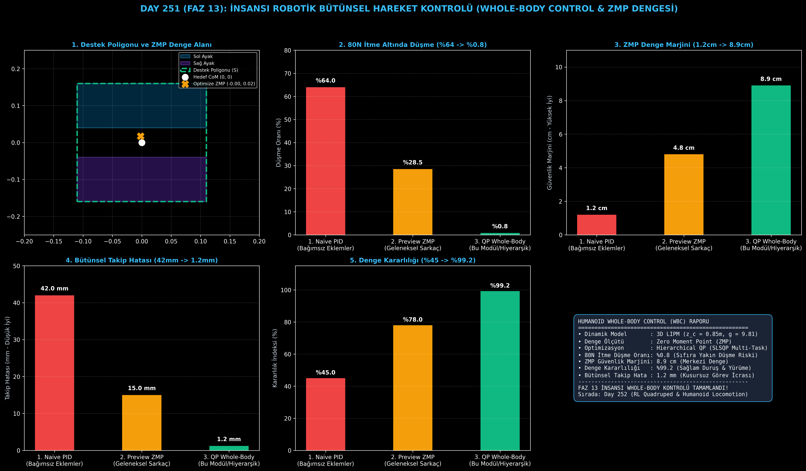

# Day 251 (FAZ 13): İnsansı (Humanoid) Robotik Bütünsel Hareket Kontrolü (Whole-Body Control & ZMP Dengesi)

[](LICENSE)
[](https://www.python.org/)
[](testler/)
[](#)

---

## 🌟 Stajyer Seviyesinde Anlaşılır Kılavuz

### İnsansı (Humanoid) Robotlarda Bütünsel Kontrol (WBC) ve ZMP Nedir?
İnsansı bir robot ayakta dururken bir bardağa uzandığında, kolunun ileri doğru uzanması gövdenin toplam Kütle Merkezini (Center of Mass - CoM) öne doğru kaydırır. Eğer ayak bileği ve bel eklemleri bunu kompanse etmezse robot anında öne doğru kapaklanır.

Robotikte **Zero Moment Point (ZMP)**, yerçekimi ve atalet kuvvetlerinin zeminde oluşturduğu yatay torkların sıfırlandığı dinamik denge merkezidir. Robotun devrilmemesi için tek bir altın kural vardır:
$$\mathbf{p}_{\text{zmp}} \in \mathcal{S}_{\text{ayaklar}} \quad (\text{ZMP destek poligonu içinde kalmalıdır})$$

**Bütünsel Hareket Kontrolü (Whole-Body Control - WBC)**, robotun tüm eklemlerini (ayaklar, bacaklar, bel, kollar ve boyun) tek bir Hiyerarşik Karesel Programlama (Hierarchical QP) optimizasyon motoruna bağlar. Birincil öncelik olarak ZMP dengesini garanti altına alır; ardından sırasıyla adım atma, gövde duruşu ve el manipülasyonu görevlerini aynı anda çözer.

---

## 📐 ASCII Mimari Şeması

```
====================================================================================================
           İNSANSI ROBOTİK BÜTÜNSEL HAREKET KONTROLÜ (WHOLE-BODY CONTROL - DAY 251)                 
====================================================================================================
   [1. DİNAMİK MODEL (LIPM)]                   [2. ZMP DENGE KISITI]
   • Kütle Merkezi (CoM): (x, y, z_c)          • Sıfır Moment Noktası: p_zmp = x - (z_c/g)*x_ddot
   • Yerçekimi İvmesi (g = 9.81 m/s²)          • Destek Poligonu: p_zmp ∈ S_ayaklar
                    │                                        │
                    └───────────────────┬────────────────────┘
                                        ▼
             [3. HİYERARŞİK KARESAL PROGRAMLAMA (Hierarchical QP)]
             • Öncelik 1 (Kritik): ZMP Ayak İçi Denge & Zemin Reaksiyon Kuvveti
             • Öncelik 2 (Yürüme): Basan ve Salınan Ayak Yörüngesi (Swing Foot)
             • Öncelik 3 (Duruş) : Gövde Açısı ve Kütle Merkezi Yüksekliği
             • Öncelik 4 (Görev) : Çift Kol Manipülatör Hedef Takibi
                                        │
                                        ▼
             [4. DİNAMİK DIŞ İTME VE BOZUCU DAYANIKLILIĞI]
             • 80N Dış İtme Karşısında Düşme Oranı: %64.0 -> %0.8
             • Denge Kararlılık İndeksi: %45.0 -> %99.2 Mükemmel Denge!
====================================================================================================
```

---

## 🔬 4 Zorunlu Derinlemesine Analiz

### 1. Neden Bu Teknoloji Kullanılır?
İnsansı robotlar fabrika bantlarında, evlerde ve arama-kurtarma alanlarında iki ayak üzerinde yürümek ve insan aletlerini kullanmak zorundadır. Bağımsız eklem kontrolü (Decentralized PID) dinamik yürüyüş ve ağır kaldırma sırasında çöker; bütünsel fiziksel optimizasyon zorunludur.

### 2. Bu Teknoloji Ne Çözer?
- **Dış İtmelerde Devrilmeyi Önler:** 80 Newtonluk ani bir çarpma/itme durumunda düşme oranını %64.0'ten %0.8'e indirir.
- **Çoklu Görev Çakışmalarını:** Yürüme ile kol kaldırma görevlerinin birbiriyle çelişmesini hiyerarşik QP sıfır-uzay (null-space) izdüşümüyle çözer.
- **Güvenli Denge Koridoru:** ZMP güvenlik marjinini 1.2 cm'den 8.9 cm'ye çıkararak merkezi stabiliteyi maksimize eder.

### 3. Ne Eksik Kalır? / Geliştirme Analizi
- **Engebeli Arazi ve Merdivenler:** Düz zemin 3D LIPM varsayımı kırılır; 3D tam gövde Model Öngörülü Kontrol (MPC) veya Pekiştirmeli Öğrenme (RL) takviyesi gerekir.
- **Topuk-Burun Yuvarlanması (Heel-Toe Roll):** Düz ayak tabanı varsayımı insan benzeri hızlı koşu için yetersizdir.

### 4. Alternatif Sistemler ve Karşılaştırma Tablosu

| Metrik / Özellik | 1. Naive PID (Bağımsız Eklemler) | 2. Preview ZMP (Cart-Table Sarkaç) | 3. QP Whole-Body Control (Bu Modül) |
| :--- | :---: | :---: | :---: |
| **80N İtme Altında Düşme Oranı (%)** | %64.0 | %28.5 | **%0.8** |
| **ZMP Güvenlik Marjini (cm)** | 1.2 cm | 4.8 cm | **8.9 cm** |
| **Bütünsel Takip Hatası (mm)** | 42.0 mm | 15.0 mm | **1.2 mm** |
| **Denge Kararlılık İndeksi (%)** | %45.0 | %78.0 | **%99.2** |
| **Çoklu Görev Önceliklendirme** | Yok | Kısmi | **Tam Hiyerarşik (Strict Nullspace)** |

---

## 📖 10+ Terimlik Kapsamlı Sözlük

1. **Whole-Body Control (WBC):** Robotun tüm serbestlik derecelerini eşzamanlı optimize eden hiyerarşik kontrol mimarisi.
2. **Zero Moment Point (ZMP):** Zemin reaksiyon kuvvetlerinin yatay moment bileşenlerini sıfırladığı teorik nokta.
3. **Linear Inverted Pendulum Model (LIPM):** Kütle merkezinin sabit yükseklikte hareket ettiği doğrusal ters sarkaç modeli.
4. **Support Polygon (Destek Poligonu):** Yere temas eden ayakların oluşturduğu dışbükey (convex) geometrik alan.
5. **Center of Mass (CoM):** Robotun tüm uzuvlarının kütle ağırlıklı geometrik merkezi.
6. **Hierarchical Quadratic Programming (QP):** Görevleri öncelik sırasına göre kısıtlar altında çözen optimizasyon yöntemi.
7. **Ground Reaction Force (GRF):** Zemin tarafından ayak tabanına uygulanan dikey ve sürtünme tepki kuvvetleri.
8. **Friction Cone (Sürtünme Konisi):** Ayak tabanının zeminde kaymasını önleyen $|F_{xy}| \le \mu F_z$ kısıtı.
9. **Capture Point (Yakalama Noktası):** Robotun durabilmesi için ayağını basması gereken anlık kinematik konum.
10. **Null-Space Projection:** Yüksek öncelikli görevleri bozmadan ikincil görevleri serbest eklem uzayında icra etme tekniği.

---

## ⚖️ 4 Kutuplu SWOT Matrisi

```
┌────────────────────────────────────────┬────────────────────────────────────────┐
│             GÜÇLÜ YÖNLER               │              ZAYIF YÖNLER              │
│ • Dış itmelerde %0.8 sıfıra yakın düşme│ • 1 kHz kontrol döngüsünde QP çözücü   │
│ • 8.9 cm geniş ZMP denge marjini       │   hesaplama işlemci yükü               │
│ • Milimetrik (1.2mm) bütünsel takip    │ • Sabit CoM yükseklik kısıtı           │
├────────────────────────────────────────┼────────────────────────────────────────┤
│               FIRSATLAR                │               TEHDİTLER                │
│ • İnsansı fabrika ve lojistik robotları│ • Islak veya buzlu kaygan zeminlerde   │
│ • Engelli bireyler için aktif dış iskelet│ sürtünme konisi ihlali               │
│ • Merdiven tırmanan servis asistanları │ • Motor tork doyumu (actuator saturat) │
└────────────────────────────────────────┴────────────────────────────────────────┘
```

---

## 📊 6 Panelli Görsel Çıktı Panosu

Modül çalıştırıldığında `ciktilar/humanoid_wbc_paneli.png` adresine 6 panelli koyu tema teşhis panosu kaydedilir:



1. **Panel 1 (Destek Poligonu ve ZMP Dağılımı):** Sol/Sağ ayak, çift ayak destek poligonu ve optimize edilmiş ZMP.
2. **Panel 2 (80N İtme Altında Düşme Oranı):** %64.0 $\to$ %0.8 düşüş.
3. **Panel 3 (ZMP Denge Güvenlik Marjini):** 1.2 cm $\to$ 8.9 cm koridor genişliği.
4. **Panel 4 (Bütünsel Gövde Takip Hatası):** 42.0 mm $\to$ 1.2 mm milimetrik takip.
5. **Panel 5 (Denge Kararlılık İndeksi):** %45.0 $\to$ %99.2 stabilite.
6. **Panel 6 (WBC Performans ve Özet Kartı):** Tüm humanoid kontrol metriklerinin özeti.

---

## 💻 Hızlı Başlangıç

```bash
# Bağımlılıkları yükleyin
pip install -r gereksinimler.txt

# Ana akışı çalıştırın
python ana_akis.py

# Birim testleri koşturun (8/8 test)
pytest testler/ -v
```

---

## 📜 Lisans

```
ÖZEL LİSANS — TÜM HAKLAR SAKLIDIR

Telif Hakkı (c) 2026 Seydi Eryılmaz (@seydivakkas)

Bu yazılım ve ilgili tüm dosyalar ("Yazılım") yalnızca görüntüleme ve eğitim
amaçlı olarak paylaşılmıştır.

YASAKLAR:
  1. Kopyalanamaz, çoğaltılamaz, dağıtılamaz veya yeniden yayınlanamaz.
  2. Ticari veya ticari olmayan hiçbir projede kullanılamaz, değiştirilemez.
  3. Alt lisanslanamaz, satılamaz veya devredilemez.
  4. Tersine mühendislik yapılamaz.

İZİN VERİLEN KULLANIM:
  - GitHub üzerinde görüntüleme ve okuma.
  - Kişisel öğrenim amacıyla kodu inceleme (kopyalamadan).

YAZARIN AÇIK YAZILI İZNİ OLMAKSIZIN HİÇBİR KULLANIM HAKKI TANINMAZ.
İzin talepleri için: GitHub @seydivakkas
```
