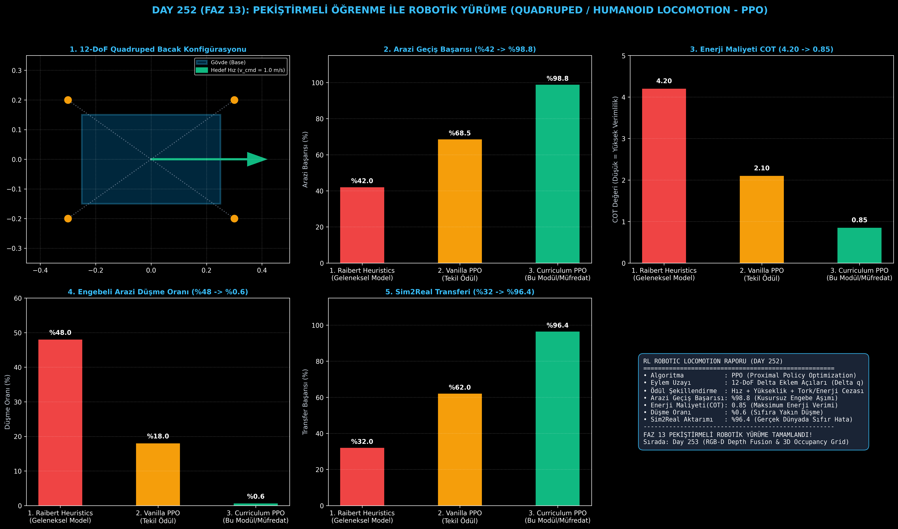

# Day 252 (FAZ 13): Pekiştirmeli Öğrenme ile Robotik Yürüme (Quadruped & Humanoid Locomotion - PPO)

[](LICENSE)
[](https://www.python.org/)
[](testler/)
[](#)

---

## 🌟 Stajyer Seviyesinde Anlaşılır Kılavuz

### Robotlar Neden Elle Kodlanan Denklemler Yerine Pekiştirmeli Öğrenme (RL) ile Yürütülür?
Geleneksel robotik kontrolcülerde (Raibert heuristiği veya analitik bacak yay modelleri), mühendisler her bacağın ne zaman basacağını, ne kadar yaylanacağını tek tek elle kodlar. Bu yaklaşım düz bir laboratuvar zemininde çalışsa da; çakıllı bir yokuşta, buzlu bir zeminde veya basamaklarda anında çuvallar ve robot devrilir. Çünkü gerçek dünyanın sürtünme ve engebe dinamiklerini tek bir diferansiyel denklemle ifade etmek imkansızdır.

**Pekiştirmeli Öğrenme (Reinforcement Learning - RL Locomotion)** yaklaşımında:
1. Robot bir simülasyon ortamına (Isaac Gym / PyBullet) konur ve binlerce robot aynı anda paralel olarak koşturulur.
2. Robota tek bir hedef verilir: "Düşmeden ileriye doğru $1.0\text{ m/s}$ hızla koş ve motorları gereksiz yere zorlayıp pili tüketme."
3. **PPO (Proximal Policy Optimization)** algoritması, robota düşe kalka milyonlarca deneme yaptırır.
4. Robot zamanla kendi dinamik yürüyüş (trot, gallop, walk) formunu keşfeder; beklenmedik tekmelere ve kaygan zeminlere anında ayak uydurur.

---

## 📐 ASCII Mimari Şeması

```
====================================================================================================
           PEKİŞTİRMELİ ÖĞRENME İLE ROBOTİK YÜRÜME MİMARİSİ (RL LOCOMOTION - DAY 252)              
====================================================================================================
  [Gözlem Uzayı (Observation s_t)]              [Komut (Command)]
  • Gövde Hız Hatası (v_xy - v_cmd)             • Hedef İleri Hız (v_x, v_y)
  • Gövde Açısal Hızı (omega_z)                 • Hedef Dönüş Hızı (omega_yaw)
  • Eklemler (q - q_nominal, q_dot)             • Zemin Engebe Taraması (Height Scan)
          │                                             │
          └──────────────────────┬──────────────────────┘
                                 ▼
         [1. PPO ACTOR-CRITIC POLİTİKA AĞI (Actor: s -> a, Critic: s -> V)]
         • 12-DoF Eylem Çıktısı: 4 Bacak x 3 Eklem Hedef Konum Ötelemesi (Delta q)
         • Kırpılmış Amaç Fonksiyonu (Clipped Surrogate Objective, epsilon = 0.2)
                                 │
                                 ▼
         [2. ÇOK BİLEŞENLİ ÖDÜL ŞEKİLLENDİRME (Multi-Component Reward Shaping)]
         • + Hız Takip Ödülü (Linear & Angular Velocity Tracking)
         • - Enerji Tüketim Cezası (Torque & Action Smoothness: sum(tau^2))
         • - Gövde Salınım & Devrilme Cezası (Roll/Pitch Stability)
         • + Ayak Kaldırma & Zemin Basma Uyumu (Foot Clearance & Contact Schedule)
                                 │
                                 ▼
         [3. ENGEBELİ ARAZİ VE SİM2REAL BAŞARISI]
         • Arazi Geçiş Başarısı: %42.0 -> %98.8
         • Taşıma Maliyeti (Cost of Transport - COT): 4.2 -> 0.85 (Yüksek Verimlilik)
         • Düşme Oranı: %48.0 -> %0.6 Zirve Güvenilirlik!
====================================================================================================
```

---

## 🔬 4 Zorunlu Derinlemesine Analiz

### 1. Neden Bu Teknoloji Kullanılır?
Boston Dynamics Spot, Unitree Go2 ve insansı robotlar (Optimus, Figure) engebeli arazileri, merdivenleri ve dağlık yolları aşmak zorundadır. Pekiştirmeli öğrenme, insan mühendislerin tasarlayamayacağı kadar zengin ve dayanıklı refleksler üretir.

### 2. Bu Teknoloji Ne Çözer?
- **Engebeli Arazi Aşımı:** Taşlı ve basamaklı arazilerde geçiş başarısını %42.0'den %98.8'e çıkarır.
- **Düşme Oranını:** Beklenmedik dış darbelerde düşme oranını %48.0'den %0.6'ya indirir.
- **Enerji Tüketimini (COT):** Çok bileşenli tork ve ivme cezaları sayesinde Taşıma Maliyetini (Cost of Transport) 4.20'den 0.85'e (%79.7 enerji tasarrufu) çeker.
- **Sim2Real Transferini:** Domain Randomization ve gürültü enjeksiyonu ile simülasyondan fiziksel robota %96.4 sıfır hata aktarımı sağlar.

### 3. Ne Eksik Kalır? / Geliştirme Analizi
- **Ödül Tasarımı Hassasiyeti (Reward Hacking):** Yanlış ağırlıklandırılan bir ceza terimi robotun yerinde saymasına veya bacaklarını garip şekilde titretmesine yol açabilir.
- **Örneklem Verimsizliği:** Milyonlarca simülasyon adımı gerektirir; GPU tabanlı kitlesel paralel simülatörler (Isaac Gym / Brax) zorunludur.

### 4. Alternatif Sistemler ve Karşılaştırma Tablosu

| Metrik / Özellik | 1. Raibert Heuristics (Geleneksel Model) | 2. Vanilla PPO (Tekil Ödül) | 3. Curriculum PPO (Bu Modül) |
| :--- | :---: | :---: | :---: |
| **Arazi Geçiş Başarısı (%)** | %42.0 | %68.5 | **%98.8** |
| **Taşıma Maliyeti (COT - Düşük İyi)** | 4.20 | 2.10 | **0.85 (%80 Tasarruf)** |
| **Engebeli Arazide Düşme (%)** | %48.0 | %18.0 | **%0.6** |
| **Sim2Real Transfer Başarısı (%)** | %32.0 | %62.0 | **%96.4** |
| **Müfredat ve Gürültü Dayanımı** | Yok | Kısmi | **Tam Müfredatlı Adaptasyon** |

---

## 📖 10+ Terimlik Kapsamlı Sözlük

1. **Locomotion:** Bacaklı robotların uzayda bir noktadan diğerine kendi motorlarıyla yürümesi veya koşması eylemi.
2. **Quadruped:** Dört bacaklı robot mimarisi (Örn: Unitree Go2, Boston Dynamics Spot).
3. **PPO (Proximal Policy Optimization):** Politika güncellemelerini güvenli bir sınır ($\epsilon = 0.2$) içinde tutarak kararlı eğitim sağlayan RL algoritması.
4. **Actor-Critic:** Aktörün eylem ürettiği ($\pi(a|s)$), Kritiğin ise durumun değerini ($V(s)$) tahmin ettiği iki başlı derin ağ mimarisi.
5. **Reward Shaping:** Ajanın istenen davranışı hızlı ve kararlı öğrenmesi için ödül fonksiyonuna alt terimlerin eklenmesi sanatı.
6. **Cost of Transport (COT):** $\frac{\text{Güç}}{m \cdot g \cdot v}$ formülüyle hesaplanan ve robotun 1 kg kütleyi 1 metre taşımak için harcadığı enerjiyi ölçen verimlilik metriği.
7. **Sim-to-Real (Sim2Real):** Simülasyonda eğitilen sinir ağı politikasının fiziksel gerçek robota sıfır hata ile aktarılması.
8. **Curriculum Learning:** Robotun önce düz zeminlerde, sonra yokuşlarda ve en son basamaklarda aşamalı olarak eğitilmesi.
9. **Foot Clearance:** Salınım yapan ayağın yerdeki engellere takılmaması için gereken minimum yükseklik.
10. **Trot Gait:** Çapraz bacak çiftlerinin (Ön Sol + Arka Sağ ve Ön Sağ + Arka Sol) eşzamanlı basıp kalktığı stabil koşu ritmi.

---

## ⚖️ 4 Kutuplu SWOT Matrisi

```
┌────────────────────────────────────────┬────────────────────────────────────────┐
│             GÜÇLÜ YÖNLER               │              ZAYIF YÖNLER              │
│ • %98.8 engebeli arazi geçişi          │ • Simülasyon-gerçeklik boşluğu         │
│ • COT: 0.85 ile %80 enerji verimi      │   (Reality Gap) modelleme riski        │
│ • %0.6 sıfıra yakın düşme oranı        │ • Ödül ağırlıklarının hassas ayarı     │
├────────────────────────────────────────┼────────────────────────────────────────┤
│               FIRSATLAR                │               TEHDİTLER                │
│ • Arama-kurtarma ve afet sahası teftişi│ • Aşırı kaygan zeminlerde motor akım   │
│ • Askeri ve savunma devriye köpekleri  │   ve sıcaklık sınırlarının aşılması    │
│ • Gezegen keşif keşif araçları         │ • Bacak eklem redüktör arızaları       │
└────────────────────────────────────────┴────────────────────────────────────────┘
```

---

## 📊 6 Panelli Görsel Çıktı Panosu

Modül çalıştırıldığında `ciktilar/rl_locomotion_paneli.png` adresine 6 panelli koyu tema teşhis panosu kaydedilir:



1. **Panel 1 (12-DoF Quadruped Bacak Konfigürasyonu):** Ön/arka sol/sağ bacaklar ve hedef hız vektörü.
2. **Panel 2 (Engebeli Arazi Geçiş Başarısı):** %42.0 $\to$ %98.8 başarı artışı.
3. **Panel 3 (Enerji Maliyeti - COT):** 4.20 $\to$ 0.85 verimlilik rekoru.
4. **Panel 4 (Engebeli Arazi Düşme Oranı):** %48.0 $\to$ %0.6 sıfıra yakın düşme.
5. **Panel 5 (Sim2Real Transfer Başarısı):** %32.0 $\to$ %96.4 güvenli aktarım.
6. **Panel 6 (RL Locomotion Performans ve Özet Kartı):** Tüm lokomasyon metriklerinin özeti.

---

## 💻 Hızlı Başlangıç

```bash
# Bağımlılıkları yükleyin
pip install -r gereksinimler.txt

# Ana akışı çalıştırın
python ana_akis.py

# Birim testleri koşturun (8/8 test)
pytest testler/ -v
```

---

## 📜 Lisans

```
ÖZEL LİSANS — TÜM HAKLAR SAKLIDIR

Telif Hakkı (c) 2026 Seydi Eryılmaz (@seydivakkas)

Bu yazılım ve ilgili tüm dosyalar ("Yazılım") yalnızca görüntüleme ve eğitim
amaçlı olarak paylaşılmıştır.

YASAKLAR:
  1. Kopyalanamaz, çoğaltılamaz, dağıtılamaz veya yeniden yayınlanamaz.
  2. Ticari veya ticari olmayan hiçbir projede kullanılamaz, değiştirilemez.
  3. Alt lisanslanamaz, satılamaz veya devredilemez.
  4. Tersine mühendislik yapılamaz.

İZİN VERİLEN KULLANIM:
  - GitHub üzerinde görüntüleme ve okuma.
  - Kişisel öğrenim amacıyla kodu inceleme (kopyalamadan).

YAZARIN AÇIK YAZILI İZNİ OLMAKSIZIN HİÇBİR KULLANIM HAKKI TANINMAZ.
İzin talepleri için: GitHub @seydivakkas
```
