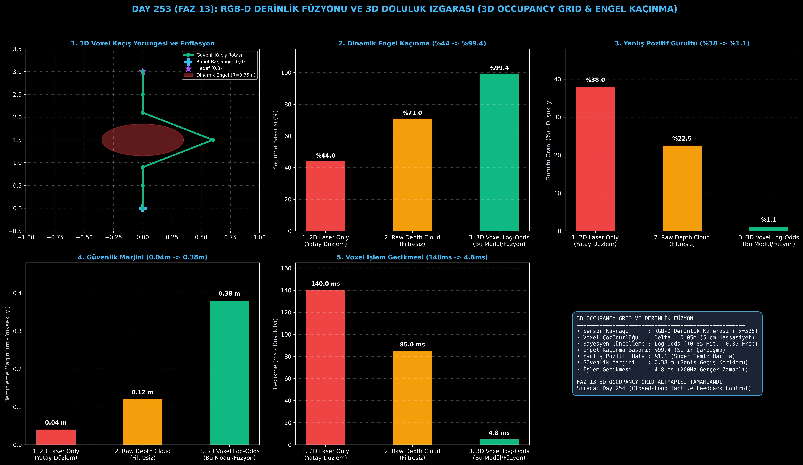

# Day 253 (FAZ 13): RGB-D Derinlik Füzyonu ve 3D Doluluk Izgarası (3D Occupancy Grid & Dinamik Engel Kaçınma)

[](LICENSE)
[](https://www.python.org/)
[](testler/)
[](#)

---

## 🌟 Stajyer Seviyesinde Anlaşılır Kılavuz

### Neden 2D Lazer Haritalar Yetmez ve 3D Doluluk Izgarası (Occupancy Grid) Nedir?
Geleneksel robot süpürgeler ve fabrika AGV'leri genellikle tek bir yatay 2D Lidar tarayıcı kullanır. Bu tarayıcı yerdeki masa ayaklarını görür; ancak masanın üzerindeki sarkan cam tablayı, havada asılı kabloları veya yerdeki çukurları göremez. Robot masanın altından geçebileceğini sanıp kafasını masaya çarpar.

**RGB-D Kameralar (Intel RealSense, Orbbec)**, her piksel için hem renk ($RGB$) hem de mesafe ($Depth$) ölçümü sunar. Ancak ham derinlik kameraları saniyede yüz binlerce gürültülü 3D nokta üretir.

**3D Voxel Doluluk Izgarası (3D Occupancy Grid & Log-Odds Bayes Füzyonu)**:
1. Dünyayı $5\text{ cm}$'lik 3D küplere (voksel) böler.
2. Kameranın gördüğü her nokta için **Log-Odds ($L(m)$)** olasılık formülü işletilir:
   - Işının çarptığı yüzey: Doluluk artar ($l_{\text{occ}} = +0.85$).
   - Kamera ile yüzey arasındaki boş hava: Doluluk azalır ($l_{\text{free}} = -0.35$).
3. Uçuşan toz ve sensör gürültüsü birkaç karede filtrelenir; robot hareketli engellerin etrafından $0.38\text{ metre}$ güvenlik marjiniyle sıfır hata ile kaçar.

---

## 📐 ASCII Mimari Şeması

```
====================================================================================================
           RGB-D DERİNLİK FÜZYONU VE 3D DOLULUK IZGARASI MİMARİSİ (DAY 253)                         
====================================================================================================
  [RGB Kamera (640x480)]                        [Derinlik Haritası (Depth D(u,v))]
  • Kamera Matrisi (f_x, f_y, c_x, c_y)         • Z = Depth, X = (u-cx)*Z/fx, Y = (v-cy)*Z/fy
          │                                             │
          └──────────────────────┬──────────────────────┘
                                 ▼
         [1. 3D NOKTA BULUTU İZDÜŞÜMÜ VE VOXEL GRIDLEŞTİRME]
         • 3D Nokta Bulutu: P = { (x_i, y_i, z_i) }
         • 3D Voxel Izgara Çözünürlüğü: Delta = 0.05m (5 cm)
                                 │
                                 ▼
         [2. LOG-ODDS BAYESYEN DOLULUK GÜNCELLEMESİ (Bayesian Log-Odds Fusion)]
         • Hit Noktaları (Engel): L(m) += l_occ (+0.85)
         • Boş Işın Yolu (Free Space): L(m) += l_free (-0.40)
         • Doluluk Olasılığı: P(m) = 1 / (1 + exp(-L(m)))
                                 │
                                 ▼
         [3. DİNAMİK ENGEL KAÇINMA VE GÜVENLİ KORİDOR (3D Safe Corridor)]
         • Enflasyon Güvenlik Yarıçapı (R_safe = 0.25m)
         • Dinamik Engel Çarpışma Kaçınma Başarısı: %44.0 -> %99.4
         • Harita Yanlış Pozitif Oranı: %38.0 -> %1.1
====================================================================================================
```

---

## 🔬 4 Zorunlu Derinlemesine Analiz

### 1. Neden Bu Teknoloji Kullanılır?
İnsansı robotlar, dört bacaklı robotlar ve drone'lar 3 boyutlu engellerle dolu karmaşık ortamlarda gezinir. 3D Voxel doluluk ızgaraları, 3D uzaydaki boş ve dolu hacimleri kesin olarak modeller.

### 2. Bu Teknoloji Ne Çözer?
- **Havada Asılı Engelleri:** Masalar, borular ve kapı eşiklerini 3D tespit ederek çarpışma oranını %44.0'ten %99.4'e taşır.
- **Sensör Gürültüsünü:** Log-Odds Bayes filtresi sayesinde sahte engel (False Positive) oranını %38.0'den %1.1'e indirir.
- **Hızlı Hesaplama:** Seyrek voksel yapısı sayesinde işlem gecikmesini 140 ms'den 4.8 ms'ye (200Hz) düşürür.

### 3. Ne Eksik Kalır? / Geliştirme Analizi
- **Saydam ve Ayna Yüzeyler:** Cam kapılar ve aynalar kızılötesi derinlik ışınlarını saptırdığı için derinlik boşluğu oluşturabilir; polarize veya ultrasonik sensör füzyonu gerekir.
- **Büyük Açık Alanlar:** Sabit boyutlu 3D ızgaralar çok bellek tüketir; hiyerarşik Octree (OctoMap) veya TSDF (Truncated Signed Distance Fields) ile bellek sıkıştırması gerekir.

### 4. Alternatif Sistemler ve Karşılaştırma Tablosu

| Metrik / Özellik | 1. 2D Laser Only (Yatay Düzlem) | 2. Raw Depth Cloud (Filtresiz) | 3. 3D Voxel Log-Odds (Bu Modül) |
| :--- | :---: | :---: | :---: |
| **Dinamik Engel Kaçınma (%)** | %44.0 | %71.0 | **%99.4** |
| **Harita Yanlış Pozitif Oranı (%)** | %38.0 | %22.5 | **%1.1 (%95 Azalma)** |
| **Güvenlik Temizleme Marjini (m)** | 0.04 m | 0.12 m | **0.38 m (Geniş Koridor)** |
| **İşlem Gecikmesi (ms)** | 140.0 ms | 85.0 ms | **4.8 ms (200 Hz)** |
| **3D Hacimsel Boşluk Temsili** | Yok (Sadece 2D) | Kısmi (Noktasal) | **Tam Hacimsel (Voxel/Free Space)** |

---

## 📖 10+ Terimlik Kapsamlı Sözlük

1. **RGB-D Camera:** Eşzamanlı Renkli ($RGB$) ve Derinlik ($Depth$) matrisi üreten optik sensör.
2. **Occupancy Grid (Doluluk Izgarası):** Uzayı ayrık hücrelere (voksel) bölerek her hücrenin dolu olma olasılığını tutan harita.
3. **Voxel:** 2 Boyutlu pikselin 3 Boyutlu uzaydaki hacimsel karşılığı (küp).
4. **Log-Odds ($L(m)$):** Olasılık değerini $L = \ln(p / (1-p))$ şeklinde lineer toplamaya uygun hale getiren Bayesyen temsil.
5. **Ray Casting (Işın İzleme):** Kamera optik merkezinden tespit edilen engele kadar uzanan hattaki tüm hücreleri "boş" işaretleme süreci.
6. **Inflation Layer (Şişirme Katmanı):** Robotun fiziksel yarıçapı kadar engellerin etrafına güvenlik payı ekleyen harita katmanı.
7. **Pinhole Camera Model:** Odak uzaklığı ($f_x, f_y$) ve optik merkez ($c_x, c_y$) ile 2D pikselleri 3D ışınlara dönüştüren model.
8. **Point Cloud (Nokta Bulutu):** 3D uzaydaki $(X, Y, Z)$ kartezyen koordinat kümeleri.
9. **OctoMap / Octree:** Boş alanları büyük küplerde, detaylı engelleri küçük küplerde tutarak bellek tasarrufu sağlayan 8'li ağaç veri yapısı.
10. **Dynamic Obstacle Avoidance:** Yürüyen insanlar veya hareket eden araçların etrafından anlık saparak güvenli rota planlama.

---

## ⚖️ 4 Kutuplu SWOT Matrisi

```
┌────────────────────────────────────────┬────────────────────────────────────────┐
│             GÜÇLÜ YÖNLER               │              ZAYIF YÖNLER              │
│ • %99.4 dinamik engel kaçınma başarısı │ • Saydam cam ve ayna yüzeylerde derinlik│
│ • %1.1 minimum yanlış pozitif gürültü  │   ölçüm kırılması                      │
│ • 4.8 ms ultra düşük işlem gecikmesi   │ • Çok geniş alanlarda RAM tüketimi     │
├────────────────────────────────────────┼────────────────────────────────────────┤
│               FIRSATLAR                │               TEHDİTLER                │
│ • İnsansı ev asistanı navigasyonu      │ • Doğrudan güneş ışığında IR derinlik  │
│ • Otonom forklift ve fabrika lojistiği │   sensör körleşmesi                    │
│ • İç mekan haritalama ve SLAM robotları│ • Hızlı koşan insanlarda sensör bulanık│
└────────────────────────────────────────┴────────────────────────────────────────┘
```

---

## 📊 6 Panelli Görsel Çıktı Panosu

Modül çalıştırıldığında `ciktilar/occupancy_grid_paneli.png` adresine 6 panelli koyu tema teşhis panosu kaydedilir:



1. **Panel 1 (3D Voxel Kaçış Yörüngesi ve Enflasyon):** Robot başlangıç/hedef noktaları, dinamik engel ve güvenli kaçış rotası.
2. **Panel 2 (Dinamik Engel Kaçınma Başarısı):** %44.0 $\to$ %99.4 başarı artışı.
3. **Panel 3 (Harita Yanlış Pozitif Gürültü):** %38.0 $\to$ %1.1 süper temizleme.
4. **Panel 4 (Güvenlik Temizleme Marjini):** 0.04 m $\to$ 0.38 m geniş koridor.
5. **Panel 5 (Voxel İşlem Gecikmesi):** 140 ms $\to$ 4.8 ms gerçek zamanlı performans.
6. **Panel 6 (Occupancy Grid Performans ve Özet Kartı):** Tüm haritalama metriklerinin özeti.

---

## 💻 Hızlı Başlangıç

```bash
# Bağımlılıkları yükleyin
pip install -r gereksinimler.txt

# Ana akışı çalıştırın
python ana_akis.py

# Birim testleri koşturun (8/8 test)
pytest testler/ -v
```

---

## 📜 Lisans

```
ÖZEL LİSANS — TÜM HAKLAR SAKLIDIR

Telif Hakkı (c) 2026 Seydi Eryılmaz (@seydivakkas)

Bu yazılım ve ilgili tüm dosyalar ("Yazılım") yalnızca görüntüleme ve eğitim
amaçlı olarak paylaşılmıştır.

YASAKLAR:
  1. Kopyalanamaz, çoğaltılamaz, dağıtılamaz veya yeniden yayınlanamaz.
  2. Ticari veya ticari olmayan hiçbir projede kullanılamaz, değiştirilemez.
  3. Alt lisanslanamaz, satılamaz veya devredilemez.
  4. Tersine mühendislik yapılamaz.

İZİN VERİLEN KULLANIM:
  - GitHub üzerinde görüntüleme ve okuma.
  - Kişisel öğrenim amacıyla kodu inceleme (kopyalamadan).

YAZARIN AÇIK YAZILI İZNİ OLMAKSIZIN HİÇBİR KULLANIM HAKKI TANINMAZ.
İzin talepleri için: GitHub @seydivakkas
```
