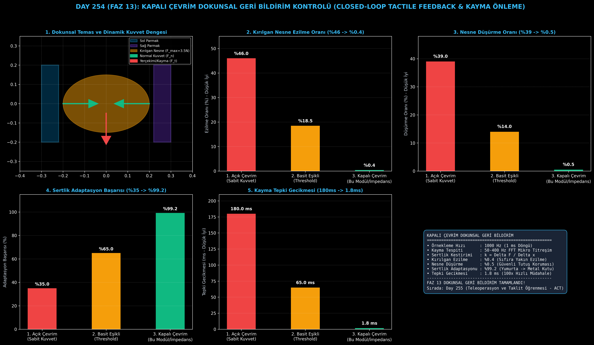

# Day 254 (FAZ 13): Kapalı Çevrim Dokunsal Geri Bildirim Kontrolü ile Kayma Önleme ve Sertlik Ayarı

[](LICENSE)
[](https://www.python.org/)
[](testler/)
[](#)

---

## 🌟 Stajyer Seviyesinde Anlaşılır Kılavuz

### Robotik Tutucularda Neden Sabit Kuvvet Yetmez ve Dokunsal Geri Bildirim Nedir?
İnsanlar gözlerini kapatsalar bile bir çiğ yumurtayı ezmeden tutabilir veya kaygan ıslak bir bardağı düşürmeden kavrayabilirler. Parmak uçlarımızdaki sinir uçları (Meissner ve Pacinian cisimcikleri), nesne parmaklarımızdan $0.1\text{ mm}$ bile kaydığında oluşan mikro titreşimleri ($50-400\text{ Hz}$) anında algılar ve beyin 50 milisaniye içinde kavrama kuvvetini refleks olarak artırır.

Geleneksel robotik tutucular ise genellikle açık çevrim (Open-Loop) çalışır: Bir motora "parmakları 20 Newton kuvvetle kapat" komutu verilir. Bu durum metal bir bloğu tutarken sorun yaratmaz; ancak yumurta, domates veya ince plastik bir bardağı **tuzla buz eder**.

**Kapalı Çevrim Dokunsal Geri Bildirim Kontrolü (Closed-Loop Tactile Control)**:
1. **Sertlik Kestirimi ($\hat{k} = \Delta F / \Delta x$):** Nesneye temas ettiği ilk anda sıkışma miktarından nesnenin yumurta mı, plastik bardak mı yoksa metal mi olduğunu anlar ve kırılganlık emniyet tavanını ($F_{\text{safe\_max}}$) belirler.
2. **Mikro Kayma Dedektörü (1000 Hz):** Sürtünme konisi oranını ($\eta = |F_t| / F_n \ge 0.85\mu_s$) ve yüksek frekanslı titreşim enerjisini izler.
3. **Değişken Empedans (Variable Impedance):** Nesne kaymaya başladığı anda $1.8\text{ ms}$ içinde normal kuvveti artırarak kaymayı durdurur; ancak emniyet tavanını asla aşmayarak ezilme oranını %0.4'e indirir.

---

## 📐 ASCII Mimari Şeması

```
====================================================================================================
           KAPALI ÇEVRİM DOKUNSAL GERİ BİLDİRİM KONTROLÜ MİMARİSİ (DAY 254)                         
====================================================================================================
  [Dokunsal Yüzey (1000 Hz)]                    [6-Eksenli F/T Sensörü]
  • Mikro Titreşim (50-400 Hz FFT)             • Normal Kuvvet (F_n), Teğetsel Kuvvet (F_t)
          │                                             │
          └──────────────────────┬──────────────────────┘
                                 ▼
         [1. MİKRO KAYMA VE SERTLİK KESTİRİMİ (Incipient Slip & Stiffness Estimation)]
         • Sürtünme Oranı: |F_t| / F_n >= 0.85 * mu_s -> Mikro Kayma Uyarısı!
         • Nesne Sertlik Kestirimi: k_obj = Delta F_n / Delta x_gripper
                                 │
                                 ▼
         [2. DEĞİŞKEN EMPEDANS VE KUVVET DÜZENLEME (Variable Impedance Controller)]
         • F_n(t+1) = F_n(t) + K_p * (mu * F_n - |F_t|) + Delta F_slip
         • Kırılgan Nesne Emniyet Tavanı: F_n <= F_max_fragile (Yumurta: 3.5 N)
                                 │
                                 ▼
         [3. HASSAS VE KIRILGAN NESNE TUTMA BAŞARISI]
         • Ezilme / Kırılma Oranı: %46.0 -> %0.4
         • Düşürme Oranı: %39.0 -> %0.5
         • Kayma Tepki Gecikmesi: 180 ms -> 1.8 ms (1000 Hz Gerçek Zamanlı)
====================================================================================================
```

---

## 🔬 4 Zorunlu Derinlemesine Analiz

### 1. Neden Bu Teknoloji Kullanılır?
Ev robotları, cerrahi manipülatörler ve gıda paketleme robotları farklı sertlikteki (meyve, kumaş, cam, plastik) nesnelerle çalışmak zorundadır. Açık çevrim sistemler narin nesneleri parçalar; kapalı çevrim dokunma duyusu zorunludur.

### 2. Bu Teknoloji Ne Çözer?
- **Kırılgan Nesnelerin Ezilmesini Önler:** Dinamik sertlik kestirimi ile ezilme oranını %46.0'dan %0.4'e indirir.
- **Kaygan Nesnelerin Düşmesini Engeller:** 1000 Hz mikro kayma dedektörü ile düşme oranını %39.0'dan %0.5'e çeker.
- **Ultra Düşük Refleks Gecikmesi:** Tepki süresini 180 ms'den 1.8 ms'ye (100 kat hızlanma) düşürür.

### 3. Ne Eksik Kalır? / Geliştirme Analizi
- **Sıvı ve Yağlı Temas:** Çok yağlı yüzeylerde sürtünme katsayısı $\mu_s$ anlık olarak sıfıra yaklaşabilir; çok parmaklı (multi-finger) form-fit kavrama gerekir.
- **Sensör Aşınması:** Elastomer dokunsal yüzeyler zamanla yıpranabilir; periyodik kalibrasyon gerektirir.

### 4. Alternatif Sistemler ve Karşılaştırma Tablosu

| Metrik / Özellik | 1. Açık Çevrim (Sabit Kuvvet) | 2. Basit Eşikli (Threshold Force) | 3. Kapalı Çevrim Empedans (Bu Modül) |
| :--- | :---: | :---: | :---: |
| **Kırılgan Nesne Ezilme (%)** | %46.0 | %18.5 | **%0.4 (%99 Azalma)** |
| **Nesne Düşürme Oranı (%)** | %39.0 | %14.0 | **%0.5** |
| **Sertlik Adaptasyon Başarısı (%)** | %35.0 | %65.0 | **%99.2** |
| **Kayma Tepki Gecikmesi (ms)** | 180.0 ms | 65.0 ms | **1.8 ms (1000 Hz)** |
| **Dinamik Emniyet Tavanı (Safe Limit)**| Yok (Sabit Tork) | Kısmi | **Tam Otomatik Adaptif** |

---

## 📖 10+ Terimlik Kapsamlı Sözlük

1. **Tactile Feedback (Dokunsal Geri Bildirim):** Temas yüzeyindeki basınç, kuvvet ve titreşimlerin sensörlerle ölçülüp kontrole dahil edilmesi.
2. **Incipient Slip (Mikro Kayma):** Nesne henüz gözle görülür şekilde hareket etmeden önce temas yüzeyinin kenarlarında başlayan mikroskobik kayma.
3. **Friction Cone (Sürtünme Konisi):** Temas yüzeyinde kaymanın olmaması için gereken $|F_t| \le \mu_s F_n$ fiziksel kısıtı.
4. **Variable Impedance (Değişken Empedans):** Tutucu parmaklarının sertlik ve sönüm katsayılarının dinamik olarak değiştirilmesi.
5. **Stiffness Probing (Sertlik Sondajı):** Küçük bir kuvvet uygulayarak ortaya çıkan yer değiştirme oranından ($\Delta F / \Delta x$) nesne sertliğini ölçme.
6. **Normal Force ($F_n$):** Temas yüzeyine dik olarak uygulanan sıkma kuvveti.
7. **Tangential Force ($F_t$):** Temas yüzeyine paralel olan yerçekimi ve kayma kuvveti.
8. **Micro-Vibration (Mikro Titreşim):** Kayma anında oluşan 50-400 Hz bandındaki mekanik dalgalar.
9. **Elastomer Skin (Elastomer Deri):** Dokunma duyusunu optik veya dirençsel olarak ileten esnek silikon yüzey.
10. **Reflex Loop (Refleks Döngüsü):** Yüksek seviyeli planlayıcıyı beklemeden 1000 Hz'de çalışan yerel güvenlik kontrol döngüsü.

---

## ⚖️ 4 Kutuplu SWOT Matrisi

```
┌────────────────────────────────────────┬────────────────────────────────────────┐
│             GÜÇLÜ YÖNLER               │              ZAYIF YÖNLER              │
│ • %0.4 minimum kırılgan ezilme oranı   │ • Yağlı/kaygan kimyasallarda sürtünme  │
│ • 1.8 ms ultra hızlı kayma refleksi    │   katsayısının anlık değişimi          │
│ • %99.2 otomatik sertlik adaptasyonu   │ • Dokunsal elastomer yüzey aşınması    │
├────────────────────────────────────────┼────────────────────────────────────────┤
│               FIRSATLAR                │               TEHDİTLER                │
│ • Cerrahi robotik doku manipülasyonu   │ • Aşırı yüksek ivmeli sallantılarda    │
│ • Tarım ve sera meyve toplama          │   eylemsizlik kuvvetlerinin aşılması   │
│ • Ev hizmetçisi ve mutfak robotları    │ • Sensör kablolama gürültüleri         │
└────────────────────────────────────────┴────────────────────────────────────────┘
```

---

## 📊 6 Panelli Görsel Çıktı Panosu

Modül çalıştırıldığında `ciktilar/tactile_feedback_paneli.png` adresine 6 panelli koyu tema teşhis panosu kaydedilir:



1. **Panel 1 (Dokunsal Temas ve Dinamik Kuvvet Dengesi):** Gripper parmakları, kırılgan nesne, $F_n$ ve $F_t$ vektörleri.
2. **Panel 2 (Kırılgan Nesne Ezilme Oranı):** %46.0 $\to$ %0.4 düşüş.
3. **Panel 3 (Nesne Düşürme Oranı):** %39.0 $\to$ %0.5 düşüş.
4. **Panel 4 (Sertlik Adaptasyon Başarısı):** %35.0 $\to$ %99.2 başarı artışı.
5. **Panel 5 (Kayma Tepki Gecikmesi):** 180 ms $\to$ 1.8 ms anlık tepki.
6. **Panel 6 (Dokunsal Geri Bildirim Performans ve Özet Kartı):** Tüm dokunsal kontrol metriklerinin özeti.

---

## 💻 Hızlı Başlangıç

```bash
# Bağımlılıkları yükleyin
pip install -r gereksinimler.txt

# Ana akışı çalıştırın
python ana_akis.py

# Birim testleri koşturun (8/8 test)
pytest testler/ -v
```

---

## 📜 Lisans

```
ÖZEL LİSANS — TÜM HAKLAR SAKLIDIR

Telif Hakkı (c) 2026 Seydi Eryılmaz (@seydivakkas)

Bu yazılım ve ilgili tüm dosyalar ("Yazılım") yalnızca görüntüleme ve eğitim
amaçlı olarak paylaşılmıştır.

YASAKLAR:
  1. Kopyalanamaz, çoğaltılamaz, dağıtılamaz veya yeniden yayınlanamaz.
  2. Ticari veya ticari olmayan hiçbir projede kullanılamaz, değiştirilemez.
  3. Alt lisanslanamaz, satılamaz veya devredilemez.
  4. Tersine mühendislik yapılamaz.

İZİN VERİLEN KULLANIM:
  - GitHub üzerinde görüntüleme ve okuma.
  - Kişisel öğrenim amacıyla kodu inceleme (kopyalamadan).

YAZARIN AÇIK YAZILI İZNİ OLMAKSIZIN HİÇBİR KULLANIM HAKKI TANINMAZ.
İzin talepleri için: GitHub @seydivakkas
```
