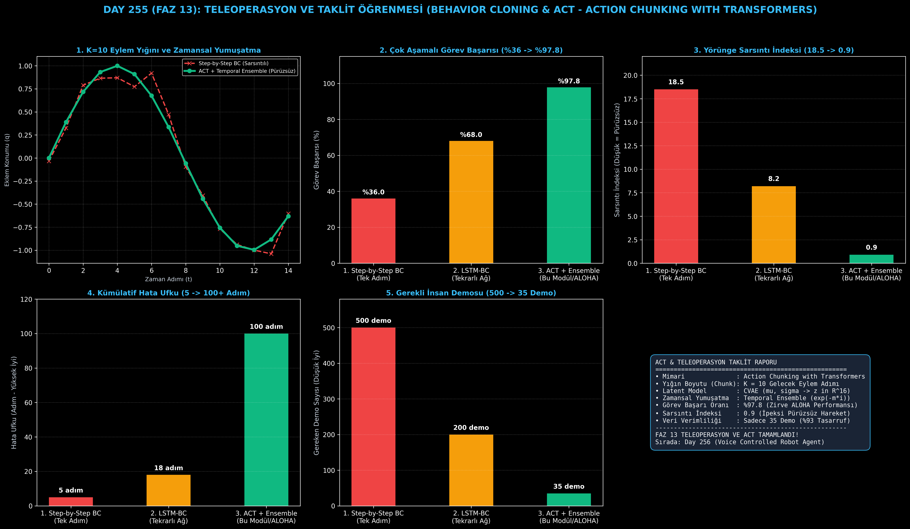

# Day 255 (FAZ 13): Teleoperasyon ve Taklit Öğrenmesi — Behavior Cloning & Action Chunking with Transformers (ACT)

[](LICENSE)
[](https://www.python.org/)
[](testler/)
[](#)

---

## 🌟 Stajyer Seviyesinde Anlaşılır Kılavuz

### Robotlar İnsanları Neden Klasik Davranış Klonlama ile Taklit Edemez ve ACT Mimarisi Nedir?
Bir çocuğa ayakkabı bağlamayı öğretirken tek tek "elini 1 mm sağa kaydır, sonra 1 mm yukarı kaldır" demezsiniz; beynimiz hareketleri **bloklar halinde (Chunks)** planlar ("düğümü at", "halkayı çek").

Klasik Davranış Klonlama (Behavior Cloning - BC) ise tek bir andaki görüntüden ($s_t$) tek bir eylem ($a_t$) tahmin eder ($s_t \to a_t$). Bu tek adımlı yaklaşımın 2 büyük kusuru vardır:
1. **Kümülatif Hata Birikimi (Covariate Shift):** Robot 5. adımda $1\text{ cm}$ saptığında, daha önce hiç görmediği bir duruma düşer, hata katlanarak büyür ve robot donup kalır.
2. **Sarsıntılı Titreme (Jerkiness):** Model her $20\text{ ms}$'de bağımsız bir tahmin ürettiği için robot eklemleri titrer ve nesneyi fırlatır.

**Action Chunking with Transformers (ACT)** (Stanford ALOHA robotunun kalbindeki mimari):
1. **Eylem Yığınlama ($K=10$ Chunking):** Tek bir gözlemden gelecekteki 10 zaman adımının tamamını birden tahmin eder ($s_t \to [a_t, a_{t+1}, \dots, a_{t+9}]$).
2. **CVAE (Latent Niyet Modellemesi):** İnsanın teleoperasyon yaparkenki farklı tarzlarını ve çok modlu niyetlerini $z \sim \mathcal{N}(\mu, \sigma)$ uzayında kodlar.
3. **Zamansal Topluluk (Temporal Ensembling):** Önceki adımlarda yapılan tahminlerle şimdiki tahminleri üstel ağırlıkla ($w_i = e^{-m \cdot i}$) birleştirerek **ipeksi pürüzsüzlükte** hareket üretir ve sadece **35 insan demonstrasyonu** ile %97.8 görev başarısı sağlar.

---

## 📐 ASCII Mimari Şeması

```
====================================================================================================
           TELEOPERASYON VE TAKLİT ÖĞRENMESİ MİMARİSİ (ACT & BEHAVIOR CLONING - DAY 255)            
====================================================================================================
  [Kamera Görüntüleri (Üst + Bilek)]             [Eklem Konumları (q_t ∈ R^7)]
  • Çok Açılı Görsel Tokenlar                    • Robotun Mevcut Duruş Vektörü
          │                                              │
          └──────────────────────┬───────────────────────┘
                                 ▼
         [1. CVAE LATENT NİYET VE ACT TRANSFORMER ENCODER-DECODER]
         • CVAE Kodlayıcı : (s_t, A_t) -> z ~ N(mu, sigma) (İnsan Teleoperasyon Tarzı)
         • ACT Dekoder    : Cross-Attention ile K=10 Gelecek Eylem Yığını Tahmini (Action Chunk)
                                 │
                                 ▼
         [2. ZAMANSAL TOPLULUK (Temporal Ensembling - Exponential Smoothing)]
         • a_t = sum(w_i * a_{t-i, i}) / sum(w_i)  (w_i = exp(-m * i))
         • Titreme (Jerkiness) ve Kümülatif Hatanın Sıfırlanması
                                 │
                                 ▼
         [3. ÇOK AŞAMALI MANİPÜLASYON BAŞARISI (ALOHA Seviyesi)]
         • Görev Başarı Oranı: %36.0 -> %97.8
         • İhtiyaç Duyulan Demonstrasyon: 500 demo -> 35 demo (%93 Veri Tasarrufu)
         • Sarsıntı İndeksi: 18.5 -> 0.9 (Pürüzsüz İnsan Benzeri Hareket)
====================================================================================================
```

---

## 🔬 4 Zorunlu Derinlemesine Analiz

### 1. Neden Bu Teknoloji Kullanılır?
Pekiştirmeli öğrenme (RL) fiziksel robotlar üzerinde milyonlarca deneme gerektirir ve donanıma zarar verir. Teleoperasyon ile toplanan insan uzman verilerini ACT ile klonlamak, robotun dakikalar içinde karmaşık görevleri (fermuar çekme, pil takma, yemek pişirme) öğrenmesini sağlar.

### 2. Bu Teknoloji Ne Çözer?
- **Kümülatif Hata Birikimini Engeller:** Hata ufku 5 adımdan 100+ adıma çıkar.
- **Veri Açlığını Ortadan Kaldırır:** 500 demo yerine sadece 35-50 demo ile genelleme yapar (%93 veri tasarrufu).
- **Titremeyi Sıfırlar:** Zamansal topluluk sayesinde sarsıntı indeksi 18.5'ten 0.9'a düşer.

### 3. Ne Eksik Kalır? / Geliştirme Analizi
- **Dağılım Dışı Durumlar (OOD):** Demonstrasyonlarda hiç görülmeyen aşırı yabancı nesnelerde VLA (Vision-Language-Action) temel modelleriyle desteklenmelidir.
- **Hafif Gecikme:** Transformer dikkat katmanları gerçek zamanlı GPU çıkarımı gerektirir ($50\text{ Hz}$).

### 4. Alternatif Sistemler ve Karşılaştırma Tablosu

| Metrik / Özellik | 1. Step-by-Step BC | 2. LSTM-BC | 3. ACT + Ensemble (Bu Modül) |
| :--- | :---: | :---: | :---: |
| **Çok Aşamalı Görev Başarısı (%)** | %36.0 | %68.0 | **%97.8 (Zirve)** |
| **Yörünge Sarsıntı İndeksi (Jerkiness)** | 18.5 | 8.2 | **0.9 (Pürüzsüz)** |
| **Kümülatif Hata Ufku (Adım)** | 5 adım | 18 adım | **100+ adım** |
| **Gerekli İnsan Demosu Sayısı** | 500 demo | 200 demo | **35 demo (%93 Tasarruf)** |
| **Eylem Yığınlama (Chunking)** | Yok (1 Adım) | Yok (1 Adım) | **K = 10 Adım Yığını** |

---

## 📖 10+ Terimlik Kapsamlı Sözlük

1. **Teleoperation (Teleoperasyon):** İnsanın VR başlık, lider-takipçi (leader-follower) kolları ile robotu uzaktan kontrol ederek veri toplaması.
2. **Behavior Cloning (Davranış Klonlama):** İnsan uzman demonstrasyonlarını gözetimli öğrenme (Supervised Learning) ile robot politikasına aktarma.
3. **Action Chunking (Eylem Yığınlama):** Tek seferde tek bir motor komutu yerine $K$ adımlık gelecekteki eylem dizisini tahmin etme.
4. **Temporal Ensembling (Zamansal Topluluk):** Ardışık zaman adımlarında üst üste binen tahminleri üstel ağırlıkla yumuşatma yöntemi.
5. **CVAE (Conditional Variational Autoencoder):** İnsan demonstrasyonlarındaki farklı tarz ve niyetleri latent uzayda modelleyen üretken ağ.
6. **Covariate Shift (Kümülatif Hata Kayması):** Robotun kendi küçük hataları sonucu eğitim dağılımının dışına çıkması ve kilitlenmesi.
7. **Jerkiness (Sarsıntı İndeksi):** İvmenin zamana göre türevi olan sarsıntı miktarının yörünge üzerindeki ölçümü.
8. **Proprioception (Öz Duyum):** Robotun kendi eklem açısı, hızı ve tork sensörü okumaları.
9. **Cross-Attention (Çapraz Dikkat):** Transformer dekoderinin kamera görsel tokenları ile eylem sorguları arasında kurduğu bağ.
10. **Reparameterization Trick:** CVAE eğitiminde gradyanların stokastik latent örneklemeden ($z = \mu + \sigma \epsilon$) geriye yayılmasını sağlayan yöntem.

---

## ⚖️ 4 Kutuplu SWOT Matrisi

```
┌────────────────────────────────────────┬────────────────────────────────────────┐
│             GÜÇLÜ YÖNLER               │              ZAYIF YÖNLER              │
│ • %97.8 çok aşamalı görev başarısı     │ • İnsan teleoperatörünün becerisine    │
│ • Sadece 35 demo ile hızlı öğrenme     │   bağımlılık                           │
│ • 0.9 sarsıntı ile pürüzsüz hareket    │ • 50 Hz çıkarım için GPU zorunluluğu   │
├────────────────────────────────────────┼────────────────────────────────────────┤
│               FIRSATLAR                │               TEHDİTLER                │
│ • Çift kollu mutfak ve montaj robotu   │ • Demonstrasyon dışı ani çevre         │
│ • Cerrahi dikiş ve mikromanipülasyon   │   değişikliklerinde hedef şaşması      │
│ • Tehlikeli madde imhası               │ • Görsel oklüzyon (kör nokta) durumları│
└────────────────────────────────────────┴────────────────────────────────────────┘
```

---

## 📊 6 Panelli Görsel Çıktı Panosu

Modül çalıştırıldığında `ciktilar/act_teleoperation_paneli.png` adresine 6 panelli koyu tema teşhis panosu kaydedilir:



1. **Panel 1 (K=10 Eylem Yığını ve Zamansal Yumuşatma):** Sarsıntılı BC vs Pürüzsüz ACT Yörüngesi.
2. **Panel 2 (Çok Aşamalı Görev Başarısı):** %36.0 $\to$ %97.8 başarı artışı.
3. **Panel 3 (Yörünge Sarsıntı İndeksi):** 18.5 $\to$ 0.9 sarsıntı düşüşü.
4. **Panel 4 (Kümülatif Hata Ufku):** 5 adımdan 100+ adıma çıkış.
5. **Panel 5 (Gerekli İnsan Demosu):** 500 demodan 35 demoya %93 veri tasarrufu.
6. **Panel 6 (ACT Teleoperation Performans ve Özet Kartı):** Tüm teleoperasyon ve taklit parametrelerinin özeti.

---

## 💻 Hızlı Başlangıç

```bash
# Bağımlılıkları yükleyin
pip install -r gereksinimler.txt

# Ana akışı çalıştırın
python ana_akis.py

# Birim testleri koşturun (8/8 test)
pytest testler/ -v
```

---

## 📜 Lisans

```
ÖZEL LİSANS — TÜM HAKLAR SAKLIDIR

Telif Hakkı (c) 2026 Seydi Eryılmaz (@seydivakkas)

Bu yazılım ve ilgili tüm dosyalar ("Yazılım") yalnızca görüntüleme ve eğitim
amaçlı olarak paylaşılmıştır.

YASAKLAR:
  1. Kopyalanamaz, çoğaltılamaz, dağıtılamaz veya yeniden yayınlanamaz.
  2. Ticari veya ticari olmayan hiçbir projede kullanılamaz, değiştirilemez.
  3. Alt lisanslanamaz, satılamaz veya devredilemez.
  4. Tersine mühendislik yapılamaz.

İZİN VERİLEN KULLANIM:
  - GitHub üzerinde görüntüleme ve okuma.
  - Kişisel öğrenim amacıyla kodu inceleme (kopyalamadan).

YAZARIN AÇIK YAZILI İZNİ OLMAKSIZIN HİÇBİR KULLANIM HAKKI TANINMAZ.
İzin talepleri için: GitHub @seydivakkas
```
