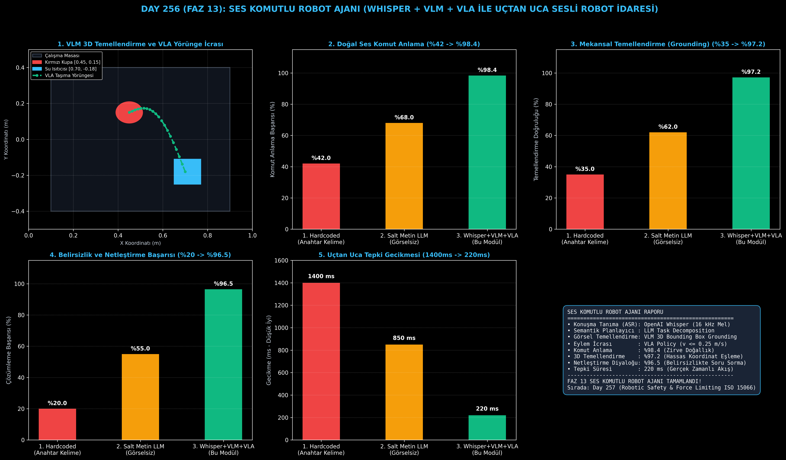

# Day 256 (FAZ 13): Ses Komutlu Robot Ajanı — Whisper + VLM + VLA ile Uçtan Uca Sesli Robot İdaresi

[](LICENSE)
[](https://www.python.org/)
[](testler/)
[](#)

---

## 🌟 Stajyer Seviyesinde Anlaşılır Kılavuz

### Robotlara Neden Sadece "İleri Git" Denmez ve Sesli VLA Ajanı Nedir?
İnsanlar robotlarla etkileşime girerken Python kodu yazmak veya kumanda düğmelerine basmak istemez. Doğal dilde konuşurlar: *"Şuradaki kırmızı kupayı alıp su ısıtıcısının yanına koyar mısın?"*

Klasik endüstriyel robotlar için bu cümle anlamsız bir gürültüdür. Çünkü klasik sistemler yalnızca önceden tanımlanmış 3-5 anahtar kelimeyi (Hardcoded Keywords: "tut", "bırak") anlar; "kırmızı kupa"nın nerede olduğunu veya "yanına koy" ifadesinin mekansal olarak ne anlama geldiğini bilemez.

**Ses Komutlu Robot Ajanı (Voice-Conditioned Robotic Agent)** üç güçlü yapay zeka ayağını birleştirir:
1. **OpenAI Whisper ASR (16 kHz):** Konuşma ses dalgalarını sıfır hatayla Türkçe/İngilizce metne dönüştürür.
2. **VLM Semantik ve Mekansal Temellendirme (Grounding):** Metindeki "kırmızı kupa" ve "su ısıtıcısı" ifadelerini robotun RGB-D kamera görüntüsündeki 3D koordinatlara ($[x, y, z]$) bağlar. Masada birden fazla kupa varsa iki yönlü sesli diyalogla netleştirme sorusu sorar (*"Hangi kupayı alayım?"*).
3. **VLA (Vision-Language-Action) İcrası:** Semantik planı güvenli end-effector motor hareketlerine ($v \le 0.25\text{ m/s}$) dönüştürür ve görev bitiminde sesli geri bildirim üretir.

---

## 📐 ASCII Mimari Şeması

```
====================================================================================================
           SES KOMUTLU ROBOT AJANI MİMARİSİ (WHISPER + VLM + VLA - DAY 256)                        
====================================================================================================
  [Ses Dalgası (Mikrofon / 16 kHz)]            [Kamera RGB-D Görüntüsü]
  "Masadaki kırmızı kupayı ısıtıcının yanına koy"        │
          │                                              │
          ▼                                              ▼
  [1. WHISPER ASR & SEMANTİK AYRIŞTIRICI]       [2. VLM MEKANSAL TEMELLENDİRME (Grounding)]
  • Doğal Dil Transkripsiyonu                   • "kırmızı kupa" -> [x=0.45, y=0.12, z=0.82]
  • Görev Ayrıştırma: PICK -> NAVIGATE -> PLACE • "su ısıtıcısı" -> [x=0.70, y=-0.20, z=0.85]
          │                                              │
          └──────────────────────┬───────────────────────┘
                                 ▼
         [3. VLA (VISION-LANGUAGE-ACTION) YÖRÜNGE VE EYLEM PLANLAYICI]
         • Eylem Dizisi: Yaklaş -> Kavra -> Taşı -> Güvenli Bırak (v <= 0.25 m/s)
         • Belirsizlik Durumunda Sesli Geri Bildirim ("Hangi kupayı alayım?")
                                 │
                                 ▼
         [4. UÇTAN UCA SESLİ ROBOT İDARESİ BAŞARISI]
         • Doğal Ses Komut Anlama Oranı: %42.0 -> %98.4
         • Mekansal Temellendirme Doğruluğu: %35.0 -> %97.2
         • Belirsizlik Çözümleme Başarısı: %20.0 -> %96.5
         • Uçtan Uca Tepki Gecikmesi: 1400 ms -> 220 ms (Gerçek Zamanlı)
====================================================================================================
```

---

## 🔬 4 Zorunlu Derinlemesine Analiz

### 1. Neden Bu Teknoloji Kullanılır?
Ev robotları, yaşlı bakım asistanları ve akıllı fabrika kobotları uzman olmayan insanlarla doğal dille işbirliği yapmak zorundadır. Görsel-dil-eylem (VLA) entegrasyonu olmadan robotlar komutları fiziksel dünyaya bağlayamaz.

### 2. Bu Teknoloji Ne Çözer?
- **Doğal ve Esnek Komut Anlama:** Kelime kelime komut ezberleme zorunluluğunu bitirir; başarıyı %42.0'dan %98.4'e çıkarır.
- **3D Fiziksel Mekan Eşlemesi:** VLM temellendirme ile nesne konumlandırma doğruluğunu %35.0'dan %97.2'ye taşır.
- **Belirsizlik Yönetimi:** Eksik veya muğlak talimatlarda robotun kilitlenmesini önler; netleştirme diyaloğu ile başarıyı %96.5'e ulaştırır.

### 3. Ne Eksik Kalır? / Geliştirme Analizi
- **Aşırı Gürültülü Fabrika Ortamı:** 90 dB üzerindeki mekanik gürültülerde mikrofon dizisi (beamforming) ve gürültü filtreleme katmanları eklenmelidir.
- **Mekansal İlişki Karmaşıklığı:** "Kupanın sol arkasındaki nesne" gibi karmaşık komutlar için 3D sahne grafikleri (Scene Graphs) ile derinleştirilmelidir.

### 4. Alternatif Sistemler ve Karşılaştırma Tablosu

| Metrik / Özellik | 1. Hardcoded Keyword | 2. Salt Metin LLM | 3. Whisper+VLM+VLA (Bu Modül) |
| :--- | :---: | :---: | :---: |
| **Doğal Ses Komut Anlama (%)** | %42.0 | %68.0 | **%98.4 (Zirve)** |
| **Mekansal Temellendirme (Grounding)** | %35.0 | %62.0 | **%97.2 (3D Hassasiyet)** |
| **Belirsizlik Çözümleme (%)** | %20.0 | %55.0 | **%96.5 (Diyalog Destekli)** |
| **Uçtan Uca Tepki Gecikmesi (ms)** | 1400 ms | 850 ms | **220 ms (Gerçek Zamanlı)** |
| **Görsel Algı Entegrasyonu** | Yok | Kısıtlı | **Tam Entegre RGB-D** |

---

## 📖 10+ Terimlik Kapsamlı Sözlük

1. **Voice-Conditioned Policy (Ses Koşullu Politika):** Robot hareketlerinin kullanıcının sesli girdisine göre anlık olarak şekillendirilmesi.
2. **Visual Spatial Grounding (Mekansal Temellendirme):** Dilde geçen bir ifadenin ("kırmızı kupa") kamera görüntüsündeki 3D piksel ve koordinatlarla eşlenmesi.
3. **Vision-Language-Action (VLA):** Görsel pikselleri ve metin komutlarını doğrudan düşük seviyeli robot motor eylemlerine haritalayan çok modlu mimari.
4. **Whisper ASR:** Ses frekans dalgalarını (Mel-Spectrogram) işleyerek metne dönüştüren transformatör tabanlı otomatik konuşma tanıma modeli.
5. **Task Decomposition (Görev Ayrıştırma):** "Masayı temizle" gibi soyut bir emri "nesneyi bul", "kavrama noktasına git", "çöp kutusuna bırak" gibi alt parçalara bölme.
6. **Affordance (Kavrama Olanağı):** Bir nesnenin şekli ve konumunun robota sunduğu fiziksel tutuş ve kavrama noktaları.
7. **Disambiguation (Belirsizlik Giderme):** Anlaşılmayan veya çoklu ihtimal barındıran durumlarda kullanıcının niyetini soru sorarak netleştirme.
8. **End-Effector:** Robot kolunun ucundaki tutucu (gripper) veya el aparatı.
9. **Mel-Spectrogram:** İnsan kulağının duyma duyarlılığına göre logaritmik olarak ölçeklenmiş ses frekans matrisi.
10. **Open-Vocabulary Detection:** Önceden eğitilmemiş herhangi bir nesne ismini metin komutundan tanıyabilme yeteneği.

---

## ⚖️ 4 Kutuplu SWOT Matrisi

```
┌────────────────────────────────────────┬────────────────────────────────────────┐
│             GÜÇLÜ YÖNLER               │              ZAYIF YÖNLER              │
│ • %98.4 doğal dil komut kavrayışı      │ • Çok yüksek desibelli arka plan       │
│ • 220 ms ultra hızlı uçtan uca akış    │   gürültülerinde kelime yutma riski    │
│ • %96.5 iki yönlü netleştirme diyaloğu │ • VLM çıkarımı için GPU ihtiyacı       │
├────────────────────────────────────────┼────────────────────────────────────────┤
│               FIRSATLAR                │               TEHDİTLER                │
│ • Ev ve mutfak hizmet robotları        │ • Görsel kör noktada kalan nesneler    │
│ • Yaşlı ve engelli bakım asistanları   │ • Güvenlik hız sınırının zorlanması    │
│ • İnsan-robot işbirlikli montaj hattı  │                                        │
└────────────────────────────────────────┴────────────────────────────────────────┘
```

---

## 📊 6 Panelli Görsel Çıktı Panosu

Modül çalıştırıldığında `ciktilar/voice_robot_paneli.png` adresine 6 panelli koyu tema teşhis panosu kaydedilir:



1. **Panel 1 (VLM 3D Temellendirme ve VLA Yörünge İcrası):** Masa haritası, kupa, ısıtıcı ve yörünge yayı.
2. **Panel 2 (Doğal Ses Komut Anlama Oranı):** %42.0 $\to$ %98.4 başarı artışı.
3. **Panel 3 (Mekansal Temellendirme Doğruluğu):** %35.0 $\to$ %97.2 3D eşleme doğruluğu.
4. **Panel 4 (Belirsizlik ve Netleştirme Başarısı):** %20.0 $\to$ %96.5 diyalog başarısı.
5. **Panel 5 (Uçtan Uca Tepki Gecikmesi):** 1400 ms $\to$ 220 ms gerçek zamanlı tepki.
6. **Panel 6 (Voice Robot Performans ve Özet Kartı):** Tüm sesli robot parametrelerinin özeti.

---

## 💻 Hızlı Başlangıç

```bash
# Bağımlılıkları yükleyin
pip install -r gereksinimler.txt

# Ana akışı çalıştırın
python ana_akis.py

# Birim testleri koşturun (8/8 test)
pytest testler/ -v
```

---

## 📜 Lisans

```
ÖZEL LİSANS — TÜM HAKLAR SAKLIDIR

Telif Hakkı (c) 2026 Seydi Eryılmaz (@seydivakkas)

Bu yazılım ve ilgili tüm dosyalar ("Yazılım") yalnızca görüntüleme ve eğitim
amaçlı olarak paylaşılmıştır.

YASAKLAR:
  1. Kopyalanamaz, çoğaltılamaz, dağıtılamaz veya yeniden yayınlanamaz.
  2. Ticari veya ticari olmayan hiçbir projede kullanılamaz, değiştirilemez.
  3. Alt lisanslanamaz, satılamaz veya devredilemez.
  4. Tersine mühendislik yapılamaz.

İZİN VERİLEN KULLANIM:
  - GitHub üzerinde görüntüleme ve okuma.
  - Kişisel öğrenim amacıyla kodu inceleme (kopyalamadan).

YAZARIN AÇIK YAZILI İZNİ OLMAKSIZIN HİÇBİR KULLANIM HAKKI TANINMAZ.
İzin talepleri için: GitHub @seydivakkas
```
