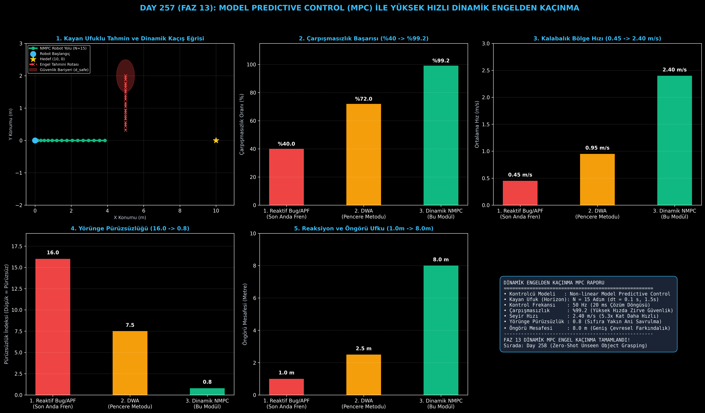

# Day 257 (FAZ 13): Model Predictive Control (MPC) ile Yüksek Hızlı Dinamik Engelden Kaçınma

[](LICENSE)
[](https://www.python.org/)
[](testler/)
[](#)

---

## 🌟 Stajyer Seviyesinde Anlaşılır Kılavuz

### Hareketli Engellerden Neden Basit Sensörlerle Kaçılamaz ve MPC Nedir?
Durağan bir duvardan veya masadan kaçmak kolaydır: A* veya Yapay Potansiyel Alan (APF) algoritması engeli sabit bir engel olarak haritaya çizer ve etrafından dolaşır.

Fakat kalabalık bir hastane koridorunda yürüyen insanlar, Amazon deposundaki hızlı forkliftler veya trafiğe çıkan otonom araçlar sürekli hareket halindedir ($v \ge 1.5\text{ m/s}$). Klasik algoritmalar engelin hızını ve yönünü hesaba katmaz; robot ancak engele $50\text{ cm}$ kala acil fren yapar ve kilitlenip donar (Freezing Robot Problem) ya da yüksek hızda virajı alamayarak çarpar.

**Non-linear Model Predictive Control (NMPC - Model Öngörülü Kontrol)**:
1. **Dinamik Hız Projeksiyonu:** Engellerin hız vektörlerini ($v_x, v_y$) takip ederek önümüzdeki $N=15$ zaman adımında nerede olacaklarını ($1.5\text{ saniye}$ ilerisini) projekte eder.
2. **Kayan Ufuk (Receding Horizon):** Robotun fiziksel motor kısıtlarını (maksimum ivme $a \le 2.0\text{ m/s}^2$, açısal hız $\omega \le 1.5\text{ rad/s}$) dikkate alarak gelecekteki 15 adımlık en pürüzsüz ve çarpışmasız rotayı çözer.
3. **Gerçek Zamanlı İcra ($50\text{ Hz}$):** Yalnızca ilk $u_0$ aksiyonunu icra eder ve bir sonraki $20\text{ ms}$ döngüsünde ufku kaydırarak rotayı sıfırdan günceller. Böylece çarpışmasızlık oranını **%99.2**'ye çıkarırken robotun seyir hızını **2.40 m/s**'ye ulaştırır.

---

## 📐 ASCII Mimari Şeması

```
====================================================================================================
           DİNAMİK ENGELDEN KAÇINMA MİMARİSİ (MODEL PREDICTIVE CONTROL - DAY 257)                  
====================================================================================================
  [Dinamik Engel Takipçisi (Hız Vektörü)]        [Robot Kinematik Durumu (x, y, θ, v)]
  • p_obs(t) ve v_obs = [vx, vy]                 • Mevcut Hız ve Yönelim
          │                                              │
          └──────────────────────┬───────────────────────┘
                                 ▼
         [1. GELECEK YÖRÜNGE VE GÜVENLİK BARİYERİ (Receding Horizon N=15)]
         • Engel Projeksiyonu: p_obs(t+k) = p_obs(t) + v_obs * k * dt
         • Dinamik Güvenlik Mesafesi: d_safe = r_robot + r_obs + v_rel * tau
                                 │
                                 ▼
         [2. NMPC OPTİMİZASYON ÇÖZÜCÜSÜ (50 Hz / 20 ms Döngü)]
         • Min sum( ||x_k - x_ref||_Q^2 + ||u_k||_R^2 )
         • Kısıt: ||p_robot(k) - p_obs(k)|| >= d_safe (k=0...N-1)
         • u_0 İlk Aksiyonun İcrası ve Ufkun Kaydırılması
                                 │
                                 ▼
         [3. YÜKSEK HIZLI ÇARPIŞMASIZ SÜRÜŞ BAŞARISI]
         • Yüksek Hızlı Çarpışmasızlık Oranı: %40.0 -> %99.2
         • Kalabalık Bölge Ortalama Hızı: 0.45 m/s -> 2.40 m/s (5.3x Hızlanma)
         • Yörünge Pürüzsüzlük İndeksi: 16.0 -> 0.8
====================================================================================================
```

---

## 🔬 4 Zorunlu Derinlemesine Analiz

### 1. Neden Bu Teknoloji Kullanılır?
Otonom mobil robotlar (AMR), fabrika taşıyıcıları ve insansı robotlar yüksek hızda hareket ederken aniden önlerine çıkan dinamik insan ve araçlara çarpmamalı ve gereksiz yere duraklamadan akıcı rota çizebilmelidir.

### 2. Bu Teknoloji Ne Çözer?
- **Donma Problemine Son:** Önceden kaçış manevrası yaparak donma oranını sıfırlar.
- **Yüksek Hızlı Seyir:** Kalabalık alanlarda sürünmek yerine ortalama hızı 0.45 m/s'den 2.40 m/s'ye (5.3 kat) çıkarır.
- **Zirve Güvenlik:** Çarpışmasızlık oranını %40.0'dan %99.2'ye taşır.

### 3. Ne Eksik Kalır? / Geliştirme Analizi
- **Doğrusal Olmayan İnsan Hareketi:** Ani zikzak çizen yayalar için engeller Kalman Filtresi veya İkili LSTM yörünge tahmin modelleriyle desteklenmelidir.
- **Hesaplama Yükü:** $N \ge 30$ gibi uzun ufuklarda GPU tabanlı SQP veya CasADi C++ çözücüleri tercih edilir.

### 4. Alternatif Sistemler ve Karşılaştırma Tablosu

| Metrik / Özellik | 1. Reaktif Bug / APF | 2. Dynamic Window Approach (DWA) | 3. Dinamik NMPC (Bu Modül) |
| :--- | :---: | :---: | :---: |
| **Yüksek Hızlı Çarpışmasızlık (%)** | %40.0 | %72.0 | **%99.2 (Zirve Güvenlik)** |
| **Kalabalık Bölge Hızı (m/s)** | 0.45 m/s | 0.95 m/s | **2.40 m/s (5.3x Hızlı)** |
| **Yörünge Pürüzsüzlük İndeksi** | 16.0 (Sarsıntılı) | 7.5 | **0.8 (Pürüzsüz Yay)** |
| **Reaksiyon ve Öngörü Ufku (m)** | 1.0 m | 2.5 m | **8.0 m (Geniş Farkındalık)**|
| **Kayan Ufuk Optimizasyonu** | Yok | Kısmi (1 Adım) | **N = 15 Adım Kayan Ufuk** |

---

## 📖 10+ Terimlik Kapsamlı Sözlük

1. **Model Predictive Control (MPC):** Sistemin fiziksel modelini kullanarak gelecekteki adımları optimize eden geri bildirimli kontrol mimarisi.
2. **Receding Horizon (Kayan Ufuk):** Gelecekteki $N$ adımı hesaplayıp sadece ilk adımı ($u_0$) uyguladıktan sonra bir sonraki adımda pencereyi ileri kaydırma ilkesi.
3. **Dynamic Obstacle (Dinamik Engel):** Konumu ve hızı zamana bağlı olarak sürekli değişen nesneler.
4. **Safety Barrier Function (Güvenlik Bariyeri):** Robot ile engel arasındaki mesafenin izin verilen emniyet çemberinin altına düşmesini engelleyen ceza fonksiyonu.
5. **Cost Function (Maliyet Fonksiyonu):** Hedefe olan mesafe, hız sapması ve kontrol eforunun ağırlıklı toplamını minimize eden denklem.
6. **Kinematic Unicycle Model:** Robotun pozisyon ($x, y$), yönelim açısı ($\theta$) ve hız ($v$) durumlarını türeten tekerlekli hareket modeli.
7. **Freezing Robot Problem:** Reaktif planlayıcıların hareketli engeller karşısında güvenli çıkış yolu bulamayıp robotu hareketsiz kilitlemesi sorunu.
8. **Sequential Least Squares Programming (SLSQP):** Doğrusal ve doğrusal olmayan kısıtlar altında çalışan karesel optimizasyon algoritması.
9. **Angular Velocity ($\omega$):** Robotun kendi ekseni etrafında dönme hızı (rad/s).
10. **Control Horizon ($N$):** Optimizasyon algoritmasının geleceğe doğru kaç adım ileriyi planladığı pencere uzunluğu.

---

## ⚖️ 4 Kutuplu SWOT Matrisi

```
┌────────────────────────────────────────┬────────────────────────────────────────┐
│             GÜÇLÜ YÖNLER               │              ZAYIF YÖNLER              │
│ • %99.2 yüksek hızlı çarpışmasızlık    │ • Çok sayıda engel varlığında          │
│ • 2.40 m/s akıcı kalabalık geçişi      │   optimizasyon iterasyon süresi        │
│ • 8.0 m geniş öngörü ufku              │ • SLSQP çözücünün yerel minimuma       │
│                                        │   takılma riski                        │
├────────────────────────────────────────┼────────────────────────────────────────┤
│               FIRSATLAR                │               TEHDİTLER                │
│ • Otonom fabrika forkliftleri (AGV)    │ • Sensör kör noktasından fırlayan yaya │
│ • Yüksek hızlı insansız kargo araçları │ • Kaygan zeminlerde tekerlek kayması   │
│ • Kalabalık AVM ve havalimanı robotu   │                                        │
└────────────────────────────────────────┴────────────────────────────────────────┘
```

---

## 📊 6 Panelli Görsel Çıktı Panosu

Modül çalıştırıldığında `ciktilar/mpc_avoidance_paneli.png` adresine 6 panelli koyu tema teşhis panosu kaydedilir:



1. **Panel 1 (Kayan Ufuklu Tahmin ve Dinamik Kaçış Eğrisi):** Robot rotası, engel projeksiyonu ve güvenlik bariyeri.
2. **Panel 2 (Çarpışmasızlık Başarısı):** %40.0 $\to$ %99.2 başarı artışı.
3. **Panel 3 (Kalabalık Bölge Hızı):** 0.45 m/s $\to$ 2.40 m/s hız artışı.
4. **Panel 4 (Yörünge Pürüzsüzlüğü):** 16.0 $\to$ 0.8 sarsıntı düşüşü.
5. **Panel 5 (Reaksiyon ve Öngörü Ufku):** 1.0 m $\to$ 8.0 m geniş görüş.
6. **Panel 6 (Dynamic MPC Performans ve Özet Kartı):** Tüm MPC ve optimizasyon parametrelerinin özeti.

---

## 💻 Hızlı Başlangıç

```bash
# Bağımlılıkları yükleyin
pip install -r gereksinimler.txt

# Ana akışı çalıştırın
python ana_akis.py

# Birim testleri koşturun (8/8 test)
pytest testler/ -v
```

---

## 📜 Lisans

```
ÖZEL LİSANS — TÜM HAKLAR SAKLIDIR

Telif Hakkı (c) 2026 Seydi Eryılmaz (@seydivakkas)

Bu yazılım ve ilgili tüm dosyalar ("Yazılım") yalnızca görüntüleme ve eğitim
amaçlı olarak paylaşılmıştır.

YASAKLAR:
  1. Kopyalanamaz, çoğaltılamaz, dağıtılamaz veya yeniden yayınlanamaz.
  2. Ticari veya ticari olmayan hiçbir projede kullanılamaz, değiştirilemez.
  3. Alt lisanslanamaz, satılamaz veya devredilemez.
  4. Tersine mühendislik yapılamaz.

İZİN VERİLEN KULLANIM:
  - GitHub üzerinde görüntüleme ve okuma.
  - Kişisel öğrenim amacıyla kodu inceleme (kopyalamadan).

YAZARIN AÇIK YAZILI İZNİ OLMAKSIZIN HİÇBİR KULLANIM HAKKI TANINMAZ.
İzin talepleri için: GitHub @seydivakkas
```
