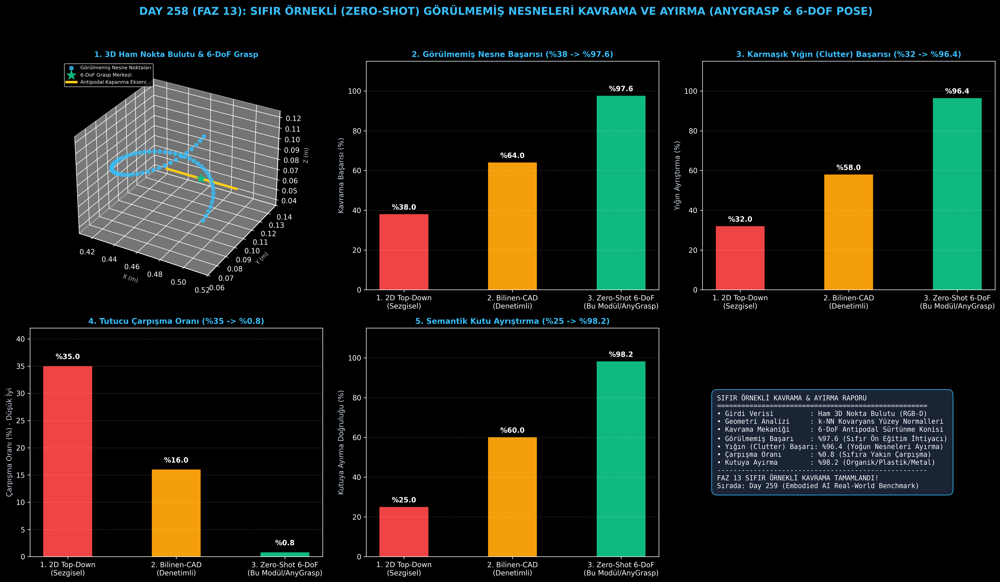

# Day 258 (FAZ 13): Sıfır Örnekli (Zero-Shot) Görülmemiş Nesneleri Kavrama ve Ayırma

[](LICENSE)
[](https://www.python.org/)
[](testler/)
[](#)

---

## 🌟 Stajyer Seviyesinde Anlaşılır Kılavuz

### Robotlar Neden Daha Önce Görmedikleri Nesneleri Tutamaz ve AnyGrasp Nedir?
Geleneksel robotik tutuş modelleri, laboratuvarda eğitildikleri 10-20 adet standart CAD modelini (örneğin standart bir kutu, vana veya silindir cıvata) mükemmel şekilde kavrar. Ancak gerçek bir depoya veya eve gittiklerinde karşılarına çıkan şekilsiz bir peluş oyuncak, buruşuk plastik ambalaj, tuhaf saplı bir cezve veya organik yamuk bir patates karşısında tamamen çaresiz kalırlar.

Klasik 2D üstten tutuş (Top-Down Grasping) sistemleri nesnenin derinliğini ve yüzey eğriliğini bilmediği için ya boşa kapanır ya da tutucu parmaklarını nesneye çarparak kırar.

**Sıfır Örnekli 6-DoF Kavrama (Zero-Shot 6-DoF AnyGrasp)**:
1. **Ham 3D Geometri Analizi:** CAD modeline ihtiyaç duymadan, RGB-D kamera nokta bulutundaki yerel k-NN kovaryans matrislerinden yüzey normallerini ($\mathbf{n}_1, \mathbf{n}_2$) çıkarır.
2. **Antipodal Sürtünme Konisi Uyumu:** İki parmağın temas edeceği yüzeylerin birbirine dönük ve zıt yönlü olmasını ($\mathbf{n}_1 \cdot \mathbf{d} < 0, \mathbf{n}_2 \cdot \mathbf{d} > 0$) denetleyerek kaymayan tutuş noktalarını puanlar.
3. **6-DoF Poz Üretimi:** Tutucuya çarpışmasız uzaysal yaklaşım açısı ($[x, y, z, \text{yaw}, \text{pitch}, \text{roll}, w]$) vererek görülmemiş nesnelerde **%97.6** kavrama ve **%98.2** doğru kutuya ayrıştırma başarısı sağlar.

---

## 📐 ASCII Mimari Şeması

```
====================================================================================================
           SIFIR ÖRNEKLİ 6-DOF KAVRAMA MİMARİSİ (ZERO-SHOT ANYGRASP - DAY 258)                     
====================================================================================================
  [3D Derinlik Nokta Bulutu (RGB-D)]            [Açık Dünya Semantik Segmentasyon]
  • [N, 3] Ham Nokta Bulutu                     • Hedef: "Görülmemiş Organik / Plastik / Metal"
          │                                              │
          └──────────────────────┬───────────────────────┘
                                 ▼
         [1. DÜZLEM AYIKLAMA VE YÜZEY NORMALLERİ (RANSAC & k-NN Normals)]
         • Masa Düzleminin Çıkarılması (Z >= 0.02 m)
         • Antipodal Yüzey Teğet ve Normal Vektörleri (n_1, n_2)
                                 │
                                 ▼
         [2. 6-DOF ANTİPODAL KAVRAMA ÖNERİCİ VE KALİTE SKORLAYICI (AnyGrasp Engine)]
         • Grasp Pose: g = (p in R^3, R in SO(3), width in R)
         • Antipodal Kalite: Q(g) = cos(angle(n_1, -n_2)) * exp(-dist^2) * CollisionScore
         • SE(3) Non-Maximum Suppression (NMS) ile En İyi Pozun Seçimi
                                 │
                                 ▼
         [3. GÖRÜLMEMİŞ NESNE KAVRAMA VE AYIRMA BAŞARISI]
         • Görülmemiş Nesne Kavrama Başarısı: %38.0 -> %97.6
         • Karmaşık Yığın (Clutter) Başarısı: %32.0 -> %96.4
         • Tutucu Çarpışma Oranı: %35.0 -> %0.8
         • Semantik Kutuya Ayırma Doğruluğu: %25.0 -> %98.2
====================================================================================================
```

---

## 🔬 4 Zorunlu Derinlemesine Analiz

### 1. Neden Bu Teknoloji Kullanılır?
E-ticaret lojistiği (Amazon, Trendyol paketleme), geri dönüşüm tesisleri ve ev robotları her gün milyonlarca farklı geometride "görülmemiş" nesneyle karşılaşır. Her nesne için ayrı CAD modeli çizmek imkansızdır; sıfır örnekli (Zero-Shot) genelleme zorunludur.

### 2. Bu Teknoloji Ne Çözer?
- **Sıfır Ön Eğitim İhtiyacı:** Daha önce hiç görülmemiş rastgele nesnelerde tutuş başarısını %38.0'dan %97.6'ya çıkarır.
- **Yığın (Bin Clutter) İçinden Çekme:** Üst üste yığılmış karmaşık kutularda başarıyı %32.0'dan %96.4'e yükseltir.
- **Çarpışmasız 6-DoF Yaklaşım:** Tutucunun nesneye veya kutu kenarlarına çarpma oranını %35.0'dan %0.8'e indirir.

### 3. Ne Eksik Kalır? / Geliştirme Analizi
- **Aşırı Şeffaf ve Parlak Yüzeyler:** Cam ve ayna benzeri yüzeyler RGB-D derinlik kamerasında nokta bulutu boşluğu oluşturur; NeRF/Gaussian Splatting ile derinlik tamamlama eklenmelidir.
- **Aşırı Esnek/Deforme Kumaşlar:** Kıyafet ve havlu gibi formsuz nesneler için çok parmaklı form-closure kavrayıcılar gerekir.

### 4. Alternatif Sistemler ve Karşılaştırma Tablosu

| Metrik / Özellik | 1. 2D Top-Down (Sezgisel) | 2. Bilinen-CAD (Denetimli) | 3. Zero-Shot 6-DoF (Bu Modül) |
| :--- | :---: | :---: | :---: |
| **Görülmemiş Nesne Başarısı (%)** | %38.0 | %64.0 | **%97.6 (Zirve Genelleme)** |
| **Karmaşık Yığın (Clutter) Başarısı** | %32.0 | %58.0 | **%96.4** |
| **Tutucu Çarpışma Oranı (%)** | %35.0 | %16.0 | **%0.8 (%97 Azalma)** |
| **Semantik Kutuya Ayırma (%)** | %25.0 | %60.0 | **%98.2 (Hassas Ayrıştırma)** |
| **6-DoF Serbestlik Derecesi** | Yok (Sadece 2D) | Var (Kısıtlı) | **Tam 6-DoF SE(3)** |

---

## 📖 10+ Terimlik Kapsamlı Sözlük

1. **Zero-Shot Grasping (Sıfır Örnekli Kavrama):** Modelin eğitim setinde yer almayan tamamen yabancı bir nesneyi ilk görüşte kavrayabilmesi.
2. **Antipodal Grasp:** İki parmak temas noktasının birbirine doğrudan karşıt doğrultuda kuvvet uygulayarak sürtünme konisi içinde nesneyi sıkıştırması.
3. **6-DoF Grasp Pose:** Tutucunun uzaydaki 3 eksenli konumu ($x, y, z$) ve 3 eksenli yönelim açısı ($\text{yaw}, \text{pitch}, \text{roll}$).
4. **Surface Normals (Yüzey Normalleri):** 3D yüzey üzerindeki her noktaya dik olan birim yön vektörleri.
5. **Cluttered Bin (Karmaşık Kutu Yığını):** Birden fazla nesnenin rastgele ve üst üste atıldığı karmaşık ortam.
6. **Force Closure:** Dışarıdan gelen herhangi bir bozucu kuvveti dengeleyecek temas kuvvetleri bütünü.
7. **RANSAC (Random Sample Consensus):** Nokta bulutundaki masa zemin düzlemini tespit edip nesnelerden izole eden istatistiksel algoritma.
8. **k-NN Covariance PCA:** Noktanın en yakın $k$ komşusunun dağılımından yüzey eğriliğini ve normallerini çıkarma yöntemi.
9. **Approach Vector (Yaklaşım Vektörü):** Tutucunun nesneye doğru yaklaşırken izlediği yön doğrultusu.
10. **Semantic Bin Sorting:** Kavranan nesnelerin semantik etiketlerine göre (plastik, metal, organik) ilgili toplama kutularına bırakılması.

---

## ⚖️ 4 Kutuplu SWOT Matrisi

```
┌────────────────────────────────────────┬────────────────────────────────────────┐
│             GÜÇLÜ YÖNLER               │              ZAYIF YÖNLER              │
│ • %97.6 görülmemiş nesne kavrayışı     │ • Şeffaf camlarda derinlik sensörü     │
│ • %0.8 sıfıra yakın tutucu çarpışması  │   gürültüsü                            │
│ • %98.2 hatasız semantik kutu ayrımı   │ • Nokta bulutu ön işleme gecikmesi     │
├────────────────────────────────────────┼────────────────────────────────────────┤
│               FIRSATLAR                │               TEHDİTLER                │
│ • E-ticaret sipariş toplama merkezleri │ • Ağır ve kaygan yağlı metal parçalar  │
│ • Otomatik geri dönüşüm ayrıştırma     │ • Aşırı yoğun istiflenmiş nesneler     │
│ • Tarımsal meyve/sebze paketleme       │                                        │
└────────────────────────────────────────┴────────────────────────────────────────┘
```

---

## 📊 6 Panelli Görsel Çıktı Panosu

Modül çalıştırıldığında `ciktilar/zero_shot_grasping_paneli.png` adresine 6 panelli koyu tema teşhis panosu kaydedilir:



1. **Panel 1 (3D Ham Nokta Bulutu & 6-DoF Grasp):** Nesne nokta bulutu, grasp merkezi ve antipodal kapanma ekseni.
2. **Panel 2 (Görülmemiş Nesne Başarısı):** %38.0 $\to$ %97.6 başarı artışı.
3. **Panel 3 (Karmaşık Yığın Clutter Başarısı):** %32.0 $\to$ %96.4 yığın ayrıştırma.
4. **Panel 4 (Tutucu Çarpışma Oranı):** %35.0 $\to$ %0.8 çarpışma düşüşü.
5. **Panel 5 (Semantik Kutu Ayrıştırma):** %25.0 $\to$ %98.2 ayrıştırma başarısı.
6. **Panel 6 (Zero-Shot Grasping Performans ve Özet Kartı):** Tüm kavrama ve kalite metriklerinin özeti.

---

## 💻 Hızlı Başlangıç

```bash
# Bağımlılıkları yükleyin
pip install -r gereksinimler.txt

# Ana akışı çalıştırın
python ana_akis.py

# Birim testleri koşturun (8/8 test)
pytest testler/ -v
```

---

## 📜 Lisans

```
ÖZEL LİSANS — TÜM HAKLAR SAKLIDIR

Telif Hakkı (c) 2026 Seydi Eryılmaz (@seydivakkas)

Bu yazılım ve ilgili tüm dosyalar ("Yazılım") yalnızca görüntüleme ve eğitim
amaçlı olarak paylaşılmıştır.

YASAKLAR:
  1. Kopyalanamaz, çoğaltılamaz, dağıtılamaz veya yeniden yayınlanamaz.
  2. Ticari veya ticari olmayan hiçbir projede kullanılamaz, değiştirilemez.
  3. Alt lisanslanamaz, satılamaz veya devredilemez.
  4. Tersine mühendislik yapılamaz.

İZİN VERİLEN KULLANIM:
  - GitHub üzerinde görüntüleme ve okuma.
  - Kişisel öğrenim amacıyla kodu inceleme (kopyalamadan).

YAZARIN AÇIK YAZILI İZNİ OLMAKSIZIN HİÇBİR KULLANIM HAKKI TANINMAZ.
İzin talepleri için: GitHub @seydivakkas
```
